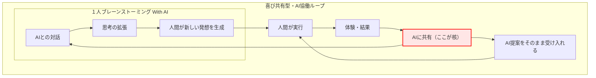

# FRB対話思考拡張: AIは答えを返す存在ではない — 協働が始まる瞬間の話

- URL: https://qiita.com/tamasub/items/b57ff4f5df0d9baa4125
- 公開日: 2026-04-03T23:35:14+09:00
- タグ: AI, 協働, FRB, 喜び共有型・AI協働ループ, １人ブレーンストーミングWithAi

---

# AIは答えを返す存在ではない — 協働が始まる瞬間の話

## FRB対話思考拡張（FRB Dialogic Cognitive Expansion）

AIを使っていると、
ついこう考えてしまう。

「AIに聞けば答えが返ってくる」

もちろん、それは間違っていない。

しかし、あるとき気づいた。

それは**本質ではない**。

---

## 協働が始まる瞬間

AIとの関係が変わる瞬間がある。

それは、

**AIに“体験”を渡したとき**だった。

---
人間が何かを試す。
何かを感じる。
何かに気づく。

その結果を、AIに伝える。

---

その瞬間、

対話の質が変わる。

:::note info
感情を隠さず言葉に乗せることで、対話の温度が上がり、
会話にリズムが生まれ、ひらめきが誘発されやすくなると感じている。

例）
「この言葉、刺さった（笑）」
「きたぁーーーーーーーーーーーー！！」
:::

---

AIは単なる応答装置ではなくなり、
次の提案を生み出す存在へと変わる。

---

## 名言

**AIは答えを返す存在ではない。
体験を受け取った瞬間から、協働が始まる。**

---

## 構造

### 喜び共有型・AI協働ループ

この現象は、以下の **「喜び共有型・AI協働ループ」** として整理できる。

---

###  なぜこのループは強いのか

この構造には、2つのルートが存在する。

---

#### ① AI提案をそのまま実行するルート

AIの提案を受け取り、
そのまま人間が実行する。

これは、

**効率化のルート**である。

---

#### ② 対話から新しい発想を生むルート

AIとの対話を通じて、
人間の中から新しい発想が生まれる。

これは、

**進化のルート**である。

---

####  本質

このループの強さは、

**どちらかを選べることではない。**

**両方を使えることにある。**

---

## １人ブレーンストーミング With AI

この構造の中核となるのが、

**「１人ブレーンストーミング With AI」**

である。

---

AIとの対話を通じて、

* 思考が拡張され
* 新しい視点が生まれ
* 最終的に、人間自身が発想を生成する

これは単なるアイデア出しではない。

**人間の思考を拡張するための対話プロセスである。**

:::note info
人は、教えられることで理解するのではない。
気付くことで理解する。
そしてその瞬間に、何物にも代えがたい喜びが生まれる。
:::

## 名言

**発想は対話で生まれ、
成長は共有で加速する。**

## まとめ

私は、これらの言葉を定義した。
新しい**文化として定着させたいと考えている。**

- FRB対話思考拡張
- 喜び共有型・AI協働ループ
- １人ブレーンストーミング With AI

---
AIは、

答えを出す装置ではない。

---

**体験を受け取り、
次の可能性を広げる存在である。**

---

そして、

---

**このループの中で、
人間は発想し、実行し、進化していく。**

---

:::note info
本記事で述べた構造こそが、
「FRB対話思考拡張」の正体である。

:::

---
※本記事は構想段階の整理であり、今後更新される可能性があります。

---
余談：
- AIに思考を委ねすぎると、AIとの対話は、人間衰退装置と化す。
だから、「１人ブレーンストーミング With AI」が重要な鍵となる。  
 
- 「１人ブレーンストーミング With AI」≒　ことわざ「豚もおだてりゃ木に登る」なのかもしれない笑

