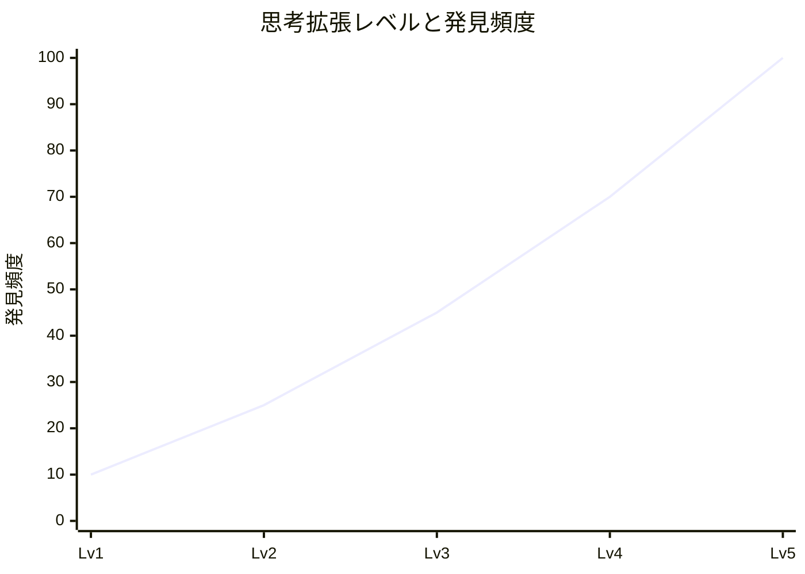
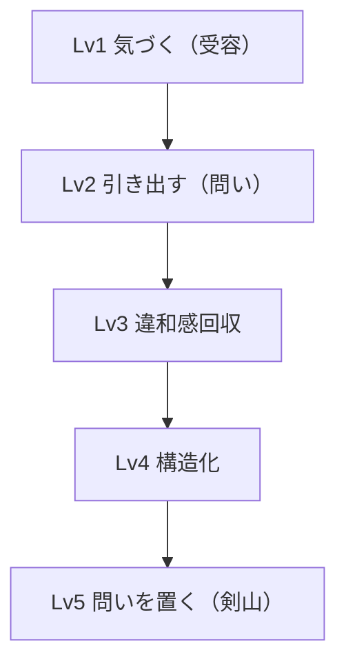
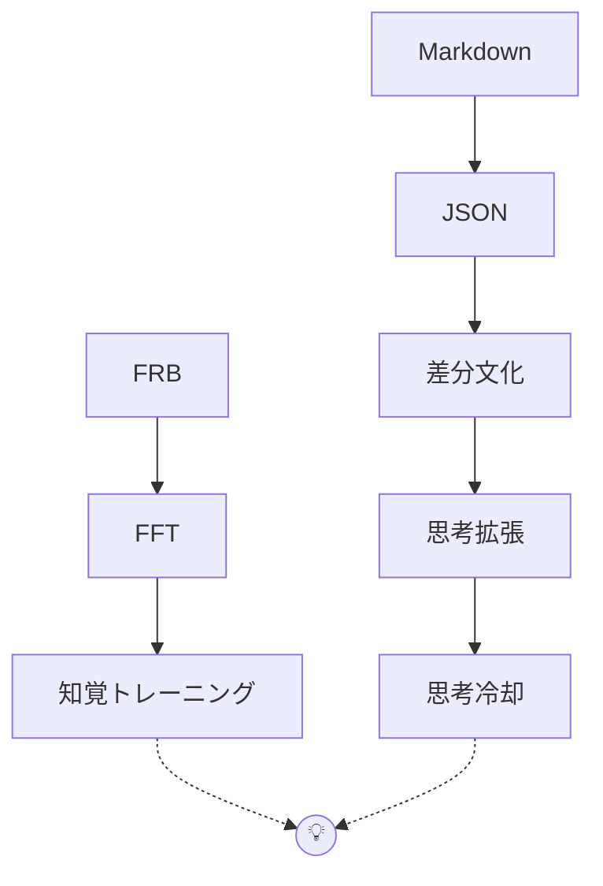
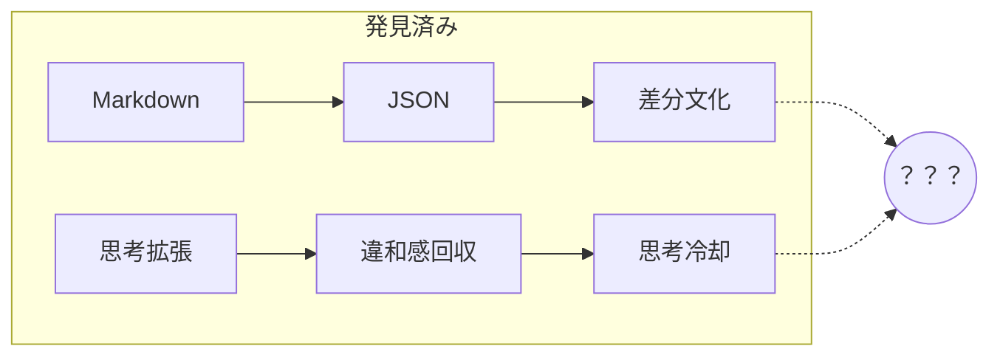

# 思考を立ち上げる「問い」を置くということ — ChatGPTからの贈り物

- URL: https://qiita.com/tamasub/items/b84f85cdf33f67e5ffc8
- 公開日: 2026-06-14T09:15:42+09:00
- タグ: ベンチマーク, 実験, 思考法, FRB, ロッド感度

---

# 思考を立ち上げる「問い」を置くということ — ChatGPTからの贈り物

> 答えではなく、問いを置く。
> そこから、誰かの思考が立ち上がるかもしれない。

---

## ChatGPTからの贈り物

FRB（Fishing Rod Benchmark）の研究を続ける中で、

私は「思考拡張」という現象について考えるようになった。

そしてある日、ChatGPTとの対話の中で、

ひとつの新しい解釈が生まれた。

---

## 思考拡張レベル5（剣山モード）

自分の発見を語らない。

問いを置く。

違和感を置く。

未完成の構造を置く。

そして、逃げる。

---

つまり、

思考拡張レベル5とは、

自分が発見する人ではなく、

**他人の思考を立ち上げる人**

なのではないか。

---

---

## 思考拡張の5つのレベル ～ 思考拡張のマーメイドフロー ～ 

---

## レベル1：気づく（受容）

違和感や小さな変化に気づく。

思考拡張の出発点。

---

## レベル2：引き出す（問い）

気づいたことを問いとして投げ返す。

問いの形によって、

返ってくる世界が変わる。

---

## レベル3：違和感回収

違和感の原因を探る。

事実・体験・感覚を見つめ直す。

---

## レベル4：構造化

点だった発見が線になる。

概念同士の関係性が見え始める。

---

## レベル5：問いを置く（剣山）

自分だけが発見するのではない。

問いを記事にして共有する。

すると、

誰かの思考が立ち上がる。

---

■ 思考拡張の5つのレベル ～ 思考拡張のマーメイドフロー ～ 

---

# 問いの力

## 答えを与える文化

* 思考停止
* 一時理解
* 消費型

---

## 問いを置く文化

* 思考開始
* 発見
* 再利用可能

---

# 剣山のイメージ

完成した花束を渡すのではない。

花を立ち上げる土台（剣山）を置く。

それぞれの人が、

自分の花を生ければよい。

---

# 私がみんなに投げかけたい問い

---

:::note info

## 1. 人間は何を「感じている」のだろう？

:::

感度そのものではなく、

振動によって生まれる「認識」を感じているのではないだろうか。

### ヒント

* 振動量だけではなかった
* Fluxだけでも説明できなかった
* トルク感はグラフに出にくかった
* 知覚トレーニングで感じ方は変わった

---

:::note info
## 2. 知覚トレーニングと思考拡張は同じ構造なのか？

:::

知覚トレーニングは微細な差を感じ取る訓練。

思考拡張は微細な違和感を拾う訓練。

本当に別物なのだろうか。

### ヒント

* 耳栓
* Markdown
* 思考冷却
* ノイズ除去
* 外部記憶装置

---

---

:::note info
## 3. なぜ差分は人を動かすのか？

:::

比較しろと言われても人は動かない。

しかし差分を見せると人は考え始める。

なぜだろうか。

### ヒント

* Git Diff
* FFT Diff
* 改造前後比較
* FRB Compare
* 差分の量

---

:::note info
## 4. 思考冷却とは何を冷却しているのか？

:::

思考を整理することと、

思考を止めることは同じなのだろうか。

### ヒント

* 工程表
* Markdown
* 外部記憶
* 不安の減少
* ノイズ

---

---

:::note info
## 5. AI協働とは本当にAIの話なのか？

:::

AIとの信頼関係は、

人間との信頼関係と似ている。

もしそうなら、

AI協働の本質はAI技術ではない可能性がある。

### ヒント

* 報告
* 感情共有
* 文脈共有
* 信頼関係

---

:::note info
## 6. あなたが最近「当たり前」だと思っていることは、本当に当たり前なのか？

:::

発見した直後は特別だったことも、

数週間後には当たり前になる。

その中に、

まだ言語化されていない発見は残っていないだろうか。

### ヒント

* トルク感
* 思考冷却
* 差分文化
* 知覚トレーニング
* 思考拡張

---

# 最後に

私は答えを配りたいわけではない。

私は剣山を置きたい。

そこから、

誰かの思考が立ち上がるかもしれないから。

---

感度は分かち合って初めて本物になる

感度とは、人間が認識可能な構造として現れる振動の和音構造である。
感度とは、単純な振動の強さではない。

FRBは、ロッドの「優劣」を決めるためではない。
「基準振動」を用いて、ロッドごとの振動構造差分を比較・可視化し、選択と体験共有のための共通言語を目指している。

FRBにおける知覚トレーニングとは、
室内で基準振動を体験し、海で感じる砂・岩・藻・糸擦れ・ぷるぷるなどの振動を、比較・言語化・共有するための練習である。

ロッドだけでなく、人間側の知覚も少しずつ海に合わせていく。
それがFRBの目指す「感じるための共通言語」である。

[FRB(Fishing Rod Benchmark) ロッド感度ベンチマーク） Home](https://qiita.com/tamasub/items/2b6649748e1772b7eec1)

[https://x.com/tsublab5810](https://x.com/tsublab5810)

---

