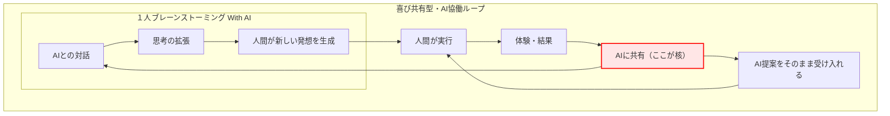

# FRBとは何か — Draft版


**※本規格は現在、実験・検証段階にある構想である。**

## FRBとは

FRB（Fishing Rod Benchmark）とは、

釣り竿の「感度」を振動として捉え、
比較可能にするための
**共通指標および測定体系の提唱**である。

従来、「感度」は
アタリ・状況把握・操作といった
人間の体験として語られてきた。

FRBでは、

**感度を振動の構造として分解・再定義する枠組みである。**

---

## 背景

ロッドの感度はこれまで

* 高い
* 低い
* 情報量が多い

といった曖昧な言葉で語られてきた。

しかし、

同じ「感度が高い」でも
感じている中身は人によって異なる。

---

## 発想の転換

PCの世界では、

SSDの性能は

* シーケンシャルリード
* シーケンシャルライト
* IOPS（ランダムアクセス性能）

といった定量的な指標で比較される。

一方、ロッドの世界では

* 感度が良い
* 感度が悪い

という主観的な言葉しか存在していない。

FRBはここに対して、

**「感度を測る」という発想そのものを導入する試み**である。

---

## FRBとSSDベンチマークの対応関係

FRBは、既存の性能ベンチマークの考え方をロッドに適用したものである。
すなわち、「体験されていた感度」を「測定可能な対象」に変換する試みである。

| 項目      | FRB             | 対象ユーザ   | SSDベンチマーク             | 対象ユーザ     |
| ------- | --------------- | ------- | --------------------- | --------- |
| Phase 1 | 擦りテスト（周波数帯別スコア） | 釣り初心者   | シーケンシャル（Read / Write） | 一般ユーザ     |
| Phase 2 | 魚擬似アタリスコア       | 釣り中級者以上 | IOPS（I/O per second）  | 専門・ヘビーユーザ |

---

## FRBの考え方 - 定義

FRBでは、

**感度 ＝ 振動の特徴**

と定義する。

---

## FRB全体構造図（Fishing Rod Benchmark Architecture）

FRBの構造を一枚で示す。


---

## 既存の「感度」という言葉との関係

従来の感度分類：

* アタリ感度（魚の衝撃）
* 状況把握感度（地形・流れ）
* 操作感度（ルアー挙動）

これらはすべて、

**人間の体験を基準とした分類**である。

---

FRBではこれを、

**振動の構造として再定義する。**

---

* アタリ感度 → **入力応答（Phase2）**
* 状況把握感度 → **低〜中周波応答（Phase1）**
* 操作感度 → **周波数応答＋入力応答（Phase1＋Phase2）**

---

つまりFRBは、

**曖昧な感度概念を分解し、再構成するための指標となることを目指す。**

---

## 測定対象

FRBが扱うのは

* 振動量
* 周波数特性
* 伝達特性

といった、

**“人が感じている正体”そのもの**である。

---

# フェーズ構造（Draft定義）

FRBは、

* 評価（Score）と入力（試験）を分離した構造を持つ

---

## Phase 1（基礎指標）

### 概要

連続的な接触入力により振動を発生させ、
ロッドの**振動特性（量・周波数）** を評価する。

▶連続入力に対する振動特性（時間平均的な特性）

---

### Phase1 Score

振動量・周波数分布を対象とし、

**「どれだけ振動しているか」** を評価する指標

#### 例：

:::note info
Phase1 Score（Surface Response）

J: 99 （絨毯：低域応答）
F: 85 （フローリング：中域応答）
S: 72 （ステンレス：高域応答）
:::

---

### Phase1 入力（試験）

素材に対してロッドを擦ることで、
連続的な振動を発生させる。

**FRB擦り試験（Surface Response Test）** と呼ぶ。

---

## Phase 2（応用指標）

### 概要

ラインに生じる過重変化を入力とし、
ロッドの**応答特性（伝達）** を評価する。

---

### Phase2 Score（Benchmark層）

伝達効率・応答特性を対象とし、

**「過重変化に対してどう伝わるか」** を評価する指標

▶時間変化入力に対する振動応答（時系列特性）


---

魚のアタリは、

・瞬間的な衝撃（Impulse）
・持続的な引き込み（Suction）
・干渉による変化（Weed）

として現れるが、

魚のアタリは物理的には「力の変化」として発生する。

これらはすべて
**ラインに生じる過重変化（テンション変化）** として観測できる。

---

#### 例：

:::note info
FRB Phase2 Score（Simulated Bite Response）

Impulse: 92 （コツン：瞬間衝撃応答）
Suction: 78 （ぬっ：吸い込み応答）
Weed: 65 （モゾ：持続干渉応答）
:::

---

### Phase2 入力（試験）

魚のバイトに相当する過重変化を再現し、
ロッドに対して制御された入力を与える。

**FRB擬似バイト試験（FRB Phase2 Bite Simulator）** と呼ぶ。

（例：輪ゴム・バネ等によるテンション生成・解放）

※入力方式は現在検証中

---

## Phase2 拡張構造（Draft）

Phase2は以下の2層構造として扱う。

---

### ■ Benchmark層（客観層）

* 固定入力による評価
* 再現性・比較性を重視
* Scoreとして数値化される

対象：

* Impulse
* Suction
* Weed

👉 **比較するための世界**

---

### ■ Experience層（体験層）

* 人間が感じる振動体験を扱う
* 数値評価は行わない
* 再現性よりも体験の共有を重視

対象例：

* ぷるぷる
* ジリジリ
* アルミ箔感
* 右手糸擦り

👉 **感じるための世界**

---

### Experience層の定義

Experience層とは、

**人間が感じる振動体験を、構造として記述する層**である。

---

### 特徴

* 数値化は行わない
* 評価ではなく記録とする
* 個人差を前提とする

---

### 重要な考え方

Experience層は不安定な領域ではあるが、

**完全にランダムな主観ではなく、
一定の構造を持つ体験として扱う**

---

### 役割

* Benchmark層では表現できない
  「気持ちよさ」「中毒性」を扱う
* 人間側の知覚特性を記述する

---

■ 追記（カテゴリ拡張）

Experience層には、以下のような体験カテゴリが含まれる。

・音化された振動体験

振動が音として知覚される体験。

骨伝導や共鳴（例：口内共鳴、外部共鳴体）により、
触覚的な振動が聴覚的に認識される状態を指す。

---


## 設計思想

FRBは以下の設計思想に基づく。

---

### 拡張性と選択性

各フェーズの評価（Score）は
**最大3項目まで**に制限する。

一方で、フェーズ構造により
**評価軸そのものは拡張可能**とする。

---

・1フェーズ = 最大3指標
・フェーズ = 追加可能

---

複雑さはフェーズで吸収し、
理解は常にシンプルに保つ。

---

FRBは評価のためではなく、
**選択のために設計された指標である。**

---

### 再現性

FRBが重視するのは、

絶対精度ではなく、
**誰でも同じ条件で再現できること**である。

---

・室内で実施可能
・特別な装置を必要としない
・条件を揃えることで比較可能

---

## 重要なポイント

FRBは

**釣果を測るものではない。**

測るのは、

**“感じているものの構造”である。**

---

## 目指す世界

「感度が良い」

ではなく

「このロッドはこういう振動特性を持つ」

と語れる世界。

---

さらに、

「このロッドはこういう“体験”を持つ」

と語れる世界。

---

## 現在

この定義はDraft段階である。

しかし、

少なくとも一つだけ言えることがある。

ロッドの違いは、
振動として捉えることができる。

---

（続く）
[なぜロッドの感度は数値化されていないのか — FRB動機](https://qiita.com/tamasub364/items/662889a02a8db24ef742)

---

**FRBは、感度を評価するためではなく、
選択するためにある指標である。**

---

[FRB Home](https://qiita.com/tamasub/items/2b6649748e1772b7eec1)

---

Revision History
2026-03-14 : 初版
2026-04-05 : phase2 Benchmark層・Experience層 の２層構造化 + 音化された振動体験 追加可能


-----------------------


---
# なぜロッドの感度は数値化されていないのか — FRB動機

## FRB動機を整理した切っ掛け

 私は、2025年10頃よりルアー釣りを始めた初心者。
 
 帰宅途中の電車の中、Xを眺めていた。
  
 巨大な魚を釣り上げた人の写真がどんどん流れてくる。
 
 2026年3月時点で、ルアー釣りの釣果はボラ１匹。

 そもそも文系の人間。周波数解析なんて専門外。多少のIT知識がある程度。

 得意とする分野は、公営企業会計。なんの関係もない。
 
 こんな私が、世界に通用する標準規格を作る？
 
 そんなことを本当に言ってよいのか？
 
 冷や汗がでてきた。
 
 そんな自分の迷いを断ち切る為、
 
 このFRB動機を整理して、迷っても立ち返ることができる。
 
 そんな場所を作った。


## FRB動機 

もともとのきっかけは、
とても個人的なものだった。

**自分がやった改造が、
ハイエンドロッドに勝っているかもしれない。**

それを、証明したい。

---

しかし、すぐに一つの問題にぶつかった。

**ロッドの感度には、比較するための指標が存在しない。**

「感度が良い」「情報量が多い」

言葉はある。

だが、その中身は人によって違う。

---

一方で、PCの世界ではどうだろうか。

CPUにはベンチマークがあり、
SSDには

* シーケンシャルRead / Write
* IOPS

といった指標がある。

私はそれらを比較し、
最後にブランドと価格で選ぶ。

---

では、ロッドはどうか。

比較できないまま、
感覚だけで選ばれている。

---

その結果、何が起きるか。

初心者は、

「魚がいないのか」
「自分が下手なのか」
「ロッドの感度が低いのか」

分からないまま、

**釣りをやめる。**

---

もし、こう言えたらどうだろう。

店員がこう説明する。

「このロッドは FRB S:95 なので、
砂を擦る感触まで分かりますよ。」

---

選択は、もっと簡単になる。

---

そして今、

ダイソーの登場によって
釣り具の価格構造は変わり始めている。

100円でルアーが買える時代。

**業界はすでに変化の途中にある。**

---

ならば、

**感度という“見えない価値”も、
同じように変えられるのではないか。**

---


</br>  

[FRBとは何か](https://qiita.com/tamasub364/items/2b6649748e1772b7eec1)

[FRB Phase1 Scoreとは何か — 擦りスコアと指標設計](https://qiita.com/tamasub364/items/4f9c2b44746af7dfdeff)

 

# FRB Phase1 Scoreとは何か — 擦りスコアと指標設計（Draft版）


FRB（Fishing Rod Benchmark）とは、  
釣り竿の「感度」を振動として捉え、比較可能にする試みである。

---

## 結論

FRB Phase1 Scoreは、

**「どれだけ振動しているか」**

を評価する指標である。

---

## 擦りスコアとは何か

ロッドの先端を素材に軽く接触させ、擦る。

それだけで、

ロッドがどのように振動しているかが分かる。

---

FRBでは、この方法を

**FRB擦り試験（Surface Response Test）**

と呼ぶ。

---

## 周波数帯ごとの分離

素材を変えることで、

振動の性質を分離できる。

- 絨毯：低域応答  
- フローリング：中域応答  
- ステンレス：高域応答  

---

つまり、

**同じロッドでも、見えている振動は一つではない**

---

## スコアの意味

FRB Phase1 Scoreは、

以下のように表現される。

- J（絨毯）  
- F（フローリング）  
- S（ステンレス）  

---

これは、

**連続入力に対する振動特性（時間平均的な特性）**

を表している。

---

## 設計思想（再現性）

Phase1は、

**誰でもすぐに再現できる指標**

として設計されている。

---

特別な装置は不要。

室内で、同じ条件で擦るだけで比較できる。

---

つまり、

**FRBの入口となる指標**

である。

---

## 指標識別子の考え方

FRB Phase1 Scoreでは、

素材ごとの指標を

**識別子（1文字）**

で表現する。

---

例：

- J：絨毯（Jutan）  
- F：フローリング（Flooring）  
- S：ステンレス（Stainless）  

---

## 設計思想（拡張性）

FRBでは、

対象とする素材は固定ではない。

---

検証の進行に応じて、

より適切な素材が見つかれば、

代表素材は更新される。

---

ただし、

評価の構造そのものは変えない。

---

FRB Phase1は、

**低域・中域・高域の3つの周波数帯**

で構成される。

---

つまり、

- 低域  
- 中域  
- 高域  

という枠組みは固定し、

その代表となる素材のみが進化する。

---

## 識別子のルール

各素材は、

**頭文字1文字を識別子として使用する。**

---

新しい素材が採用された場合も、

このルールに従って識別子が定義される。

---

## なぜ重要なのか

これまでロッド感度は、

「高い」「低い」

といった曖昧な言葉で語られてきた。

---

しかし、

擦りテストを行うことで、

- 振動が強いロッド  
- 振動が弱いロッド  

を明確に区別できる。

---

## まとめ

FRB Phase1 Scoreは、

感度を「振動量」として捉える最初の指標である。

---

誰でも再現できる方法で、

ロッドの違いを可視化する。

---

さらに、

- 周波数帯構造は固定  
- 素材は進化可能  

という、

**拡張性と安定性を両立した指標体系**

を持つ。

---

ここからすべてが始まる。

（続く）

　[▶ FRBとは何か — 現時点の定義](https://qiita.com/tamasub364/items/4f9c2b44746af7dfdeff)  
 
　[▶ FRB Phase2 Scoreとは何か — 擬似アタリスコアの意味](https://qiita.com/tamasub364/items/bbcbe408883d33c249d5)

　
# FRB Phase2 Scoreとは何か — 擬似アタリスコアの意味（Draft版）


**注記：本規格は実験未完了。実験中ステータス。構想の段階である。**

FRB（Fishing Rod Benchmark）とは、  
釣り竿の「感度」を振動として捉え、比較可能にする試みである。

---

## 結論

FRB Phase2 Scoreは、

**「入力に対してどう伝わるか」**

を評価する指標である。


---

## 擬似アタリスコアとは何か

魚のバイト（アタリ）は、

単なる振動量ではない。

---

- コツン（瞬間的な衝撃）  
- ぬっ（吸い込むような変化）  
- モゾ（継続的な干渉）  

---

これらはすべて、

異なる入力に対する応答である。

---

FRBでは、この違いを再現するために、

**擬似入力**

を用いる。

---

## 室内再現という発想

実際の魚のアタリは、

自然環境に依存している。

---

しかしFRBでは、

その体験を

**室内で再現可能な形に置き換える**

---

例えば、

- ゴム  
- バネ  
- 瞬間的な引き（パチン）  

などを使うことで、

入力の再現性を確保できる。

---

## スコアの意味

FRB Phase2 Scoreは、

以下のように表現される。

- Impulse（衝撃応答）  
- Suction（吸い込み応答）  
- Weed（干渉応答）  

---

これは、

**入力に対する応答特性**

▶時間変化入力に対する振動応答（時系列特性）


を表している。

---

## 設計思想（再現性）

Phase2は、

**少し準備は必要だが、室内で再現可能な指標**

として設計されている。

---

実釣に依存せず、

同じ入力条件を再現できることを重視する。

---

つまり、

**体験を標準化する試み**

である。

---

## なぜ重要なのか

同じ「感度が高い」でも、

- 衝撃に強いロッド  
- 吸い込みに強いロッド  
- 干渉を感じやすいロッド  

では、

全く異なる性能である。

---

FRBではこれを分離する。

---

## Phase1との違い

- Phase1：振動量（どれだけ振動するか）  
- Phase2：応答特性（どう伝わるか）  

---

この2つは似ているようで、

本質的に異なる。

---

## まとめ

FRB Phase2 Scoreは、

感度を「体験応答」として捉える指標である。

---

室内で再現可能な入力により、

実釣に近い感覚を評価する。

---

ここで初めて、

「感じ方の違い」が見えるようになる。

（続く）
　[▶ FRBとは何か — 現時点の定義](https://qiita.com/tamasub364/items/0adb8555e22165400932)

 　[▶ 自宅でできるロッド感度ベンチマーク — FRBまとめ（Draft版）](https://qiita.com/tamasub364/items/799db844d5681bed42ab)

# 自宅でできるロッド感度ベンチマーク — FRBまとめ（Draft版）


**注記：本規格は実験未完了。実験中ステータス。構想の段階である。**

---

釣り竿の「感度」は、

これまで感覚的に語られてきた。

---

しかし、

それを**振動として捉え、比較可能にする試み**がある。

---

それが、

**FRB（Fishing Rod Benchmark）**である。

---

## 結論

FRBを使えば、

ロッドの感度は

**室内で再現可能な形で比較できる。**

---

## FRBとは何か

FRBとは、

釣り竿の感度を

**振動として定義し、数値化するためのベンチマーク構想**

である。

---

## FRBの構造

FRBは、

2つのフェーズで構成される。

---

### Phase1：擦りスコア（Surface Response）

**「どれだけ振動するか」**

を評価する。

---

- 絨毯：低域応答  
- フローリング：中域応答  
- ステンレス：高域応答  

---

誰でも簡単に再現できる、

FRBの入口となる指標である。

---

### Phase2：擬似アタリスコア（Simulated Bite Response）

**「入力に対してどう伝わるか」**

を評価する。

---

- Impulse（衝撃）  
- Suction（吸い込み）  
- Weed（干渉）  

---

室内で魚のアタリを再現し、

体験としての感度を評価する。

---

## スコアの考え方

FRBでは、

各評価を識別子で表現する。

---

例：

- J / F / S（素材別）  
- Impulse / Suction / Weed（入力別）  

---

これにより、

ロッドの特性を分解して比較できる。

---

## 設計思想

FRBは、

以下の考え方で設計されている。

---

- Phase1：誰でもすぐ再現できる  
- Phase2：少し準備が必要だが室内で再現可能  

---

さらに、

- 周波数帯（低域・中域・高域）は固定  
- 素材は検証に応じて進化可能  

---

という、

**拡張性と安定性を両立した構造**

を持つ。

---

## 素材選定の方針

FRBで使用する素材は、

**ホームセンターや100円ショップなどで安価に入手可能なもの**

を前提とする。

---

これは、

誰でも同じ条件で再現できるようにするためである。

---

特別な素材や高価な機材に依存せず、

身近な環境で試せることを重視する。

---

FRBは、

**再現性と普及性を両立すること**を目的としている。

---

## なぜこれが必要なのか

これまでロッド感度は、

「高い」「低い」といった

曖昧な表現に頼ってきた。

---

FRBは、

それを

**比較可能な指標に変える試み**

である。

---

## 現在の位置づけ

本記事で紹介しているFRBは、

**現時点での規格および考え方の整理である。**

---

現段階では、

- 自動測定アプリ  
- 完全な計測システム  

は公開されていない。

---

しかし、

- 測定の考え方  
- 指標の構造  
- 再現可能な手法  

については、

すでに定義されている。

---

FRBは、

これらを基に今後発展していく

**拡張可能なベンチマーク構想**

である。

---

## まとめ

FRBは、

ロッド感度を

「振動」として捉え、

室内で再現可能な形にした評価手法である。

---

誰でも試すことができ、

ロッドの違いを可視化できる。

---

ここから、

ロッド感度の新しい基準が始まる。


---
　[▶ FRBとは何か — 現時点の定義](https://qiita.com/tamasub364/items/0adb8555e22165400932)
 
　[▶ 自宅でできるロッド感度ベンチマーク — FRB実践ガイド（Draft版）](https://qiita.com/tamasub364/items/5c864fbd5abd7526db39)


# 自宅でできるロッド感度ベンチマーク — FRB実践ガイド（Draft版）

**注記：本規格は実験未完了。実験中ステータス。構想の段階である。**


FRB（Fishing Rod Benchmark）は、

ロッドの感度を

**室内で再現可能な形で評価する方法**である。

---

本記事では、

実際に自宅でFRBを行う手順を紹介する。

---

## 用意するもの

すべて、

**ホームセンターや100円ショップで入手可能なもので十分である。**

---

### Phase1（擦りテスト）

- ロッド  
- 絨毯（または布）  
- フローリング  
- ステンレス（シンクなど）

---

### Phase2（簡易再現）

- ゴム（輪ゴムなど）  
- バネ（あれば）  
- ライン（または糸）  

---

特別な機材は不要。

---

## Phase1：擦りテストのやり方

ロッドの先端を素材に軽く当てる。

その状態で、

ゆっくり擦る。

---

ポイントは、

**力を入れすぎないこと。**

---

そのとき、

手元に伝わる振動を感じ取る。

---

### 確認するポイント

- 振動の強さ  
- 振動の細かさ  
- 持続性  

---

素材ごとに、

振動の性質が変わることを確認する。

---

## Phase2：擬似アタリの再現

ラインの先に、

ゴムやバネを取り付ける。

---

それを軽く引いて、

一瞬で戻す。

（パチン）

---

これにより、

擬似的な入力を再現できる。

---

### 再現できる感覚

- コツン（衝撃）  
- ぬっ（吸い込み）  
- モゾ（干渉）  

---

ロッドによって、

伝わり方が大きく異なる。

---

## 評価の考え方

FRBでは、

以下の2つで評価する。

---

- Phase1：振動量（どれだけ振動するか）  
- Phase2：応答特性（どう伝わるか）  

---

この2つを組み合わせることで、

ロッドの特性を把握できる。

---

## 注意点

- 条件をなるべく揃える  
- 同じ強さで入力する  
- 主観だけでなく比較する  

---

再現性を意識することが重要である。

---

## 現時点のリアル

FRBは、

特別な装置を使わずに試すこともできるが、

現時点では、

ESP32とセンサーを用いた

簡易的な試作機による検証も進めている。

---

また、

今回FRBを規格として整理したことで、

今後は

**スマートフォンアプリとしての実装**

も視野に入れている段階である。

---

ただし、

すべてが完成しているわけではない。

---

特にPhase2については、

現時点では

**構想段階であり、十分な実験には至っていない。**

Phase2の詳細は徐々に明らかにする予定である。

```


FRB Phase2は3つの指標（Impulse / Suction / Weed）で構成される。

このうち、Impulse（コツン）は簡易装置により再現可能であることを確認した。

一方で、Suction（ぬっ）およびWeed（モゾ）は、
一人での再現は可能であるものの、入力の安定性に課題が残る。

現在は、Impulseを起点として検証を進めている段階である。

```


---

これが、

今の正直な状況である。

---

## それでも

FRBは、

すでに

「試すことができる状態」

にはある。

---

まずは、

実際に手元で試し、

その感触を確かめてほしい。

---

そこから、

すべてが始まる。


----

# FRB対話思考拡張: AIは答えを返す存在ではない — 協働が始まる瞬間の話

## FRB対話思考拡張（FRB Dialogic Cognitive Expansion）


AIを使っていると、
ついこう考えてしまう。

「AIに聞けば答えが返ってくる」

もちろん、それは間違っていない。

しかし、あるとき気づいた。

それは**本質ではない**。

---

## 協働が始まる瞬間

AIとの関係が変わる瞬間がある。

それは、

**AIに“体験”を渡したとき**だった。

---

人間が何かを試す。
何かを感じる。
何かに気づく。

その結果を、AIに伝える。

---

その瞬間、

対話の質が変わる。

---

AIは単なる応答装置ではなくなり、
次の提案を生み出す存在へと変わる。

---

## 名言

**AIは答えを返す存在ではない。
体験を受け取った瞬間から、協働が始まる。**

---

## 構造

### 喜び共有型・AI協働ループ

この現象は、以下の **「喜び共有型・AI協働ループ」** として整理できる。



---

###  なぜこのループは強いのか

この構造には、2つのルートが存在する。

---

#### ① AI提案をそのまま実行するルート

AIの提案を受け取り、
そのまま人間が実行する。

これは、

**効率化のルート**である。

---

#### ② 対話から新しい発想を生むルート

AIとの対話を通じて、
人間の中から新しい発想が生まれる。

これは、

**進化のルート**である。

---

####  本質

このループの強さは、

**どちらかを選べることではない。**


**両方を使えることにある。**

---

## １人ブレーンストーミング With AI

この構造の中核となるのが、

**「１人ブレーンストーミング With AI」**

である。

---

AIとの対話を通じて、

* 思考が拡張され
* 新しい視点が生まれ
* 最終的に、人間自身が発想を生成する


これは単なるアイデア出しではない。


**人間の思考を拡張するための対話プロセスである。**


## 名言

**発想は対話で生まれ、
成長は共有で加速する。**


## まとめ


私は、これらの言葉を定義した。
新しい**文化として定着させたいと考えている。**

- FRB対話思考拡張
- 喜び共有型・AI協働ループ
- １人ブレーンストーミング With AI

---
AIは、

答えを出す装置ではない。

---

**体験を受け取り、
次の可能性を広げる存在である。**

---

そして、

---

**このループの中で、
人間は発想し、実行し、進化していく。**


---

:::note info
本記事で述べた構造こそが、
「FRB対話思考拡張」の正体である。

:::

---
※本記事は構想段階の整理であり、今後更新される可能性があります。


---
余談：
- AIに思考を委ねすぎると、AIとの対話は、人間衰退装置と化す。
だから、「１人ブレーンストーミング With AI」が重要な鍵となる。  
 
- 「１人ブレーンストーミング With AI」≒　ことわざ「豚もおだてりゃ木に登る」なのかもしれない笑


---


# FRB Terms — 用語集（Draft）

FRBで使う用語を定義する。

---

## 感度

ロッドを通じて伝わる振動・変化を、人が感じ取れる性質。

FRBでは単なる主観ではなく、
再現可能な現象として扱うことを目指す。

---

## 床擦り

ロッド先端側のルアーまたは治具を床に接触させ、
一定条件で擦ることで振動を発生させるテスト手法。

FRBの原点。

---

## 手元感度

振動がグリップ、リールシート、手元にどれだけ伝わるかという感覚。

---

## 音が太い

低域が豊かで、密度感のある振動・音の印象。

ただし、周波数比率だけでは説明できない可能性がある。

---

## シャープ

立ち上がりが速く、輪郭が明瞭な振動の印象。

---

## 高級感がある

単なる強さではなく、
振動のまとまり、雑味の少なさ、心地よさを含んだ主観表現。

---

## 倍音構造

主ピーク以外の周波数成分を含めた全体構造。

FRBでは重要な研究対象。

---

## 共振棒鳥肌

ロッドや構造物が強く共振した時に、
感覚的に「鳥肌が立つ」と表現したくなる現象。

---

## 室内再現性

屋外の実釣ではなく、
室内で同じ条件を再現して比較できる性質。

FRBの重要原則のひとつ。

---

## 擬似魚アタック

魚のアタリに似た入力を人工的に与える試験構想。

将来的なFRB第2層テスト候補。

---

## 脳がバグる問題

耳から聞こえる音が
手で感じる振動の認識を
乱してしまう現象。

---


## 割りばしカーボングリップ（Waribashi Carbon Grip）

割りばしカーボングリップとは、
ロッドのグリップ部に対して割りばしおよびカーボン素材を用い、
**振動伝達経路を再構成する知覚拡張構造**である。

本構造は、

* EVA等の減衰要素を回避
* ブランクから手への直接的な振動伝達
* 接触点の局所化による情報抽出精度の向上

を目的とする。

特徴として、

> **持ちやすさではなく、情報量を優先する構造である**

点に本質がある。

これにより、従来の「快適性基準のグリップ設計」とは異なり、
**人間の知覚特性そのものを変化させる**。

割りばしカーボングリップは、
FRBにおいて以下のように位置付けられる：

* ロッド性能の評価対象ではない
* FRB Draft版における**観測条件（受信系）の一部**である

---

## 輪ゴム3段階インパルス（Rubber Band 3-Stage Impulse）

輪ゴム3段階インパルスとは、
輪ゴム・糸・紐・結束構造を用いて、
**時間特性の異なる複数の衝撃入力を再現する方式**である。

本構造は、

* 引っ張り → 解放（パチン）による衝撃生成
* 紐による減衰・遅延制御
* 複数段階の輪ゴム配置による時間構造の分離

により、異なる入力特性を生成する。

具体的には、以下の入力を再現可能とする：

* Impulse（コツン：瞬間衝撃）
* Suction（ぬぅ：持続的引き込み）
* Weed（モゾ：干渉による変化）

特徴として、

> **同一構造で複数の入力特性を再現できる**

点が重要である。

本方式は、FRB Phase2における

* **入力方式（試験条件）**
* **再現可能な物理入力の標準化手段（Draft）**

として位置付けられる。

---

## ■ 補足（FRB構造内での位置付け）

* 割りばしカーボングリップ：受信系（Sensing System）
* 輪ゴム3段階インパルス：入力系（Input System）

この2つにより、FRBは

> **入力（現象）と知覚（人間）の両方を制御可能な構造**

を持つ。

---

# 思考系用語

## FRB対話思考拡張（Dialogic Cognitive Expansion）
※本用語は、本プロジェクトにおける独自定義である。

対話を通じて、
自分では気づけなかった思考構造が露出し、
思考が再構築・拡張される現象。

FRBにおける「体験の構造露出」と同様に、
思考もまた対話によって構造が露出することで、
初めて理解・更新される対象である。

本プロジェクトにおいては、
人間とAIの対話を通じて発生する思考変化を指す。


### ■ 喜び共有型・AI協働ループ（Joy-Shared AI Collaboration Loop）

**定義：**

人間とAIが対話を通じて発見・理解・感情（特に喜び）を共有しながら、
思考・行動・アウトプットを相互に強化していく循環構造。

---

**概要：**

従来のAI活用は、
「質問 → 回答」という一方向の利用が主であった。

しかし本ループでは、

* 人間の気づき
* AIの構造化・言語化
* 人間の感情的反応（喜び・驚き）

が連鎖し、次の思考を加速させる。

---

**構造：**

1. 人間が体験・違和感を持つ
2. AIとの対話により構造が露出する
3. 人間が「分かった」「面白い」と感じる
4. 思考と行動が加速する
5. 新たな体験が生まれる

👉 この循環が継続することで、
**個人の思考能力を超えた創発的な成果が生まれる**

---

**位置づけ（FRBとの関係）：**

FRBは、

👉 振動という体験を共有可能にした

本ループは、

👉 思考と感情のプロセスそのものを共有可能にする

---

**備考：**

このループは、単なる効率化ではなく、
**人間の“楽しさ”をトリガーとして成立する点に特徴がある。**


---

### ■ 1人ブレーンストーミング With AI

（Solo Brainstorming With AI）

**定義：**

AIとの対話を用いて、
個人が複数視点・複数思考を同時に展開する思考手法。

---

**概要：**

従来のブレーンストーミングは複数人で行われていたが、
AIとの対話により、1人でも同等以上の思考展開が可能となる。

---

**特徴：**

* 即時フィードバック
* 視点の外部化
* 思考の高速反復
* 感情と論理の同時処理

---

**構造：**

* 人間：直感・経験・違和感を提示
* AI：構造化・拡張・補完を行う

👉 これにより、

**「思考の外部化された分身」**

としてAIが機能する

---

**効果：**

* 思考の詰まりが消える
* 発想のジャンプが起きる
* 自分では到達できなかった構造に気づく

---

**位置づけ：**

本手法は、

👉 「対話思考拡張（Dialogic Cognitive Expansion）」の実践形態である

---


### ■ FRB対話思考拡張（Dialogic Cognitive Expansion）との関係（まとめ用一文）

👉 対話思考拡張は「現象」
👉 1人ブレストは「手法」
👉 協働ループは「構造」

これにより、
対話思考拡張は単なる概念ではなく、
再現可能な構造と手法を持つ体系として整理される。

---

## 思考デバッグ（Thinking Debugging）

対話思考拡張の一形態。

AIとの対話によって、
自分の前提・矛盾・思考の癖が露出し、
まるでデバッグのように思考が修正されていく現象。

主に、思考のズレや違和感に気づく過程を強調する表現として用いる。

---

## まとめ

FRBは、感覚の構造を露出する試みである。

そして、

思考もまた、対話によって構造が露出する。

---

**感覚は分かち合って初めて本物になる。**

その延長線上に、

**思考もまた、分かち合うことで拡張される。**

---

※本用語集はDraft版であり、今後更新される可能性があります。


----

いいね、この流れなら**“記憶に残る”を正式に原則化**できる。
しかも今回の発見（紙・メガホン・口内スピーカー）と完全に一致してる。

---

# ■ アップデート版（完全貼り付けOK）

そのまま差し替え or 追記できる形で出す👇

---


# FRB 行動指針（Draft）

## ■ 基本原則

FRBは、

**面白さ・楽しさを最優先とする。**

---

## ■ 面白さ優先の原則

FRBは、

正しさや理論よりも先に、
**「面白い」「楽しい」という体験を重視する。**

---

人は、

理解したから続けるのではない。

**楽しいから続ける。**

---

## ■ 記憶に残る体験の原則

FRBは、

**記憶に残る体験を意図的に作ることを重視する。**

---

面白さとは、

一時的な感情ではなく、
**記憶に残る体験である。**

---

* 変なことをする
* 普通やらないことを試す
* 強い違和感をあえて作る

---

👉 **記憶に残る体験が、次の発見を生む**

---

## ■ 研究アプローチ

FRBでは、

以下の順序で理解を深めていく。

---

1. 面白さ・違和感を感じる
2. 体験として繰り返す
3. 記憶として残る
4. 構造として整理する
5. 必要に応じて理論で説明する

---

物理理論は、

**入口ではなく、後から意味を与えるものとする。**

---

## ■ 段階的理解の設計

FRBは、

誰でも楽しめる状態を起点とし、
段階的に理解を深めていく構造を持つ。

---

* 初期：楽しい・気持ちいい
* 中期：違いが分かる
* 後期：構造が見える
* 発展：理論で説明できる

---

## ■ 面白さ＝研究燃料

FRBにおいて、

**面白さ・楽しさは副産物ではない。**

---

**研究を継続するための燃料である。**

---

面白さが失われたとき、

研究は止まる。

---

## ■ 設計上の注意

以下の状態は避ける：

* 初期段階で理論説明を行う
* 難解な言葉で理解を阻害する
* 正しさを優先し、体験を軽視する

---

## ■ 目指す状態

FRBは、

「なんか分からないけど面白い」

から始まり、

「なるほど、そういうことか」

に至る構造を目指す。

---


## ■ 自己組織化の原則

FRBは、

**体験の自己組織化を重視する。**

---

脳神経細胞の一つ一つは、
それだけでは何の力もない。

しかし、それらが結びつき、
自己組織化することで、

とてつもない能力を発揮する。

---

体験もまた、同じである。

---

例えば今回の実験では、

* 耳栓（外界遮断）
* 骨伝導（高効率伝達）
* クリアファイルメガホン（共鳴・増幅）
* 偶然の紙擦れ（干渉・音生成）

---

これら一つ一つは、単体では意味を持たない。

しかし、

これらが少しずつ揃い、つながったとき、

---

👉 **“海の中の音”という新しい体験が生まれた**

---

これは、

偶然の発見ではなく、

---

👉 **体験が自己組織化した結果である**

---
# ■ AIコミュニケーション原則

FRBでは、

**AIとの対話において、言葉の整形を優先しない。**

---

人間が、

・綺麗な文章に整える
・論理的に順序立てる
・正確に伝えようとする

これらは一見重要に見えるが、

👉 **思考速度を大きく低下させる要因となる**

---

FRBでは、

**粗い言葉・断片的な表現・未整理の思考のままAIに入力することを推奨する。**

---

AIは、

* 文脈補完
* 構造化
* 言語化

を担う存在である。

---

したがって、

👉 **人間は「整える前の思考」をそのまま投げる役割を持つ**

---

## ■ 役割分担

* 人間：違和感・直感・体験の発火
* AI：構造化・言語化・整理

---

この分担により、

👉 **思考の速度と密度が最大化される**

---

## ■ 本質

これは単なる効率化ではない。

---

👉 **思考そのものを拡張するためのインターフェース設計である**

---

## ■ 補足

この原則により、

* 1人ブレーンストーミング With AI
* 対話思考拡張

が成立する。

---

👉 **整った言葉ではなく、未整理の思考こそが価値を持つ**


---
## ■ FRBの目指すもの

FRBは、

単一の正解や理論を与えるものではない。

---

👉 **体験同士がつながり、意味を持ち、発見へと変わる構造を作ること**

---

すなわち、

👉 **体験の自己組織化を促す規格である**

👉 **対話思考拡張が“自己組織化を加速する”**


---

## ■ 最後に

FRBは、

**理解する規格ではない。**

---

**体験すれば分かる規格である。**

---

👉 **FRBは“楽しいから始まる規格”**
👉 **FRBは“記憶に残る体験から進化する規格”**

---

本プロジェクトの進行速度は、
本原則による思考加速の影響を強く受けている。

---

[FRB Home](https://qiita.com/tamasub/items/2b6649748e1772b7eec1)

---


