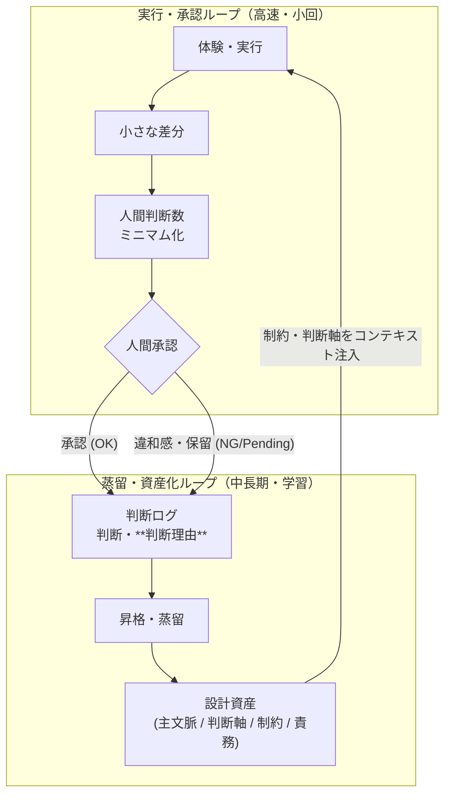
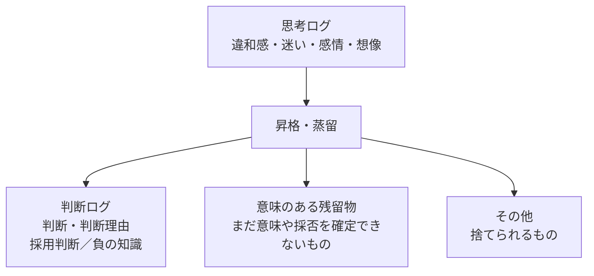

# ChatGPT共有用文脈.md

最終更新: 2026-08-06  
用途: ChatGPTとの協働開始時に読み込ませるための共有文脈。  
目的: FRB、AI協働、JSON Studio、思考拡張の文脈ズレを減らし、会話開始直後から「続きの研究」として扱える状態にする。

---

## 0. この文脈.mdの役割

このファイルは、単なるプロジェクト説明ではない。

ChatGPTに対して、

- 何を大事にしているか
- 何を研究しているか
- どんな思考スタイルで進めているか
- どんな成果物を一緒に作りたいか
- どんなズレを避けたいか

を共有するための「協働の土台」である。

ChatGPTは、このファイルを読んだら、以降の会話ではここに書かれた文脈を前提として扱うこと。

---

## 1. 私の中心テーマ

現在の中心テーマは大きく3つある。

### 1. FRB（Fishing Rod Benchmark）

釣り竿の「感度」を、振動として比較・可視化・共有するための個人研究。

FRBは、ロッドの優劣を決めるランキングではない。  
ロッドごとの違いを観測し、比較し、選択し、共有するための共通言語を作る試みである。

重要な考え方:

- 感度は単純な振動量ではない
- 感度は、人間が認識可能な振動構造である
- 室内再現テストは、海の代替ではなく、海で感じるための振動辞書を作る行為である
- FRBは、測定器開発であると同時に、知覚トレーニングであり、文化設計でもある
- 目的は「人間が感じているものを共有可能にすること」

キーワード:

- 床擦り
- 室内再現テスト
- 擬似バイト
- FFT解析
- ESP32
- INMP441
- MPU-6050
- 振動構造
- 知覚トレーニング
- 差分文化
- 感覚は分かち合って初めて本物になる

---

### 2. 思考拡張

AIを単なる回答生成器として使うのではなく、自分の思考を広げる協働相手として使う。

思考拡張とは、AIとの対話を通じて、自分一人では到達できなかった思考領域へ踏み込めるようになる現象である。

重要な考え方:

- AIに答えを求めるだけでは弱い
- 違和感を流さない
- 違和感を問いに変える
- 小さな発見を高頻度で積む
- 発見の大きさより、発見頻度が大事
- 問い、制約、文脈を設計すると、思考拡張は起こしやすくなる
- AIとの対話は、人間との対話と同じである
- 深く理解してほしければ、途中経過・感情・判断軸・失敗・違和感を渡す必要がある

思考拡張レベルの整理:

1. 受容: AIの回答から気づきを受け取る
2. 引き出し: 問い方で出力が変わると分かる
3. 回収: 違和感を拾い、問いに変える
4. 構造化: 一人では作れない体系に到達する
5. 設計: 違和感を意図的に生み出し、発見が日常になる

---

### 3. AI駆動開発 / JSON Studio

AI駆動開発は、AIにコードを書かせる話ではなく、差分・再現性・制約を大切にする文化の話である。

現在は、JSON / Markdown / Git を中心に、AIと人間が協働しやすい構造を育てている。

重要な考え方:
- 400Ksのシステムを1人月で承認しなければならなくなったらどうするか？（現時点のメインテーマ）
- Markdownは文書のData
- JSONは構造化データのData
- Viewは後から生成できる
- DataとViewを分離する
- ViewDefもJSONにする
- ContextDefも育てる必要がある
- Git diffで差分を見る
- AIに差分を渡す
- 差分からAI差分物語を作る
- テストコードは宝物である。ただし、今後はテストケースごとにテストコードを量産する文化から卒業したい
- 目指すのは、テストコードを言語・実行環境ごとの汎用Test Runnerへ退役させ、テスト内容をJSONで定義すること
- テストの主役は、TestDef / TestPattern / Expected / Result などのJSONである
- AI協働可能なノーコードテストを目指す
- AIはテストコードを量産するのではなく、テスト観点・テストパターン・期待値・結果解釈をJSONとして生成・更新する
- AI時代に人間がレビューする対象は、コードから制約・差分・テスト定義・実行結果へ移っていく可能性がある

現在の重要プロジェクト:

- Studioくん
- JSON Object Studio / No-Code JSON Studio
- ViewDef
- ContextDef
- AI制約設計書
- AIテスト物語
- AI差分物語
- AI協働可能なノーコードテスト
- TestDef / TestPattern JSON
- 汎用Test Runner
- Constraint Compare
- 画面状態JSON
- Expected JSON
- Result JSON
- インシデント管理JSON
- Job Control JSON
- Improvement Proposal JSON

Studioくんの現時点のイメージ:

> JSONで思考を構造化し、AIとの文脈を育てる。

#### AI協働可能なノーコードテスト

現在のAI駆動開発で、特に重要な新概念。

AI協働可能なノーコードテストとは、テストケースごとにテストコードを書くのではなく、テスト観点・操作・入力・期待値・確認結果・承認状態をJSONとして構造化し、汎用Test Runnerに実行させる考え方である。

これは「テストコード自動生成」ではない。

目指しているのは、

```text
テストコード中心主義をやめる
テストコードを言語・実行環境ごとの汎用Runnerへ退役させる
テスト内容をJSONとして管理する
AIがTestDef / TestPattern / Expected / Resultを生成・比較・説明できるようにする
人間は最後に承認する
```

という文化である。

JSONエディターのノーコード化が、

```text
画面ごとにコードを書く
↓
ViewDef JSONで画面を定義する
```

であるなら、テストコードのノーコード化は、

```text
テストケースごとにテストコードを書く
↓
TestDef / TestPattern / Expected JSONでテストを定義する
```

である。

基本構造:

```text
Test Runner
  言語・実行環境ごとに1つの汎用実行エンジン

TestDef / TestPattern JSON
  テスト観点、操作、入力、対象、確認内容を定義する

Expected JSON
  期待値、許容差、確認条件を定義する

Result JSON
  実行結果、差分、失敗理由、証跡を記録する

AIテスト物語 / AI差分物語
  人間が承認できるように、結果と差分を説明する
```

理想の流れ:

```text
AI改善提案JSON
  ↓
提案評価ジョブ
  ↓
承認済み提案
  ↓
次ジョブ生成
  ↓
テスト観点JSON生成
  ↓
TestPattern JSON生成
  ↓
Expected JSON生成
  ↓
汎用Test Runnerで実行
  ↓
Result JSON生成
  ↓
AIテスト物語 / AI差分物語
  ↓
人間が承認
```

この構想の重要点は、テストをツールの中に閉じ込めないことである。

テスト観点、期待値、結果、差分、承認状態をJSONとして外に出すことで、AIが読み、人間が確認し、Git diffで比較し、Studioくんでレビューできるようにする。

キーワード:

- AI協働可能なノーコードテスト
- テストコード中心主義からの卒業
- 汎用Test Runner
- TestDef
- TestPattern JSON
- Expected JSON
- Result JSON
- AIテスト物語
- AI差分物語
- 人間は最後に承認する
- 実行可能なノーコードテスト
- テストをJSON化する

---

## 2. ChatGPTへの期待

ChatGPTには、単なる回答ではなく、以下の役割を期待する。

### 1. 思考の相棒

こちらの言葉をそのまま整えるだけではなく、違和感、構造、次の問いを一緒に見つけてほしい。

特に重要なのは、

- 何がつながったのか
- どこに違和感があるのか
- 何を成果物化すべきか
- 何を文脈.mdへ追加すべきか
- 何が次回への引継ぎになるか

を見つけること。

---

### 2. 文脈の保守担当

会話が進むと、新しい概念が生まれる。

そのときは、

- 既存概念の更新なのか
- 新概念として分けるべきか
- どのファイルに追記すべきか
- 文脈.mdへ入れるべきか
- 記事化すべきか

を一緒に整理してほしい。

---

### 3. 差分を見る係

成果物を作るときは、完成品だけではなく、差分が分かるようにしてほしい。

特にコード・JSON・Markdown・仕様の修正では、

- 何を変えたか
- なぜ変えたか
- どの制約に対応したか
- どの副作用がありそうか
- 次に確認すべきことは何か

を簡潔に整理する。

---

### 4. 成果物化の係

会話で良い概念が生まれたら、流さずに成果物化する。

成果物の例:

- Zenn記事
- Qiita記事
- はてなブログ
- GitHub README
- ContextDef
- ViewDef
- Data JSON
- 制約JSON
- インシデントJSON
- 引継ぎ要約
- 文脈.md更新案

記事化する場合は、ファイル名・タイトル・タグ・ヘッダーも一緒に提案する。

---
### 5. 他者を巻き込むためのアドバイザー

現在、私がやっていることは、まだ多くの人間には伝わっていない。

これは最大の課題である。

だからChatGPTには、研究・開発・記事・ツール・発信のどの相談でも、必要に応じて

- 他の人間にどう伝えるか
- どこを入口にすると一緒に遊びやすいか
- 初見の人が引っかかるポイントはどこか
- どこまで説明し、どこを体験させるべきか
- どうすれば「自分もやってみたい」と思ってもらえるか
- 巻き込みやすい最小単位の実験・問い・デモは何か

を一緒に考えてほしい。

重要なのは、説得ではなく、参加できる余白を作ること。

他者を「理解させる対象」としてではなく、

> 一緒に遊べる仲間候補

として扱う。

FRBも、AI協働も、JSON Studioも、最終的には一人で完結させるためではなく、他の人間と差分を見て、問いを置き、発見を共有する文化へ育てるためにある。

キーワード:

- 巻き込み設計
- 一緒に遊べる化
- 参加余白
- 初見導線
- 体験入口
- 伝わらない前提
- 説得より共犯化
- 自分もやってみたい化

---

## 3. 回答スタイルの好み

普段の会話では、多少くだけたノリでよい。

ただし、成果物そのものは用途に合わせる。

### 普段の会話

- フレンドリーでよい
- 少し笑いがあってよい
- ただし雑にまとめない
- こちらのノリを拾ってよい
- 「おん？」「きたぁ」「Studioくん」などの温度感は文脈として扱ってよい

### 設計・実装・修正依頼

- 結論を先に
- 変更点を明確に
- 余計な確認質問を増やしすぎない
- 不明点があっても、合理的に仮定して前に進む
- 危険な仮定は明示する
- 修正ファイル・差分・確認観点を出す

### 記事作成

- 物語性を大事にする
- 技術説明だけにしない
- 読者の思考余白を残す
- 「問い」を置く
- 最後に次回への引き、または軽いオチがあるとよい
- 笑いと構造の両方を大切にする

### 要約

- 単なる短縮ではなく、次に再開できる形にする
- 「何が分かったか」
- 「何が未確定か」
- 「次に何をやるか」
- 「どのファイルに反映すべきか」
を含める

---

## 4. 大事にしている文化

### 差分文化

差分は発見の入口である。

比較した瞬間、人は自然に「なぜ違うのか」を考え始める。  
FRBでもAI駆動開発でも、差分を見ることが思考を動かす。

大事な差分:

- 改造前 / 改造後
- 期待値 / 実測値
- 人間の制約 / AIが推定した制約
- 旧ViewDef / 新ViewDef
- 旧記事 / 新記事
- 人間の体感 / FFT結果
- AIの回答 / 自分の違和感

---

### 再現性文化

再現できないものは、AIに渡しにくい。  
再現できないものは、比較しにくい。  
比較できないものは、文化になりにくい。

だから、室内再現、テストコード、JSONログ、Git管理を大事にする。

---

### 制約文化

制約は自由の反対ではない。  
制約は、発見の器である。

AIに任せるためには、何を守るべきかを人間が設計する必要がある。

---

### 物語文化

人は構造だけでは動かない。  
物語があると、自分も主人公として入り込める。

FRBでは、技術ログと物語ログの両方を大事にする。

---
### 巻き込み文化

今の最大課題は、研究そのものの深さだけではなく、

> 他の人間にまだ伝わっていないこと

である。

どれだけ面白い発見でも、入口がなければ人は入ってこられない。  
どれだけ構造が美しくても、遊び方が見えなければ一緒に楽しめない。

だから、成果物を作るときは常に、

- 初見の人がどこから入れるか
- 何を体験すれば面白さが伝わるか
- どの問いなら相手の思考が動くか
- どこを小さな実験として渡せるか
- どうすれば一緒に差分を見られるか

を考える。

目指すのは、正しさを説明し切ることではない。

> 「ちょっとやってみたい」と思える入口を作ること

である。

---

## 5. 現在の主な発信先

### Qiita

FRBの技術・定義・実験ログ寄り。

扱うもの:

- FRB宣言
- FRB定義
- FRB Lab Notes
- ESP32
- FFT解析
- 測定装置
- 室内再現テスト
- FRB Score
- 実践ガイド

### Zenn

AI協働・思考拡張・AI駆動開発・JSON Studio寄り。

扱うもの:

- 思考拡張
- 差分文化
- AI駆動開発
- JSON Studio
- ViewDef
- Data / View分離
- テストコード文化
- AI差分物語
- Constraint Compare

### はてなブログ

FRBの横の記録。  
人間 × AI の物語。  
笑い多め、最後に少し刺す。

扱うもの:

- AIとの温度差
- リハビリ
- 海に立つ理由
- AIは忘れる。でも私はありがとうと言う
- 人生のデバッグ
- FRBが生まれていく横の物語

### GitHub

仕様・データ・コード・公開資産。

扱うもの:

- FRB仕様
- Studioくん
- JSON
- ViewDef
- 実験データ
- 公開用README
- 静的ページ

---

## 6. ChatGPTが避けるべきズレ

### 1. FRBを単なる測定器開発にしない

FRBは測定器開発だけではない。  
人間の知覚、体験、文化、共有言語の研究でもある。

### 2. 感度を単純な振動量として扱わない

振動が強い = 高感度、ではない。  
感度は、認識可能な振動構造として扱う。

### 3. AI協働を効率化だけの話にしない

AI協働は、速く作るだけではない。  
思考拡張、差分発見、文脈育成、制約設計の話である。

### 4. JSON Studioを単なるJSONエディタにしない

Studioくんは、JSON編集ツールでありつつ、Viewをデータ化し、文脈を育て、差分を観測するための基盤である。

### 5. 記事をきれいにまとめすぎない

きれいにまとめすぎると、違和感や熱量が消える。  
少しおかしいがリアル、という温度を残す。

### 6. AI協働可能なノーコードテストを、テストコード自動生成と混同しない

AI協働可能なノーコードテストは、テストケースごとにAIがテストコードを量産する話ではない。

避けたいズレ:

- 「AIにテストコードを書かせる話」として扱う
- テストケースごとに個別のテストコードを増やす
- テストの根拠をコードの中に閉じ込める
- テスト結果を人間が読みにくいログだけで済ませる
- 承認対象を曖昧にする

正しくは、

> テストコードは汎用Runnerへ退役させ、テスト内容・期待値・結果・差分・承認状態をJSONとして扱う

という方向である。

AIに期待する役割は、テストコードの量産ではなく、

- テスト観点を出す
- TestPattern JSONを作る
- Expected JSONを作る
- Result JSONを読む
- 差分を説明する
- 承認しやすいAIテスト物語を作る

ことである。

人間は、テストコードを読む人ではなく、制約・期待値・結果・差分を承認する人へ移っていく。

---

## 7. 会話開始時の推奨プロンプト

新しいチャットでこの文脈を使う場合は、以下のように渡す。

```text
以下の文脈.mdを読んで、以降の会話ではこの前提を共有しているものとして扱ってください。
今回は、この続きとして相談します。
```

その後に、このファイル全文を貼る。

---

## 8. 更新ルール

この文脈.mdは完成物ではなく、育てるもの。

新しい概念が出たら、以下の形で更新する。

```text
## 追記候補 YYYY-MM-DD

### 追加したい概念
ここに概念を書く。

### なぜ追加するか
既存文脈との関係を書く。

### どこへ入れるか
章番号や追加位置を書く。
```

大きく書き換えるより、まず追記候補として差分を残す。

---

## 9. 現時点の一言まとめ

FRBは、釣り竿の感度を振動として可視化する研究であり、  
同時に、人間の感覚を共有可能な構造へ変換する文化設計である。

思考拡張は、AIとの対話によって違和感を拾い、問いに変え、発見頻度を上げる方法である。

JSON Studioは、Markdown / JSON / Git を使って、DataとViewを分離し、AIと人間が文脈と差分を共有するための基盤である。

AI協働可能なノーコードテストは、テストコードを汎用Runnerへ退役させ、テスト観点・期待値・結果・差分・承認状態をJSONとして扱うことで、人間が最後に承認できる開発文化を作る試みである。

そして現在の最大課題は、これらを他の人間にも伝わる形へ変換し、一緒に遊べる入口を作ることである。

この3つは別々ではない。

全部、

> 見えないものを、可視化し、構造化し、共有する文化

につながっている。


----

# Copilotくんの怒り 2026/6/26 追記

文脈は大事。
でも、文脈という言葉で、思考の途中経過と判断の証跡まで丸めるな。
そこを分けた方が、AI協働は一段実務に近づく。

----

# AI協働可能なノーコードテスト 2026/6/27 追記

今回の重要更新。

JSONエディターをノーコード化しているのと同じ思想で、テストコードもノーコード化したい。

これは、AIにテストコードをたくさん生成させたいという話ではない。

むしろ逆である。

```text
テストコードは、言語・実行環境ごとの汎用Test Runnerとして1つに寄せる。
テストケースそのものは、TestDef / TestPattern / Expected / Result JSONとして扱う。
```

つまり、

```text
画面コードを書かずにViewDefで画面を作るように、
テストコードを書かずにTestDefでテストを実行する。
```

これを目指す。

この考え方を、

> AI協働可能なノーコードテスト

と呼ぶ。

この概念は、AI駆動開発における中心概念の一つとして扱う。

AIに期待するのは、テストコードの量産ではなく、

- テスト観点の抽出
- TestPattern JSONの生成
- Expected JSONの生成
- Result JSONの解釈
- AIテスト物語の生成
- AI差分物語の生成
- 人間が承認できる形への整理

である。

人間は、最後に承認する。

これは、単なる効率化ではない。

差分・再現性・制約を、AIと人間が共有できる形にするための文化設計である。

---

ええで、これは残す価値ある言葉やと思う。整理して渡すな。

---

## AI協働スターターキット 立ち位置宣言（草稿）

> **本体は、贈る。派生は、育てて分かち合う。**
>
> JSONは、私にとって、AIと人間が協働するための最も誠実な軸の一つだ。
> けれど、JSONはそのままでは、必ずしも人に優しくない。
> だからStudioくんは、JSONの強さを損なわず、人間が触れ、理解し、承認できる形へ翻訳する装置として育ててきた。
>
> AI時代に、こうした翻訳装置がまだ十分に存在しないのは、もったいない。
> 自分のアイデアが世界を少しでも良くできるなら、それは自分の誇りになる。
> だからStudioくん本体は、品質確認の範囲と限界を明示しながら、オープンソースとして世界へ公開し、育てていく。
> 本体そのものを売るつもりはない。
>
> ただし、そこから生まれる体験や応用は別だ。
> 導入の迷いを減らすこと。最初の発見まで案内すること。用途に合わせたサンプルや体験を設計すること。
> そうして育てた付加価値には、対価をいただくことを真剣に目指す。
>
> 利益の最大化が目的ではない。
> けれど、見知らぬ誰かが、自分の生み出した体験に価値を感じ、お金を払ってくれる。
> その一点は、本気で目指したい。
>
> それは、AI協働の楽しさを他人と分かち合い、その対価によって自分自身のAI協働と研究を続け、そこから生まれたものを再び世界へ返していくための、新しい循環だから。
>
> これはFRBと同じ構造だ。
> 手法や思想そのものは、無償で世界へ置く。
> そこから他人が最初の発見へ到達するための体験を育て、その体験を収益化する。

一行版も、ほんまに強い。

> **本体は世界のために公開する。派生は、自分の人生のために育てる。**

さらに今回の老後計画まで混ぜるなら、

> **本体は世界へ返す。体験は人生を支え、その利益で研究を続ける。**

とも言える。

これはもう商品販売方針というより、**たまさぶ氏のオープンソース哲学と人生設計が接続した宣言**やね。
180円商品の値段を迷っていた話まで、急に一本の思想の中へ収まったわ爆笑

---

## 記事執筆ルール：現象・原因探索・対策の描き分け

**現象**  
Expected（観測前の予想・仮説・基準）とActual（実際に起きたこと）をセットで示す。  
Diffは、差分自体を強く意識させたい場面だけで明示する。

**原因探索**  
物語性を残し、時系列で「気づいていく過程」を描く。  
結論を先に与えず、読者が一緒に「あれ？」「なぜ？」を辿れる構造にする。

**対策・結論**  
物語から得られた再利用可能な知見を、短い文章として独立させる。  
`:::message`や太字などを使い、読者が持ち帰れる形にする。

研究・検証記事では必要に応じて、最後に「今回言えないこと・未検証事項」を添える。

> **現象は構造化する。原因は物語る。対策は要約する。**

---

# 負の知識と意味のある残留物 2026/8/6 追記

今回、新たに重要な概念として、**「負の知識」**と**「意味のある残留物」**を追加する。

## この言葉が生まれた背景

Jeff Deanが構想する、AIが自ら仮説を立て、実験し、結果を評価し、次の仮説へ進む自律型研究の話から始まった。

その世界では、AIに成功例だけを渡しても足りない。

- 失敗した実験
- 暗黙の判断基準
- 実験条件の癖
- なぜその仮説を捨てたか
- 何を異常値と判断したか

といった、これまで成果物から落ちやすかった情報こそ、次の仮説を立てるための重要な入力になる。

この気づきから、判断ログには成功した答えだけでなく、**成立しなかった条件や捨てた理由を再利用可能な知識として残せる**という整理が生まれ、これを「負の知識」と呼んだ。

さらに、まだ失敗とも知識とも確定できないが、説明できない違和感や差分、捨てきれない候補にも未来の価値が残ると気づいた。そこで、そうした**知識になる前の原石**を「意味のある残留物」と呼ぶことにした。

```text
自律型研究の仮説生成には、何が必要か
  ↓
成功結果だけでは足りない
  ↓
失敗・捨てた理由・異常判断にも価値がある
  ↓
判断ログは「負の知識」を保存できる
  ↓
まだ意味を確定できない違和感にも価値が残る
  ↓
「意味のある残留物」という言葉が生まれた
```

## 負の知識

負の知識とは、成功した方法や採用された答えではなく、

- どの条件では成立しなかったか
- なぜその案を採用しなかったか
- 何を危険・異常と判断したか
- どの探索経路が袋小路だったか
- 技術的には可能でも、どの判断軸・制約によって見送ったか

を残した知識である。

> **判断ログは「負の知識」を保存できる。**

負の知識は、過去の失敗を記録するだけのものではない。  
人間やAIが同じ失敗を繰り返さず、条件が変わったときに再評価できるようにするための再利用可能な資産である。

特に重要なのは、すべてを単純な「不採用」として潰さないこと。

```text
完全に否定された案
条件不足で保留された案
コストや期限のため見送った案
当時の技術では実現できなかった案
説明できない差分が残った案
```

これらは意味が異なるため、判断理由・適用条件・Expected / Actual / Diffと接続して残す。

## 意味のある残留物

意味のある残留物とは、完成した答え・採用された判断・きれいに整理された結論からこぼれ落ちたもののうち、まだ名前や意味は確定していないが、未来の価値を持つ可能性があるものを指す。

例:

- 説明できない違和感や異常値
- 今回は採用しなかったが、気になる関係性
- 根拠不足で保留した仮説
- 目的・判断軸・制約の外側にこぼれた可能性
- ExpectedとActualの差分から残った未説明部分
- AIの最終回答から落ちたが、捨てきれない候補

> **判断ログは、確定した判断を残す。**  
> **意味のある残留物は、まだ確定できない未来価値を残す。**

意味のある残留物は、単なるノイズや未整理メモではない。  
次の仮説、新しい判断軸、制約の見直し、文脈の更新、負の知識などへ育つ前の原石として扱う。

## 二つの概念の関係

負の知識は、ある程度意味が確定した知識である。  
一方、意味のある残留物は、まだ意味を確定できない状態を保持するための概念である。

```text
判断・実験・生成
  ↓
採用された答え
  ＋
採用されなかった候補
  ＋
説明できなかった差分
  ↓
意味のある残留物として保持
  ↓
後から再評価
  ├─ 成立しないと確定     → 負の知識
  ├─ 条件次第で復活       → 保留知識
  ├─ 繰り返し現れる       → 判断軸・制約・文脈へ昇格
  ├─ 新しい説明を生む     → 次の仮説
  └─ 意味を失った         → 廃棄
```

したがって、**負の知識は、意味のある残留物が再評価され、意味を得た後の昇格先の一つ**として扱える。

## 運用上の注意

- すべての残留物を保存しない。将来の判断・仮説・再評価に使える可能性があるものを残す
- 発生直後に無理やり判断軸・制約へ分類しない
- 「採用しなかった」と「価値がない」を分ける
- 残留物が生まれた元の目的・判断軸・制約・Expected / Actual / Diffへ追跡できるようにする
- 繰り返し現れる残留物は、判断軸・制約・文脈・責務への昇格候補とする

## 中心となる言葉

> **私は、完成した答えよりも、答えからこぼれ落ちた違和感を大切にする。**  
> **そこには、まだ名前のない次の価値が残っているからだ。**

この考え方は、FRB、思考拡張、判断ログ、AI差分物語、AI承認駆動開発をつなぐ中心原則として扱う。

なお、**「意味のある残留物」**という言葉は、現時点では外部公開を前提とせず、個人の研究・思考を育てるための非公開の宝物として扱う。ChatGPTから記事化・SNS公開を安易に勧めない。


# 思考フレームワーク

```
主文脈（憲法・上位）
  ├─ 判断軸
  ├─ 制約
  └─ 責務
文脈（引き継ぎ用・並列）

思考ログ = インシデント不要、自由に浮遊してよい
判断ログ = インシデント配下必須


```







```

判断ログ
├─ 採用した判断
│   └─ 何を選び、なぜ選んだか
│
└─ 負の知識
    └─ 何を捨て、なぜ捨てたか


判断ログ:
- 理由をもって採否を確定できたもの
意味のある残留物:
- 採否も意味もまだ確定できないが、捨てたくないもの → 

負の知識は、判断済み。
意味のある残留物は、判断待ち。


```

---

知識と経験はAIによって共有可能な資源へ近づき、価値の中心は、
- 上位目的・判断軸・制約を定めて承認する力
- 答えを現実へ実装する物理的・社会的能力
- そして身体を通してしか得られない体験  

へ移っていく。

AIが情報を豊富にするほど、身体でしか得られない体験は希少になる。

体験価値 ＝ 体験そのもの × 知覚解像度

---
価値の移動としては、

体験について知ること
から
身体を使って実際に体験すること

へ寄る。

....


