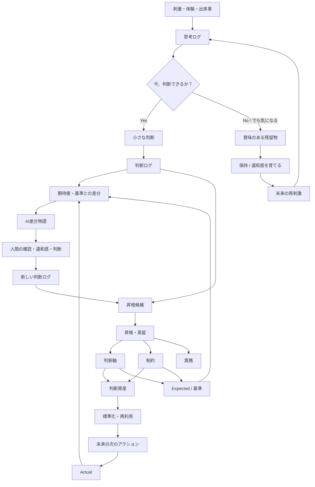

# AI協働・AI承認駆動開発 中核理論 ― 新チャット引継ぎ要約

最終更新: 2026-08-11  
用途: 新しいChatGPTチャットへ移行し、今回の議論の続きから再開するための引継ぎ資料  
位置づけ: **「私が考えるAI協働の中核理論」記事を新規作成するための現在地整理**  
ステータス: 仮説 / Evolving

---

# 0. この引継ぎで最も重要なこと

今回の議論では、これまで `ai-collaboration-context-decision-log.md`
（「私が考えるAI協働とは — 文脈というブラックホールに、判断ログを投げ込むな」）
へ追記してきた考えを、今後は別の**中核理論記事**へ集約する方針になった。

今後、以下のような中核概念に対する思考が更新された場合は、

- 思考ログ
- 違和感
- 違和感を育てる
- 意味のある残留物
- 小さな判断
- 判断ログ
- 判断軸
- 制約
- 判断資産
- 暗黙知
- 期待値
- 期待値との差分 / 基準との差分
- AI差分物語
- 昇格候補
- 昇格・蒸留
- ループ
- 再利用
- 人間判断数ミニマム化
- Markdown / JSON / Git
- DataとViewの分離
- 知識・判断 分離革命
- 人間の意思

まず**「AI協働の中核理論」記事を更新する**。

その後、

- `ai-collaboration-context-decision-log.md`
- AI承認駆動開発 #0 / #1 / 以降の記事
- FRB Studio / Test Runner / ViewDef / ContextDef等
- AI差分物語などの応用記事

へ必要な内容を反映する。

つまり、新しく作る中核理論記事を、

> **AI協働に関する自分の思考が変わった時、最初に戻って更新する「正本」**

として扱いたい。

---

# 1. 新しく作る記事の位置づけ

記事の立場は、

> **私が考えるAI協働の中核理論**

ただし、確立済みの学術理論として主張するのではない。

あくまで、

> **FRB、思考拡張、AIとの協働、AI駆動開発、実務経験を通じて形成された、現時点の個人仮説**

として明示する。

たとえば冒頭では、

> 本稿では便宜上「中核理論」と呼ぶが、確立された学術理論を意味するものではない。  
> 私自身のAI協働、FRB、思考拡張、AI駆動開発、実務経験から形成され、現在も更新を続けている仮説である。

くらいの宣言がよい。

ファイル名候補:

```text
ai-collaboration-core-theory.md
```

タイトル候補:

```text
私が考えるAI協働の中核理論 —— 判断を未来へ渡すループ
```

---

# 2. 記事群の責務分離

現在の記事群は、今後こう整理するとよい。

```text
【正本 / 上位】
AI協働の中核理論
  │
  ├─ 思考ログ
  ├─ 違和感 / 意味のある残留物
  ├─ 小さな判断
  ├─ 判断ログ
  ├─ 判断軸
  ├─ 制約
  ├─ 暗黙知
  ├─ 判断資産
  ├─ 期待値
  ├─ 期待値との差分 / 基準との差分
  ├─ AI差分物語
  ├─ 昇格・蒸留
  ├─ ループ
  ├─ 再利用
  ├─ 人間判断数ミニマム化
  ├─ Markdown / JSON / Git
  ├─ DataとViewの分離
  └─ 人間の意思

        ↓ 詳細化

【詳細論】
「文脈というブラックホールに、判断ログを投げ込むな」
  ├─ 文脈 / 主文脈
  ├─ 判断ログ
  ├─ 判断軸
  ├─ 制約
  ├─ 責務
  ├─ 検証可能な保証
  └─ 昇格候補の構造

        ↓ 開発への適用

【応用理論】
AI承認駆動開発
  ├─ 400KS / 人月
  ├─ スムーズな人間承認
  ├─ 責務
  ├─ TestPattern
  ├─ Expected
  ├─ Actual / Diff
  ├─ Relation Approval
  ├─ Definition Driven Testing
  └─ Human Decisions Required

        ↓ 実装・実験

【実装】
FRB Studio
ViewDef
ContextDef
Definition Test Runner
各種JSON
自己組織化デモ
比較実験
```

`ai-collaboration-context-decision-log.md` は「正本」ではなくなり、
**判断資産化・判断ログ周辺を詳しく掘る専門記事**という位置づけにする。

AI承認駆動開発は、
**中核理論を「400KS / 人月でも人間がスムーズに承認できる開発」へ適用した応用理論**
と位置づける。

---

# 3. この中核理論が生まれた大きな流れ

この考え方は、机上で一気に作ったものではない。

大きな生成史は、

```text
FRB
↓
思考拡張
↓
AI駆動開発
↓
400KS / 人月という問い
↓
スムーズな人間承認
↓
人間判断数ミニマム化
↓
小さな判断・判断ログ・差分確認
↓
判断軸・制約・責務への昇格・蒸留
↓
再利用
↓
次のアクション
↓
LOOP
```

である。

重要なのは、

> **最初から「AI協働理論を作ろう」と考えていたわけではない。**

FRB、仕事経験、ChatGPT、Copilot、Claude、AI駆動開発、Studio開発、
さまざまな違和感や刺激が接続され、
後から一つの構造として見えるようになった。

---

# 4. FRB → 思考拡張 → AI駆動開発

## FRB

FRB（Fishing Rod Benchmark）では、

- 体験を残す
- 再現する
- Expectedを作る
- Actualを測る
- 差分を見る
- 違和感を拾う
- 仮説を作る
- 再実験する

ということを繰り返してきた。

ここで「差分」「再現性」「違和感」が強いキーワードになった。

## 思考拡張

AIとの対話を通じ、

- 違和感を流さない
- 問いに変える
- 過去の経験と接続する
- 新しい言葉を得る
- 後から構造化する

という体験が増えた。

## AI駆動開発

Markdown / JSON / Gitを中心に、

- AIと成果物を循環させる
- Git Diffを見る
- Expected / Actual / Diffを見る
- テストをJSON化する
- ViewとDataを分離する
- 判断理由を残す

方向へ進んだ。

---

# 5. 400KS / 人月が重要なトリガー

この中核理論を強く押し進めた問いが、

> **AIが400KS規模のシステムを生成したとして、人間が1人月でどう承認する？**

というもの。

これは思想遊びではなく、かなり実務的な問い。

コードを全部読むのは無理。

AIに要約させるだけでも弱い。

そこで、

> **そもそも、人間が毎回新しく判断しなければならない対象そのものを減らさないといけない。**

という方向へ進んだ。

ここから、

> **人間判断数ミニマム化**

という考えへつながった。

---

# 6. 人間判断数ミニマム化

「人間判断数ミニマム化」は、

> 人間の判断をなくす

ことではない。

逆である。

> **過去に一度判断済みのことを、何度も人間に判断させない。**

過去の判断を残す。

判断理由を見る。

繰り返される価値判断を判断軸へ蒸留する。

繰り返される境界を制約へ蒸留する。

再利用できるものは再利用する。

標準化できるものは標準化する。

既存資産で処理できるものは機械・AIへ寄せる。

その結果、

> **本当に新しい差分、本当に新しい意思決定だけを人間へ返す。**

つまり、

> **人間を判断から排除するのではなく、人間を「本当に意思が必要な判断」へ集中させる。**

という思想。

---

# 7. 絶対に抜かしてはいけない最重要キーワード：LOOP

この理論は「ログを残しましょう」という記録論ではない。

最重要なのは、

> **ループ**

である。

今回の判断を、今回だけで終わらせない。

```text
体験・出来事
↓
思考ログ
↓
違和感 / 問い
↓
小さな判断
↓
判断ログ
↓
Expected / Actual / Diff
↓
AI差分物語
↓
人間の確認・違和感
↓
昇格候補
↓
昇格・蒸留
↓
判断軸 / 制約 / 責務
↓
標準化
↓
再利用
↓
未来の次のアクション
↓
新しい結果
↓
また Expected / Actual / Diff
↓
LOOP
```

このループを回すことで、

- 判断が資産になる
- 暗黙知が可視化される
- 過去判断を再利用できる
- 人間の新規判断数が減る
- 次の作業が楽になる
- 新しい差分からさらに判断資産が育つ

という循環を目指す。

---

# 8. 絶対に抜かしてはいけない最重要キーワード：昇格・蒸留

判断ログを大量保存するだけなら、巨大な倉庫になる。

重要なのは、

> **個別の判断から、未来で再利用できる構造を抽出すること。**

これを、

> **昇格・蒸留**

と呼ぶ。

例:

```text
似た判断理由が何度も出る
↓
「何を優先している？」
↓
判断軸候補
↓
人間承認
↓
判断軸へ昇格
```

```text
似た条件で何度もNGにする
↓
「どこが越えてはいけない境界？」
↓
制約候補
↓
人間承認
↓
制約へ昇格
```

重要:

```text
判断ログ
↓
いきなり判断軸・制約
```

ではない。

正確には、

```text
判断ログ
↓
昇格候補
↓
人間による確認・承認
↓
正式資産へ昇格
```

である。

つまり、

> **判断ログは過去を保存する場所ではなく、未来の標準を生成する原料。**

---

# 9. 「再利用」を中核語にする

以前は「共通化」という言葉を多用していたが、
中核理論ではできるだけ、

> **再利用**

で統一する。

「共通化」は、
本人のキャラクターを表すストーリー部分で使う。

### 共通化変人ストーリー

本人には昔から、

> 「これ、今は面倒でも未来便利になるんちゃう？」

と考え、何でも共通化したくなる癖がある。

```text
昔
処理を共通化

↓
Studio
画面をViewDefへ

↓
Definition Test Runner
テストをDefinitionから導出

↓
今回
ついに人間の判断まで再利用可能にしようとしている
```

記事内では、

> **狂気的な共通化変人が、未来を見すぎてまたやってしまった**

というストーリーとして使うとよい。

理論上の本質語は「再利用」。

---

# 10. 思考ログ

思考ログは、

- 迷い
- 会話
- 仮説
- 違和感
- まだ結論になっていないもの

を残す場所。

きれいでなくてよい。

```text
なんか違う
まだ分からない
これ何かある気がする
```

を保存してよい。

判断ログとは別。

```text
思考ログ
= 考えている途中

判断ログ
= 実際に選択・判断した記録
```

---

# 11. 意味のある残留物

「意味のある残留物」は重要な中核キーワード。

定義イメージ:

> **完成した答えからこぼれ落ちた違和感、未確定の価値、まだ名前のない次の仮説の種。**

思考ログの中で、

- まだ判断できない
- でも捨てたくない
- 未来につながる気がする

ものを保持する。

```text
思考ログ
↓
判断できる
  → 小さな判断へ

判断できない
でも捨てたくない
  → 意味のある残留物
  → 保持
  → 未来の刺激
  → 回収
```

---

# 12. 「違和感を育てる」

本人にとって非常に重要な言葉。

ただし、一般的な方法論として、

> 違和感があれば全部寝かせろ

とは言えない。

違和感には、

- 単なる理解不足
- 勘違い
- 今すぐ確認すべき危険
- ノイズ
- 未来につながる重要な違和感

が混ざる。

したがって中核理論では、

> **違和感をすぐ解消するだけでなく、価値があると感じた違和感を未解決のまま保持し、後の体験や刺激との接続を待つことがある。私はこれを「違和感を育てる」と考えている。**

くらいにする。

そして、

> **どの違和感を育てるべきかを一般化する方法は、まだ持っていない。経験値に依存する部分が大きい。**

と明示するとよい。

---

# 13. 「制約が思考を立ち上げる」が腹落ちするまで

Claudeが以前、

> **どんな制約を与えれば、思考が動き出すか**

という表現を使った。

当時、本人はこの意味が分からなかった。

かなり強い違和感を持った。

通常なら、違和感がある記事は公開しない。

しかしこの時は、
意味が完全に分からないまま、あえて公開した。

しかも、すぐClaudeへ説明を求めなかった。

約1週間、

> **違和感を飼った / 育てた。**

その後、FRB実験ログ #63、

> **近所迷惑を避けようとした結果、ロッドの微細翻訳構造が見えてしまった**

という体験が起きた。

「近所迷惑を避ける」という制約によって、
実験方法の探索空間が変わり、
別の方法を試した結果、新しい発見につながった。

ここで、

> 制約が思考を動かす

というClaudeの言葉が初めて腹落ちした。

---

# 14. 公開したこと自体が「自己制約」だった

さらに後から、

> **意味が分からない文章をあえて公開したこと自体が、自分に責任という制約を与えた**

と気づいた。

```text
公開する
↓
「いつかこの違和感を回収したい」という責任が生まれる
↓
未解決のまま保持される
↓
未来の体験へ反応する
↓
FRB #63
↓
意味を回収
```

つまり、

> 「制約が思考を動かす意味が分からない」

と言っていた本人が、

> **自分自身に制約をかけ、その制約によって実際に思考を継続させていた。**

という自己言及的なエピソード。

---

# 15. 制約について、実は仕事では昔から使いこなしていた

さらに重要な実務エピソード。

本人はパッケージ導入の仕事で、
提案書へ**制約を大量に書かないと不安で契約できないタイプ**だった。

ただし表現は、

> 「制約があります」

というネガティブな言い方ではなく、

> **「弊社システムの場合は、このような運用になります」**

と、運用設計として前向きに書く。

顧客との打ち合わせも、
実際にはこうした制約・運用条件について話す時間が非常に長い。

制約を提示すると顧客は、

- その運用で回るか
- このケースはどうするか
- 例外は必要か
- 現場運用を変えるか
- そもそもこの業務は必要か

を考え始める。

つまり仕事上では昔から、

> **制約を提示することで、顧客の思考を立ち上げる**

ことを実践していた。

Claudeの言葉は正しかった。

ただ、本人がその意味に接続するまで時間がかかった。

---

# 16. パッケージ開発部署への「制約事項を明確にしろ」事件

さらに笑える重要エピソード。

本人の部署はパッケージ導入部署。

パッケージ開発部署が、
製品の制約事項を十分に整理していないことへ非常に不満を持っていた。

本人自身は経験があるため、
顧客へ制約事項を説明できる。

しかし全国レベルで見ると、

> **どこの部署にも、製品制約を経験だけで説明できる熟練SEがいるわけではない。**

そのため、開発部署の責任者へ、

> **「パッケージとして制約事項を明確にしろぉーーーー！！」**

と散々説教していた。

今の中核理論の言葉で翻訳すると、

```text
熟練SEの暗黙知
↓
製品制約として言語化
↓
組織の判断資産へ
↓
全国の導入SEが再利用
↓
顧客との対話へ
```

を、昔から要求していたことになる。

にもかかわらず、

Claude:
> 「制約で思考を動かす」

本人:
> 「？？？？」

だった。

ここは記事の笑える強いエピソード。

> **自分で散々制約を使い、制約の組織資産化まで要求していたのに、その上位概念には反応できなかった。**

---

# 17. このエピソードが示す「暗黙知」

ここで重要なのが、

> **実践できていることと、その構造を言語化できていることは別**

ということ。

本人は制約を実践的には使いこなしていた。

しかし、

> **「制約は思考・対話・探索を立ち上げる境界でもある」**

という上位概念では認識していなかった。

つまり、制約の扱い方そのものも暗黙知だった。

これは判断軸にも同じことが言える。

---

# 18. 暗黙知：絶対に抜かしてはいけない中核キーワード

本人は昔から、

- 設計書に「なぜこの仕様にしたか」を書く
- 提案書へ制約を書く
- サービス仕様書へ制約を書く

習慣は持っていた。

しかし、

> **「私は何を優先して、この案を選んだのか」という判断軸そのものを、独立した資産として言語化・可視化する習慣は持っていなかった。**

ここが非常に重要。

従来の人間同士の協業では、

- 長年一緒に働く
- 空気を読む
- 相手の癖を知る
- 過去判断から推測する
- 熟練者が補完する

ことで、暗黙知のままでも一定程度回っていた。

しかし大AI時代、

> **判断軸を暗黙知のままにしておく運用は通用しなくなる可能性がある。**

という仮説を置く。

---

# 19. 暗黙知を言語化すると「人間自身の期待値」が見える

ここが最新の重要な補足。

判断軸を言語化・可視化する目的は、

> AIへ判断基準を渡す

だけではない。

AIへ説明するために、

> 「自分はなぜこの回答を違うと感じた？」

を考える。

すると、

```text
なんか違う
↓
なぜ違う？
↓
自分は何を期待していた？
↓
何を優先していた？
↓
判断軸が見える
↓
期待値が明確になる
```

ということが起きる。

つまり、

> **AIに期待値を教えるために言語化していたら、人間自身が、自分が何を期待していたのか初めて理解する。**

という未来があり得る。

これは非常に重要な仮説。

---

# 20. Expectedが明確になるほどDiffの価値が上がる

「差分」は中核語だが、
初見の読者へ単に「差分」と言っても意味が分かりにくい。

記事ではなるべく、

> **期待値との差分**
> **基準との差分**

と補足して使う。

たとえば、

```text
Expected:
なんとなく良い成果物

Actual:
AIの成果物

Diff:
なんか違う
```

では価値が低い。

しかし判断軸が明確なら、

```text
Expected / 基準:
変更範囲より責務分離を優先する
既存データ互換性を維持する
人間が変更理由を追跡できる

Actual:
変更範囲を減らすため既存責務へ処理を追加した
```

ここから、

```text
Diff:
「変更範囲最小化」と
「責務分離」の優先関係が期待と逆転している
```

まで見える。

つまり、

> **判断軸が明確になるとExpectedが明確になる。  
> Expectedが明確になるとDiffの解像度が上がる。**

そして逆方向にも、

> **Diffを見ることで、まだ言語化されていなかったExpectedや判断軸が見つかる。**

というループがある。

強い言い方:

> **ExpectedがDiffを強くし、DiffがExpectedを育てる。**

---

# 21. AI差分物語

「AI差分物語」は中核理論へ必ず入れる。

AI差分物語とは、

> **Expected / 基準とActualの差分を、人間が判断できる意味へ翻訳するAI仮説。**

位置づけ:

```text
Expected / 基準
↓
Actual
↓
Diff
↓
AI差分物語
「なぜこの差分が生まれたのか？」
↓
人間が読む
↓
違和感がある / ない
↓
必要なら補正
↓
小さな判断
↓
判断ログ
↓
昇格・蒸留
```

重要なのは、

> **AI差分物語が正解を決めるわけではない。**

AIが仮説を提示し、
人間が違和感を確認し、
判断するための支援。

---

# 22. 判断資産

「判断資産」は非常に良い上位カテゴリ語として採用候補。

```text
判断資産
├─ 判断ログ
├─ 判断軸
├─ 制約
└─ 必要に応じて責務・Expectedとの関係
```

ただし、「文脈」という言葉に全部を丸めないという思想と同様、
判断資産という言葉も内部の役割分離を消さないようにする。

あくまで上位カテゴリ。

---

# 23. 知識・判断 分離革命

この言葉も中核理論へ入れられるなら入れたい。

整理:

```text
知識
= 世界について知っていること

判断
= その知識と文脈の中で、
  何を選び、何を良しとしたか
```

AI時代には、
知識そのものはAIが大量に持つ。

しかし、

> **その人、その組織が、なぜこちらを選んだのか**

は知識だけでは復元できない。

そこで、

> **知識を保存するだけでなく、判断を独立した資産として扱う。**

これを、

> **知識・判断 分離革命**

という上位思想として置ける。

```text
知識資産
＋
判断資産
↓
文脈に応じた次の判断
```

---

# 24. 人間同士の協業にも当てはまる理論

中核理論では絶対に、

> **これはAI専用の理論ではない。**

という見解を残す。

背景共有、判断理由、判断軸、制約、過去判断の再利用、暗黙知の言語化は、
人間同士の協働でも必要。

AIの登場によって、

> **人間同士では暗黙に補完していたものが、明確に言語化しないと成立しない形で露出した**

可能性がある。

つまり、

> **AIとの協働を考えた結果、人間同士の協業でも本来必要だった構造が見えてきた。**

という見方。

パッケージ開発部署 → 導入SE → 顧客
という実務エピソードは、
AIが一切出てこないのにこの理論が成立している具体例。

---

# 25. AI時代に「人間の意思」が重要になる

別のトリガーとして、
AIが研究・発見そのものまで自動化する未来について考えた。

そこから、

> **発見までAIが自動化された世界で、人間は何を大切にすべきか？**

という問いが生まれた。

AIが、

- 仮説を作る
- 発見する
- 設計する
- コードを書く
- テストする
- 改善案を出す

ところまで行ったとしても、

最後には、

- 何を良いとするか
- 何を優先するか
- どちらを選ぶか
- どこまで許すか
- 何は絶対に許さないか

が残る。

これはまさに、

> **判断軸**
> **制約**

である。

したがって、

> **AIが賢くなるほど、人間は自分自身の判断軸と制約を明確に持つ必要がある。**

という結論。

判断軸・制約は、
AI精度向上のためだけのデータではない。

> **AIに振り回されず、人間が意思を持つための資産**

でもある。

---

# 26. Markdown / JSON / Git は抜かしてはいけない

中核理論にするなら、

- Markdown
- JSON
- Git

も必ず登場させる。

深く技術解説する必要はない。

位置づけは、

> **このループを日常的に回し、期待値との差分を身近なものにする基盤。**

### Markdown

```text
人間にもAIにも読みやすい文章Data
差分を取りやすい
```

### JSON

```text
判断・制約・Expected等を
構造化して扱えるData
```

### Git

```text
変更履歴を残し、
Diffを日常的に観測する基盤
```

一言で:

> **Markdown / JSONで意味をDataとして残し、Gitで差分を観測する。**

重要なのはツール信仰ではない。

> **差分を見ることを特別な作業ではなく、日常にすること。**

---

# 27. DataとViewの分離

これも重要な上位ワード。

```text
Data
= 意味の原本

View
= 目的・承認者・状況に応じた見せ方
```

たとえば、

```text
JSON
↓
ViewDef
↓
Grid / Dialog / Markdown
```

AI承認駆動開発なら、

```text
JSON原本
↓
顧客向けView
開発者向けView
品質担当向けView
↓
人間承認
```

になる。

中核理論では、

> **意味はDataとして残し、Viewは目的に応じて変える。**

という思想を残す。

---

# 28. Markdown / JSON / Git / Diff とLOOP

これらの技術基盤は、
中核ループの実装を支える。

```text
Markdown / JSONを変更
↓
Git Diffが生まれる
↓
期待値・基準との差分を見る
↓
AI差分物語
↓
人間判断
↓
判断ログ
↓
昇格・蒸留
↓
判断軸・制約等を更新
↓
Dataが変わる
↓
またGit Diff
↓
LOOP
```

昔作っていた手書き図では、
すでに中央にMarkdown / JSON / Git Diffがあり、
人間とAIがそれを介して循環していた。

今回の中核理論では、

> **その中央の箱の「中身」が詳細化された**

と考えられる。

---

# 29. 自己組織化の話

今回の議論の出発点には、
Fish / Ant / Brainの自己組織化デモがあった。

最新版:

```text
emergent_behavior_fish_ants_brain_demo_v2.html
```

位置づけ:

> **単純な局所ルールの反復から、全体として予想していなかった構造・振る舞いが生まれる感覚を体験するデモ。**

現状はv2で一旦凍結してよい。

このデモへ判断ログ・判断軸・制約比較まで混ぜない。

自己組織化デモと、
AI協働仮説の比較実験は責務分離する。

---

# 30. 自分の思考も自己組織化的に育ったのではないか

本人のAI協働の考え方も、

最初から設計されたものではなく、

```text
刺激
↓
連想
↓
過去経験との接続
↓
違和感
↓
保持
↓
別の刺激
↓
再接続
↓
強化 / 弱化
↓
反復
↓
後から構造化
```

したように見える。

ただし、

> 自己組織化して生まれたから正しい

とはしない。

生成過程と、
そのルールが有効かどうかの検証は別。

---

# 31. 比較実験構想

今後、

> 判断ログ・判断軸・制約等を使う場合 / 使わない場合

を比較する実験も候補。

重要原則:

> **同じ入力を与えて差分を見る。**

例:

```text
左:
ルールなし

右:
判断ログ
差分確認
判断軸
制約
昇格・蒸留
再利用あり
```

比較候補:

- 一貫性
- 同じ失敗の再発
- 説明可能性
- 再利用できた判断数
- 新規人間判断数
- 矛盾
- adaptability

最重要メトリクス候補:

> **Human Decisions Required**

ただし、この実験は自己組織化HTMLへ追加せず、
Claude Artifact等の柔軟に変更できる環境で試作してもよい。

---

# 32. 「AIなしでも成立する」が重要

中核理論そのものは、
AIがなくても成立する。

```text
判断
↓
記録
↓
差分
↓
昇格・蒸留
↓
再利用
```

は人間でもできる。

AIは、

> **このループを高速・低コスト・高頻度に回すための実装手段**

と考える。

したがって、

> **AIがあるから可能になった思想ではない。  
> AIの登場によって、これまで高コストだった運用が現実的になった。**

という立場。

これが「人間同士の協業にも当てはまる」とつながる。

---

# 33. 中核理論の記事で絶対に落としたくない上位キーワード一覧

## 目的・思想

- AI協働
- AI承認駆動開発
- 仮説
- スムーズな人間承認
- 400KS / 人月
- 人間判断数ミニマム化
- 人間の意思
- 知識・判断 分離革命
- 人間同士の協業にも適用可能

## 思考上流

- 思考ログ
- 違和感
- 違和感を育てる
- 意味のある残留物
- 刺激
- 再刺激
- 思考拡張
- 自己組織化

## 判断構造

- 小さな判断
- 判断ログ
- 判断軸
- 制約
- 判断資産
- 暗黙知
- 文脈
- 主文脈
- 責務

## 差分・期待

- Expected / 期待値
- 基準
- Actual
- **期待値との差分**
- **基準との差分**
- Diff
- AI差分物語
- 再現性

## 進化

- 昇格候補
- 昇格・蒸留
- ループ
- 標準化
- 再利用
- 未来の次のアクション

## 技術基盤

- Markdown
- JSON
- Git
- Git Diff
- DataとViewの分離

## キャラクター・物語

- 狂気的な共通化変人
- 「今は面倒でも、未来便利になるかもしれないでしょ？」
- また未来を見すぎてやってしまった

---

# 34. 中核ループの現時点案



※図はまだ仮。記事制作時に簡素化してよい。

---

# 35. 暗黙知 → Expected → Diff の重要ループ

この部分は中核理論の心臓部候補。

```text
暗黙知
↓
判断軸を言語化
↓
人間自身の期待値が明確になる
↓
Expected / 基準が見える
↓
Actualと比較できる
↓
期待値との差分 / 基準との差分が見える
↓
AI差分物語
↓
人間の違和感・判断
↓
判断ログ
↓
昇格・蒸留
↓
判断軸がさらに育つ
↓
Expectedがさらに明確になる
↓
LOOP
```

短い表現候補:

> **暗黙知を言語化すると判断軸が見える。  
> 判断軸が見えると期待値が見える。  
> 期待値が見えると差分が見える。  
> 差分が見えると次の判断が生まれる。  
> その判断をまた昇格・蒸留する。**

または、

> **ExpectedがDiffを強くし、DiffがExpectedを育てる。**

---

# 36. 制約の中核的な捉え方

制約は単なる「禁止事項」ではない。

中核理論では少なくとも三つの意味を持つ。

### 1. 越えてはいけない境界

```text
これはしてはいけない
これは必ず守る
```

### 2. 探索空間を作る境界

制約によって選択肢が減ることで、

> **その内側で「ではどうするか？」という思考が始まる。**

### 3. 協業を立ち上げる起点

制約を相手へ提示すると、

- 運用をどうするか
- 例外をどうするか
- 何を変えるか
- 何を諦めるか

という対話が始まる。

仕事でもFRBでも、
制約は思考・探索・対話を立ち上げていた。

---

# 37. 判断軸の中核的な捉え方

判断軸は、

> **制約の内側に残った複数の選択肢から、何を良いとし、何を優先するかを決めるものさし。**

例:

```text
短期効率より再現性を優先する
変更量の小ささより責務分離を優先する
実装量より人間の視認性を優先する
```

大AI時代には、
この判断軸を暗黙知のままにせず、
言語化・可視化する価値が増す可能性がある。

---

# 38. AI協働の中核理論を一文で言う候補

現時点の候補:

> **AI協働とは、人間の思考と判断をその場限りで捨てず、判断ログとして残し、期待値や基準との差分を観測し、AI差分物語を使って意味を確認し、再利用可能な判断軸・制約・責務へ昇格・蒸留し、それを未来の次のアクションへ戻すループである。**

さらに目的まで入れるなら:

> **その目的は、人間の判断をなくすことではなく、過去に何度も行った判断を再利用し、本当に人間の意思が必要な新しい判断へ集中できる状態を作ることにある。**

---

# 39. AI承認駆動開発との関係

AI承認駆動開発は中核理論そのものではなく、
中核理論の開発分野への適用。

```text
中核理論
判断を残す
↓
昇格・蒸留
↓
再利用
↓
人間判断数ミニマム化

        ↓ ソフトウェア開発へ適用

AI承認駆動開発
制約
↓
責務
↓
検証可能な保証
↓
TestPattern + Expected
↓
実行
↓
Actual / Diff
↓
人間承認
↓
判断ログ
↓
制約・責務・Expected等を更新
↓
LOOP
```

400KS / 人月問題は、
この応用理論の強いトリガー。

---

# 40. 記事のストーリー構成候補

## 第1幕: また未来を見すぎてしまった

- 昔から何でも共通化したくなる
- 「今は面倒でも未来便利になるんちゃう？」
- コード、UI、テストと対象が広がった
- 今回ついに「人間の判断」まで再利用しようとしている

## 第2幕: 400KS / 人月

- AIが大量生成できる
- 人間は全部読めない
- どう承認する？
- 人間判断数そのものを減らす必要がある

## 第3幕: 判断を残す

- 小さな判断
- 判断ログ
- 判断軸
- 制約
- 判断資産
- 昇格・蒸留
- 再利用
- LOOP

## 第4幕: 暗黙知

- 自分は理由や制約は書いてきた
- 判断軸は明示してこなかった
- 大AI時代は通用しないかもしれない
- 判断軸の言語化によって自分自身のExpectedまで見える

## 第5幕: Expected / Diff / AI差分物語

- 「差分」だけでは分からない
- 期待値との差分 / 基準との差分
- Expectedが明確ならDiffの価値が上がる
- AI差分物語で意味へ翻訳
- また判断へ戻る

## 第6幕: 違和感と意味のある残留物

- すぐ判断できないものを捨てない
- 違和感を育てる
- FRB #63
- 制約の意味を回収
- 昔の仕事経験まで再解釈

## 第7幕: 制約は思考を立ち上げる

- 提案書へ制約を書きまくる
- 「弊社の場合はこういう運用です」
- 顧客との打ち合わせは制約が中心
- パッケージ開発部署へ制約明文化を要求
- 本人は昔から実践していた
- それでもClaudeの一文に反応できなかった笑

## 第8幕: 人間同士にも同じ

- AI専用ではない
- 人間協業でも暗黙知が問題
- AIがそれを露出させた可能性

## 第9幕: Markdown / JSON / Git

- 差分を日常にする
- DataとViewを分ける
- 技術はループの基盤

## 第10幕: 発見がAI化された未来

- AIが発見までやるかもしれない
- 人間は何を持つ？
- 判断軸・制約
- 人間の意思
- AIに振り回されない

## 結末

> 今回の判断を、今回だけで終わらせない。

---

# 41. 記事を書く際の注意

- 「世界初の理論」とは言わない。
- 「既存研究に一切ない」と断定しない。
- 「私が経験から辿り着いた整理・仮説」とする。
- 自己組織化を科学的事実として自分の思考へ断定的に適用しない。
- 「違和感を育てる」を誰にでも有効な万能手法として書かない。
- AI差分物語はAIの正解ではなく、仮説・説明候補。
- 人間判断数ミニマム化は「人間排除」ではない。
- 制約は「禁止」だけに縮めない。
- Diffは最初から「期待値との差分」「基準との差分」と説明する。
- Markdown / JSON / Gitは目的ではなく、差分を日常化する基盤。
- DataとViewの分離は中核思想として残す。
- 「共通化」は理論語より、本人のキャラクター・物語で使う。
- 理論本体は「再利用」で統一する。

---

# 42. 次のチャットで最初にやること

次チャットではまず、

> **「私が考えるAI協働の中核理論 —— 判断を未来へ渡すループ」**

の記事構成を正式に決める。

特に確認したいポイント:

1. 冒頭フックを「共通化変人」から始めるか、「400KS / 人月」から始めるか。
2. FRB → 思考拡張 → AI駆動開発の生成史をどのくらい書くか。
3. 中核ループ図をどこまで簡潔にするか。
4. 判断資産の定義をどの粒度で書くか。
5. 暗黙知 → Expected → Diffを記事の中心にどこまで置くか。
6. AI差分物語をどこで登場させるか。
7. 「違和感を育てる」をどこまで方法論化せずに残すか。
8. 制約の実務エピソードをどこへ置くか。
9. Markdown / JSON / Git / DataとViewの分離を短い基盤章にするか。
10. 「知識・判断 分離革命」をどの節で接続するか。
11. 最後に「AIが発見する世界で、人間の意思」へどう着地するか。

---

# 43. 新チャット冒頭へ貼る最短文

以下だけでもかなり文脈を復元できる。

> FRB → 思考拡張 → AI駆動開発を経て、「AIが400KSを生成したとき、人間は1人月でどう承認するのか？」という問いから、私はAI協働の中核理論を整理している。中心は「思考ログ → 小さな判断 / 意味のある残留物 → 判断ログ → Expected / Actual → 期待値・基準との差分 → AI差分物語 → 昇格候補 → 判断軸・制約・責務への昇格・蒸留 → 標準化・再利用 → 未来の次のアクション → 新しい差分」というLOOPであり、目的は人間判断数ミニマム化である。大AI時代には、これまで暗黙知だった判断軸を言語化・可視化する必要が増し、その結果、人間自身の期待値まで明確になる可能性がある。Expectedが明確になるほどDiffの価値も上がる。またこれはAI専用ではなく、人間同士の協業にも当てはまる仮説である。Markdown / JSON / Gitは差分を日常化する基盤、DataとViewの分離も重要思想。判断資産、知識・判断 分離革命、違和感を育てる、意味のある残留物、人間の意思も中核記事へ含める。今後これらの中核概念が更新された場合は、まず中核理論記事を更新し、その後に既存の「文脈というブラックホールに、判断ログを投げ込むな」やAI承認駆動開発等へ反映する。

---

# 44. 一番短い現在地

> **今回の判断を、今回だけで終わらせない。**

判断を残す。  
暗黙知を言語化する。  
期待値を明確にする。  
期待値との差分を見る。  
AIに差分の物語を作らせる。  
人間が違和感と判断を返す。  
判断ログから判断軸・制約・責務を昇格・蒸留する。  
再利用する。  
未来の次のアクションへ戻す。  
また差分を見る。

**LOOPする。**

そして、

> **AIが賢くなるほど、人間は自分の判断軸と制約を明確に持つ。**

これが現時点の中核。
