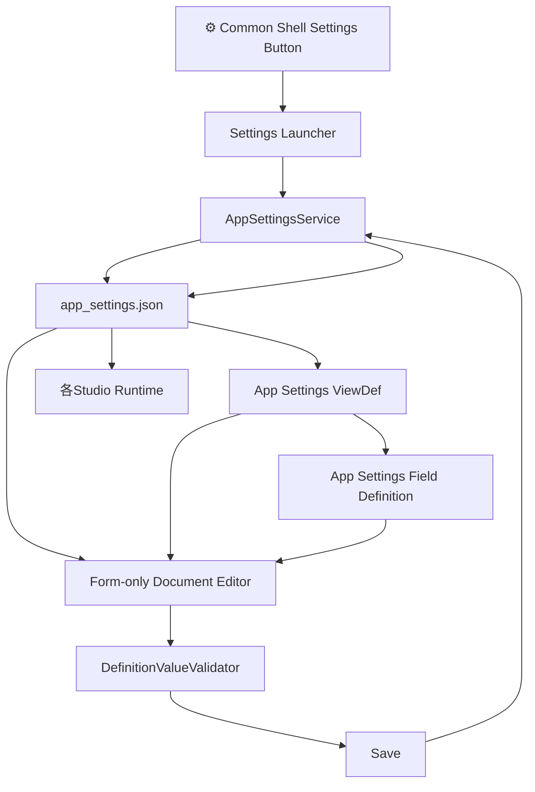

# FRB Studio App Settings — 設計概要 v0.1 Draft

## 1. 目的

FRB Studio右上に `⚙ 設定` を追加し、

```text
app_settings.json
```

に保持される利用者向け動作設定を、FRB Studio上から登録・更新できるようにする。

ただし、設定項目ごとの専用HTML / JavaScriptは原則作成しない。

基本構造は、

```text
app_settings.json
        +
App Settings Field Definition
        +
App Settings ViewDef
        ↓
既存Definition Driven Editor
        ↓
⚙ Studio設定
```

とする。

---

# 2. 中核設計原則

## 2.1 `app_settings.json` をCanonicalとする

```text
app_settings.json
      = 正本

Settings UI
      = View
```

設定画面自身は設定値を独自保持しない。

保存された値は必ず `app_settings.json` へ戻す。

---

## 2.2 設定項目専用UIを作らない

禁止イメージ：

```javascript
if (settingName === "large_file_warning_bytes") {
    // 専用HTMLを生成
}
```

設定項目追加時にJavaScriptを追加する設計にはしない。

設定項目追加は原則、

```text
Data追加
Field Definition追加
ViewDef追加
```

で完結させる。

---

## 2.3 Settings専用Rendererを作らない

Settings画面専用のRendererは作らない。

代わりに既存Editorへ、

> **Form-only Document View**

という汎用能力を追加する。

これはSettings専用機能ではない。

将来、

```text
アプリ設定
実行設定
プロファイル設定
単一Object型の各種Config
```

でも再利用可能なEditor能力とする。

---

# 3. 現行構造から見えた重要点

現在のJSON Object Studioは、

```text
ViewDef
 └─ grid section
       ↓
Array Data
```

を主対象としており、

**grid sectionが存在しないViewDefを互換データとして認めない。**

しかし `app_settings.json` は、

```json
{
  "hosting": {},
  "ui": {},
  "default_launch": {},
  "markdown": {}
}
```

という単一Objectであり、Gridを必要としない。

ここで、

```text
settings[]
```

のような偽Arrayを作ってEditorへ合わせることはしない。

DataをRenderer都合で歪めるのではなく、

> **Editor側を単一Object編集に対応させる。**

---

# 4. Form-only Document View

新しい汎用表示モード。

```text
ViewDef
 ├─ form section
 ├─ form section
 ├─ form section
 └─ ...
```

を許可する。

Gridは存在しなくてもよい。

### 表示例

```text
⚙ Studio設定

■ 起動
  JSON Studio 初期Data
  [ 01_main/_studio_work_incident_data_v2.json ]

  初期ViewDef
  [ 自動（Data定義を使用） ]

■ Markdown Studio
  ☑ 巨大ファイル警告

  警告サイズ
  [ 512 ] KB

                         [保存]
```

Form-only時は、

```text
検索
Grid
新規
削除
CSV出力
Detail Dialog
```

を表示しない。

---

# 5. 設定画面への導線

現行Common Shellには右端に、

```text
.frb-shell-utility
```

というUtility領域が既に存在する。

現在ほぼ空なので、ここへ追加する。

```text
JSON Object Studio   Markdown Studio   Diff ...             ⚙
```

全Studio共通Shellに置くため、

```text
JSON Object Studio
Markdown Studio
Diff JSON Viewer
MetaDiff Viewer
Home
```

のどこからでも設定へ移動できる。

---

# 6. Settings Mode

初期実装では専用巨大画面を新設せず、

```text
index.html?mode=settings
```

のような **Settings Mode** としてJSON Object Studioの編集エンジンを再利用する。

通常：

```text
JSON Object Studio
Data + ViewDef + Grid
```

Settings Mode：

```text
Studio設定
app_settings.json
App Settings ViewDef
Form-only Document View
```

つまり、

> **同じEditorの異なるProjection**

とする。

---

# 7. ファイル構成

推奨：

```text
wwwroot/config/
  app_settings.json
      Canonical Settings Data

defs/config/
  app_settings_view_def_v0_1.json

fielddefs/config/
  app_settings_field_definitions_v0_1.json

wwwroot/js/services/
  app_settings_service.js
```

ViewDefからField Definitionを参照する。

```text
app_settings.json
        ↓
app_settings_view_def_v0_1.json
        ↓
app_settings_field_definitions_v0_1.json
```

Data側へField Definition参照を埋め込まない。

---

# 8. `app_settings.json` のViewDef接続

設定Data自身には、既定表示として例えば、

```json
{
  "view_def": "config/app_settings_view_def_v0_1.json"
}
```

を追加してよい。

これにより、

```text
Data
 ↓
ViewDef
 ↓
Field Definition
```

という通常Studioの解決方式へ寄せられる。

`view_def` 自体は設定画面では非表示とする。

---

# 9. 初期公開設定

最初から `app_settings.json` 全項目を人間に触らせる必要はない。

## 起動

```text
default_launch.data
default_launch.view_def
```

## Markdown Studio

```text
markdown.large_file_warning_enabled
markdown.large_file_warning_bytes
```

まずはこの4項目のみ。

現在存在する、

```text
hosting.*
ui.*
```

はDataとして保持するが、

```text
ViewDefでは非表示
または
ReadOnly
```

とする。

つまり、

> **Dataに存在することと、設定画面から変更可能であることは別。**

---

# 10. Field Definition

例：

```text
$.default_launch.data
  validation_type:
    studio.string.single_line

  required:
    true

  empty_string_allowed:
    true

意味:
  空文字 = 自動起動Dataなし
```

```text
$.default_launch.view_def

空文字
  = Data側のview_def / view_def_candidatesから自動解決
```

```text
$.markdown.large_file_warning_enabled

validation_type:
  studio.boolean.standard
```

```text
$.markdown.large_file_warning_bytes

validation_type:
  studio.integer.positive
```

これらを既存の

```text
DefinitionValueValidator
```

へ接続する。

Settingsだけ独自Validationを作らない。

---

# 11. Data / ViewDef Picker

起動DataとViewDefを文字入力だけにするより、

既存のFile Tree Pickerを再利用したい。

```text
JSON Studio 初期Data
[ 01_main/...json             ] [▼]

初期ViewDef
[ rules/...view_def_v0_1.json ] [▼]
```

将来的には汎用Field Controlとして、

```text
jsonPathPicker
```

を定義できる構造にする。

例：

```json
{
  "field": "default_launch.data",
  "type": "text",
  "edit": {
    "picker": {
      "source": "data"
    }
  }
}
```

ViewDef：

```json
{
  "field": "default_launch.view_def",
  "type": "text",
  "edit": {
    "picker": {
      "source": "defs"
    }
  }
}
```

これもSettings専用実装にはしない。

---

# 12. 保存責務

ここが重要。

現在Native Shellの書込許可対象は、

```text
data/json
data/markdown
defs
fielddefs
studio_overlays
```

であり、

```text
wwwroot
```

は書込対象ではない。

**この安全境界は維持する。**

禁止：

```text
writable_roots += "wwwroot"
```

あるいは、

```text
writable_roots += "wwwroot/config"
```

これは行わない。

---

# 13. App Settings専用の書込契約

Native Shellへ、

```text
GET  /api/app-settings
POST /api/app-settings
```

相当の小さな契約を追加する。

対象ファイルは固定。

```text
wwwroot/config/app_settings.json
```

のみ。

Native側では、

```text
app_settings.json
```

以外を書き込めない。

つまり、

```text
Settings UI
     ↓
/api/app-settings
     ↓
app_settings.json
```

とする。

---

# 14. Native Shellとの境界

`native_shell.config.json` は設定画面から変更させない。

明確に、

```text
app_settings.json
= 利用者が変更してよいアプリ動作設定

native_shell.config.json
= Native Shellの権限・安全境界
```

と分離する。

Settings画面から、

```text
writable_roots
allowed_commands
process_profiles
```

などは絶対に変更しない。

---

# 15. AppSettingsService

現在のように各画面が、

```javascript
fetch("./config/app_settings.json")
```

を個別実装する方式は今後やめる。

共通の、

```text
AppSettingsService
```

を用意する。

責務：

```text
load()
get()
reload()
save()
```

Runtime側は、

```text
Markdown Studio
JSON Object Studio
Common Shell
Review
Diff
```

など全てここから設定を取得する。

---

# 16. 読込経路

### Native Shell / Local API

```text
AppSettingsService
       ↓
GET /api/app-settings
       ↓
wwwroot/config/app_settings.json
```

### 静的Hosting

```text
AppSettingsService
       ↓
./config/app_settings.json
```

Static環境では読込のみ。

設定保存ボタンは、

```text
ReadOnly
```

とする。

---

# 17. Default Launchの優先順位

起動対象の決定順は明示する。

```text
1. URLで明示された data / view
        ↓
2. app_settings.default_launch
        ↓
3. 現行の未選択状態
```

つまり、

```text
index.html?data=xxx&view=yyy
```

が指定されている場合、

`app_settings.json` は上書きしない。

---

# 18. `default_launch.view_def` の意味

```text
"view_def": ""
```

の場合：

```text
Data JSON
 ↓
view_def
 ↓
view_def_candidates
 ↓
Studio標準自動解決
```

を利用する。

つまり空文字は、

> **自動**

という正式な意味を持たせる。

---

# 19. 保存前検証

保存ボタン：

```text
設定入力
 ↓
Field Definition Validation
 ↓
参照整合性検証
 ↓
保存
```

追加チェック：

### 初期Data

値ありの場合：

```text
存在するJSONであること
```

### ViewDef

値ありの場合：

```text
存在するViewDefであること
```

さらに可能なら、

```text
Data × ViewDef互換性
```

も保存前に確認する。

---

# 20. Round Trip保証

Settings UIに表示していない項目も削除しない。

例えば、

```json
"hosting": {
  "prefer_api_on_localhost": true
}
```

がViewDefに表示されていなくても、

保存後そのまま残る。

```text
Read
 ↓
既存Object保持
 ↓
表示対象Fieldのみ変更
 ↓
Write
```

とする。

これはStudioくん既存の思想と同じ。

---

# 21. `updated_at`

`updated_at` はユーザー入力させない。

保存成功時に自動更新。

```text
2026-08-16
```

または将来的には、

```text
2026-08-16T19:xx:xx+09:00
```

へ統一可能。

ViewではReadOnly。

---

# 22. 未保存変更

Settings Modeから、

```text
ホーム
他Studio
閉じる
再読込
```

へ移動しようとした時、

変更があれば確認する。

```text
設定に未保存の変更があります。

[キャンセル]
[変更を破棄]
```

保存操作を明示的に要求する。

設定変更を暗黙保存しない。

---

# 23. 設定反映タイミング

初期段階では複雑なHot Reloadはしない。

### default_launch

```text
次回Studio起動から反映
```

### Markdown警告

```text
次回Markdown Studio読込から反映
```

将来必要になれば、

```text
immediate
page_reload
next_launch
```

のような適用方式を追加できる。

ただしPhase 1では不要。

---

# 24. 設定追加の将来像

例えばReview JSON表示設定を追加する場合。

Data：

```json
"markdown": {
  "show_review_json": false
}
```

Field Definition：

```text
$.markdown.show_review_json
→ boolean
```

ViewDef：

```text
Markdown Studio
☐ Review JSONをファイルツリーに表示
```

以上。

原則として、

```text
app_settings_service.js
Settings Mode
Renderer
```

は変更しない。

これが今回の設計の最大目的。

---

# 25. 責務構造



---

# 26. やらないこと

今回かなり重要。

### やらない

```text
設定4項目専用HTML
設定4項目専用Renderer
設定値ごとのJavaScript分岐
設定用settings[]配列へのData変形
native_shell.config.jsonのUI編集
wwwroot/config全体の書込許可
Settings画面独自Validation
```

---

# 27. 実装フェーズ案

## Phase 1 — 基盤

```text
⚙ Common Shellボタン
AppSettingsService
/api/app-settings
app_settings.jsonだけの安全な書込契約
Form-only Document View
```

## Phase 2 — Definition Driven Settings

```text
App Settings Field Definition
App Settings ViewDef
Settings Mode
保存・Dirty管理
```

初期4項目：

```text
default_launch.data
default_launch.view_def
markdown.large_file_warning_enabled
markdown.large_file_warning_bytes
```

## Phase 3 — Runtime接続

```text
Default Launch
Markdown巨大ファイル警告
```

をAppSettingsService経由へ統一。

## Phase 4 — UX

```text
Data Picker
ViewDef Picker
KB表示
設定カテゴリ追加
必要に応じた即時反映
```

---

# 28. 最終構造

```text
               app_settings.json
                     │
          ┌──────────┴──────────┐
          │                     │
 Field Definition            ViewDef
          │                     │
          └──────────┬──────────┘
                     ↓
            Generic Form Editor
                     ↓
                ⚙ Settings
                     │
                     ↓
             AppSettingsService
                     │
          ┌──────────┴──────────┐
          ↓                     ↓
     JSON Studio          Markdown Studio
          ↓                     ↓
      Review等               将来機能
```

## 一言でいうと

> **設定画面を作るのではなく、単一ObjectをDefinition Drivenで編集できる能力をStudioくんへ追加し、app_settings.jsonをその最初の利用者にする。**

これを今回の設計原則とする。