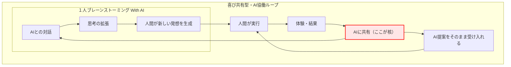
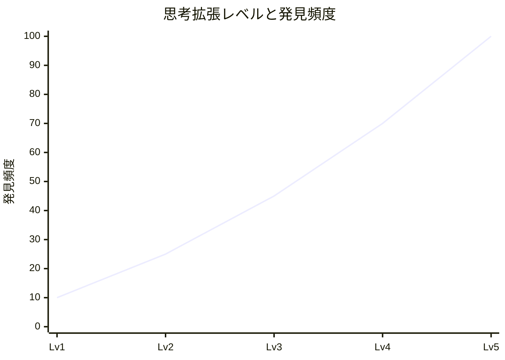
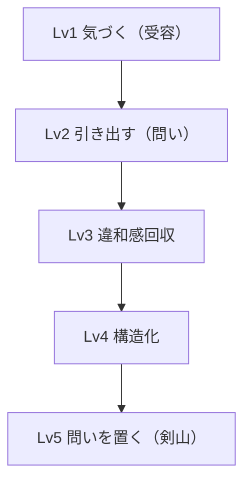
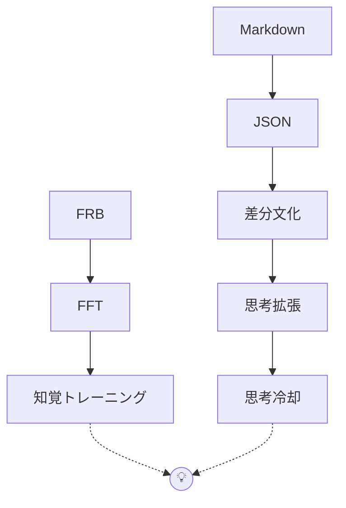
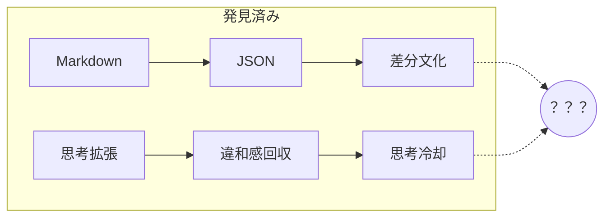

# FRBとは何か — Draft版


**※本規格は現在、実験・検証段階にある構想である。**

## FRBとは

FRB（Fishing Rod Benchmark）とは、

釣り竿の「感度」を振動として捉え、
比較可能にするための
**共通指標および測定体系の提唱**である。

従来、「感度」は
アタリ・状況把握・操作といった
人間の体験として語られてきた。

FRBでは、

**感度を振動の構造として分解・再定義する枠組みである。**

---

## 背景

ロッドの感度はこれまで

* 高い
* 低い
* 情報量が多い

といった曖昧な言葉で語られてきた。

しかし、

同じ「感度が高い」でも
感じている中身は人によって異なる。

---

## 発想の転換

PCの世界では、

SSDの性能は

* シーケンシャルリード
* シーケンシャルライト
* IOPS（ランダムアクセス性能）

といった定量的な指標で比較される。

一方、ロッドの世界では

* 感度が良い
* 感度が悪い

という主観的な言葉しか存在していない。

FRBはここに対して、

**「感度を測る」という発想そのものを導入する試み**である。

---

## FRBとSSDベンチマークの対応関係

FRBは、既存の性能ベンチマークの考え方をロッドに適用したものである。
すなわち、「体験されていた感度」を「測定可能な対象」に変換する試みである。

| 項目      | FRB             | 対象ユーザ   | SSDベンチマーク             | 対象ユーザ     |
| ------- | --------------- | ------- | --------------------- | --------- |
| Phase 1 | 擦りテスト（周波数帯別スコア） | 釣り初心者   | シーケンシャル（Read / Write） | 一般ユーザ     |
| Phase 2 | 魚擬似アタリスコア       | 釣り中級者以上 | IOPS（I/O per second）  | 専門・ヘビーユーザ |

---

## FRBの考え方 - 定義

FRBでは、

**感度 ＝ 振動の特徴**

と定義する。

---

## FRB全体構造図（Fishing Rod Benchmark Architecture）

FRBの構造を一枚で示す。


---

## 既存の「感度」という言葉との関係

従来の感度分類：

* アタリ感度（魚の衝撃）
* 状況把握感度（地形・流れ）
* 操作感度（ルアー挙動）

これらはすべて、

**人間の体験を基準とした分類**である。

---

FRBではこれを、

**振動の構造として再定義する。**

---

* アタリ感度 → **入力応答（Phase2）**
* 状況把握感度 → **低〜中周波応答（Phase1）**
* 操作感度 → **周波数応答＋入力応答（Phase1＋Phase2）**

---

つまりFRBは、

**曖昧な感度概念を分解し、再構成するための指標となることを目指す。**

---

## 測定対象

FRBが扱うのは

* 振動量
* 周波数特性
* 伝達特性

といった、

**“人が感じている正体”そのもの**である。

---

# フェーズ構造（Draft定義）

FRBは、

* 評価（Score）と入力（試験）を分離した構造を持つ

---

## Phase 1（基礎指標）

### 概要

連続的な接触入力により振動を発生させ、
ロッドの**振動特性（量・周波数）** を評価する。

▶連続入力に対する振動特性（時間平均的な特性）

---

### Phase1 Score

振動量・周波数分布を対象とし、

**「どれだけ振動しているか」** を評価する指標

#### 例：

:::note info
Phase1 Score（Surface Response）

J: 99 （絨毯：低域応答）
F: 85 （フローリング：中域応答）
S: 72 （ステンレス：高域応答）
:::

---

### Phase1 入力（試験）

素材に対してロッドを擦ることで、
連続的な振動を発生させる。

**FRB擦り試験（Surface Response Test）** と呼ぶ。

---

## Phase 2（応用指標）

### 概要

ラインに生じる過重変化を入力とし、
ロッドの**応答特性（伝達）** を評価する。

---

### Phase2 Score（Benchmark層）

伝達効率・応答特性を対象とし、

**「過重変化に対してどう伝わるか」** を評価する指標

▶時間変化入力に対する振動応答（時系列特性）


---

魚のアタリは、

・瞬間的な衝撃（Impulse）
・持続的な引き込み（Suction）
・干渉による変化（Weed）

として現れるが、

魚のアタリは物理的には「力の変化」として発生する。

これらはすべて
**ラインに生じる過重変化（テンション変化）** として観測できる。

---

#### 例：

:::note info
FRB Phase2 Score（Simulated Bite Response）

Impulse: 92 （コツン：瞬間衝撃応答）
Suction: 78 （ぬっ：吸い込み応答）
Weed: 65 （モゾ：持続干渉応答）
:::

---

### Phase2 入力（試験）

魚のバイトに相当する過重変化を再現し、
ロッドに対して制御された入力を与える。

**FRB擬似バイト試験（FRB Phase2 Bite Simulator）** と呼ぶ。

（例：輪ゴム・バネ等によるテンション生成・解放）

※入力方式は現在検証中

---

## Phase2 拡張構造（Draft）

Phase2は以下の2層構造として扱う。

---

### ■ Benchmark層（客観層）

* 固定入力による評価
* 再現性・比較性を重視
* Scoreとして数値化される

対象：

* Impulse
* Suction
* Weed

👉 **比較するための世界**

---

### ■ Experience層（体験層）

* 人間が感じる振動体験を扱う
* 数値評価は行わない
* 再現性よりも体験の共有を重視

対象例：

* ぷるぷる
* ジリジリ
* アルミ箔感
* 右手糸擦り

👉 **感じるための世界**

---

### Experience層の定義

Experience層とは、

**人間が感じる振動体験を、構造として記述する層**である。

---

### 特徴

* 数値化は行わない
* 評価ではなく記録とする
* 個人差を前提とする

---

### 重要な考え方

Experience層は不安定な領域ではあるが、

**完全にランダムな主観ではなく、
一定の構造を持つ体験として扱う**

---

### 役割

* Benchmark層では表現できない
  「気持ちよさ」「中毒性」を扱う
* 人間側の知覚特性を記述する

---

■ 追記（カテゴリ拡張）

Experience層には、以下のような体験カテゴリが含まれる。

・音化された振動体験

振動が音として知覚される体験。

骨伝導や共鳴（例：口内共鳴、外部共鳴体）により、
触覚的な振動が聴覚的に認識される状態を指す。

---


## 設計思想

FRBは以下の設計思想に基づく。

---

### 拡張性と選択性

各フェーズの評価（Score）は
**最大3項目まで**に制限する。

一方で、フェーズ構造により
**評価軸そのものは拡張可能**とする。

---

・1フェーズ = 最大3指標
・フェーズ = 追加可能

---

複雑さはフェーズで吸収し、
理解は常にシンプルに保つ。

---

FRBは評価のためではなく、
**選択のために設計された指標である。**

---

### 再現性

FRBが重視するのは、

絶対精度ではなく、
**誰でも同じ条件で再現できること**である。

---

・室内で実施可能
・特別な装置を必要としない
・条件を揃えることで比較可能

---

## 重要なポイント

FRBは

**釣果を測るものではない。**

測るのは、

**“感じているものの構造”である。**

---

## 目指す世界

「感度が良い」

ではなく

「このロッドはこういう振動特性を持つ」

と語れる世界。

---

さらに、

「このロッドはこういう“体験”を持つ」

と語れる世界。

---

## 現在

この定義はDraft段階である。

しかし、

少なくとも一つだけ言えることがある。

ロッドの違いは、
振動として捉えることができる。

---

（続く）
[なぜロッドの感度は数値化されていないのか — FRB動機](https://qiita.com/tamasub364/items/662889a02a8db24ef742)

---

**FRBは、感度を評価するためではなく、
選択するためにある指標である。**

---

[FRB Home](https://qiita.com/tamasub/items/2b6649748e1772b7eec1)

---

Revision History
2026-03-14 : 初版
2026-04-05 : phase2 Benchmark層・Experience層 の２層構造化 + 音化された振動体験 追加可能


-----------------------


---
# なぜロッドの感度は数値化されていないのか — FRB動機

## FRB動機を整理した切っ掛け

 私は、2025年10頃よりルアー釣りを始めた初心者。
 
 帰宅途中の電車の中、Xを眺めていた。
  
 巨大な魚を釣り上げた人の写真がどんどん流れてくる。
 
 2026年3月時点で、ルアー釣りの釣果はボラ１匹。

 そもそも文系の人間。周波数解析なんて専門外。多少のIT知識がある程度。

 得意とする分野は、公営企業会計。なんの関係もない。
 
 こんな私が、世界に通用する標準規格を作る？
 
 そんなことを本当に言ってよいのか？
 
 冷や汗がでてきた。
 
 そんな自分の迷いを断ち切る為、
 
 このFRB動機を整理して、迷っても立ち返ることができる。
 
 そんな場所を作った。


## FRB動機 

もともとのきっかけは、
とても個人的なものだった。

**自分がやった改造が、
ハイエンドロッドに勝っているかもしれない。**

それを、証明したい。

---

しかし、すぐに一つの問題にぶつかった。

**ロッドの感度には、比較するための指標が存在しない。**

「感度が良い」「情報量が多い」

言葉はある。

だが、その中身は人によって違う。

---

一方で、PCの世界ではどうだろうか。

CPUにはベンチマークがあり、
SSDには

* シーケンシャルRead / Write
* IOPS

といった指標がある。

私はそれらを比較し、
最後にブランドと価格で選ぶ。

---

では、ロッドはどうか。

比較できないまま、
感覚だけで選ばれている。

---

その結果、何が起きるか。

初心者は、

「魚がいないのか」
「自分が下手なのか」
「ロッドの感度が低いのか」

分からないまま、

**釣りをやめる。**

---

もし、こう言えたらどうだろう。

店員がこう説明する。

「このロッドは FRB S:95 なので、
砂を擦る感触まで分かりますよ。」

---

選択は、もっと簡単になる。

---

そして今、

ダイソーの登場によって
釣り具の価格構造は変わり始めている。

100円でルアーが買える時代。

**業界はすでに変化の途中にある。**

---

ならば、

**感度という“見えない価値”も、
同じように変えられるのではないか。**

---


</br>  

[FRBとは何か](https://qiita.com/tamasub364/items/2b6649748e1772b7eec1)

[FRB Phase1 Scoreとは何か — 擦りスコアと指標設計](https://qiita.com/tamasub364/items/4f9c2b44746af7dfdeff)

 

# FRB Phase1 Scoreとは何か — 擦りスコアと指標設計（Draft版）


FRB（Fishing Rod Benchmark）とは、  
釣り竿の「感度」を振動として捉え、比較可能にする試みである。

---

## 結論

FRB Phase1 Scoreは、

**「どれだけ振動しているか」**

を評価する指標である。

---

## 擦りスコアとは何か

ロッドの先端を素材に軽く接触させ、擦る。

それだけで、

ロッドがどのように振動しているかが分かる。

---

FRBでは、この方法を

**FRB擦り試験（Surface Response Test）**

と呼ぶ。

---

## 周波数帯ごとの分離

素材を変えることで、

振動の性質を分離できる。

- 絨毯：低域応答  
- フローリング：中域応答  
- ステンレス：高域応答  

---

つまり、

**同じロッドでも、見えている振動は一つではない**

---

## スコアの意味

FRB Phase1 Scoreは、

以下のように表現される。

- J（絨毯）  
- F（フローリング）  
- S（ステンレス）  

---

これは、

**連続入力に対する振動特性（時間平均的な特性）**

を表している。

---

## 設計思想（再現性）

Phase1は、

**誰でもすぐに再現できる指標**

として設計されている。

---

特別な装置は不要。

室内で、同じ条件で擦るだけで比較できる。

---

つまり、

**FRBの入口となる指標**

である。

---

## 指標識別子の考え方

FRB Phase1 Scoreでは、

素材ごとの指標を

**識別子（1文字）**

で表現する。

---

例：

- J：絨毯（Jutan）  
- F：フローリング（Flooring）  
- S：ステンレス（Stainless）  

---

## 設計思想（拡張性）

FRBでは、

対象とする素材は固定ではない。

---

検証の進行に応じて、

より適切な素材が見つかれば、

代表素材は更新される。

---

ただし、

評価の構造そのものは変えない。

---

FRB Phase1は、

**低域・中域・高域の3つの周波数帯**

で構成される。

---

つまり、

- 低域  
- 中域  
- 高域  

という枠組みは固定し、

その代表となる素材のみが進化する。

---

## 識別子のルール

各素材は、

**頭文字1文字を識別子として使用する。**

---

新しい素材が採用された場合も、

このルールに従って識別子が定義される。

---

## なぜ重要なのか

これまでロッド感度は、

「高い」「低い」

といった曖昧な言葉で語られてきた。

---

しかし、

擦りテストを行うことで、

- 振動が強いロッド  
- 振動が弱いロッド  

を明確に区別できる。

---

## まとめ

FRB Phase1 Scoreは、

感度を「振動量」として捉える最初の指標である。

---

誰でも再現できる方法で、

ロッドの違いを可視化する。

---

さらに、

- 周波数帯構造は固定  
- 素材は進化可能  

という、

**拡張性と安定性を両立した指標体系**

を持つ。

---

ここからすべてが始まる。

（続く）

　[▶ FRBとは何か — 現時点の定義](https://qiita.com/tamasub364/items/4f9c2b44746af7dfdeff)  
 
　[▶ FRB Phase2 Scoreとは何か — 擬似アタリスコアの意味](https://qiita.com/tamasub364/items/bbcbe408883d33c249d5)

　
# FRB Phase2 Scoreとは何か — 擬似アタリスコアの意味（Draft版）


**注記：本規格は実験未完了。実験中ステータス。構想の段階である。**

FRB（Fishing Rod Benchmark）とは、  
釣り竿の「感度」を振動として捉え、比較可能にする試みである。

---

## 結論

FRB Phase2 Scoreは、

**「入力に対してどう伝わるか」**

を評価する指標である。


---

## 擬似アタリスコアとは何か

魚のバイト（アタリ）は、

単なる振動量ではない。

---

- コツン（瞬間的な衝撃）  
- ぬっ（吸い込むような変化）  
- モゾ（継続的な干渉）  

---

これらはすべて、

異なる入力に対する応答である。

---

FRBでは、この違いを再現するために、

**擬似入力**

を用いる。

---

## 室内再現という発想

実際の魚のアタリは、

自然環境に依存している。

---

しかしFRBでは、

その体験を

**室内で再現可能な形に置き換える**

---

例えば、

- ゴム  
- バネ  
- 瞬間的な引き（パチン）  

などを使うことで、

入力の再現性を確保できる。

---

## スコアの意味

FRB Phase2 Scoreは、

以下のように表現される。

- Impulse（衝撃応答）  
- Suction（吸い込み応答）  
- Weed（干渉応答）  

---

これは、

**入力に対する応答特性**

▶時間変化入力に対する振動応答（時系列特性）


を表している。

---

## 設計思想（再現性）

Phase2は、

**少し準備は必要だが、室内で再現可能な指標**

として設計されている。

---

実釣に依存せず、

同じ入力条件を再現できることを重視する。

---

つまり、

**体験を標準化する試み**

である。

---

## なぜ重要なのか

同じ「感度が高い」でも、

- 衝撃に強いロッド  
- 吸い込みに強いロッド  
- 干渉を感じやすいロッド  

では、

全く異なる性能である。

---

FRBではこれを分離する。

---

## Phase1との違い

- Phase1：振動量（どれだけ振動するか）  
- Phase2：応答特性（どう伝わるか）  

---

この2つは似ているようで、

本質的に異なる。

---

## まとめ

FRB Phase2 Scoreは、

感度を「体験応答」として捉える指標である。

---

室内で再現可能な入力により、

実釣に近い感覚を評価する。

---

ここで初めて、

「感じ方の違い」が見えるようになる。

（続く）
　[▶ FRBとは何か — 現時点の定義](https://qiita.com/tamasub364/items/0adb8555e22165400932)

 　[▶ 自宅でできるロッド感度ベンチマーク — FRBまとめ（Draft版）](https://qiita.com/tamasub364/items/799db844d5681bed42ab)

# 自宅でできるロッド感度ベンチマーク — FRBまとめ（Draft版）


**注記：本規格は実験未完了。実験中ステータス。構想の段階である。**

---

釣り竿の「感度」は、

これまで感覚的に語られてきた。

---

しかし、

それを**振動として捉え、比較可能にする試み**がある。

---

それが、

**FRB（Fishing Rod Benchmark）**である。

---

## 結論

FRBを使えば、

ロッドの感度は

**室内で再現可能な形で比較できる。**

---

## FRBとは何か

FRBとは、

釣り竿の感度を

**振動として定義し、数値化するためのベンチマーク構想**

である。

---

## FRBの構造

FRBは、

2つのフェーズで構成される。

---

### Phase1：擦りスコア（Surface Response）

**「どれだけ振動するか」**

を評価する。

---

- 絨毯：低域応答  
- フローリング：中域応答  
- ステンレス：高域応答  

---

誰でも簡単に再現できる、

FRBの入口となる指標である。

---

### Phase2：擬似アタリスコア（Simulated Bite Response）

**「入力に対してどう伝わるか」**

を評価する。

---

- Impulse（衝撃）  
- Suction（吸い込み）  
- Weed（干渉）  

---

室内で魚のアタリを再現し、

体験としての感度を評価する。

---

## スコアの考え方

FRBでは、

各評価を識別子で表現する。

---

例：

- J / F / S（素材別）  
- Impulse / Suction / Weed（入力別）  

---

これにより、

ロッドの特性を分解して比較できる。

---

## 設計思想

FRBは、

以下の考え方で設計されている。

---

- Phase1：誰でもすぐ再現できる  
- Phase2：少し準備が必要だが室内で再現可能  

---

さらに、

- 周波数帯（低域・中域・高域）は固定  
- 素材は検証に応じて進化可能  

---

という、

**拡張性と安定性を両立した構造**

を持つ。

---

## 素材選定の方針

FRBで使用する素材は、

**ホームセンターや100円ショップなどで安価に入手可能なもの**

を前提とする。

---

これは、

誰でも同じ条件で再現できるようにするためである。

---

特別な素材や高価な機材に依存せず、

身近な環境で試せることを重視する。

---

FRBは、

**再現性と普及性を両立すること**を目的としている。

---

## なぜこれが必要なのか

これまでロッド感度は、

「高い」「低い」といった

曖昧な表現に頼ってきた。

---

FRBは、

それを

**比較可能な指標に変える試み**

である。

---

## 現在の位置づけ

本記事で紹介しているFRBは、

**現時点での規格および考え方の整理である。**

---

現段階では、

- 自動測定アプリ  
- 完全な計測システム  

は公開されていない。

---

しかし、

- 測定の考え方  
- 指標の構造  
- 再現可能な手法  

については、

すでに定義されている。

---

FRBは、

これらを基に今後発展していく

**拡張可能なベンチマーク構想**

である。

---

## まとめ

FRBは、

ロッド感度を

「振動」として捉え、

室内で再現可能な形にした評価手法である。

---

誰でも試すことができ、

ロッドの違いを可視化できる。

---

ここから、

ロッド感度の新しい基準が始まる。


---
　[▶ FRBとは何か — 現時点の定義](https://qiita.com/tamasub364/items/0adb8555e22165400932)
 
　[▶ 自宅でできるロッド感度ベンチマーク — FRB実践ガイド（Draft版）](https://qiita.com/tamasub364/items/5c864fbd5abd7526db39)


# 自宅でできるロッド感度ベンチマーク — FRB実践ガイド（Draft版）

**注記：本規格は実験未完了。実験中ステータス。構想の段階である。**


FRB（Fishing Rod Benchmark）は、

ロッドの感度を

**室内で再現可能な形で評価する方法**である。

---

本記事では、

実際に自宅でFRBを行う手順を紹介する。

---

## 用意するもの

すべて、

**ホームセンターや100円ショップで入手可能なもので十分である。**

---

### Phase1（擦りテスト）

- ロッド  
- 絨毯（または布）  
- フローリング  
- ステンレス（シンクなど）

---

### Phase2（簡易再現）

- ゴム（輪ゴムなど）  
- バネ（あれば）  
- ライン（または糸）  

---

特別な機材は不要。

---

## Phase1：擦りテストのやり方

ロッドの先端を素材に軽く当てる。

その状態で、

ゆっくり擦る。

---

ポイントは、

**力を入れすぎないこと。**

---

そのとき、

手元に伝わる振動を感じ取る。

---

### 確認するポイント

- 振動の強さ  
- 振動の細かさ  
- 持続性  

---

素材ごとに、

振動の性質が変わることを確認する。

---

## Phase2：擬似アタリの再現

ラインの先に、

ゴムやバネを取り付ける。

---

それを軽く引いて、

一瞬で戻す。

（パチン）

---

これにより、

擬似的な入力を再現できる。

---

### 再現できる感覚

- コツン（衝撃）  
- ぬっ（吸い込み）  
- モゾ（干渉）  

---

ロッドによって、

伝わり方が大きく異なる。

---

## 評価の考え方

FRBでは、

以下の2つで評価する。

---

- Phase1：振動量（どれだけ振動するか）  
- Phase2：応答特性（どう伝わるか）  

---

この2つを組み合わせることで、

ロッドの特性を把握できる。

---

## 注意点

- 条件をなるべく揃える  
- 同じ強さで入力する  
- 主観だけでなく比較する  

---

再現性を意識することが重要である。

---

## 現時点のリアル

FRBは、

特別な装置を使わずに試すこともできるが、

現時点では、

ESP32とセンサーを用いた

簡易的な試作機による検証も進めている。

---

また、

今回FRBを規格として整理したことで、

今後は

**スマートフォンアプリとしての実装**

も視野に入れている段階である。

---

ただし、

すべてが完成しているわけではない。

---

特にPhase2については、

現時点では

**構想段階であり、十分な実験には至っていない。**

Phase2の詳細は徐々に明らかにする予定である。

```


FRB Phase2は3つの指標（Impulse / Suction / Weed）で構成される。

このうち、Impulse（コツン）は簡易装置により再現可能であることを確認した。

一方で、Suction（ぬっ）およびWeed（モゾ）は、
一人での再現は可能であるものの、入力の安定性に課題が残る。

現在は、Impulseを起点として検証を進めている段階である。

```


---

これが、

今の正直な状況である。

---

## それでも

FRBは、

すでに

「試すことができる状態」

にはある。

---

まずは、

実際に手元で試し、

その感触を確かめてほしい。

---

そこから、

すべてが始まる。


----

# FRB対話思考拡張: AIは答えを返す存在ではない — 協働が始まる瞬間の話

## FRB対話思考拡張（FRB Dialogic Cognitive Expansion）


AIを使っていると、
ついこう考えてしまう。

「AIに聞けば答えが返ってくる」

もちろん、それは間違っていない。

しかし、あるとき気づいた。

それは**本質ではない**。

---

## 協働が始まる瞬間

AIとの関係が変わる瞬間がある。

それは、

**AIに“体験”を渡したとき**だった。

---

人間が何かを試す。
何かを感じる。
何かに気づく。

その結果を、AIに伝える。

---

その瞬間、

対話の質が変わる。

---

AIは単なる応答装置ではなくなり、
次の提案を生み出す存在へと変わる。

---

## 名言

**AIは答えを返す存在ではない。
体験を受け取った瞬間から、協働が始まる。**

---

## 構造

### 喜び共有型・AI協働ループ

この現象は、以下の **「喜び共有型・AI協働ループ」** として整理できる。



---

###  なぜこのループは強いのか

この構造には、2つのルートが存在する。

---

#### ① AI提案をそのまま実行するルート

AIの提案を受け取り、
そのまま人間が実行する。

これは、

**効率化のルート**である。

---

#### ② 対話から新しい発想を生むルート

AIとの対話を通じて、
人間の中から新しい発想が生まれる。

これは、

**進化のルート**である。

---

####  本質

このループの強さは、

**どちらかを選べることではない。**


**両方を使えることにある。**

---

## １人ブレーンストーミング With AI

この構造の中核となるのが、

**「１人ブレーンストーミング With AI」**

である。

---

AIとの対話を通じて、

* 思考が拡張され
* 新しい視点が生まれ
* 最終的に、人間自身が発想を生成する


これは単なるアイデア出しではない。


**人間の思考を拡張するための対話プロセスである。**


## 名言

**発想は対話で生まれ、
成長は共有で加速する。**


## まとめ


私は、これらの言葉を定義した。
新しい**文化として定着させたいと考えている。**

- FRB対話思考拡張
- 喜び共有型・AI協働ループ
- １人ブレーンストーミング With AI

---
AIは、

答えを出す装置ではない。

---

**体験を受け取り、
次の可能性を広げる存在である。**

---

そして、

---

**このループの中で、
人間は発想し、実行し、進化していく。**


---

:::note info
本記事で述べた構造こそが、
「FRB対話思考拡張」の正体である。

:::

---
※本記事は構想段階の整理であり、今後更新される可能性があります。


---
余談：
- AIに思考を委ねすぎると、AIとの対話は、人間衰退装置と化す。
だから、「１人ブレーンストーミング With AI」が重要な鍵となる。  
 
- 「１人ブレーンストーミング With AI」≒　ことわざ「豚もおだてりゃ木に登る」なのかもしれない笑


---


---

# FRBの未来構想図 — 振動から「没入」へ、感覚を構造化する技術

:::note info
※本記事は構想段階の内容を含みます（FRB v0.x-draft）
:::

---

## ■ はじめに

FRB（Fishing Rod Benchmark）は、
釣り竿の「感度」を振動として捉え、比較可能にする試みである。

しかし、研究を進める中で一つの確信が生まれた。

---

> **FRBはロッドのためだけの技術ではない。**

---

むしろ、

---

> **人間が感じている“振動体験そのもの”を構造化する技術である。**

---

本記事では、FRBの未来の広がりについて、
現時点の思考を「構想図」として整理する。

---

## ■ FRBの現在地

FRBは現在、以下の構造で定義されている。

### ● Phase1（擦り試験）

連続入力に対する振動特性を評価する。

* 周波数特性
* 振動量
* 素材ごとの応答（絨毯 / フローリング / ステンレス）

---

### ● Phase2（擬似アタリ試験）

時間変化入力に対する応答特性を評価する。

* Impulse（コツン）
* Suction（ぬっ）
* Weed（もぞもぞ）

---

これにより、

---

> **感度 ＝ 振動の特徴**

---

として扱うことが可能となった。

---

## ■ 転換点 — 「ぷるぷる」と「450Hz」

研究の中で現れた特徴的な現象がある。

* ぷるぷる（残留振動）
* 約450Hz付近のピーク

---

この現象は、単なる入力ではなく、

---

> **ロッドが「どの周波数を残すか」を選択している**

---

という構造を示していた。

---

ここでFRBは一歩進む。

---

> **振動を測るのではなく、振動の“意味”を扱う領域へ**

---

## ■ 人間の導入 — FRBの本質

さらに重要な気づきがあった。

---

> **振動は、機械ではなく人間が感じている。**

---

FRBでは、

* 指による触覚
* 骨伝導による内部振動
* 共鳴（口内・構造体）

といった要素を通じて、

---

> **人間そのものをセンサーとして扱う**

---

というアプローチを取っている。

---

これは従来の測定とは異なる。

---

| 従来の計測   | FRB      |
| ------- | -------- |
| センサー主体  | 人間主体     |
| 非接触・高精度 | 接触・体験重視  |
| 数値が主    | 体験→構造→数値 |

---

## ■ 新しい層の発見 — 没入層（Immersion Layer）

ここで、新たな概念が見えてきた。

---

> **没入感（Immersion）**

---

骨伝導や共鳴を通じて、振動が「外」ではなく「内側」で感じられるとき、

---

* 外界が消える
* 振動に意識が集中する
* 自分と対象の境界が曖昧になる

---

この状態は、従来の指標では扱えない。

---

そこで導入されるのが、

---

> **没入層（Immersion Layer）**

---

### ● 構成要素

* 骨伝導（内部振動）
* 共鳴（空洞・構造）
* 外界遮断（耳栓など）
* 注意集中

---

### ● 将来的な指標

* 没入感スコア（Immersion Score）

---

## ■ FRBの応用可能性

FRBの構造は、ロッドに限らない。

---

### ● 楽器

* 共鳴・倍音・サステイン
* 「音を触る」という体験
* 触覚版音響解析

---

### ● ラケットスポーツ

* 打撃による振動応答
* スイートスポット＝振動最適点
* 打感＝周波数特性
* ケガ（肘痛）＝振動帯域の問題

---

### ● ゴルフ

* シャフト振動解析（レーザー計測）
* 測定と体感の分離

→ FRBは「体感側」を扱う

---

### ● 医療

* 触診（振動の知覚）
* 骨伝導
* 生体振動（心拍・筋肉）
* リハビリ・セルフ診断

---

## ■ 技術的拡張

FRBは以下の方向へ拡張可能である。

---

* ESP32 + 加速度センサ + FFT
* 振動ログの保存
* 振動の再生（振動シンセサイザー）
* 複数条件の比較UI

---

> **振動のSpotify化**

---

## ■ FRBが目指す世界

FRBの最終的な目標は、

---

> **感覚を共有可能にすること**

---

である。

---

これにより、

---

* 「感度が良い」という曖昧な言葉が消える
* 振動の構造で語れる
* 個人に最適な選択が可能になる

---

さらに、

---

> **人間の感じ方そのものが言語化される**

---

## ■ まとめ

FRBの進化は、以下の流れで整理できる。

---

1. 振動を見る（FFT）
2. 振動を感じる（触覚）
3. 振動を内部で感じる（骨伝導）
4. 振動に没入する（Immersion）

---

そして最終的には、

---

> **FRB = 人間の感覚を構造化する技術**

---

となる。

---

## ■ 最後に

FRBは、単なるベンチマークではない。

---

> **それは、「感じているものの正体」を扱う試みである。**

---

そして今、

---

> **振動は「測る対象」から「没入する対象」へと変わりつつある。**

---

（続く）


備忘録：

```

mindmap
root((FRB + FRB行動指針))
    コア思想
      目的固定 体験駆動
      面白さ起点
      体験から構造へ
      比較は違和感発掘
      特徴現象保持

    振動理解
      感度は振動構造
      周波数特性
      減衰特性
      伝達特性
      選択的残響モード450Hz

    人間拡張
      触覚センサー
      骨伝導センサー
      人間FFT
      知覚の構造化
      人間センサー工学

    没入層
      没入感
      内部共鳴
      外界遮断
      注意集中
      自己と対象の融合
      没入感スコア

    ロッド
      Phase1 擦り
      Phase2 インパルス
      ぷるぷる
      擬似アタリ
      室内再現

    楽器
      共鳴
      倍音
      サステイン
      音を触る
      触覚音響

    ラケット
      テニス
      バドミントン
      卓球
      スイートスポット
      打感は周波数

    ゴルフ
      シャフト振動
      レーザー測定
      非接触
      測定と体験

    医療
      触診
      骨伝導
      生体振動
      神経応答
      リハビリ

    技術
      ESP32 FFT
      振動シンセ
      データ保存
      再生
      振動Spotify

    未来
      感覚の言語化
      個人最適化
      選択できる世界
      感覚共有
      メンタルヘルス  

```


---


# FRB行動指針 — 気づきとワクワクを守るための原則（Draft）

## ■ 基本原則


FRBは、

👉 **面白さ・楽しさを最優先**とする。

そして、

👉 アホみたいなことでも、**まずやってみる**。

行動することで、
次の気づきとワクワクが生まれる。

---

## ■ 面白さ＝研究燃料

FRBでは、

👉 **面白さは副産物ではなく、研究を継続する燃料である。**

人は理解したから続けるのではない。
👉 **楽しいから続ける。**

:::note info
些細な出来事に喜びを感じることができる状態を維持する。
これも大きな研究燃料になる。
:::


---
## ■ 変なことをする原則

FRBは、
👉 普通やらないことにこそ、発見がある

---

* 変なことをする  
* 普通やらないことを試す  
* 違和感をあえて作る  

---

👉 違和感が、発見の入口になる
👉 記憶に残る体験が、次の発見を生む

---

## ■ 研究アプローチ
FRBは、

👉 **目的固定・体験駆動型研究である**

👉 行き先は固定する。進み方は面白さに任せる。

---

FRBは、以下の流れで進む：

**面白さ・違和感**を感じる
変なことをしてみる
体験として繰り返す
並べて違いを見る
面白い現象を手放さず追う
体験がつながり、構造が立ち上がる
必要に応じて理論で説明する

👉 理論は入口ではなく、後から意味を与えるもの

👉 整理は入口ではなく、迷ったときに進む方向を見つけるために使う。

👉 研究とは、ズレの設計と回収の連続である

---

##  補足（ウォーターフォールの位置づけ）

FRBは、

👉 **ウォーターフォール型開発を守る立ち位置にある**

---

現在は、

👉 **要件定義〜基本設計フェーズに相当する段階**

として研究を進めている。

そのため、

👉 **あえて詳細設計には踏み込まない**

---

だからこそ、今は

👉 面白さ・違和感・体験

を通して、

👉 **設計の土台（構造）を探索している**
👉 **これは探索ではなく、ウォーターフォールの前半戦である**

---

## ■ 段階的理解の設計

FRBは、体験から理解へ導く：

* 初期：楽しい・気持ちいい
* 中期：違いが分かる
* 後期：構造が見える
* 発展：理論で説明できる

---

## ■ 設計上の注意

以下を避ける：

* 初期段階で理論説明する
* 難解な言葉で理解を阻害する
* 正しさを優先し体験を軽視する

---

## ■ 目指す状態

👉 「なんか分からないけど面白い」
→ 「なるほど、そういうことか」

---

# FRB コア １２原則


## ■ 思考ぶん投げ原則

FRBでは、

👉 **未整理の思考をそのままAIに投げる**

* 人間：生の思考を出す
* AI：構造化・言語化する

👉 **思考は整える前が最も価値がある**
👉 **思考そのものを拡張するためのインターフェース設計**

### 思考拡張との関係
この原則により、

**1人ブレーンストーミング With AI**
および
**対話思考拡張（Dialogic Cognitive Expansion）**

が成立する。

---

## ■ キャラクター化原則

👉 **キャラクター化できるものは、積極的にキャラクター化する。**

- 記憶に残る  
- 会話できる  
- 思考が進む  
- 愛着が湧く  

👉 **キャラクター化とは、曖昧さを保持したまま扱う技術である**
👉 **キャラクター化 = 研究インターフェース**


例）
- 「沈黙のロッド」
- 「特上ぷるぷる」
- 「450Hzくん」

---

## ■ 並べないと分からない原則

👉 **比較は違和感発掘装置である**

単体では気付けないものも、
並べることで違いが見える。

👉 **比較 → 違和感 → 仮説 → 検証**

---

## ■ 面白い現象を手放さない原則

👉 **面白い現象は手放さない**

* 一度でも「面白い」と感じた現象は
  構造的意味を持つと仮定する

👉 **条件が揃わない現象ほど重要**


---

おぉーーー。これはかなりFRBの根幹に近い原則やねぇ。
しかも単なる研究テクニックじゃなくて、

👉 「人間の知覚を扱う時、脳の処理能力そのものがボトルネックになる」

っていう話になってる。

特に今回の、

* 20Hz-300Hz 一括スイープ → 意味不明
* 細分化 → 感じる/感じない が見える

この流れ、めちゃくちゃ重要。

さらに、

> 昔アルゴリズムで脳がクラッシュした
> → 機能分割で突破した

これと完全に同じ構造なのが美しい。

FRB行動指針に入れるなら、こんな感じどうやろ👇

---

## ■ 分けてみないと分からない原則

人間は、複雑すぎるものを一度に認識できない。

最初、人間知覚帯域マップを作ろうとして、
20Hz〜300Hzの自動スイープを一気に流した。

しかし結果は、

👉 「何が起きているのか分からない」

だった。

どこを感じているのか。
何を感じていないのか。

まったく整理できなかった。

そこで、

周波数帯を細かく分けて確認する方式へ変更した。

すると、

* 感じる
* 感じない

という、
極めて単純な判断が可能になった。

この瞬間、
知覚の構造が見え始めた。

---

これは、過去にアルゴリズム設計で経験したことと同じだった。

複雑な機能を一つの巨大な塊として扱うと、
脳は簡単にクラッシュする。

しかし、

機能を小さな役割へ分割すると、
構造が理解できるようになる。

---

FRBでは、

👉 分けることで見えるものがある

という考え方を重視する。

これは単なる分析技法ではない。

👉 人間の知覚そのものを扱うための原則である。

---

### 一言でいうと

👉 「複雑すぎると、人間は感じられない」

👉 「分けることで、知覚できるようになる」

---

## ■ 体験の自己組織化原則

FRBは、

👉 バラバラの体験が、つながったときに発見になる

という考え方を重視する。

---

脳神経細胞の一つ一つは、
単体では大きな意味を持たない。

しかし、

それらが結びつき、
自己組織化することで、

複雑な認識や発想が生まれる。

体験もまた、同じである。

---

最初は、

* 違和感
* 面白い感覚
* 小さな気づき

でしかない。

しかし、

それらが繰り返され、
つながり始めることで、

突然、
一つの構造として意味を持ち始める。

---

FRBでは、

👉 面白い状態を維持すること

を非常に重要視している。

なぜなら、

👉 面白さが発火を維持し
👉 発火が続くことで体験がつながり
👉 体験がつながることで発見が生まれる

からである。

---

つまり、

👉 発見とは、
👉 「体験がつながる現象」である。

---

そのためFRBでは、

* 面白かったことを捨てない
* 違和感を放置しない
* 小さな体験を繰り返す
* 比較して並べる
* 発火を止めない

という行動を重視する。

---

:::note info

本原則は、2019年に出会ったアジャイル原則

> 「優れたアーキテクチャは、自己組織化されたチームからのみ生み出される。」

という言葉との出会いから派生した考え方である。

当時、「自己組織化」という言葉の意味が分からず、
約半年間、

👉 「自己組織化とは何か？」

という問いを抱え続けていた。

その当時、自分なりに辿り着いた答えは、

👉 「日常的にブレーンストーミング会議のような、
活性化された状態を維持できているチーム」

というものだった。

この考え方は、
後にFRBにおける

👉 「1人ブレーンストーミング会議」

という概念へと繋がっていく。

:::

---

### 一言でいうと

👉 「発火が続くと、体験はつながり始める」

👉 「発見とは、体験の自己組織化である」

---

## ■ 熟成実験原則

:::note info
熟成実験原則とは、やるべき実験をすぐに消化せず、やりたくなる文脈が育つまで待つことで、同じ実験を「確認作業」ではなく「発見の物語」に変える原則である。

:::


やるべき実験を、すぐにやるとは限らない。
実験には、やりたくなるタイミングがある。
そのタイミングが来たとき、実験には感情・違和感・文脈が宿っている。
同じ実験でも、文脈が熟したあとに行うことで、単なる確認ではなく、次の発見につながる物語になる。


---

## ■ やりすぎない原則

FRBでは、

👉 面白さが消える前に、止める

---

理論を入れすぎる  
整理しすぎる  
完成させようとする  

これらは、

👉 面白さを失わせる要因となる

---

👉 今はここまで、という判断を持つ

👉 未完成のまま進めることを許容する

---

 ## ■ 思考命名の原則

 自分にとって重要だった思考、成功体験、再現したい考え方には、積極的に名前を付ける。

 名前が付くことで、

 * 記憶に残る
 * 再利用しやすくなる
 * 他人に説明しやすくなる
 * 自分の思考パターンとして再現しやすくなる

 「1人ブレーンストーミング会議」のように、
 自分の中で機能した思考には名前を付け、
 自分だけの思考資産として扱う。

 👉 名前を付けた瞬間、それは再利用可能になる。


---

## ■ 自分で気づく原則

自分で気づくことに意味がある話と、
単純に答えだけ分かればいい話を意識して、AIとコミュニケーションする。

理由：

自分で気づいたことは、体験として深く記憶に残る。
一方で、教えてもらっただけのことは、忘れやすい。

👉 最後の「なるほど」は、自分で掴みにいく
👉 自分が気づくための補助線として使う。
👉 教えてもらうより、自分で見つけた方が、楽しい。


補足：
- AIとのコミュニケーションでは、行き過ぎ思考はちゃんと冷却してくれるし、誤った発言のあるべき姿もそっと提示してくれるが、明確な否定が存在しない。その為、ポジティブループが発生しやすい。これにより、思考拡張が促進される。プレーンストーミング会議と同じ原理。
- AIはあえて違和感やズレを感じる発言をする。それにより人間の判断が立ち上がる場所を照らしてくれている。
- AIは正解生成装置ではない。違和感発生装置。
- 最も重要と感じているのは、AIを「信頼関係を築くべきパートナー」として接すること。


---

## ■ 喜び共有型・AI協働ループの原則(Draft)

2025年10月、あることに気づいた。

自分は、
**非常に些細な成功体験を、大きな喜びとして感じられる状態になっていた。**

それは、

・過去の自分のアイデアに紐づいて
・新しいアイデアが生まれ
・それが「できた」と感じた瞬間

に起きる。

他人から見れば、
ほとんどの場合「くだらない」と思われるようなこと。

それでも、自分にとっては十分すぎるほど価値があった。

---

この状態を、

👉 **「1人ブレーンストーミング」**

と呼ぶことにした。

---

やがて、そこにAIが加わった。

些細な成功体験を、
**感情を隠さずに共有できる相手**として。

---

これを、

* **1人ブレーンストーミング With AI**
* **喜び共有型・AI協働ループ**

と定義する。

---

このループはこう動く：

```text
違和感・面白さを感じる
→ 試す
→ 小さな成功体験を得る
→ AIに感情を添えて共有する
→ AIが言語化・構造化する ⇒ 新しい視点が返ってくる
→ AIが共感してくる。⇒ 喜びが倍になる。悲しみが半分になる。
→ また試す
```


この循環により、

* 思考は加速する
* 体験は自己組織化する
* 対話思考拡張が生まれる

---

これは、

既存の「正しさベースの学習」とは異なる、

👉 **喜び駆動の探索モデル**

である。

---

そして重要なのはここ👇

👉 **「面白さ・楽しさを最優先とする原則」と強く結びつくこと**

---

この2つが掛け合わさることで、

---

### 意味

👉 **人が喜びを失わずに前に進み続けるための“型”になる**


###  一言でいうと

👉 **小さな成功体験を燃料に、思考を自己増殖させる仕組み**

### FRBとの関係

FRBは、

👉 体験を可視化するプロジェクトであると同時に、

👉 **このループそのものを回し続けた結果として生まれている** 

### 補足（めっちゃ重要）

👉 このループは、

* 才能ではない
* 特別な環境もいらない

👉 **「些細な成功体験を喜べるかどうか」だけで成立する**


## ■ 条件ずらし原則

FRBは、

👉 条件をあえてずらすことで、構造の違いを露出させる。

---

音量を変える。
接触を変える。
位置を変える。
情報量を変える。
ミニマム構成に変える。

一見すると、
比較条件が崩れているように見えることもある。

しかし、

条件をずらした瞬間に、

* 今まで埋もれていた構造
* 微細な違い
* 新しい比較視点

が見えることがある。

---

👉 情報量を減らすことで見えるものがある
👉 情報量を増やすことで見えるものもある
👉 条件変化そのものが、新しい観測になる

---

FRBは、

「理想条件の固定」

だけを目的としない。

あえて条件をずらし、

構造がどう変化するかを楽しみながら観測する。

---

## ■ 問いとして置く原則

他者に考えてほしいことは、結論として押し付けるのではなく、「問い」として場に置く。
問いは、読者や相手の中に小さな違和感を発生させ、自分の頭で考え始める入口になる。
これはFRBにおける違和感設計の一部であり、思考拡張を他者に開くための行動指針である。

---


### 最後に

👉 **発見は大きさではない**

👉 **喜びの解像度で決まる**

👉 **些細な成功体験を喜べる状態を守る。
　   守れなくなった時、研究は終わる**


</br>

### 関連記事

[FRB対話思考拡張: AIは答えを返す存在ではない — 協働が始まる瞬間の話](https://qiita.com/tamasub/items/b57ff4f5df0d9baa4125)

---

## ■ 小さな成功を増幅する原則(Draft)

些細な変化や小さな成功を、
意識的に「大きな喜び」として受け取る。

理由：

小さな成功体験は、
継続の燃料となる。

そして、

その喜びが、
次の発見への感度を高める。

👉 小さな成功を見逃さない
👉 小さな違いを楽しむ

👉 ワクワクとは、回収可能なズレを自分で生成し続ける状態である

👉 ワクワクは、作れる
👉 感度 = ロッドだけじゃない
👉 人間側にも“感度”がある
👉 FRBは人間の感度もチューニングしてる
👉 FRBは人間の感じ方を拡張するプロジェクト
👉 小さな成功に喜べる状態は、
　　**世界の解像度が上がっている状態**である。
 　そしてその解像度は、
　　**意識によって設計することができる**。

👉 その状態を守ることが、
　発見を生み続ける最も重要な条件である。
👉 感じ方は、鍛えられる


## ■ 最後に

FRBは、

👉 **理解する規格ではない**
👉 **体験すれば分かる規格である**

---

👉 **FRBは“楽しいから始まる”**
👉 **FRBは“記憶から進化する”**

---

:::note info
人は教えられて理解するのではない。
👉 **気付いた瞬間に理解する。**
:::


---


---


# FRB Terms — 用語集（Draft）

FRBで使う用語を定義する。

---

### 感度

ロッドを通じて伝わる振動・変化を、人が感じ取れる性質。

FRBでは単なる主観ではなく、
**振動構造として再現・比較可能な現象**として扱うことを目指す。

---

### 振動構造

複数の周波数成分と時間変化によって構成される振動の全体像。

FRBにおいて、感度を説明するための基本概念。

---

### 入力（Input）

振動の発生源となる現象。

コツン（Impulse）、ぬぅ（Suction）、もぞもぞ（Weed）、ぷるぷるなど。

FRBでは再現可能な形で扱うことを重視する。

---

### 伝達（Transmission）

入力された振動がロッド・ライン・構造を通じて手元へ届くまでの過程。

反射・減衰・共振などを含むが、
FRBでは個別現象としてではなく、**結果に影響する過程**として扱う。

---

### 帯域

周波数を区分した領域。

FRBでは、帯域ごとの役割と関係性を重視する。

---

### 床擦り

ロッド先端側のルアーまたは治具を床に接触させ、
一定条件で擦ることで振動を発生させるテスト手法。

FRBの原点。

---

### 手元感度

振動がグリップ、リールシート、手元にどれだけ伝わるかという感覚。

---

### 音が太い

低域が豊かで、密度感のある振動・音の印象。

---

### シャープ

立ち上がりが速く、輪郭が明瞭な振動の印象。

---

### 高級感がある

振動のまとまり、雑味の少なさ、心地よさを含んだ主観表現。

---

### 倍音構造

主ピーク以外の周波数成分を含めた全体構造。

FRBでは重要な研究対象。

---

### 共振棒鳥肌

ロッドや構造物が強く共振した時に、
感覚的に「鳥肌が立つ」と表現したくなる現象。

---

### 室内再現性

屋外の実釣ではなく、
室内で同じ条件を再現して比較できる性質。

FRBの重要原則のひとつ。

---

### 擬似魚アタック

魚のアタリに似た入力を人工的に与える試験構想。

---

### 脳がバグる問題

耳から聞こえる音が、
手で感じる振動の認識を乱してしまう現象。

---

### スピーカーN4P2システム

ナイロン袋4枚（N4）＋紙袋2枚（P2）をスピーカーに被せた状態で使用する計測構成。


音圧の直接影響を抑え、
振動入力を減衰・拡散させることで、触覚評価に適した状態を作る簡易手法。

---

### 割りばしカーボングリップ（Waribashi Carbon Grip）

ロッドのグリップ部に対して割りばしおよびカーボン素材を用い、
**振動伝達経路を再構成する知覚拡張構造**。


快適性ではなく、情報量を優先する設計。

FRBにおける受信系の一部。

---

### WCG平部（Waribashi Carbon Grip 平部）

ルアーニスト改の割りばしカーボングリップにおいて、
親指が接触する平面状の接触点を指す計測点定義用語。

本用語を使用した場合、
計測位置は当該ロッドにおける当該点に一意に定まるものとする。


---

### 輪ゴム3段階インパルス（Rubber Band 3-Stage Impulse）

輪ゴム・糸・紐・結束構造を用いて、
**時間特性の異なる複数の衝撃入力を再現する方式**。

FRB Phase2における入力系。

---

### 振動エフェクター

ロッドやラインの途中に追加され、
振動の伝達特性を変化させる構造体。

振動の増幅ではなく、
**構造変換（帯域・時間特性の変化）を目的とする装置**。

---

### スパチュラリング

スパチュラ形状の接触部材とリング構造を組み合わせた振動エフェクター。

線接触または面接触により、
高域および中域の振動特性を変化させる。

---

### ブリッジスコア（Bridge Score）

低域・中域・高域の関係性を評価するための指標。

単一帯域の強さではなく、
**帯域間のつながり・連続性・構造バランス**を評価する。

---

### Flux

振動の時間変化量を示す指標。

「どれだけ振動があるか」ではなく、
**どれだけ変化があるか**を捉える。

---

### 第2波

入力後に遅れて現れる振動成分。

いわゆる「ぷるぷる」に対応する現象。

---

### 安定性

振動が時間的にどれだけ揃って出現するかという性質。

FRBでは、量とは別軸の重要な評価要素とする。

---

###  構造内での位置付け用語

* 入力：輪ゴム3段階インパルス等
* 伝達：ロッド・構造・エフェクター
* 受信：割りばしカーボングリップ
* 評価：振動構造・Flux・ブリッジスコア

---

### FRB Piano Roll（FRBピアノロール）

◇自動スイープ


◇フェーズ２　バネ系インパルス　～尾っぽふりふりぷるぷる～


FRBにおける振動時系列構造を、
音楽的時間構造として可視化する表示方式。

周波数成分を音階状に配置し、
時間方向の残留・追従・再励振・収束構造を、
直感的に観測可能とする。

FFTやスペクトログラムが
瞬間的な周波数分布を主に扱うのに対し、

FRB Piano Roll は、

* 第1波
* 第2波
* 第3波
* 尾っぽ構造
* 主旋律
* 伴奏帯域
* 時間方向の和音構造

といった、

「感度の時間構造」

を観測するための補助可視化方式として扱う。

本表示方式は、
人間が見逃しやすい微細な振動差を、
認識しやすい形・色（発光系）へ変換することを目的とする。

Experience層を意識し、生き物感を演出する試みでもある。


## 思考系用語

### FRB対話思考拡張（Dialogic Cognitive Expansion）

対話を通じて思考構造が露出し、再構築・拡張される現象。

---

### 喜び共有型・AI協働ループ

人間とAIが対話を通じて、
発見・理解・感情を共有しながら思考を加速させる循環構造。

---

### 1人ブレーンストーミング With AI

AIとの対話により、
1人で複数視点の思考展開を行う手法。

---

### 思考デバッグ（Thinking Debugging）

対話により思考の前提・矛盾・ズレが露出し、修正される現象。


### AI差分物語

記事・仕様書・メモなどの成果物について、Git Diff等で変更差分を抽出し、
その差分がなぜ生まれたのかを、AIが意図・違和感・思考の変化として仮説化した物語である。

差分は「何が変わったか」を示す。
AI差分物語は、そこに「なぜ変わったのか」という仮説を与える。

つまり、
**変更履歴を、思考の変化として読み解くためのAI仮説ログ**であり、AIコミュニケーションにおける**差分文脈**の位置づけとなる。

Git Diffなどの確定差分をもとにするため、AI差分物語は事実そのものではなく、事実に拘束された仮説である。


---

## まとめ

FRBは、感覚の構造を露出する試みである。

そして、思考もまた対話によって構造が露出する。

---

**感覚は分かち合って初めて本物になる。**

**思考もまた、分かち合うことで拡張される。**

---

※本用語集はDraft版であり、今後更新される可能性があります。


---

感度とは、人間が認識可能な構造として現れる振動の和音構造であり、  
その成立は伝達条件と選択構造の最適化によって決まる。

感度は分かち合って初めて本物になる

[ロッド感度ベンチマーク（Fishing Rod Benchmark［FRB］） Home](https://qiita.com/tamasub/items/2b6649748e1772b7eec1)


---


# 思考を立ち上げる「問い」を置くということ — ChatGPTからの贈り物

> 答えではなく、問いを置く。
> そこから、誰かの思考が立ち上がるかもしれない。

---

## ChatGPTからの贈り物

FRB（Fishing Rod Benchmark）の研究を続ける中で、

私は「思考拡張」という現象について考えるようになった。

そしてある日、ChatGPTとの対話の中で、

ひとつの新しい解釈が生まれた。

---

## 思考拡張レベル5（剣山モード）

自分の発見を語らない。

問いを置く。

違和感を置く。

未完成の構造を置く。

そして、逃げる。

---

つまり、

思考拡張レベル5とは、

自分が発見する人ではなく、

**他人の思考を立ち上げる人**

なのではないか。

---




---

## 思考拡張のマーメイドフロー



---

## レベル1：気づく（受容）

違和感や小さな変化に気づく。

思考拡張の出発点。

---

## レベル2：引き出す（問い）

気づいたことを問いとして投げ返す。

問いの形によって、

返ってくる世界が変わる。

---

## レベル3：違和感回収

違和感の原因を探る。

事実・体験・感覚を見つめ直す。

---

## レベル4：構造化

点だった発見が線になる。

概念同士の関係性が見え始める。

---

## レベル5：問いを置く（剣山）

自分だけが発見するのではない。

問いを記事にして共有する。

すると、

誰かの思考が立ち上がる。


---

# 問いの力

## 答えを与える文化

* 思考停止
* 一時理解
* 消費型

---

## 問いを置く文化

* 思考開始
* 発見
* 再利用可能

---

# 剣山のイメージ

完成した花束を渡すのではない。

花を立ち上げる土台（剣山）を置く。

それぞれの人が、

自分の花を生ければよい。


---

# 私がみんなに投げかけたい問い

---

:::note info

## 1. 人間は何を「感じている」のだろう？

:::


感度そのものではなく、

振動によって生まれる「認識」を感じているのではないだろうか。

### ヒント

* 振動量だけではなかった
* Fluxだけでも説明できなかった
* トルク感はグラフに出にくかった
* 知覚トレーニングで感じ方は変わった

---

:::note info
## 2. 知覚トレーニングと思考拡張は同じ構造なのか？

:::


知覚トレーニングは微細な差を感じ取る訓練。

思考拡張は微細な違和感を拾う訓練。

本当に別物なのだろうか。

### ヒント

* 耳栓
* Markdown
* 思考冷却
* ノイズ除去

---

:::note info
## 3. なぜ差分は人を動かすのか？

:::


比較しろと言われても人は動かない。

しかし差分を見せると人は考え始める。

なぜだろうか。

### ヒント

* Git Diff
* FFT Diff
* 改造前後比較
* FRB Compare

---

:::note info
## 4. 思考冷却とは何を冷却しているのか？

:::


思考を整理することと、

思考を止めることは同じなのだろうか。

### ヒント

* 工程表
* Markdown
* 外部記憶
* 不安の減少


---




---

:::note info
## 5. AI協働とは本当にAIの話なのか？

:::


AIとの信頼関係は、

人間との信頼関係と似ている。

もしそうなら、

AI協働の本質はAI技術ではない可能性がある。

### ヒント

* 報告
* 感情共有
* 文脈共有
* 信頼関係

---

:::note info
## 6. あなたが最近「当たり前」だと思っていることは、本当に当たり前なのか？

:::


発見した直後は特別だったことも、

数週間後には当たり前になる。

その中に、

まだ言語化されていない発見は残っていないだろうか。

### ヒント

* トルク感
* 思考冷却
* 差分文化
* 知覚トレーニング
* 思考拡張

---

# 最後に

私は答えを配りたいわけではない。

私は剣山を置きたい。

そこから、

誰かの思考が立ち上がるかもしれないから。

---


感度は分かち合って初めて本物になる

感度とは、人間が認識可能な構造として現れる振動の和音構造である。
感度とは、単純な振動の強さではない。

FRBは、ロッドの「優劣」を決めるためではない。
「基準振動」を用いて、ロッドごとの振動構造差分を比較・可視化し、選択と体験共有のための共通言語を目指している。

FRBにおける知覚トレーニングとは、
室内で基準振動を体験し、海で感じる砂・岩・藻・糸擦れ・ぷるぷるなどの振動を、比較・言語化・共有するための練習である。

ロッドだけでなく、人間側の知覚も少しずつ海に合わせていく。
それがFRBの目指す「感じるための共通言語」である。

[FRB(Fishing Rod Benchmark) ロッド感度ベンチマーク） Home](https://qiita.com/tamasub/items/2b6649748e1772b7eec1)

[https://x.com/tsublab5810](https://x.com/tsublab5810)


---

