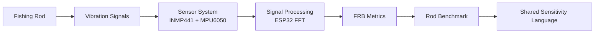
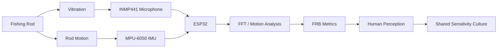
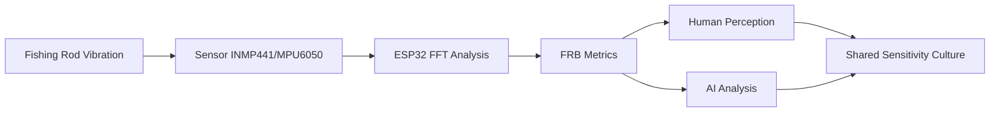
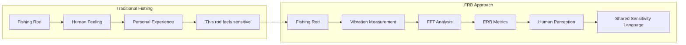
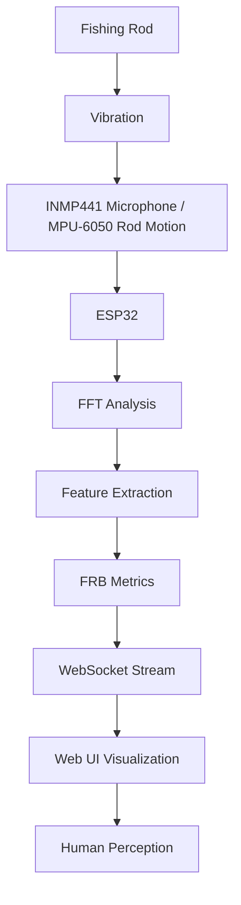

# FRB — Fishing Rod Benchmark

**FRB (Fishing Rod Benchmark)** is a project to create a shared language for **fishing rod sensitivity**.

Fishing rod sensitivity has traditionally been subjective and difficult to describe.  
FRB aims to make it **observable, measurable, and shareable**.

The goal is **not replacing human feeling**.

The goal is making **human perception shareable**.

---

# FRB Concept

### What FRB Means

### System Overview

FRB converts rod vibration into measurable data while keeping **human perception at the center**.

---

### Human + AI Analysis

FRB uses both **human perception** and **AI-assisted analysis** to interpret rod vibration data.

---

### Traditional vs FRB

Traditional fishing relies on **individual feeling**.

FRB explores whether rod sensitivity can become **observable and comparable**.

---

# Current System

### FRB Architecture

The experimental setup currently includes:

- ESP32 microcontroller
- INMP441 digital microphone
- FFT-based vibration analysis
- Web-based visualization UI
- Rod comparison experiments

The current experimental setup captures rod vibration,
analyzes the signal using FFT, and visualizes the resulting metrics
through a web-based interface.

---

# Documents

Project documentation:

- [FRB Manifesto](FRB_MANIFESTO.md)
- [FRB Method](FRB_METHOD.md)
- [FRB Spec](FRB_SPEC.md)
- [FRB Terms](FRB_TERMS.md)
- [FRB Experiments](FRB_EXPERIMENTS.md)

---

# Story Behind FRB

The origin story of the project can be found here:

- [FRB Story](FRB_STORY.md)

Personal development notes and research logs:

- [mymemo.md](mymemo.md)

---

# Project Status

FRB is currently in an **experimental research phase**.

Current focus:

- vibration measurement
- signal processing
- perception correlation

---

# Philosophy

> Sensitivity becomes real when it can be shared.

---

FRB — Fishing Rod Benchmark

