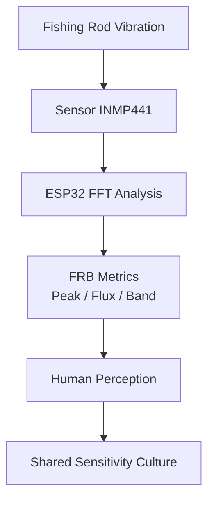
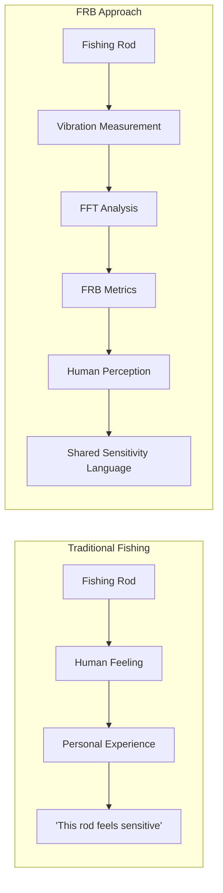
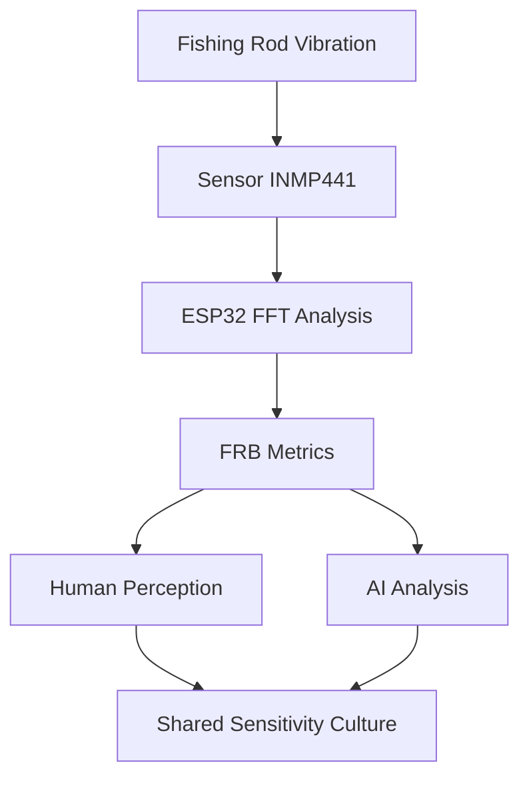

# FRB — Fishing Rod Benchmark

**FRB (Fishing Rod Benchmark)** is a project to create a shared language for **fishing rod sensitivity**.

Fishing rod sensitivity has traditionally been subjective and difficult to describe.  
FRB aims to make it **observable, measurable, and shareable**.

The goal is **not replacing human feeling**.

The goal is making **human perception shareable**.

---

# FRB Concept

FRB converts rod vibration into measurable data while keeping **human perception at the center**.

FRB is a **human-centered measurement system**.

---

---

---

# Why FRB Exists

Many anglers say:

- "This rod has great sensitivity"
- "This rod feels dull"

But these descriptions are difficult to compare.

FRB explores whether rod sensitivity can be expressed through **observable vibration characteristics**.

The aim is to build a **shared vocabulary for rod feel**.

---

# Current System

The experimental setup currently includes:

- ESP32
- INMP441 digital microphone
- FFT vibration analysis
- Web-based visualization UI
- rod comparison experiments

This system allows vibration generated in a fishing rod to be analyzed and visualized.

---

# Documents

Project documentation:

- [FRB Manifesto](FRB_MANIFESTO.md)
- [FRB Method](FRB_METHOD.md)
- [FRB Spec](FRB_SPEC.md)
- [FRB Terms](FRB_TERMS.md)
- [FRB Experiments](FRB_EXPERIMENTS.md)

---

# Story Behind FRB

The origin story of the project can be found here:

- [FRB Story](FRB_STORY.md)

Personal research notes and development logs are stored in:

- [mymemo.md](mymemo.md)

---

# Project Status

FRB is currently in an **experimental research phase**.

The focus is currently on:

- vibration measurement
- signal analysis
- human perception correlation

---

# Philosophy

FRB is built on one simple idea:

> Sensitivity becomes real when it can be shared.

---

FRB — Fishing Rod Benchmark