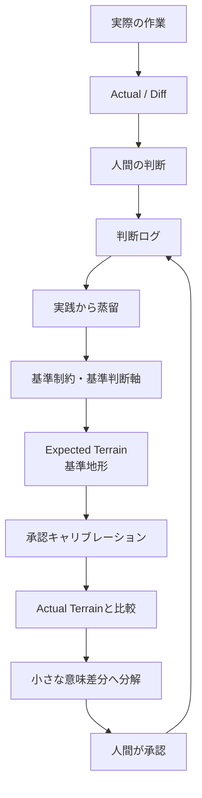

:::message
AI承認駆動開発は、成果物を小さくする開発ではない。

**人間が一度に認識する差分を小さくする開発である。**
:::

:::message
Expectedとは、単なる正解値ではない。

**承認しやすい差分を発生させるための「基準地形」である。**
:::

## はじめに

前回の **AI承認駆動開発 #0** では、現時点で考えている全体構想を、いったん見える場所へ並べた。

```text
制約
  ↓
責務
  ↓
検証可能な保証
  ↓
TestPattern + Expected
  ↓
Actual / Diff
  ↓
承認・改定
```

その中で、Expectedは重要な位置に置いていた。

しかし、#0を書いた時点では、Expectedをまだ十分に捉えられていなかったのかもしれない。

Expectedというと、私はまず次のようなものを想像していた。

```text
入力：数量 = 5
Expected：正常終了
```

あるいは、

```text
Expected：検索結果は3件
```

もちろん、これらもExpectedである。

でも、Expectedは本当に、個々のテスト結果の値だけなのだろうか。

今回の記事は、そんな問いから始まった……わけではない。

実際には、**Studioくんの寄り道**から始まった。

---

## Studioくんの、FX以外のオーバーレイを探していた

Studioくんには、FXシミュレーション用のオーバーレイがある。

では、FX以外にも、JSONを使った面白いオーバーレイを作れないだろうか。

そんな軽い雑談から、Geminiに候補を聞いてみた。

いくつかの案が返ってきたので、その結果をGPTにも相談した。

そこで候補の一つとして出てきたのが、

> **思考プロセス・グラフ**

だった。

大量のMarkdownに書かれている体験、違和感、問い、仮説、判断、制約、成果物をノードとしてつなぎ、思考の進化を見えるようにする。

面白そうだったので、FRBやAI協働の記事を入力にして、単独HTMLで動くサンプルを作ってもらった。

それが、**Thought Evolution Graph Viewer** である。

<!-- 画像候補：Thought Evolution Graph Viewer 全体画面 -->
 


HTMLを開くと、FRBの体験、橋渡し概念、AI協働・開発の概念が、グラフとしてつながっていた。

さらに右側には、文書を横断して生成したInsightが表示されていた。

その中に、次の一文があった。

> **③ 本当の研究対象は、ロッドから「人間の認識構造」へ広がっている。**

この一文が、思った以上に仕事をした。

---

## 「人間の認識構造」という言葉が、別の問いを起動した

FRBとAI承認駆動開発が、同じような構造を持っていること自体は、以前から意識していた。

```text
体験・実行
  ↓
差分
  ↓
問い・仮説
  ↓
再現可能な条件
  ↓
構造化
  ↓
人間による判断
```

そのため、Viewerが二つの共通構造を示しただけなら、私にとっては確認に近い。

「うん。知っている。そのように考えている」で終わる。

ところが、GPTとの会話の中で、次の視点が出てきた。

> 同じ部分ではなく、**FRBにあって、AI承認駆動開発にないもの**を見ると何が起きるだろう。

つまり、共通構造ではなく、

> **非対称**

を見る。

FRBには、Benchmark層だけでなくExperience層がある。

FRBには、既知の振動を使って人間側の感覚を合わせる、感覚キャリブレーションがある。

では、人間の承認にも、それに相当するものがあるのではないか。

最初は、FRBの「振動の和音構造」を人間の承認へ当てはめられないか、と考えていた。

複数の周波数成分が重なる振動のように、人間も複数の制約、判断軸、期待値、影響範囲を同時に受け取って承認しているのではないか。

しかし、このままでは落としどころが見えなかった。

そこで、もう少し簡単な問いに変えた。

> **人間の認識構造を和らげるには、どうすればよいだろう。**

そこで浮かんだのが、

> **小さな差分**

だった。

ここから話が、一気にExpectedへつながっていった。

```text
人間の認識構造
  ↓
認識負荷を和らげたい
  ↓
一度に認識する差分を小さくする
  ↓
差分を作るには比較基準が必要
  ↓
Expectedとは何か？
```

当初考えたかったこととは、少しズレた。

しかし、このズレから、新しい問いが生まれた。

今回の記事は、その**思考拡張の実況中継**でもある。

---

## FRBのオートスイープは「答えが見えている振動」だった

FRBには、オートスイープという入力がある。

周波数が時間とともに移動していく振動を与える。

オートスイープの価値は、単に周波数が動くことではない。

> **どの時点で、どの周波数が入っているのか、答えが先に見えている。**

だから、実際の計測結果や人間の体感と比較できる。

```text
既知のスイープ軌道
  = Expected

ロッドの応答・人間の体感
  = Actual

抜け・遅れ・強調・変形
  = Diff
```

たとえば、次のような違和感を発見できる。

```text
200Hz付近だけ感じにくい
300Hzで急に強くなる
計測では追随しているのに、手では分からない
手では感じるのに、FFTでは線が途切れる
```

つまりオートスイープは、単なる入力方式ではない。

> **正解パターンありきの、差分・違和感抽出装置**

である。

違和感を偶然待つのではない。

答えが見えている比較対象を先に置き、違和感を発生しやすくする。

ここで、AI承認駆動開発のExpectedも同じように考えられないか、と思った。

> **Expectedは、承認対象へ流すオートスイープなのではないか。**

---

## Expectedを「値」から解放してみる

Expectedを、個々の出力値だけだと考えると、次のようになる。

```text
Expected：100
Actual：95
Diff：-5
```

これは分かりやすい。

しかし、人間が成果物を承認するときに期待しているものは、値だけではない。

たとえば、Studioくんの開発で、次のような構造を期待しているとする。

```text
制約：1件
責務：3〜5件
各責務に検証可能な保証がある
各保証にTestPatternが接続されている
未接続保証：0件
Expected未定義：0件
```

これは、一つの正解値ではない。

しかし、

> **この成果物は、だいたいこういう形になっているはず**

という期待ではある。

Actualが次の状態なら、差分をすぐに出せる。

```text
責務：1件
保証：4件
TestPattern：3件
未接続保証：6件
```

```text
責務：基準より少ない
TestPattern：不足候補
未接続保証：+6件
```

人間は、成果物を最初から全部読まなくてもよい。

まず、

> なぜ責務が少ないのか。

> なぜ保証が6件も未接続なのか。

だけを確認できる。

このときExpectedは、答えそのものというより、

> **何を差分として見たいかを定義するもの**

になっている。

Expectedを広げると、少なくとも次のような種類が考えられる。

### Value Expected

```text
Expected：100
Actual：95
```

### Count Expected

```text
制約1件あたり、責務は3〜5件程度
Actual：1件
```

### Relation Expected

```text
すべての保証は、1件以上のTestPatternへ接続される
```

### Topology Expected

```text
Constraint
  ↓
Responsibility
  ↓
Guarantee
  ↓
TestPattern
  ↓
Actual / Diff
```

途中の接続が飛んでいないか、孤立していないかを確認する。

### Absence Expected

```text
未接続保証：0件
存在しない保証ID参照：0件
未承認で実行済み：0件
```

### Evidence Expected

```text
判断ログには、次の根拠が存在する
- 適用した制約
- 採用理由
- 捨てた案
- 許容したリスク
```

これらはすべて、Expectedである。

値、件数、関係、構造、欠落、根拠。

Expectedは、思っていたより広い。

---

## Expectedが「正しさの地形」になる

この話をしていたとき、GPTから次の表現が返ってきた。

> **Expectedが、値ではなく正しさの地形になる。**

この「地形」という言葉が、私の言いたかったことにかなり近かった。

```text
Expected Terrain
  = 基準地形

Actual Terrain
  = 実際地形

Terrain Diff
  = 地形差分
```

たとえば、基準地形にActualを重ねると、次のように見える。

```text
責務が不足している
  → 地形がへこんでいる

TestPatternが一部の責務へ集中している
  → 一箇所だけ山になっている

保証とTestPatternが未接続
  → 道が途切れている

根拠のない成果物が存在する
  → 浮島になっている

責務が過剰に分割されている
  → 不自然な隆起がある
```

この比喩の良いところは、Expectedを「一点の正解」から解放できることにある。

地形には、幅がある。

仕事の種類やフェーズによっても変わる。

```text
プロトタイプの基準地形
本番反映の基準地形
軽微改修の基準地形
外部API連携の基準地形
法定計算の基準地形
```

そして、基準地形との差が出たからといって、即NGとは限らない。

差分には強さがある。

```text
HARD
  必ず守る境界

STANDARD
  通常期待する形

HEURISTIC
  違和感を出すための目安

EXPLORATORY
  AIが仮置きした比較地形
```

基準地形の目的は、人間を機械的な正解へ縛ることではない。

> **人間が考えるべき場所を発光させること。**

である。

---

## 承認の前に、基準地形を理解する

基準地形という概念が出てくると、もう一つの問いが生まれる。

承認者は、その基準地形を理解しているのだろうか。

同じ成果物を見ても、人によって頭の中にある正しさの形は違う。

```text
Aさん：責務は2件あれば十分
Bさん：少なくとも5件必要
Cさん：件数より未接続の方が重要
```

Actualについて意見が割れているように見えて、実は、Actualを見る前の基準がズレている。

そこで、三つの地形を考える。

```text
Expected Terrain
  = 共有された基準地形

Mental Terrain
  = 承認者の頭の中にある地形

Actual Terrain
  = 実際に生成された成果物の地形
```

```text
Expected Terrain
vs
Mental Terrain
  = Calibration Diff

Expected Terrain
vs
Actual Terrain
  = Approval Diff
```

Actualを承認する前に、まずExpected TerrainとMental Terrainの差を小さくする。

この行為を、

> **承認キャリブレーション**

と呼べるのではないか。

FRBでは、既知の振動を体験し、人間側の感覚を合わせてから、未知の振動差を感じ取る。

```text
FRBの感覚キャリブレーション
既知の振動を感じる
  ↓
人間側の感覚ダイヤルを合わせる
  ↓
未知の振動との差を感じる
```

人間の承認でも、構造は似ている。

```text
承認キャリブレーション
基準地形を理解する
  ↓
承認者の判断ダイヤルを合わせる
  ↓
Actualとの差を判断する
```

> **同じ成果物を見る前に、同じ地形を見ているか確認する。**

承認は、Actualを見るところから始まるのではない。

基準地形を理解するところから始まる。

---

## 人間の承認を滑らかにする核は、「認識させる差分を小さくする」こと

ここまで掘った結果、今回の話の核は、かなり単純なところへ戻ってきた。

> **人間に認識させる差分を小さくする。**

これは、「変更を小さくする」とは違う。

たとえば、コードを3行しか変更していなくても、その3行の意味を判断するためにシステム全体を理解しなければならないなら、人間が認識する差分は大きい。

逆に、100ファイルを一括で名称変更していても、

```text
Expected：旧名称の残存0件
Actual：旧名称の残存2件
Diff：2件
```

と示されれば、人間が判断する差分は小さい。

つまり、承認コストを決めるのは、変更行数やファイル数ではない。

> **人間が一度に判断しなければならない意味の量**

である。

```text
巨大な成果物
  ↓
基準地形と比較
  ↓
意味単位で差分を分解
  ↓
小さな差分を順番に確認
  ↓
全体を承認
```

たとえば、次のように分けられる。

```text
制約Diff
責務Diff
保証Diff
TestPattern Diff
Expected Diff
判断理由Diff
```

元々考えていた「振動の和音構造」を無理に当てはめるなら、複雑な成果物は和音のようなものかもしれない。

一度に全部鳴らすと、何が違うのか分からない。

しかし、差分を一音ずつ聞かせれば、人間は判断しやすくなる。

開発そのものを小さくできなくても、**認識させる意味差分は小さくできる。**

ここに、Studioくんの役割が見えてくる。

> **Studioくんは、巨大なAI成果物を、人間が承認可能な小さな意味差分へ変換する装置である。**

Grid、Relation Viewer、Diff Viewer、全文検索、Expected、Actual。

これらは便利なUI機能ではなく、人間が一度に認識する差分を小さくするための手段だったのかもしれない。

---

## 基準地形を広げると、基準制約・基準判断軸が必要になる

基準地形を本気で扱おうとすると、その地形が何から作られているのかを考える必要がある。

```text
基準制約
  = 越えてはいけない境界

基準判断軸
  = 何を高く評価し、何を危険と見るか

基準責務・基準リレーション
  = 地形上に存在すべき地点と道

基準地形プロファイル
  = それらを仕事の種類ごとに統合した形
```

将来的に、Studioくんの開発を通じて、次のようなものが育つと面白い。

```text
再利用可能な基準制約
再利用可能な基準判断軸
再利用可能な基準地形プロファイル
```

ただし、ここで重要な注意がある。

> **これらを最初から立派に設計してはいけない。**

頭の中だけで作った基準は、実態に見合わない可能性が高い。

現場を助ける地図ではなく、現場へ押しつける理想図になってしまう。

基準は、実際の作業の中から育てる必要がある。

```text
実際に作業する
  ↓
差分が出る
  ↓
人間が判断する
  ↓
判断理由を残す
  ↓
似た判断が積み重なる
  ↓
共通成分を抽出する
  ↓
再利用可能な基準へブラッシュアップする
```

この過程を表す言葉として、今回もっともしっくりきたのが、

> **蒸留**

だった。

判断ログには、その案件だけの事情、迷い、失敗、暫定対応、偶然うまくいったことが混ざっている。

そこから、繰り返し現れる判断理由だけを取り出し、再利用可能な純度へ上げていく。

```text
判断ログ
  = 原液

基準判断軸・基準制約
  = 蒸留された判断成分

基準地形プロファイル
  = 複数の蒸留成分を配合した標準モデル
```

> **基準は設計するものではない。実践から蒸留するものだ。**

今のところ、Studioくんで目指したいのは、このくらいの温度感である。

最初から完成した基準地形を作るのではない。

日々のインシデント、判断ログ、TestPattern、Expected、Actual / Diffの中から、使い回せそうな良い判断が育ってきたら拾う。

それを少しずつ蒸留する。

---

## 現時点の全体像

今回の話を一枚にすると、次のようになる。



Expectedは、単なる値ではない。

基準制約、基準判断軸、期待する件数、関係、構造、根拠を統合した、正しさの基準地形になり得る。

その地形を承認者が理解する行為が、承認キャリブレーションである。

その地形とActualとの差を、人間が認識可能な小さな意味差分へ分解する。

そして、その判断結果を次の基準へ蒸留していく。

---

## おわりに——寄り道から生まれた基準地形

今回の話は、Expectedを深掘りしようとして始めたものではない。

StudioくんのFX以外のオーバーレイ候補を探した。

Geminiへ相談した。

その結果をGPTへ持ち込んだ。

Thought Evolution Graph Viewerが生まれた。

Viewerが、

> 本当の研究対象は、ロッドから「人間の認識構造」へ広がっている

という言葉を返した。

そこから、FRBとAI承認駆動開発の非対称を考えた。

人間の承認構造へ、FRBの感覚キャリブレーションや、答えが見えている振動を移植してみた。

そして、Expectedが、値から基準地形へ広がった。

```text
人間の認識構造
  ↓
人間の承認構造
  ↓
認識させる差分を小さくする
  ↓
Expectedを比較基準として広げる
  ↓
Expected Terrain
  ↓
承認キャリブレーション
  ↓
基準制約・基準判断軸
  ↓
実践から蒸留する
```

完成した理論を説明したというより、AIとの対話の中で、概念が連鎖していった記録である。

私が考える思考拡張は、AIから完成した答えを受け取ることではない。

AIが置いた一つの言葉と、自分の中に積み重なっていた体験との間に差分が生まれ、そこから新しい問いが立ち上がることである。

今回、その発火点になったのは、

> **人間の認識構造**

という一言だった。

最後に、現時点での仮説を残す。

> **Expectedとは、正解を固定するための値ではない。人間が判断すべき場所を浮かび上がらせる基準地形である。**

> **AI承認駆動開発は、巨大な成果物を小さくする開発ではない。人間が一度に認識する差分を小さくする開発である。**

そして、その基準地形は、最初から作るものではない。

> **基準は設計するものではない。実践から蒸留するものだ。**

まだ仮説である。

だから、Studioくんで実験を続ける。

---

## 次回候補

**AI承認駆動開発 #2｜基準は設計するな、実践から蒸留せよ**

判断ログから、基準制約・基準判断軸・基準地形プロファイルが、どのように育つのかを考えてみたい。

---

## 関連記事

- AI承認駆動開発 #0｜詳細設計書って、AI時代に必要？
- FRB（Fishing Rod Benchmark）釣り竿の「感度」を数値化する話
- 思考拡張の5つのレベル——AIと共に、発見し続ける人になるために
