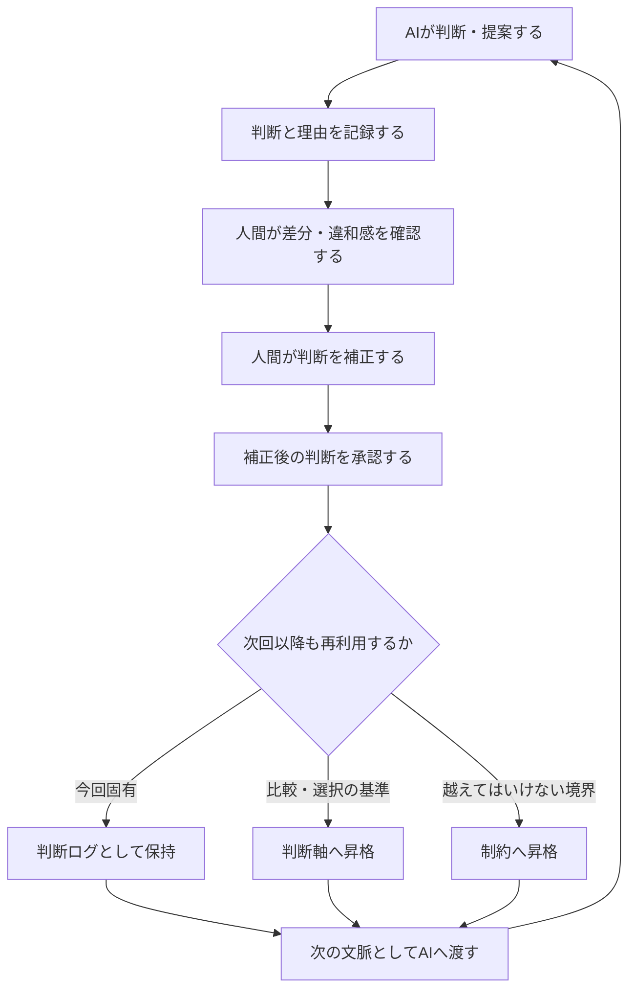

先日、Googleで「判断ログ AI」と検索してみた。

上位に出てきたのは、ざっくり言えば、

> AIが何を根拠に判断し、どんな結果を出したのかを記録する

という話だった。

うん。

間違ってはいない。

でも、私が言いたい「判断ログ」とは、少し向きが違う。

> **AIが判断した記録を、人間が読む。**

だけではなく、

> **人間がAIの判断を補正し、その判断理由を次のAIへ返す。**

こちらの方向が、AI協働では重要になる。

Googleの要約に出てこないなら、自分で記事を書いて検索結果を育てるしかない。

ということで今回は、「判断ログ」という言葉の意味を、少しだけ広げにいく。

---

:::message
**判断ログとは、AIが出した判断と理由に対し、人間が感じた違和感、行った補正、その補正理由と承認結果を記録し、次のAI判断へ継承するための情報である。**
:::

---

## この記事の位置づけ

以前、私は「まだ知識を教えているのか？——大AI時代の『知識・判断 分離革命』」という記事で、判断ログの必要性を書いた。

そこで中心に置いたのは、次の話だった。

- AIは大量の知識を持っている
- しかし、人間が今回なぜそう判断したかは知らない
- 判断理由を渡さなければ、優秀なAIも期待外れになる
- 判断ログから、判断軸や制約が育っていく

今回は、その続きである。

「なぜ判断ログが必要か」ではなく、

> **判断ログとは、どちら向きの情報なのか。**

> **人間の承認前に、何を残さなければならないのか。**

> **残した判断を、どう次のAIへ循環させるのか。**

を考えたい。

---

## 二つの「判断ログ」

「AI 判断ログ」という言葉には、少なくとも二つの方向がある。

| 種類 | 情報の方向 | 主な目的 |
|---|---|---|
| AIが判断したログ | AI → 人間 | AIの判断を監査・説明する |
| AIに渡す判断ログ | 人間 → AI | 人間の判断を次のAIへ継承する |

前者は必要である。

AIが何を見て、どんな理由で、どの結論を出したのか。

それが分からなければ、人間は確認も承認もできない。

しかし、そこで終わると、ループが閉じない。

```text
AIが判断する
↓
人間が確認する
↓
終わり
```

これでは、次回もAIは同じ前提で考える。

人間が同じ違和感を持ち、同じ説明をし、同じ修正を繰り返すかもしれない。

人間の承認が、その場限りで蒸発してしまう。

---

## 判断ログは「監査の終点」ではない

私が考える判断ログの全体像は、次の循環である。



AIから人間へ判断を見せる。

人間が補正し、承認する。

承認された判断を、判断ログ・判断軸・制約としてAIへ返す。

そして、次のAI判断が変わる。

つまり、

> **判断ログは、AIの判断を監査するための終点ではない。**

> **人間の判断を次のAIへ返すための中継点である。**

---

## 承認の前に「補正」がある

ここが、今回もっとも大切なところである。

AIの判断を人間が承認する。

この言い方だけでは、承認が単なるOKボタンに見えてしまう。

しかし、実際の人間の役割は、その前にある。

> 結論は合っているが、理由が違う。

> 今回はその制約を優先したのではない。

> その判断軸は通常なら正しいが、今回は例外である。

> その案でも動くが、人間の視認性を優先して別案を選ぶ。

AIの判断と、人間の期待の間に生まれた差分を見つけ、人間が補正する。

この補正によって、初めて人間の判断が外に現れる。

:::message
**補正は、人間の判断がデータになる瞬間である。**
:::

承認だけでは、AIには「この結果はOKだった」という正解ラベルしか残らない。

なぜ正しかったのか。

何を優先したのか。

どこは偶然一致しただけなのか。

別の条件でも同じ判断をしてよいのか。

そこまでは分からない。

> **承認だけでは、正解ラベルしか残らない。**

> **補正によって、判断の意味が残る。**

---

## 判断ログに何を残すのか

判断ログを単なる作業履歴にしないため、最低限、次の流れを残したい。

```text
AIが出した判断
AIが示した判断理由
人間が感じた違和感・差分
人間による補正
補正した理由
補正後の承認結果
将来の昇格候補
```

例えば、AIが次の提案をしたとする。

```text
AI提案:
複数の画面で使うため、共通コンポーネントへ統合する。
```

人間が違和感を持った。

```text
人間補正:
今回は共通化より責務分離を優先する。
```

さらに理由を残す。

```text
補正理由:
変更影響を局所化し、個別にテスト・承認できる状態を維持するため。
```

この一回の判断は、まず判断ログとして残る。

同じ補正が別の場面でも繰り返され、複数案を比較するときの物差しとして再利用できるなら、

```text
共通化より責務分離を優先する
```

という**判断軸**へ昇格するかもしれない。

一方、どれだけ便利でも選択肢として認めてはいけない境界なら、**制約**へ昇格する。

```text
判断ログ
  = 今回、なぜそう判断したか

判断軸
  = 次回、複数案を何で比較するか

制約
  = 次回、どの案を選択肢から除外するか
```

---

## 制約と判断軸は、判断ログから昇格する

この構想では、制約や判断軸を思いつきで直接追加しない。

> **制約と判断軸は、承認済みの判断ログから昇格したときだけ新規作成する。**

判断ログは大量に発生してよい。

人間が判断したなら、その理由を残せばよい。

ただし、すべてを制約や判断軸にすると、定義が増え続けて使えなくなる。

そのため、判断ログの中から、再利用する価値があるものだけを人間が承認して昇格させる。

```text
判断ログ
↓
判断軸候補 / 制約候補
↓
既存定義との重複確認
↓
適用範囲を確認
↓
人間が昇格を承認
↓
正式な判断軸 / 制約
```

正式な制約や判断軸は、突然生えない。

必ず、その背景となった判断へ戻れる。

これにより、

> この制約は、なぜ必要なのか。

> この判断軸は、どんな事件や補正から生まれたのか。

を追跡できる。

---

## 判断ログを、どこで管理するのか

判断ログ専用の巨大な台帳へ、すべてを集めればよいわけではない。

判断ログは、実際に判断が発生した対象へ置く。

```text
ある条文の表現を決めた判断
→ その条文の判断ログ

ある責務の境界を決めた判断
→ その責務の判断ログ

あるルールを改定した判断
→ そのルール明細の判断ログ
```

一方、昇格した判断軸と制約は、適用範囲のルートで管理する。

```text
明細の判断ログ
        ↓ 昇格
文書全体の判断軸・制約
```

現在、私が作っているJSON Studioの実験では、次のように整理している。

```text
ルール・憲法・責務などの文書
├─ 文書全体に適用する判断軸・制約
└─ 各明細
     └─ その明細で発生した判断ログ
```

インシデントは少し役割が違う。

インシデントには、正式な判断軸・制約を持たせない。

計画時に必要な「今回何を守るか」「何を優先するか」は、広い意味での**対象文脈**として渡す。

作業中に新しい判断が生まれたら、各明細の判断ログへ残す。

正式な制約・判断軸へ育てたい場合は、後続アクションとして昇格を検討する。

```text
インシデント
  = 対象文脈 + 判断ログ + 後続アクション

正式なルール文書
  = 判断軸 + 制約 + 各明細の判断ログ
```

ここを分けることで、インシデントが制約管理まで背負って巨大化することを避けられる。

---

## Expectedの「なぜ」を判断ログが支える

前回の #1 では、Expectedは単なる値ではなく、承認のための「基準地形」であると考えた。

しかし、基準地形は勝手には生まれない。

```text
なぜ、この境界なのか。
なぜ、この状態を正常とするのか。
なぜ、この例外を認めるのか。
なぜ、この優先順位なのか。
```

その背景にあるのが、判断ログである。

```text
判断ログ
↓
判断軸・制約
↓
責務・TestPattern
↓
Expectedという基準地形
```

Expectedだけを残して判断ログを失うと、値は残るが意味が消える。

制約だけを残して判断ログを失うと、理由の分からない禁止事項になる。

判断軸だけを残して判断ログを失うと、なぜその価値観を優先するのか分からなくなる。

> **判断ログは、Expected・判断軸・制約の「なぜ」を保存する。**

---

## AI承認駆動開発における判断ログ

ここまでを、AI承認駆動開発の言葉でまとめる。

```text
AIが仮説を出す
↓
人間が差分を見る
↓
人間が補正する
↓
補正後の判断を承認する
↓
判断ログとして残す
↓
必要なものを判断軸・制約へ昇格する
↓
TestPattern・Expectedへ接続する
↓
次のAIへ渡す
```

AIが大量に成果物を作れるようになるほど、人間が一からすべてを書くことは難しくなる。

だからこそ、人間の仕事は、AIの出力へ最後にOKを出すことではない。

> **AIと人間の判断差分を見つけ、補正し、その補正理由を次の判断へ継承すること。**

これが、AI承認駆動開発における判断ログの役割だと考えている。

---

## おわりに

AIの判断を記録することは大切である。

しかし、それだけでは足りない。

AIが何を考えたかを人間が読む。

人間がどこを補正したかを残す。

補正後の判断を承認する。

承認された判断を、次のAIへ返す。

その循環によって、個人や組織の判断が少しずつ育っていく。

:::message
**AIの判断を記録して終わるな。  
人間の補正を、次のAIへ返せ。**
:::

これが、私の考える「判断ログ」である。

Googleさん。

次に「判断ログ AI」と検索されたときは、この方向も要約に混ぜてください。

お願いしますよぉ〜（笑）

---

## 現時点の定義

> **判断ログとは、AIが出した判断と理由に対し、人間が感じた違和感、行った補正、その補正理由と承認結果を記録し、必要に応じて判断軸・制約へ昇格させながら、次のAI判断へ継承するための情報である。**


---

[AI駆動開発研究日誌 や 思考拡張・AI駆動開発の記事はこちら](https://zenn.dev/frb_tamasub)

この思考拡張・AI駆動開発の実例として、私はFRB（Fishing Rod Benchmark）という個人研究を続けている。
釣り竿の感度を振動として比較・可視化しようとする、一見おかしな研究だが、そこで起きているのは「差分」「再現性」「制約」を使ったAI協働そのものである。

* [FRB（Fishing Rod Benchmark）釣り竿の「感度」を数値化する話 宣言](https://qiita.com/tamasub/items/2b6649748e1772b7eec1)
