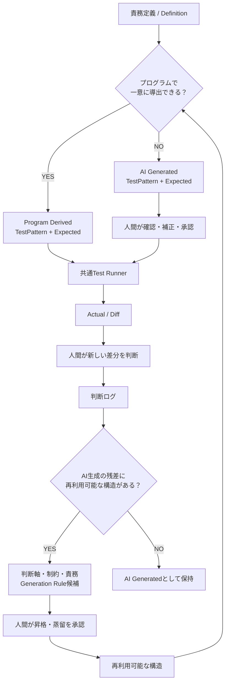
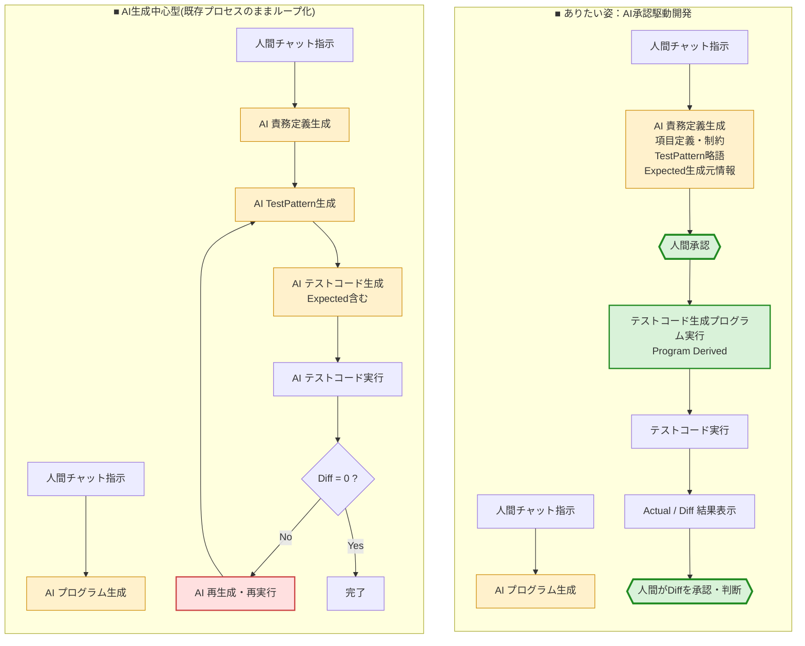

:::message
**同じ判断を、二度させるな。**

不安定な人間に、同じ判断を何度もさせない。  
答えが確定したことを、AIにも毎回考え直させない。

**判断軸と制約を育て、人間とAIで協力して、可能な限りプログラムへ倒していく。**
:::

:::message
**AI承認駆動開発では、AI生成を増やすことを目指さない。**

**承認済みの定義からプログラムで導出できる領域を増やし、AI生成が必要な残差を極小化していく。**
:::

# AI駆動開発なのに、AI生成を減らしたくなってきた

AI駆動開発という言葉からは、

```text
AIにコードを書かせる
AIにテストを書かせる
AIに設計情報を書かせる
```

といった、

**AIに何を、どれだけ生成させるか**

という方向を想像しやすい。

もちろん、AIの生成能力は大きな価値である。

私自身も、AIを使って開発生産性を大きく上げられないかと考えてきた。

その思考を強制的に広げるために、私は以前、

> **400KS/人月**

という、かなり極端な目標を置いた。

これは「本当に400KS/人月が実現できる」と予測したかったわけではない。

AIによる開発生産性向上のニュースをきっかけに、

> **既存の仕事のやり方に引っ張られずに考えるための、意図的なストレスシナリオ**

として置いた数字だった。

ただし、この思考には二つの大きな制約を置いている。

> **AIが生成した成果物は、必ず人間の承認を通過してから採用する。**
>
> **複数のAIが相互レビューして一致したとしても、それだけで品質が確保されたとはみなさない。**

将来的には、複数AIの相互レビュー結果だけで品質確保とみなす流れが
一般化する可能性もあると思っている。

ただし、現時点の私の構想では、
最終的な品質責任をAI同士の合意へ委ねない。


この制約を置いたままAIの生成速度だけが上がれば、
当然、人間が承認しなければならない量も増えていく。

もしAIが、とんでもない速度でコードやテストや設計情報を生成できるようになったら。

従来の開発プロセスは、そのままでも成立するのだろうか。

そこで、次の問いを立てた。

> **そんな大量の成果物を、人間はどうすればスムーズに承認できるのか？**

Expected。

Diff。

責務定義。

TestPattern。

承認View。

人間が巨大な成果物を、少ない認知負荷で承認するための仕組みを考え始めた。

でも、ずっと小さな違和感が残っていた。

> **……そんなに大量にAIへ生成させて、その大量生成物を人間が頑張って承認する構造で、本当にいいんだろうか。**

あるとき、問いの向きが変わった。

```text
どうすれば、
大量のAI生成物を高速に承認できるか？
```

ではなく、

```text
なぜ、
そんなに大量のものを
人間が個別に判断しなければならないのか？
```

である。

そこから、私の中で一つの判断方向が、かなり強い言葉になった。

> **同じ判断を、二度させるな。**

今回の記事は、この一文から考える。

---

# 「同じ判断を二度させるな」は、人間が主語である

ここで大切なのは、

> **誰に同じ判断をさせたくないのか。**

という話である。

最初に主語になるのは、**人間**である。

人間の判断には価値がある。

しかし、人間の判断は安定しない。

同じ人でも、

- 経験が増える
- 疲れている
- 急いでいる
- 別の文脈を持っている
- 前回の判断理由を忘れている

といった条件で、判断が揺れる。

別の担当者なら、なおさらである。

同じ条件なのに、

```text
1回目：Aを採用
2回目：Bを採用
3回目：またAを採用
```

となれば、後から見た人は困る。

だから、一度人間が意味を持って判断したなら、

> **その判断を、再利用できる形へ変えて未来へ渡したい。**

これが、私が「人間判断数ミニマム化」と呼んでいる考え方の根にある。

人間の判断をなくしたいわけではない。

むしろ逆である。

> **人間には、まだ答えのない新しい判断へ集中してほしい。**

そのために、

> **同じ判断を、何度も不安定な人間へ返さない。**

---

# これは、ある意味AIにも当てはまる

この考え方は、人間だけの話でもない。

AIも、毎回まったく同じ答えを保証する機械ではない。

モデル、文脈、指示、周辺情報によって、出力は変わりうる。

もちろん、AIの再現性を高める工夫はできる。

しかし、

> **すでに答えが規則として確定していることまで、毎回AIへ考え直させる必要はあるのか。**

という問いは残る。

たとえば、

```text
minimum = 1
maximum = 100
```

という項目定義が、人間によって承認されている。

さらに、

```text
minimum_minus_1
minimum
maximum
maximum_plus_1
```

というテスト生成規則も承認されている。

このとき、

```text
0
1
100
101
```

を毎回AIへ生成させ、

> 「今回もこの4つでいいですか？」

と人間へ返す必要はない。

答えが一意に決まるなら、

> **プログラムで生成すればよい。**

つまり、

```text
人間が判断する
↓
判断を構造化する
↓
生成規則として固定できる
↓
次回からProgram Derived
```

へ移す。

> **確実性を高められるものは、人間とAIが知恵を出し合って、可能な限りプログラムへ倒す。**

これが、今回考えたい方向である。

---

# 始まりは「テストパターン略語」に対する「おん？？」だった

この考え方を最初から理論として持っていたわけではない。

始まりは、もっと小さな実装上の話だった。

私は現在、試作中のStudioくんで、

```text
ViewDef
  = どう表示・編集するか
```

とは別に、

```text
Field Definition
  = その項目が何を受け付け、何を保証するか
```

という項目定義JSONを作っている。

たとえば、

```json
{
  "field_path": "$.sample_count",
  "validation_type": "integer",
  "minimum": 1,
  "maximum": 100,
  "nullable": false
}
```

のように、

- 型
- 必須
- Null可否
- 最小値
- 最大値
- 形式

などを構造化する。

このField Definitionは、現在の構想では、広い意味で**責務定義の一部**として扱っている。

そして、

> この項目定義から、どんなテストをすればよいのか。

という話をしていた。

そこで、

```text
minimum
minimum_minus_1
maximum
maximum_plus_1
invalid_format
```

のような、

**テストパターンの意味を表す略語**

を持たせる案が出てきた。

私はそこで、

> **おん？？**

となった。

最小値が定義されている。

最大値も定義されている。

さらに、

```text
minimum_minus_1
```

という意味まで分かっている。

だったら、

> **具体的なテストデータを、人間やAIが作る必要はないのではないか。**

プログラムで計算できる。

さらに、

> minimum未満ならREJECT  
> minimum以上ならACCEPT

というExpectedまで、承認済みの検証規則から導出できる。

だったら、

```text
Field Definition
        ＋
Generation Rule
        ↓
TestPattern
        ＋
TestData
        ＋
Expected
```

まで、機械的に作れる。

そしてTest Runner側を汎用化すれば、

```text
承認済みDefinition
        ↓
Resolved Contract
        ↓
Generated TestPattern + Expected
        ↓
Generic Test Runner
        ↓
Actual / Diff
```

までつながる。

実際に、かなりの範囲でつながった。

ここで、私の中の見え方が変わった。

---

# そもそも、責務定義からTestPatternを直接導出できる領域がある

AI承認駆動開発の初期構想では、大きく次の流れを考えていた。

```text
責務定義JSON
        ↓
TestPattern + Expected JSON
        ↓
Test Code / Test Runner
        ↓
Actual / Diff
```

ここでいう責務定義は、

> **何をするか**

ではなく、

> **何を保証するか**

を持つ。

従来の詳細設計書に混ざっていた、

```text
顧客へ説明・承認してもらうための情報
```

は、顧客向けのViewへ寄せる。

一方、

```text
SEが決めたHowをPGへ細かく引き継ぐ情報
```

は、できるだけ減らしたい。

その代わりに、

```text
責務
制約
判断軸
Expected
TestPattern
```

といった、

**何を正しいとするか**

を強くする。

今回気づいたのは、その構造の中でも、

> **責務定義 → TestPattern + Expected**

を、AI・人間が毎回手作業で書く必要がない領域があることだった。

項目定義は、その分かりやすい例だった。

---

# 関連項目チェックも、かなりプログラムで生成できた

単項目バリデーションだけではない。

たとえば、

```text
analysis_start_date < analysis_end_date
```

という関連項目チェックがある。

最初は、

> 関連項目のテストデータは、さすがに個別に作る必要があるのではないか。

と思っていた。

しかし、比較関係そのものを考えると、

```text
LEFT < RIGHT
LEFT = RIGHT
LEFT > RIGHT
```

という、三つの意味状態に分解できる。

そして、

```text
LOW
MID
HIGH
```

という代表値を、両項目の有効範囲からプログラムで導出できれば、

```text
LESS    = LOW  / HIGH
EQUAL   = MID  / MID
GREATER = HIGH / LOW
```

と作れる。

演算子が、

```text
<
<=
=
!=
>=
>
```

のどれであっても、

入力側の三状態は同じでよい。

変わるのはExpectedである。

つまり、ここでも、

```text
承認済みField Definition
        ＋
承認済みCross Field Constraint
        ＋
Generation Rule
        ↓
TestPattern + Expected
```

をプログラムで導出できた。

「人間が考えなければならない」と思っていた領域が、また一つ小さくなった。

---

# でも、全部をプログラム生成できるわけではない

もちろん、ここで、

> **すべてのテストはプログラム生成できる！**

と言いたいわけではない。

たとえば、

- 営業日カレンダーを使う条件
- 特殊な丸め規則
- 状態遷移
- 業務固有の例外
- 複雑な親子関係
- 特殊な組み合わせ条件

などは、単純な生成規則へ落とせないことがある。

ここで一度、

```text
Program Derived
```

が止まる。

でも、そこで全体を止める必要もない。

> **プログラムで生成できない部分だけ、AIに生成してもらえばよい。**

と考えられる。

```text
責務定義
  ├─ Program Derived
  └─ AI Generated
```

AIが、

- TestPattern候補
- TestData候補
- Expected候補

を生成する。

そのAI生成部分を、人間が確認・補正・承認する。

これなら、とりあえず全体をつなぐことはできる。

ただし。

ここで終わると、今回の記事の意味がない。

---

# AI生成で埋められたから、完成ではない

AI生成として残った部分を見て、

> **AIなら作れるから問題ない。**

とは考えない。

むしろ、そこから新しい問いが始まる。

> **なぜ、これはまだプログラムで生成できないのか。**

たとえば、

> **判断軸が足りない？**

> **制約が、まだ暗黙知のまま残っている？**

> **責務の定義が粗い？**

> **共通する意味状態を、まだ見つけられていない？**

という問いを、人間とAIで考える。

その中から新しい判断が生まれる。

そして、その判断を再利用できそうなら、

```text
判断ログ
↓
昇格・蒸留候補
↓
人間の承認
↓
判断軸
制約
責務
Generation Rule
```

へ育てる。

Generation Ruleとして表現できれば、

> **次回からはAI Generatedではなく、Program Derivedへ移せる。**

つまり、

```text
AI Generated
        ↓
なぜProgram Derivedにできない？
        ↓
判断軸が足りない？
制約が暗黙知のまま？
        ↓
人間 + AIで考える
        ↓
判断を明示化する
        ↓
昇格・蒸留
        ↓
Generation Rule
        ↓
Program Derived
```

というループになる。

---

# 制約は言語化してきた。でも、判断軸は言語化してこなかった

ここで、私自身のSE人生を振り返ると、少し面白い非対称がある。

私は昔から、

**制約**

をかなり大切にしてきた。

提案や契約では、

> **最初に制約をどこまで明確に示せるか**

が重要になる。

制約が言語化されていなければ、

> そんな制限があるとは聞いていない。

という契約トラブルにもつながる。

だから、

```text
できること
できないこと
保証する範囲
保証しない範囲
前提条件
利用上の制限
```

は、かなり意識して外へ出してきた。

会社のルールや、プロジェクト基準も同じである。

越えてはいけない境界は、比較的言語化されやすい。

一方で、

**判断軸**

は違った。

そもそも私は以前、

> 判断軸

という言葉自体を、それほど明確には理解していなかった。

当然、

> **日々の細かな設計判断で、自分は何を優先しているのか。**

を判断軸として整理し、構造化して残すこともしてこなかった。

人間同士では、それでも仕事ができた。

先輩の仕事を見る。

レビューで指摘される。

理由を聞く。

何度か経験する。

そして、

> **こういうときは、こっちを選ぶのか。**

と身につける。

つまり判断軸のかなりの部分は、

**OJTによって先輩から後輩へ引き継がれる、仕事のやり方の暗黙知**

として存在していたのだと思う。

---

# AI協働は、その暗黙知だった判断軸を外へ出すことを要求している

会社には、すでにたくさんのルールがある。

プロジェクト基準もある。

コーディング規約もある。

禁止事項もある。

でも、AIと日々一緒に設計していると、それだけでは足りない場面が出てくる。

たとえば、

```text
この2案なら何を優先する？

どこまで共通化する？

説明力と簡潔さなら、どちらを取る？

再利用性と局所性なら？

今ここで抽象化する？

まだ具体例が足りないから待つ？
```

こういう、

**もっと下位の、小さな判断の物差し**

である。

人間同士なら、

> いつもの感じで。

> 今回はこっちやろ。

で伝わることがある。

AIには、その蓄積がない。

制約を守っていても、AIが自分の期待とは違う方向へ走ることがある。

そのとき不足しているのは、

**禁止事項**

ではない場合がある。

> **複数の成立する案の中から、何を優先して選ぶのか。**

その判断方向である。

だから最近、私は強く思う。

> **判断軸を言語化しよう。**

制約は、言語化しないと契約トラブルになるから、比較的外へ出されてきた。

判断軸は、人間同士ならOJTで伝わったから、暗黙知のまま残りやすかった。

しかし、

> **AIが入ったことで、判断軸という暗黙知が急にボトルネックとして見えるようになった。**

そして今回、その言語化には、AIへ自分の期待方向を伝える以上の意味が見えてきた。

判断軸と制約が十分に構造化できれば、

> **その判断自体を、AIへ問い合わせる必要すらなくなる可能性がある。**

---

# 「判断を未来へ渡すループ」とつながった

私は別の記事で、AI協働の中核理論として、

```text
行動・実行
↓
差分・違和感
↓
判断
↓
判断ログ
↓
昇格・蒸留候補
↓
人間の承認
↓
判断軸・制約・責務 他
↓
再利用
```

というループを整理した。

重要なのは、

> **判断ログを保存して終わらない。**

ことである。

一度起きた判断から、

- 再利用できる判断軸
- 越えてはいけない制約
- 誰が何を保証するかという責務
- Expected
- その他の再利用可能な構造

を育てる。

今回の話を、このループへ重ねると、かなり綺麗につながった。

> **判断軸・制約への昇格・蒸留とは、「同じ判断を二度させない」ために、人間の判断を再利用可能な構造へ変換することでもある。**

そしてAI承認駆動開発では、その構造をさらに、

```text
Generation Rule
```

へ落とせるか考える。

```text
人間が一度判断する
        ↓
判断を残す
        ↓
判断軸・制約・責務へ昇格・蒸留する
        ↓
一意な生成規則にできる？
        ↓
YES
        ↓
Program Derived
```

ここまで進めば、

**人間にもAIにも、同じ判断を繰り返させなくて済む。**

---

# AI生成の「残差」は、次の自動化候補である

この見方をすると、

```text
AI Generated
```

というラベルの意味も変わる。

AI Generatedは、単に、

> AIに作ってもらったもの

ではない。

> **まだProgram Derivedへ移せていない領域**

として見ることができる。

たとえば100件のTestPatternがあって、

```text
Program Derived : 92
AI Generated    : 8
```

だったとする。

ここで、

> 92%自動化できた。やった！

だけで終わらない。

次に見るのは、8件である。

> **なぜ、この8件だけプログラム生成できなかったのか。**

この8件に、

- 同じ判断軸が隠れている
- 同じ制約が暗黙知のまま残っている
- 同じ業務例外がある
- 同じ生成パターンがある

と分かれば、

新しいGeneration Ruleへ昇格できるかもしれない。

だから、

> **AI Generated Ratio**

は、単純な「AI利用率」ではない。

> **まだ形式化できていない判断領域の大きさを見る観測値**

として使える可能性がある。

ゼロを絶対目標にする必要はない。

一回限りの例外や、複雑すぎてルール化する価値のないものまで、無理にプログラムへ押し込む必要はない。

目指すのは、

> **ゼロ化ではなく、極小化。**

である。

---

# AI生成率の極小化は、目的ではない

ここは重要なので、明確にしておきたい。

この理論の目的は、

> **AI生成率を下げること**

そのものではない。

もっと上位にあるのは、

> **人間判断数ミニマム化**

である。

さらに短く言えば、

> **同じ判断を、二度させるな。**

である。

AI Generatedだと、

```text
AIが候補を生成
↓
人間が確認
↓
今回はこれでいい？
↓
人間が判断
```

という流れが発生しやすい。

一方、

```text
承認済みDefinition
＋
承認済みGeneration Rule
↓
Program Derived
```

なら、

**そこに新しい判断はない。**

だからProgram Derivedへ移す。

つまり、

> **AI生成率の極小化は、人間判断数ミニマム化を追求した結果として現れる。**

これが、今回もっとも大切な順序である。

---

# 「承認を速くする」だけではなく、「再判断を発生させない」

400KS/人月というストレスシナリオから、最初に考えたのは、

> **大量成果物をどうやって人間がスムーズに承認するか。**

だった。

この問い自体は今でも重要である。

ExpectedやDiffを使って、人間が一度に認識する意味差分を小さくする。

承認Viewを工夫する。

変更箇所だけを見せる。

これらは必要である。

ただ、今回もう一つの方向が見えた。

> **承認を速くする前に、そもそも再判断を発生させなくてよい領域を増やす。**

```text
承認済みDefinition
        ↓
承認済みGeneration Rule
        ↓
Program Derived
```

で一意に決まるものまで、

人間へ一件ずつ、

> これでいいですか？

と返さない。

AIへも、

> また考えてください。

と返さない。

既に確定した判断は、構造として利用する。

人間へ返すのは、

> **まだ構造化されていない、新しい判断だけ。**

---

# AI承認駆動開発 #3 のループ

今回の話を、一つのループへまとめる。



このループで重要なのは、

**AI Generatedを敵にしないこと**

である。

プログラムで導出できないなら、AIの力を借りればよい。

AIは、人間だけでは見つけにくい共通構造を提案できる。

テスト候補も出せる。

Generation Rule候補も考えられる。

ただし、

> **AIが生成できたから終わり**

にはしない。

残差を観察する。

まだ言語化されていない判断軸はないか。

制約が暗黙知のまま残っていないか。

Generation Ruleへ移せないか。

人間とAIが知恵を出し合う。

そして、確実な規則へ変えられるものはプログラムへ渡す。

---

# 現時点の仮説

今回の思考を、現時点では次のように整理している。

> **同じ判断を、二度させるな。**

不安定な人間に、同じ判断を何度もさせない。

答えが確定したことを、AIにも毎回考え直させない。

一度人間が承認した判断は、判断ログとして残す。

再利用できるなら、判断軸・制約・責務へ昇格・蒸留する。

そこから一意なGeneration Ruleを作れるなら、Program Derivedへ移す。

Program Derivedへ移せない部分だけ、AI Generatedとして残す。

そして、その残差を観察し、

> **なぜ、これはまだプログラムで生成できないのか。**

を問い続ける。

```text
判断軸が足りない？

制約が、まだ暗黙知のまま残っている？

責務が粗い？

共通する意味状態を見つけられていない？
```

そこから新しい判断を見つけ、

また未来へ渡す。

---

# そして、もう一つ残差が残った

ただし、Program Derivedへ移せば終わりではない。

> **Generation Ruleは、いつ古くなるのか。**  
> **判断軸が衝突したとき、誰が何を承認するのか。**  
> **どこまでプログラムへ倒す価値があるのか。**

「同じ判断を二度させるな」は、思考停止するための原則ではない。

> **再判断すべき条件そのものも、判断軸・制約として育てる必要がある。**

このあたりは、今後の記事で考えてみたい。

---

# おわりに

最初は、

> **400KS/人月の世界で、人間はどうやって大量の成果物を承認するのか。**

という問いだった。

Expectedを作った。

Diffを小さくした。

承認Viewを考えた。

責務定義を作った。

Field Definitionを作った。

テストパターンの略語を考えた。

そして、そこで、

> **おん？？**

となった。

これ、人間やAIが毎回テストデータを考えなくても、プログラムで作れるのではないか。

そこから、

> **同じ判断を、二度させるな。**

という判断軸が、AI承認駆動開発の中でも強く見えるようになった。

人間にも。

AIにも。

答えが確定したことを、何度も考え直させない。

そのために、判断軸を言語化する。

制約を暗黙知のまま残さない。

責務を明確にする。

そして、

> **どうすれば、もっと確実なプログラムへ倒せるか。**

を、人間とAIが一緒に考える。

AIを最大限使うために、AI生成を増やすのではない。

> **AIと人間で、AIすら使わなくても済む領域を増やしていく。**

それが、今の私が考えるAI承認駆動開発の一つのループである。

:::message
**AI承認駆動開発では、AI生成を増やすことを目指さない。**

**承認済みの定義からプログラムで導出できる領域を増やし、AI生成が必要な残差を極小化していく。**

**そのために、判断軸と制約を大切に育てる。**
:::

---

# 追伸

前提  

- AIが生成したものは、人間が必ず承認しなければならないという視点で下記フローを比較してみてください。

ストレスシナリオ
- 400KS/人月 AIがプログラムコード生成する前提で考える。  
- テストコードは、プログラムコードと同じ規模生成される前提とする。




---

[AI駆動開発研究日誌や、思考拡張・AI承認駆動開発の記事はこちら](https://zenn.dev/frb_tamasub)

この思考拡張・AI駆動開発の実例として、私はFRB（Fishing Rod Benchmark）という個人研究を続けている。  
釣り竿の感度を振動として比較・可視化しようとする、一見おかしな研究だが、そこで起きているのは「差分」「再現性」「制約」を使ったAI協働そのものである。

- [FRB（Fishing Rod Benchmark）釣り竿の「感度」を数値化する話 宣言](https://qiita.com/tamasub/items/2b6649748e1772b7eec1)


