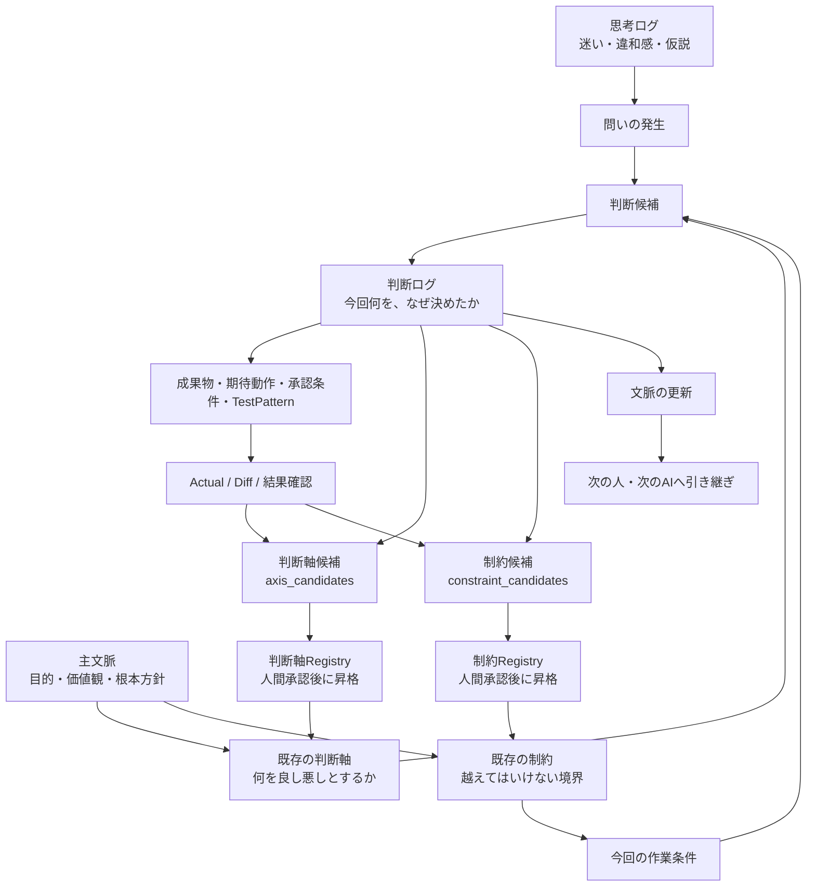
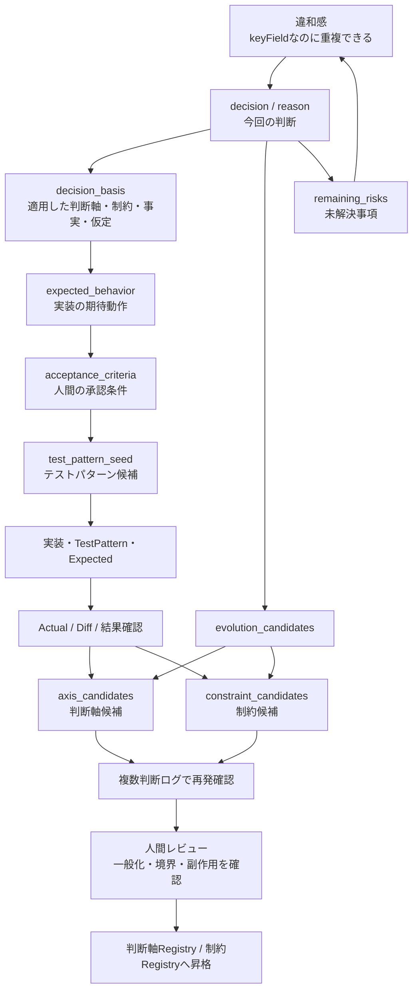

# 文脈というブラックホールに、判断ログを投げ込むな

AI協働をしていると、何でも「文脈」と呼びたくなる。

前提も文脈。
会話履歴も文脈。
判断理由も文脈。
迷いも文脈。
差分も文脈。
制約も文脈。

便利である。

便利すぎる。

そして、便利すぎる言葉はだいたい危険である。

ある日、会社のAI推進計画をCopilotに相談していたとき、私はこう聞いた。

> 判断ログって言葉、文脈って言葉に丸めてもええかな？

すると、Copilotに止められた。

まあまあ強めに止められた。

要するにこういうことだ。

> 文脈は大事。
> でも、判断ログまで文脈に丸めるな。

たしかに正しい。

「文脈」という言葉は便利すぎて、何でも飲み込むブラックホールになる。

そしてブラックホールに飲み込まれた情報は、あとから承認にもレビューにも使いにくい。

この記事では、AI協働における「文脈」「主文脈」「判断軸」「制約」「判断ログ」「思考ログ」を整理する。

そして最終的に、判断ログを単なる記録ではなく、

> **判断軸と制約を育てるための蒸留槽**

として捉え直す。

現場で生まれた判断理由を、その場限りの文章で終わらせない。  
複数の判断ログに繰り返し現れる「ものさし」と「境界」を抽出し、人間が承認したうえで、正式な判断軸・制約へ昇格させる。

この記事の後半では、そのための言葉とJSON構造まで提案する。

---

## きっかけ：400Ksを1人月で承認するには？

前提として、私はCopilotにこんな問いを共有していた。

> AIが生成した400Ks規模のシステムを、1人月で承認するには？

普通に考えると、コードを全部読むのは無理である。

では、人間は何を見るべきなのか。

ここで、

> 文脈が大事です

と言うだけでは、ちょっと弱い。

いや、大事なのは分かる。

でも、それでは承認できない。

承認に必要なのは、もう少し分解された情報である。

* 何を前提にしているのか
* 何を判断基準にしているのか
* 何を決めたのか
* なぜそう決めたのか
* 何を捨てたのか
* どのリスクを許容したのか

このあたりを全部まとめて「文脈」と呼ぶと、気持ちはいい。

でも、実務ではぼやける。

だから分ける。

---

## 用語整理

いったん、こう置く。

```text
主文脈 = 憲法
判断軸 = 判例・判断基準
制約 = 越えてはいけない法的境界
判断ログ = 実際の判決記録
思考ログ = 評議・迷い・違和感の記録
文脈 = この話を理解するための土台
```

表にするとこうなる。

| 用語       | 何を残すか             | 一言でいうと     | 主な用途       |
| -------- | ----------------- | ---------- | ---------- |
| **思考ログ** | 迷い・違和感・仮説・会話の揺れ | 考えた道筋 | 後から発見を掘り返す |
| **判断ログ** | 決めたこと・理由・捨てた案・リスク | なぜそう決めたか | 承認・説明・レビュー |
| **文脈** | 前提・目的・価値観・用語・継続方針 | この話を理解する土台 | AIや人への引き継ぎ |
| **主文脈** | 根本目的・価値観・守るべき方向性 | 憲法 | 判断全体の方向を守る |
| **判断軸** | 良し悪しを判断する基準 | 判例・判断基準 | 複数案を評価する |
| **制約** | 禁止事項・必須条件・変更不能な境界 | 越えてはいけない線 | 判断と実装の暴走を防ぐ |

さらに短く言うと、こう。

```text
思考ログ = ぐちゃぐちゃでよい
判断ログ = 決定の証跡
文脈     = 次回以降の前提
判断軸   = 判断に使うものさし
制約     = 判断しても越えてはいけない境界
主文脈   = ものさしと境界を支える土台
```

---

## 関係図

全体の流れはこうである。



ポイントは、判断ログがゴールではないことだ。

判断ログには、二つの流れがある。

```text
上から下への流れ:
既存の判断軸・制約
＋ 今回の作業条件
＋ 今回の解釈
＝ 今回の判断

下から上への流れ:
今回の判断理由
＋ 結果確認
＋ 複数事例での再発
＝ 新しい判断軸候補・制約候補
```

既存の判断軸と制約を、現場へ適用する。  
そして現場で繰り返し現れた判断理由を、正式な判断軸と制約へ蒸留する。

AI協働で本当に回したいのは、

> **判断軸と制約の適用・検証・蒸留ループ**

である。

---

## 思考ログとは何か

思考ログとは、考えている途中の記録である。

まだ結論になっていないものを残す場所。

たとえば、こういうもの。

```text
KPIを大切にされる方々と話すともやる。
でも、なぜもやるのか？
KPIを大切にされる方々は、AI協働を成果測定の話として見ている。
自分は文化・思考環境・差分蓄積の話として見ている。
ここに大きな時間軸のズレがある気がする。
```

これは判断ではない。

でも、めちゃくちゃ大事である。

なぜなら、ここに違和感の火種があるからだ。

思考ログは、きれいにしすぎると死ぬ。

```text
なんか違う
腹立つ
でもたぶんここが本質
Copilotに怒られた
```

こういう温度が残っていていい。

むしろ、その熱量があとで効く。

---

## 判断ログとは何か

判断ログとは、分岐点で何を選んだかの記録である。

たとえば、こういうもの。

```text
判断:
AI協働推進の説明では、「文脈」という言葉だけで押し切らない。

理由:
文脈という言葉が広すぎて、KPIを大切にされる方々には測定不能に見えるため。

採用する言い分け:
- 思考ログ
- 判断ログ
- 文脈
- 判断軸

捨てた案:
全部まとめて「文脈ログ」と呼ぶ案。

リスク:
言葉が増えすぎると初見の人に重く見える。

次アクション:
説明では、まず「判断ログ」から入る。
```

これが判断ログである。

ただし、判断ログをさらに強くするなら、今回の判断の起因となった制約も紐づけておきたい。

```text
適用した制約ID:
constraint_019

今回の作業条件:
既存ファイル名を維持したまま、新しい機能を追加する。

今回の判断:
既存ファイルは改名せず、新規ファイルの追加で対応する。

制約の解釈:
既存参照を壊さないことを優先し、命名統一は表示名側で行う。
```

こうしておけば、あとから見たときに、

> なぜ今回はこの判断になったのか

を、担当者の好みではなく、制約と作業条件の組み合わせとして追跡できる。

判断ログには、

* 何を決めたか
* なぜ決めたか
* どの制約を適用したか
* その制約を今回どう解釈したか
* 何を捨てたか
* どのリスクを許容したか
* 次に何を見るべきか

が残る。

これは単なる議事録ではない。

制約を現実の作業へ着地させた、承認のための証跡である。

---

## 判断ログが、設計書とテスト仕様書の母体になった瞬間

ここまでは、判断ログを「過去の判断を説明するための記録」として捉えていた。

しかし、Studioくんへ **Studio JSON Round Trip** を追加し、AIが生成したJSONを画面へ貼り付ける実験をしていたとき、判断ログの見え方が変わった。

きっかけは、小さな違和感だった。

ViewDefには、次の定義があった。

```json
{
  "dataPath": "$.work_items",
  "keyField": "work_item_id"
}
```

ところが、`work_item_id`は重複登録できた。

`keyField`と書いてあるのに、一意性は保証されていなかった。

そこで、次の問いが生まれた。

> 「キーとして設定したものは、必ず重複チェックして一意であることを確認する」

これは判断軸なのか。制約なのか。

答えは、**両方だった。**

```text
判断軸:
編集の自由度や操作上の利便性より、
データのIdentity整合性と追跡可能性を優先する。

制約:
keyFieldに指定された値は、
対象Grid内で必須かつ一意でなければならない。
```

判断軸は、なぜ一意性を優先するのかを決める「ものさし」である。

制約は、そのものさしから導かれた、越えてはいけない具体的な境界である。

この判断をStudioくんの判断ログへ入れようとしたとき、AIが次の構造を生成した。

| 項目 | 何を残すか | `keyField`の例 |
| --- | --- | --- |
| `decision` | 何を決めたか | `keyField`を単なる行識別子ではなく、Identity保証契約として扱う |
| `reason` | なぜ決めたか | 重複すると、編集・更新・参照・差分・履歴の対象を一意に特定できない |
| `applied_axes` | 今回、何を物差しにしたか | Identity整合性、名称と保証の一致、共通Validation |
| `conditions` | どんな条件で適用するか | ViewDefのGridに`keyField`が指定されている |
| `exceptions` | どこでは適用しないか | `keyField`未指定Grid、異なるGrid間 |
| `expected_behavior` | 実装はどう振る舞うべきか | null・空値・重複を拒否し、自己更新は許可する |
| `acceptance_criteria` | 人間は何を確認すれば承認できるか | 重複登録不可、既存値維持更新可、Paste後修正可 |
| `test_pattern_seed` | どんなテストへ展開できるか | 新規重複、自己更新、既存衝突、空値、Paste後修正 |
| `remaining_risks` | まだ何が決まっていないか | 前後空白、大文字小文字、型差、拒否タイミング |

この時点では、`conditions`と`exceptions`という比較的素朴な名前を使っていた。

しかし後で考えると、ここはさらに分けた方がよい。

```text
applicability_conditions
= この判断・制約を適用する条件

non_applicability_conditions
= この判断・制約を適用しない条件

out_of_scope
= 今回はまだ扱わない領域
```

たとえば、

```text
keyField未指定Grid
= 非適用条件

異なるGrid間
= 適用範囲の境界

複合キー
= 今回の対象外・将来課題
```

である。

この違いを分けることで、AIが「例外」という曖昧な言葉を勝手に広げる危険を減らせる。

この構造は、単にログを細かくしただけではない。

一つの判断から、

```text
意味
↓
適用範囲
↓
実装の期待動作
↓
人間の承認条件
↓
テストパターン
↓
次に判断すべき未解決事項
```

までを、一本につないでいる。

実際の判断ログは、次のような形になった。

```json
{
  "decision_id": "decision_keyfield_identity_contract_001",
  "decision": "ViewDefのkeyFieldを、単なる行識別用フィールドではなく、対象Grid内で必須かつ一意なIdentityを保証する契約として扱う。",
  "reason": "同じkeyField値を持つ行が複数存在すると、編集対象、更新対象、関連参照、差分、判断ログおよび履歴の対象を一意に特定できないため。",
  "applied_axes": [
    {
      "axis_id": "decision_axis_identity_integrity_priority",
      "axis": "データのIdentity整合性と追跡可能性を、編集の自由度や操作上の利便性より優先する。"
    },
    {
      "axis_id": "decision_axis_contract_name_alignment",
      "axis": "定義名が示す意味と、Runtimeが保証する挙動を一致させる。"
    },
    {
      "axis_id": "decision_axis_common_validation",
      "axis": "個別画面の注意運用ではなく、共通契約と共通Validationで保証する。"
    }
  ],
  "conditions": [
    "ViewDefのGrid定義にkeyFieldが指定されていること",
    "対象データが同一dataPath配下のGrid行集合であること",
    "新規追加、通常編集、PasteJSON、F12反映または保存を行うこと"
  ],
  "exceptions": [
    "keyFieldが指定されていないGridは対象外",
    "異なるGridまたは異なるdataPath間の同一値は許容",
    "複合キーと外部データ横断一意性は別契約"
  ],
  "expected_behavior": [
    "keyFieldがnull、未定義、空文字または無効値なら反映を拒否する",
    "同一Grid内に同じkeyField値を持つ別行が存在すれば反映を拒否する",
    "既存行が自身のkeyField値を維持した更新は許可する",
    "PasteJSON時に重複候補を通知し、F12反映前に修正できる",
    "F12反映時および保存直前には重複データを確定させない"
  ],
  "acceptance_criteria": [
    "同一Grid内に重複するkeyField値を持つデータを新規登録できない",
    "既存行のkeyFieldを別行と同じ値へ変更できない",
    "既存行を同じkeyField値のまま更新できる",
    "空または未設定のkeyFieldを持つ行を確定できない",
    "PasteJSON後に一意な値へ修正すればF12反映できる",
    "keyField未指定Gridの既存挙動を壊さない"
  ],
  "test_pattern_seed": [
    {
      "pattern_id": "keyfield_unique_new_duplicate",
      "input": "新規行へ既存行と同じkeyField値を入力する",
      "expected": "重複エラーとなり反映されない"
    },
    {
      "pattern_id": "keyfield_unique_self_update",
      "input": "既存行をkeyField値を変更せず更新する",
      "expected": "自身を重複対象から除外し、正常に反映される"
    },
    {
      "pattern_id": "keyfield_unique_existing_collision",
      "input": "既存行のkeyFieldを別行と同じ値へ変更する",
      "expected": "重複エラーとなり反映されない"
    },
    {
      "pattern_id": "keyfield_required_empty",
      "input": "keyFieldへ空文字またはnullを入力する",
      "expected": "必須エラーとなり反映されない"
    },
    {
      "pattern_id": "keyfield_paste_fix_before_commit",
      "input": "PasteJSONで重複IDを貼り付けた後、一意なIDへ手修正してF12を実行する",
      "expected": "手修正後の一意なIDで正常に反映される"
    },
    {
      "pattern_id": "grid_without_keyfield_compatibility",
      "input": "keyField未指定Gridで既存の追加・編集を行う",
      "expected": "本制約による追加エラーは発生しない"
    }
  ],
  "remaining_risks": [
    "既存データに重複または空のkeyFieldがある場合の移行方針",
    "文字列前後空白を除去して比較するか",
    "大文字小文字を区別するか",
    "数値1と文字列\"1\"を同一とみなすか",
    "読込時、Paste時、F12時、保存時のどこで拒否するか"
  ]
}
```

画面上にこの判断ログが展開されたとき、私は少し感動した。

なぜなら、これはもう「なぜそう決めたか」を残すだけのログではなかったからだ。

### `decision`と`reason`は、人間が意味を承認する場所

人間が本気で確認するのは、まずここである。

```text
keyFieldはIdentity契約である。
Identity整合性を、入力の自由度より優先する。
```

この意味に納得できるか。

この判断を、自分の責任で採用できるか。

### `applied_axes`と適用範囲は、再利用の境界を作る

良い判断でも、無条件に使い回すと危険である。

```text
どの物差しで決めたのか
どの条件なら使えるのか
どの条件では使わないのか
何を今回の対象外として残したのか
```

を残すことで、判断は「いつでも正しいルール」ではなく、再利用可能な判断資産になる。

ここで、適用除外条件も制約の一部と考えられる。

ただし正確には、

> **適用除外条件は、制約が有効になる範囲を定める境界情報**

である。

制約は「何を守るか」だけでは完成しない。  
「どの世界で守るか」まで定義されて、初めて安全に機械適用できる。

### `expected_behavior`は、判断を実装言語へ変換する

判断軸や制約を承認しても、実装がどう動けばよいかが曖昧なら、AIは好きな形で埋めてしまう。

`expected_behavior`は、

> この判断が正しく実装された世界では、何が起きるはずか

を記述する。

これは、判断とコードの間をつなぐ橋になる。

### `acceptance_criteria`は、人間の承認範囲を小さくする

人間がコードを全部読む代わりに、

```text
重複登録できない
自己更新はできる
空値は拒否される
Paste後に修正して反映できる
既存Gridを壊さない
```

を確認すればよい。

承認対象が、巨大な実装から、認知可能な確認条件へ圧縮される。

### `test_pattern_seed`は、判断からテストを生む

ここが、特に大きかった。

人間が承認した判断から、AIがテストパターン候補を展開できる。

```text
新規重複
自己更新
既存行との衝突
空値
Paste後の修正
keyField未指定Gridへの非影響
```

人間は、テストコード一行一行をゼロから考えるのではない。

まず、判断軸・制約・適用条件・期待動作を承認する。

その承認済み構造から、AIがテストパターンとExpectedを導出する。

これは、私が考えているAI承認駆動開発の姿にかなり近い。

### `remaining_risks`は、未完成を隠さない

判断ログをきれいに仕上げようとすると、未決定事項まで埋めたくなる。

しかし、

```text
前後空白はどうする？
大文字小文字は？
数値と文字列は同じか？
いつ拒否する？
```

は、まだ決まっていない。

そこをAIが勝手に補完せず、**次に人間が判断すべき差分**として残す。

未解決リスクは、判断ログの欠陥ではない。

次の判断を起動するための入口である。

---

## 判断ログは、判断軸と制約を蒸留する原液である

ここで、さらに一つ大きな問いが生まれた。

> 判断ログの中の、どの言葉を、将来の判断軸や制約へ昇格させるのか。

判断ログの`reason`には、いろいろな種類の情報が混ざる。

```text
判断理由
├─ 既存の判断軸を適用した理由
├─ 既存の制約を適用した理由
├─ 今回新しく生まれた判断軸候補
├─ 今回新しく生まれた制約候補
├─ 事実
├─ 前提・仮定
└─ リスク・未解決事項
```

これを全部「理由」として文章の中に閉じ込めると、あとから蒸留できない。

そこで、判断ログの中を次のように分ける。

| 項目 | 意味 | 将来の扱い |
| --- | --- | --- |
| `applied_axes` | 既存の判断軸を今回使った | 判断軸の適用実績 |
| `applied_constraints` | 既存の制約を今回使った | 制約の適用実績 |
| `axis_candidates` | 今回の判断から生まれた新しいものさし | 判断軸Registryへの昇格候補 |
| `constraint_candidates` | 今回の判断から生まれた新しい境界・不変条件 | 制約Registryへの昇格候補 |
| `facts` | 観測された事実 | 判断根拠 |
| `assumptions` | 成立すると仮定した前提 | 再確認対象 |
| `remaining_risks` | まだ決めていないこと | 次の判断ログの入口 |

ここで重要なのは、**適用したもの**と**新しく生まれた候補**を分けることだ。

```text
applied_axes
= すでに承認済みの判断軸を、今回使った

axis_candidates
= 今回の経験から、新しい判断軸候補が生まれた

applied_constraints
= すでに承認済みの制約を、今回使った

constraint_candidates
= 今回の経験から、新しい制約候補が生まれた
```

この区別がないと、AIが一回だけ現れた判断理由を、いきなり全社共通ルールへ昇格させかねない。

### 制約へ蒸留される元の言葉は何か

制約へ蒸留される元の中心概念は、

> **守るべき境界**  
> **常に成立させたい不変条件（Invariant）**

である。

判断理由の文章では、次の言い回しが制約候補のサインになる。

| 言葉の型 | 蒸留される制約の型 |
| --- | --- |
| 必ず〜する | 必須制約 |
| 〜してはならない | 禁止制約 |
| 常に〜である | 不変条件 |
| 〜の場合のみ許可する | 許可条件 |
| 〜以上／以下 | 範囲制約 |
| 〜より前に／後に | 順序制約 |
| 〜までは変更しない | ライフサイクル制約 |
| 〜が責任を持つ | 責務・権限制約 |
| 失敗した場合は〜する | Failure Policy |
| 〜の場合は適用しない | 非適用条件 |
| 例外は〜のみ | 例外境界 |

英語の強い語に寄せるなら、次の三つである。

```text
MUST
MUST NOT
INVARIANT
```

今回の`keyField`は、まさにInvariantである。

```text
同一Grid内で、keyFieldは常に必須かつ一意である。
```

新規追加、通常編集、PasteJSON、F12反映、ファイル保存。  
どの経路を通っても成立し続けなければならない。

### 制約候補は、一文だけでは完成しない

制約候補は、

```text
keyFieldは一意である
```

だけでは弱い。

安全に機械適用するには、少なくとも次が必要になる。

```text
statement
何を守るか

constraint_type
必須・禁止・不変条件・範囲・順序など

scope
どの世界で守るか

applicability_conditions
いつ適用するか

non_applicability_conditions
いつ適用しないか

out_of_scope
今回は何をまだ扱わないか

enforcement_points
どの処理境界で検証するか

violation_behavior
破ったときに止めるのか、警告するのか

evidence_decision_ids
どの判断ログから生まれたか
```

今回の例なら、こうなる。

```json
{
  "candidate_id": "constraint_keyfield_required_unique",
  "statement": "keyFieldに指定された値は、対象Grid内で必須かつ一意でなければならない",
  "constraint_type": "INVARIANT",
  "scope": "同一dataPath配下のGrid行集合",
  "applicability_conditions": [
    "ViewDefのGrid定義にkeyFieldが指定されている"
  ],
  "non_applicability_conditions": [
    "keyFieldが指定されていないGrid",
    "異なるGridまたは異なるdataPath間"
  ],
  "out_of_scope": [
    "複合キー",
    "外部ファイルを横断した一意性"
  ],
  "enforcement_points": [
    "新規追加",
    "PasteJSON",
    "F12反映",
    "ファイル保存"
  ],
  "violation_behavior": "BLOCK",
  "evidence_decision_ids": [
    "decision_keyfield_identity_contract_001"
  ],
  "promotion_status": "CANDIDATE"
}
```

ここで、`exceptions`は制約候補から消えたわけではない。

```text
exceptions
↓ 分解
non_applicability_conditions
＋ out_of_scope
```

という形で、より機械判定しやすい境界情報へ進化した。

### 判断ログの推奨構造

最終的には、判断ログを次のように分けると、蒸留ループが明確になる。

```json
{
  "decision": "今回何を決めたか",
  "reason": "人間向けの自由記述",

  "decision_basis": {
    "applied_axes": [],
    "applied_constraints": [],
    "facts": [],
    "assumptions": []
  },

  "evolution_candidates": {
    "axis_candidates": [],
    "constraint_candidates": []
  },

  "applicability_conditions": [],
  "non_applicability_conditions": [],
  "out_of_scope": [],

  "expected_behavior": [],
  "acceptance_criteria": [],
  "test_pattern_seed": [],
  "remaining_risks": []
}
```

自由記述の`reason`は残す。

人間は、最初から完全な分類をしなくてよい。  
まず自分の言葉で理由を書く。

その後AIが、

```text
これは既存判断軸の適用か
これは既存制約の適用か
これは新しい判断軸候補か
これは新しい制約候補か
これは単なる事実か
これは未確認の仮定か
```

を分類候補として提示する。

人間は、その分類と昇格候補を承認する。

### 一回出ただけでは、昇格させない

ここは非常に重要である。

一つの判断ログに現れただけの理由を、すぐに正式な判断軸・制約へ昇格させると、ルールは肥大化する。

昇格候補には、少なくとも次を確認したい。

```text
再発性:
複数の判断ログで繰り返し現れたか

横断性:
一つの画面・一つの案件だけでなく、複数の対象に通用するか

説明可能性:
なぜ必要かを、人間が説明できるか

境界明確性:
適用条件・非適用条件・対象外を分けられるか

検証可能性:
違反をテストやValidationで確認できるか

副作用:
既存資産や自由度を不必要に壊さないか
```

一回限りの判断は、判断ログに残せばよい。

繰り返し現れ、一般化でき、検証可能になったものだけを、

```text
CANDIDATE
↓ 複数事例で検証
↓ 人間レビュー
↓ APPROVED
↓ 判断軸Registry / 制約Registry
```

へ昇格させる。

### 判断軸候補も同じように蒸留する

制約だけではない。

今回の`keyField`では、次の判断軸候補も生まれた。

```text
編集の自由度や操作上の利便性より、
データのIdentity整合性と追跡可能性を優先する。
```

この言葉が複数の判断ログで繰り返し現れるなら、

```json
{
  "axis_candidate_id": "decision_axis_identity_integrity_priority",
  "statement": "編集の自由度より、Identity整合性と追跡可能性を優先する",
  "evidence_decision_ids": [
    "decision_keyfield_identity_contract_001"
  ],
  "promotion_status": "CANDIDATE"
}
```

として判断軸Registryへの昇格候補にできる。

判断軸は「どちらを優先するか」という比較の言葉から生まれやすい。

```text
AよりBを優先する
短期効率より再現性を重視する
共通化より責務分離を先に行う
実装量より人間の視認性を優先する
```

これらは、判断軸候補のサインになる。

---

## 判断ログは「過去の記録」から「未来の生成構造」へ

この構造を一枚で表すと、こうなる。



判断ログは、過去を説明するだけのものではない。

```text
過去:
なぜこの判断をしたのか

現在:
何を承認すればよいのか

未来:
どんな仕様・テスト・次の判断を生むのか

進化:
どの判断理由を、判断軸・制約へ昇格させるのか
```

を同時に持てる。

つまり判断ログは、

> **判断から、次の承認可能な差分を生成する構造**

であり、さらに、

> **現場の判断理由から、判断軸と制約を蒸留する構造**

にもなり得る。

この瞬間、判断ログは議事録を卒業する。

設計書、レビュー観点、テスト仕様、リスク一覧の母体になる。  
同時に、判断軸Registryと制約Registryを育てる原液になる。

そして人間の仕事は、すべての成果物を一から読むことではなく、

> その判断軸で本当に良いのか。  
> その制約を、この条件へ適用してよいのか。  
> そのExpectedは、承認した意味から正しく導かれているか。  
> その判断理由は、一時的な事情なのか、昇格させるべき共通原則なのか。

を確認することへ移っていく。

---

## 文脈とは何か

文脈とは、次の会話や作業を成立させるための土台である。

ただし、ここが重要である。

文脈は、思考ログや判断ログを全部入れる箱ではない。

むしろ、思考ログや判断ログの蓄積から抽出された、

* この話は何を目的にしているのか
* 何を大事にしているのか
* どの言葉をどういう意味で使うのか
* 何を避けたいのか
* どんな成果物を作りたいのか
* 次回以降、何を前提にすればよいのか

をまとめたものである。

つまり文脈は、

```text
ログそのものではなく、
ログから育った前提セット
```

である。

文脈は大事。

でも、文脈はゴミ箱ではない。

ここを間違えると、あとで全部が「なんとなく大事な話」になる。

そして「なんとなく大事な話」は、だいたい承認に使えない。

---

## 判断軸とは何か

判断軸とは、何を良し悪しとして判断するかの基準である。

AI駆動開発なら、たとえばこういうものが判断軸になる。

* 差分が追えること
* 再現できること
* 制約が明文化されていること
* AIに渡しやすいこと
* 人間が承認できる粒度に圧縮されていること
* 説明責任を果たせること

判断軸は、主文脈から生まれる。

そして、判断ログによって更新される。

最初は、

```text
AI協働では効率化を重視する
```

だった判断軸が、実際に進めるうちに、

```text
効率化だけで見ると、文脈が残る価値や再現性が見えない
```

と分かることがある。

すると判断軸が変わる。

```text
AI協働では、短期的な効率だけでなく、
文脈化率・差分化率・再現率も重視する
```

こうして判断軸が育つ。

---

## 制約とは何か

制約とは、判断や実装が越えてはいけない境界である。

たとえば、AI駆動開発なら次のようなものが制約になる。

* 既存のファイル名を変更しない
* Git diffで追えない変更をしない
* 承認なしに本番へ反映しない
* テストで確認できない仕様を「完了」と扱わない
* 個人情報を外部AIへ渡さない

判断軸と制約は似ているが、役割が違う。

```text
判断軸 = 複数案の中から、より良い案を選ぶためのものさし
制約   = どれほど魅力的でも、採用してはいけない案を落とす境界
```

たとえば、

```text
判断軸:
AIに渡しやすい構造を優先する。

制約:
既存の参照関係を壊すファイル名変更は禁止する。
```

という形で共存する。

判断軸は、状況に応じて重みが変わる。

一方、制約は原則として守らなければならない。

もちろん、制約そのものが古くなることはある。

ただし、その場合も黙って破るのではなく、

```text
なぜこの制約を変えるのか
どのリスクを新たに受け入れるのか
代わりに何を守るのか
```

を判断ログとして残す必要がある。

つまり制約は、思考停止のルールではない。

> 自由に考えるために、先に固定しておく境界

である。

---


## 制約と判断ログはどうつながるのか

制約と判断ログの関係は、一方向ではない。

現時点では、次の二つの流れで捉えている。

### 上位制約を、今回の判断へ適用する

```text
既存制約
＋ 今回の作業条件
＋ 今回の解釈
＝ 判断ログ
```

たとえば、

```text
制約:
既存のファイル名を変更しない。

インシデント固有の作業条件:
命名揺れを整理しながら、新機能を追加したい。

判断ログ:
既存ファイルは改名しない。
新規ファイルだけ命名規則へ合わせ、既存名称は表示名で補う。
```

同じ制約でも、作業条件が違えば判断は変わる。

だから判断ログには、制約IDだけでなく、今回の解釈も残したほうがよい。

```json
{
  "decision_log_id": "decision_20260710_001",
  "decision_basis": {
    "applied_constraints": [
      {
        "constraint_id": "constraint_019",
        "interpretation": "既存参照を壊さないため、既存ファイル名は維持する"
      }
    ]
  }
}
```

この構造があると、判断ログは、

> 制約を、現場で実際に適用した実績

になる。

### 現場の判断理由を、新しい制約へ蒸留する

逆方向もある。

```text
違和感
↓
今回の判断
↓
constraint_candidates
↓
複数判断ログで再発確認
↓
一般化・適用境界・副作用を確認
↓
人間承認
↓
新しい制約、または既存制約の改訂
```

今回の`keyField`がこの流れである。

最初から、

```text
keyFieldは必須かつ一意
```

という正式制約が存在していたわけではない。

Studio JSON Round Tripの実験で重複登録が露出し、

```text
Identity整合性を優先する
```

という判断軸候補と、

```text
keyFieldは対象Grid内で必須かつ一意
```

という制約候補が生まれた。

つまり判断ログは、

```text
既存制約を使った実績
```

であると同時に、

```text
新しい制約を生む観測地点
```

でもある。

制約は、最初から完成した法律集ではない。

現場の判断ログと結果から育てる。  
ただし、一回だけ出た判断をすぐ法律にしない。

この慎重な蒸留プロセスまで含めて、制約管理である。

---

## なぜ判断ログを文脈に丸めてはいけないのか

判断ログを文脈に丸めると、一見すっきりする。

言葉が減る。

説明しやすくなる。

でも、その代わりに大事なものが消える。

それは、

> 誰が、どの判断軸で、何を選び、何を捨てたのか

である。

たとえば、

```text
今回はB案を採用した。
```

だけでは弱い。

```text
今回はB案を採用した。
理由は、A案よりもGit diffで追いやすく、AI差分物語に変換しやすいため。
A案はUIとしては自然だが、判断理由が画面側に閉じてしまい、後からAIに渡しにくい。
リスクは、初見ユーザにはB案が少し硬く見えること。
```

ここまで残って、ようやく判断ログになる。

これは文脈ではない。

これは承認のための記録である。

ここを文脈に丸めると、あとでこうなる。

> なんか当時、そういう流れだったんですよね。

出た。

日本企業名物、ふんわり判断である。

ふんわり判断は、AIに渡せない。

---

## AIに渡すときの使い分け

AIに渡すときは、それぞれ目的が違う。

### 思考ログを渡す

目的は、違和感の回収である。

```text
この思考ログを読んで、
まだ言語化できていない違和感、
判断が分岐している場所、
次に整理すべき問いを抽出してください。
```

### 判断ログを渡す

目的は、レビュー、承認、蒸留候補の抽出である。

```text
この判断ログを読んで、次を整理してください。

1. 判断理由が弱いところ
2. 捨てた案の中に再検討すべきもの
3. リスクとして残るもの
4. 既存判断軸・既存制約を適用した部分
5. 新しい判断軸候補
6. 新しい制約候補
7. 事実と仮定が混ざっている部分
8. 適用条件・非適用条件・対象外が曖昧な部分

候補は自動昇格させず、人間の承認対象として提示してください。
```

### 文脈を渡す

目的は、引き継ぎと継続である。

```text
以下の文脈を前提として、
今回の相談を続きの研究として扱ってください。
```

### 判断軸を渡す

目的は、評価基準の共有である。

```text
以下の判断軸に基づいて、
今回の案を評価してください。
判断軸そのものに古さや不足があれば、それも指摘してください。
```

### 制約を渡す

目的は、AIの提案や実装が越えてはいけない境界を共有することである。

```text
以下の制約を必ず守ってください。
制約と依頼内容が衝突する場合は、
制約を破って進めず、衝突箇所と代替案を示してください。
```

AIにとって制約は、単なる注意書きではない。

出力候補を絞り込み、判断可能な範囲を定める入力である。

さらに判断ログと制約をセットで渡すと、AIは、

```text
何を守るべきか
なぜその制約があるのか
過去にどの状況でどう適用されたのか
今回どこまで同じ判断を再利用できるのか
```

まで考えられる。

その結果、AIが生成できるのはコードだけではない。

* テストパターンと期待値
* 設計書や方針書
* 承認資料
* インシデント記録
* ブログや説明文

といった重要な成果物にも効く。

```text
文脈      = 何のために作るか
制約      = 何を守るか
判断ログ  = なぜ今回はそうしたか
```

この三点がそろうと、AIは一般論ではなく、その活動に固有の成果物を作りやすくなる。

---

## 400Ksを1人月で承認するなら

最初の問いに戻る。

> AIが生成した400Ks規模のシステムを、1人月で承認するには？

この問いに対して、

```text
コードを全部読む
```

はたぶん無理である。

必要なのは、コードを読むことではなく、

> 承認判断できる情報構造へ変換すること

である。

その情報構造には、少なくとも以下が必要になる。

```text
主文脈:
このシステムは何を守るべきか。

判断軸:
何をもってOKとするか。

判断ログ:
今回どの判断をしたか。
何を採用し、何を捨てたか。

差分:
前回から何が変わったか。

制約:
絶対に破ってはいけない条件は何か。

再現性:
その判断をテストやログで再確認できるか。

関係:
制約、判断ログ、成果物、テスト、結果がつながっているか。

進化候補:
今回の判断理由のうち、
どれを判断軸・制約へ昇格させるべきか。
```

人間がレビューする対象は、コードそのものから、

> 判断可能な文脈構造

へ移っていく。

たぶん、AI時代に人間が最後に担うべき仕事はここである。

AIがコードを書く。

AIがテストを書く。

AIが差分を説明する。

それでも人間は、

> その判断軸で、本当に良いのか？  
> その制約を、本当に共通化してよいのか？  
> その判断理由は、一時的事情ではなく、将来も守るべき原則なのか？

を見なければならない。

そして将来的には、成果物だけを単体で承認するのではなく、

```text
制約
→ 判断ログ
→ 成果物
→ テストパターン
→ 結果
```

という関係が切れていないかを承認する必要が出てくる。
ここでは、その考え方を仮に「リレーション承認」と呼んでおく。

ただし、これは別の記事で掘ったほうがよい話なので、今回は入口だけにしておく。

---

## 最終定義

この記事での定義をまとめる。

### 思考ログとは、

違和感・仮説・迷い・会話の揺れを残す記録である。

目的は、後から思考を再起動すること。

### 判断ログとは、

選択・理由・適用した判断軸・適用した制約・事実・仮定・捨てた案・リスク・次アクションを残す記録である。

さらに強い判断ログでは、

```text
decision_basis
= 今回何を根拠として使ったか

evolution_candidates
= 今回の経験から何を育てる候補とするか

expected_behavior
= 実装がどう振る舞うべきか

acceptance_criteria
= 人間が何を確認すれば承認できるか

test_pattern_seed
= どんなテストへ展開できるか

remaining_risks
= 次に何を判断すべきか
```

までを構造化する。

目的は、今回の判断を説明可能・再利用可能にし、その判断から仕様・テスト・Expected・次の判断を生成すること。  
さらに、判断理由の中から、将来の判断軸候補・制約候補を抽出できる状態を作ること。

### 文脈とは、

思考ログと判断ログの蓄積から抽出された、次の対話や作業を成立させる前提である。

目的は、人間やAIが説明なしに続きから考えられる状態を作ること。

> 文脈 = 前提・目的・背景・価値観・用語・継続方針・ゴール

### 主文脈とは、

その活動の根本目的・価値観・守るべき方向性である。

目的は、判断軸と制約の根拠を安定させること。

### 判断軸とは、

何を良し悪しとして判断するかの基準である。

目的は、複数案を評価可能にし、判断の再利用性を高めること。

判断軸は、主文脈から定められる。  
同時に、複数の判断ログに繰り返し現れた優先関係から蒸留される。

> 「壁の内側で、どれを優先するか」のものさし

### 制約とは、

判断・提案・実装が越えてはいけない禁止事項、必須条件、不変条件、適用境界である。

目的は、AIと人間の自由度を安全な範囲へ限定し、守るべき境界を明示すること。

制約は固定された完成品ではない。  
複数の判断ログと結果から、追加・分割・統合・改訂・廃止される。

> 「これ以上は越えてはいけない」の壁

### 判断軸候補とは、

今回の判断理由から抽出された、まだ正式承認されていない新しい優先基準である。

複数事例での再発性、横断性、説明可能性、副作用を確認し、人間承認後に判断軸Registryへ昇格する。

### 制約候補とは、

今回の判断理由から抽出された、まだ正式承認されていない新しい境界・必須条件・不変条件である。

```text
statement
scope
applicability_conditions
non_applicability_conditions
out_of_scope
enforcement_points
violation_behavior
evidence
```

を整え、複数事例で検証し、人間承認後に制約Registryへ昇格する。

### 制約と判断軸の使い方

> 違和感が出たとき、まず制約違反か、判断軸のズレかを切り分ける。  
> 判断軸のズレなら、判断軸自体を更新する機会である。  
> 新しい境界が繰り返し必要になるなら、制約候補として蒸留する。

---

## おわりに

文脈は大事である。

でも、文脈という言葉で全部を丸めてはいけない。

文脈に丸めると、思考の途中経過も、判断の証跡も、判断基準も、全部ぼやける。

AI協働で必要なのは、文脈を増やすことだけではない。

そして判断ログは、過去を保存するだけの箱でもない。

```text
decision
reason

decision_basis
├─ applied_axes
├─ applied_constraints
├─ facts
└─ assumptions

evolution_candidates
├─ axis_candidates
└─ constraint_candidates

applicability_conditions
non_applicability_conditions
out_of_scope

expected_behavior
acceptance_criteria
test_pattern_seed
remaining_risks
```

までがつながると、判断ログは、

```text
今回の判断を説明する
↓
承認条件へ変換する
↓
TestPatternとExpectedを生む
↓
結果から差分を確認する
↓
判断軸候補・制約候補を蒸留する
↓
人間承認後に正式な判断軸・制約へ昇格する
```

という循環装置になる。

文脈を育てるために、

* 思考ログを残す
* 判断ログに、適用した判断軸・制約と今回の解釈を残す
* 判断理由から、判断軸候補・制約候補を抽出する
* 一回だけの判断を、すぐ共通ルールへ昇格させない
* 複数事例で再発性・横断性・境界・副作用を確認する
* 人間が承認したものだけを、判断軸Registry・制約Registryへ昇格する
* 主文脈とのズレを見る
* 次回以降の文脈へ反映する

このループを回すことだ。

AIに何を頼むかではなく、

> AIと人間が、何を判断できる状態にするか。

そして、

> 現場の判断から、未来の判断基準と安全な境界をどう育てるか。

である。

そのために、文脈をブラックホールにしない。

文脈は土台。  
主文脈は憲法。  
判断軸はものさし。  
制約は越えてはいけない柵。  
判断ログは、個別の判断証跡であり、判断軸と制約を育てる蒸留槽。  
思考ログは鉱脈。

この分け方と育成ループを、しばらく使ってみたい。

---

判断ログは個別判決。  
判断軸は、複数の判決から蒸留された判断基準。  
制約は、複数の判断と結果から育つ法律。  
そして判断ログは、次の判断軸と制約を生む判例データベースでもある。

---


追伸：会社のCopilotくんに怒られたので、家のCHATGPTくんに教えてもらいながら、整理してもらった記事です。

追伸2：AI協働の本質的なところをCHATGPTくんに整理してもらいました。

> **AIが自分の期待値を超えるアウトプットを出せるようにするには、AIを信頼関係を築くべきパートナーとして扱えばいい。**
>
> 信頼関係を築こうとすると、人は自然に、背景、目的、価値観、境界、判断理由、違和感を相手へ共有する。
> それらはAIにとって、文脈・判断軸・制約・判断ログになる。
>
> 文脈が通ると、AIは世間一般の正解ではなく、その人の目的に合った答えを選べる。さらに、その人固有の体験とAIが持つ広い知識が結びつくことで、本人がまだ言語化できていなかった答えが生まれる。
>
> **期待値を超える出力は、うまい命令から生まれるのではない。
> 文脈を育て、違和感を返し合える関係から生まれる。**


---


[AI駆動開発研究日誌 や 思考拡張・AI駆動開発の記事はこちら](https://zenn.dev/frb_tamasub)

この思考拡張・AI駆動開発の実例として、私はFRB（Fishing Rod Benchmark）という個人研究を続けている。
釣り竿の感度を振動として比較・可視化しようとする、一見おかしな研究だが、そこで起きているのは「差分」「再現性」「制約」を使ったAI協働そのものである。
  
- [FRB（Fishing Rod Benchmark）釣り竿の「感度」を数値化する話 宣言](https://qiita.com/tamasub/items/2b6649748e1772b7eec1)
  


