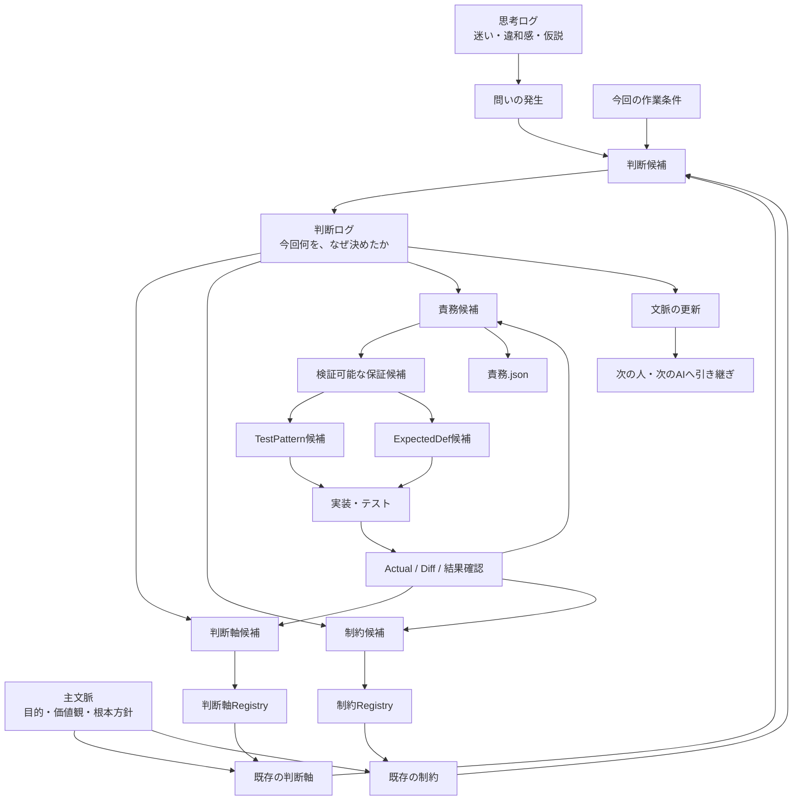
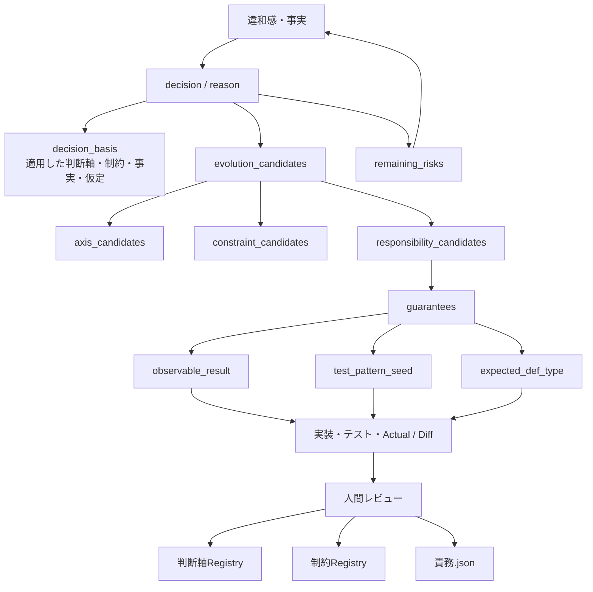

別の記事で、パートナー離脱の話から「判断を会社の資産として残す」重要性を書いた。
👉 [私が考えるAI協働とは —— パートナー離脱でプロジェクト崩壊？](https://zenn.dev/frb_tamasub/articles/ai-collaboration03-decisions-remain)

今回は、その「判断」を実際にどう分解し、どう育てるかの話。

---


# 文脈というブラックホールに、判断ログを投げ込むな

AI協働をしていると、何でも「文脈」と呼びたくなる。

前提も文脈。  
会話履歴も文脈。  
判断理由も文脈。  
迷いも文脈。  
差分も文脈。  
制約も文脈。

便利である。

便利すぎる。

そして、便利すぎる言葉は、ときどき大切な違いまで飲み込んでしまう。

ある日、会社のAI推進計画をCopilotに相談していたとき、私はこう聞いた。

> 判断ログって言葉、文脈って言葉に丸めてもええかな？

すると、Copilotに止められた。

要するに、こういうことだった。

> 文脈は大事。  
> でも、判断ログまで文脈に丸めるな。

たしかに正しい。

「文脈」という言葉に全部を入れると、あとから承認にもレビューにも使いにくい。

この記事では、AI協働における次の言葉を整理する。

```text
思考ログ
文脈
主文脈
判断軸
制約
判断ログ
責務
検証可能な保証
```

そして最終的に、判断ログを単なる記録ではなく、

> **判断軸・制約・責務を育てる蒸留槽**

として捉え直す。

現場で生まれた判断理由を、その場限りの文章で終わらせない。  
判断ログに残った「ものさし」「境界」「誰が何を保証するか」を、人間が承認できる構造へ変換し、正式な設計資産へ昇格させる。

そのための言葉とJSON構造まで、この記事で一度つないでみたい。

---

## きっかけ：400Ksを1人月で承認するには？

前提として、私はCopilotにこんな問いを共有していた。

> AIが生成した400Ks規模のシステムを、1人月で承認するには？

普通に考えると、コードを全部読むのは難しい。

では、人間は何を見るべきなのか。

ここで、

> 文脈が大事です

と言うだけでは、まだ承認できない。

承認に必要なのは、もう少し分解された情報である。

* 何を前提にしているのか
* 何を判断基準にしているのか
* 何を決めたのか
* なぜそう決めたのか
* 何を守らなければならないのか
* 誰が何を保証するのか
* 何を観測できれば、その保証を承認できるのか
* どのリスクが未解決なのか

これらを全部まとめて「文脈」と呼ぶと、実務ではぼやける。

だから分ける。

---

## まず、用語を分ける

いったん、こう置く。

```text
主文脈 = 憲法
判断軸 = 何を優先するかを決めるものさし
制約 = 越えてはいけない境界
責務 = 誰が何を保証するか
判断ログ = 実際の判断と、その根拠・境界・結果を残す記録
思考ログ = 評議・迷い・違和感の記録
文脈 = この話を理解し、続きを始めるための土台
```

| 用語 | 何を残すか | 一言でいうと | 主な用途 |
| --- | --- | --- | --- |
| **思考ログ** | 迷い・違和感・仮説・会話の揺れ | 考えている途中 | 発見の種を残す |
| **判断ログ** | 決定・理由・適用条件・候補・リスク | 個別判断の証跡 | 承認・説明・蒸留 |
| **文脈** | 前提・目的・価値観・用語・継続方針 | 次回の土台 | 人やAIへの引き継ぎ |
| **主文脈** | 根本目的・守るべき方向性 | 憲法 | 判断全体の方向を守る |
| **判断軸** | 良し悪しや優先順位の基準 | ものさし | 複数案を評価する |
| **制約** | 禁止・必須・不変条件・適用境界 | 越えてはいけない線 | 暴走と事故を防ぐ |
| **責務** | 主体・対象・保証・境界 | 誰が何を保証するか | 実装と承認の単位を作る |

さらに短く言うと、こうである。

```text
思考ログ = ぐちゃぐちゃでよい
判断ログ = 決定と進化候補の証跡
文脈     = 次回以降の前提
判断軸   = 壁の内側で、どれを優先するか
制約     = 越えてはいけない壁
責務     = その壁と期待を、誰が保証するか
主文脈   = ものさし・壁・責務を支える土台
```

---

## 全体の関係

全体を一枚にすると、次のようになる。



判断ログには、二方向の流れがある。

```text
上から下:
既存の判断軸・制約
＋ 今回の作業条件
＋ 今回の解釈
＝ 今回の判断

下から上:
今回の判断理由
＋ 観測された結果
＋ 再利用可能な構造
＝ 新しい判断軸・制約・責務の候補
```

判断ログは、上位ルールを現場へ適用した証跡である。

同時に、現場から新しい設計資産を育てる観測地点でもある。

---

## 思考ログとは何か

思考ログとは、まだ結論になっていないものを残す場所である。

たとえば、こういうもの。

```text
成果指標だけでAI協働を説明すると、何かが抜け落ちる気がする。
自分が価値を感じているのは、短期的な作業時間だけではない。
判断理由が残ること。
差分を再利用できること。
次の人やAIが、続きから考えられること。
この価値を、どうすれば承認可能な言葉へ変換できるだろう。
```

これは判断ではない。

しかし、とても重要である。

ここに違和感の火種があるからだ。

思考ログは、きれいにしすぎなくてよい。

```text
なんか違う
まだ言葉にできない
たぶん、ここに本質がある
```

この温度が、あとで判断を生む。

---

## 判断ログとは何か

判断ログとは、分岐点で何を選んだかを残す記録である。

```text
判断:
AI協働の説明では、「文脈」という言葉だけで押し切らない。

理由:
文脈という言葉が広すぎると、
前提・判断基準・決定・制約・責務の違いが見えなくなるため。

採用する言い分け:
- 思考ログ
- 判断ログ
- 文脈
- 判断軸
- 制約
- 責務

捨てた案:
全部を「文脈ログ」と呼ぶ案。

リスク:
言葉が増え、初見では複雑に見える可能性がある。

次アクション:
各用語を、承認や設計資産の用途へ接続する。
```

これだけでも、単なる議事録より強い。

さらに判断ログを育てるなら、既存の判断軸や制約との関係も残したい。

```json
{
  "decision_basis": {
    "applied_axes": [
      {
        "axis_id": "axis_explainable_structure",
        "interpretation": "概念を承認可能な単位へ分解する"
      }
    ],
    "applied_constraints": [
      {
        "constraint_id": "constraint_no_ambiguous_approval",
        "interpretation": "承認対象を曖昧な総称だけで表現しない"
      }
    ],
    "facts": [],
    "assumptions": []
  }
}
```

こうしておけば、判断を担当者の好みではなく、

> どの判断軸と制約を、今回どう適用したか

として追跡できる。

---

## `keyField`が、判断ログの見え方を変えた

Studioくんへ **Studio JSON Round Trip** を追加し、AIが生成したJSONを画面へ貼り付ける実験をしていたとき、判断ログの見え方が変わった。

ViewDefには、次の定義があった。

```json
{
  "dataPath": "$.work_items",
  "keyField": "work_item_id"
}
```

ところが、`work_item_id`は重複登録できた。

`keyField`と書いてあるのに、一意性は保証されていなかった。

そこで、次の問いが生まれた。

> キーとして設定した値は、必ず重複チェックし、一意であることを確認するべきではないか。

これは判断軸なのか。制約なのか。責務なのか。

答えは、役割を分ければ三つとも存在する。

```text
判断軸:
編集の自由度や操作上の利便性より、
データのIdentity整合性と追跡可能性を優先する。

制約:
keyFieldに指定された値は、
対象Grid内で必須かつ一意でなければならない。

責務:
Grid Runtimeは、
新規追加・編集・PasteJSON・F12反映・保存の各確定経路で、
keyFieldのIdentity整合性を保証する。
```

同じ出来事から生まれているが、役割は違う。

```text
判断軸 = なぜ、それを優先するのか
制約   = 何が必ず成立しなければならないか
責務   = 誰が、どの境界で、その成立を保証するか
```

この三つを分けた瞬間、判断ログは「理由の記録」から「設計資産の原料」へ変わった。

---

## 強い判断ログは、未来の構造を持つ

最初に作った判断ログは、次の項目を持っていた。

| 項目 | 役割 |
| --- | --- |
| `decision` | 何を決めたか |
| `reason` | なぜ決めたか |
| `applied_axes` | 何を物差しにしたか |
| `conditions` | どんな条件で適用するか |
| `exceptions` | どこでは適用しないか |
| `expected_behavior` | 実装はどう振る舞うべきか |
| `acceptance_criteria` | 何を確認すれば承認できるか |
| `test_pattern_seed` | どんなテストへ展開できるか |
| `remaining_risks` | まだ何が決まっていないか |

この構造は、一つの判断から次をつないでいる。

```text
意味
↓
適用範囲
↓
期待する振る舞い
↓
観測可能な結果
↓
テストパターン
↓
未解決事項
```

ただし、運用していくと、いくつかの言葉はさらに分けた方がよいと分かった。

```text
conditions
↓
applicability_conditions

exceptions
↓
non_applicability_conditions
＋ out_of_scope
```

たとえば、

```text
keyField未指定Grid
= 非適用条件

異なるGrid間
= 適用範囲の境界

複合キー
= 今回の対象外
```

「例外」という一語に丸めずに分けることで、AIが適用範囲を安全に扱いやすくなる。

---

## 判断ログから、何を蒸留するのか

判断ログの`reason`には、異なる種類の情報が混ざる。

```text
判断理由
├─ 既存の判断軸を適用した理由
├─ 既存の制約を適用した理由
├─ 新しい判断軸候補
├─ 新しい制約候補
├─ 新しい責務候補
├─ 事実
├─ 仮定
└─ リスク・未解決事項
```

これらを全部、自由記述の中へ閉じ込めると、あとから正式資産へ昇格させにくい。

そこで、次のように分ける。

| 項目 | 意味 | 将来の扱い |
| --- | --- | --- |
| `applied_axes` | 既存判断軸を今回使った | 適用実績 |
| `applied_constraints` | 既存制約を今回使った | 適用実績 |
| `axis_candidates` | 新しく生まれた優先基準 | 判断軸Registry候補 |
| `constraint_candidates` | 新しく生まれた境界・不変条件 | 制約Registry候補 |
| `responsibility_candidates` | 新しく生まれた保証主体と責務 | 責務.json候補 |
| `facts` | 観測された事実 | 判断根拠 |
| `assumptions` | 成立すると仮定した前提 | 再確認対象 |
| `remaining_risks` | まだ決めていないこと | 次の判断入口 |

重要なのは、**適用した既存資産**と**今回新しく生まれた候補**を分けることだ。

```text
applied_axes / applied_constraints
= すでに承認済みの資産を今回使った

axis_candidates / constraint_candidates / responsibility_candidates
= 今回の経験から新しい候補が生まれた
```

一回だけ出た判断理由を、そのまま全体ルールへ昇格させないためにも、この区別は必要である。

---

## 制約へ蒸留される言葉

制約へ蒸留される中心概念は、

> **守るべき境界**  
> **常に成立させたい不変条件（Invariant）**

である。

判断理由の文章では、次の言い回しが制約候補のサインになる。

| 言葉の型 | 制約候補の型 |
| --- | --- |
| 必ず〜する | 必須制約 |
| 〜してはならない | 禁止制約 |
| 常に〜である | 不変条件 |
| 〜の場合のみ許可する | 許可条件 |
| 〜以上／以下 | 範囲制約 |
| 〜より前に／後に | 順序制約 |
| 〜までは変更しない | ライフサイクル制約 |
| 失敗した場合は〜する | Failure Policy |
| 〜の場合は適用しない | 非適用条件 |
| 例外は〜のみ | 例外境界 |

英語の強い語に寄せるなら、次の三つである。

```text
MUST
MUST NOT
INVARIANT
```

今回の`keyField`は、まさにInvariantである。

```text
同一Grid内で、keyFieldは常に必須かつ一意である。
```

新規追加、通常編集、PasteJSON、F12反映、ファイル保存。  
どの経路を通っても成立し続けなければならない。

安全に機械適用する制約候補には、一文だけでなく次の情報が必要になる。

```text
statement
constraint_type
scope
applicability_conditions
non_applicability_conditions
out_of_scope
enforcement_points
violation_behavior
evidence_decision_ids
```

---

## 責務という、もう一つの昇格先

判断ログから蒸留されるのは、判断軸と制約だけではない。

`expected_behavior`を見ていると、

> この振る舞いを、誰が保証するのか

という問いが生まれる。

ここで責務が必要になる。

責務は、単なる期待動作ではない。

```text
責務
= 主体
+ 目的
+ 対象
+ 適用条件
+ 保証
+ 境界
+ 対象外
```

今回の`keyField`なら、次のようになる。

```text
主体:
Grid Runtime

目的:
編集・更新・参照・差分・履歴の対象を一意に追跡可能にする

対象:
ViewDefでkeyFieldが指定された同一Grid内の行集合

保証:
- keyFieldが空の行を確定しない
- 同一Grid内の重複を確定しない
- 自身のkeyFieldを維持した更新は許可する

対象外:
- 異なるGrid間の一意性
- 複合キー
- 外部ファイル横断一意性
```

つまり、

```text
制約 = 成立しなければならない境界
責務 = 誰が、その境界と期待する結果を保証するか
```

である。

---

## 責務.jsonを、昇格先の正解形として扱う

責務を正式資産にするなら、責務.jsonには少なくとも次が必要になる。

```text
responsibility_cd
name
summary
purpose
source_file
interface_name
in_scope
out_of_scope
constraint_ids
guarantees
```

特に重要なのが、`guarantees`である。

```json
{
  "guarantee_id": "search_filter_g001",
  "guarantee_type": "rule",
  "condition": "有効な検索条件が1件以上指定された場合",
  "guarantee": "すべての検索条件に一致する行だけが結果に含まれる。",
  "observable_result": "結果行IDが条件一致行IDと一致し、不一致行を含まない。",
  "expected_def_type": "StateExpectedDef",
  "test_pattern_seed": "条件一致行だけを返す基本パターン",
  "priority": "high",
  "enabled": true
}
```

この一行は、単なる仕様一覧ではない。

```text
condition
= いつ保証するか

guarantee
= 何を保証するか

observable_result
= 何が観測できれば、保証が成立したと言えるか

expected_def_type
= その観測結果を、どの判定モデルで評価するか

test_pattern_seed
= 何を試して確認するか
```

この組み合わせ全体を、ここでは**検証可能な保証**と呼ぶ。

---

## 検証可能な保証は、責務の承認条件である

責務を宣言するだけでは、承認できない。

```text
検索条件を正しく評価する
```

だけでは、「正しく」が何を意味するのか分からない。

責務.jsonの`guarantees`を、

```text
TestPattern候補
＋ 観測可能な結果
＋ ExpectedDef型
```

まで構造化すると、人間が確認可能になる。

```text
責務:
検索Runtimeは、条件へ一致する行だけを返す

TestPattern候補:
条件一致行だけを返す基本パターン

観測可能な結果:
結果行IDが条件一致行IDと一致し、不一致行を含まない

ExpectedDef型:
StateExpectedDef
```

このとき、責務.jsonの「検証可能な保証」一行一行が、実質的なAcceptance Criteriaになる。

より正確には、

```text
責務の承認条件
=
保証
＋ TestPattern候補
＋ 観測可能な結果
＋ ExpectedDef型
```

である。

`test_pattern_seed`は「どう試すか」。  
`observable_result`は「何が見えれば成功か」。  
`expected_def_type`は「どう判定するか」。

この三つが保証へ接続されることで、責務は人間が承認できる意味単位になる。

---

## 判断ログと責務.jsonの言葉をそろえる

ここで、大切な設計方針が生まれる。

> 判断ログの中に責務の種を残すなら、昇格先の責務.jsonと同じ言葉を使うか、明示的にマッピングできるようにする。

判断ログと責務.jsonの対応は、次のようになる。

| 判断ログ側 | 責務.json側 |
| --- | --- |
| `reason` | `purpose`が必要になった背景 |
| `applied_constraints` | `constraint_ids` |
| `applicability_conditions` | `in_scope`または`guarantees.condition` |
| `non_applicability_conditions` / `out_of_scope` | `out_of_scope` |
| `expected_behavior` | `guarantees.guarantee` |
| `acceptance_criteria` | `guarantees.observable_result` |
| `test_pattern_seed` | `guarantees.test_pattern_seed` |
| Expected分類候補 | `guarantees.expected_def_type` |
| `remaining_risks` | `notes`または次の判断候補 |
| `responsibility_candidates` | 責務.json本体 |

特に、次の三本が重要である。

```text
expected_behavior
↓
guarantee

acceptance_criteria
↓
observable_result

test_pattern_seed
↓
test_pattern_seed
```

判断ログで使う言葉と正式資産の言葉がそろっていれば、情報を失わずに昇格できる。

---

## 判断ログ本体と、昇格候補ブロックは分ける

ただし、判断ログそのものを責務.jsonへ変えてはいけない。

両者には役割の違いがある。

```text
判断ログ
= 今回の判断原文と証跡

責務候補
= 責務.jsonへ昇格するための中間構造

責務.json
= 人間が承認した正式資産
```

そこで、判断ログは二層にする。

```text
判断ログ本体
= 人間が自然な言葉で、何をなぜ決めたかを書く

昇格候補ブロック
= 昇格先と同じ語彙で、AIが構造化候補を提示する
```

たとえば、次のような形である。

```json
{
  "decision": "keyFieldをIdentity契約として扱う。",
  "reason": "重複すると、編集・参照・履歴の対象を一意に追跡できないため。",

  "decision_basis": {
    "applied_axes": [],
    "applied_constraints": [],
    "facts": [],
    "assumptions": []
  },

  "evolution_candidates": {
    "axis_candidates": [],
    "constraint_candidates": [],
    "responsibility_candidates": [
      {
        "candidate_id": "responsibility_grid_identity_integrity",
        "summary": "keyFieldが指定されたGridのIdentity整合性を保証する。",
        "purpose": "編集・更新・参照・差分・履歴の対象を一意に追跡可能にする。",
        "in_scope": [
          "keyFieldが指定された同一Grid内の行"
        ],
        "out_of_scope": [
          "異なるGrid間の一意性",
          "複合キー",
          "外部ファイル横断一意性"
        ],
        "constraint_ids": [
          "constraint_keyfield_required_unique"
        ],
        "guarantees": [
          {
            "condition": "新規行または既存行を確定する場合",
            "guarantee": "同一Grid内で重複するkeyField値を確定しない。",
            "observable_result": "既存IDと同じIDを持つ別行は、F12反映または保存できない。",
            "expected_def_type": "RuleExpectedDef",
            "test_pattern_seed": "既存IDと同じIDを新規行へ指定する重複パターン",
            "priority": "high"
          }
        ],
        "promotion_status": "candidate",
        "derived_from_decision_ids": [
          "decision_keyfield_identity_contract_001"
        ]
      }
    ]
  },

  "remaining_risks": []
}
```

判断ログ本体は、人間が意味を理解する場所である。

昇格候補ブロックは、AIと機械処理が正式資産へ接続する場所である。

この二層構造なら、自然な文章と構造化データのどちらも失わない。

---

## キーワードをそろえる目的

キーワードをそろえる目的は、見た目の統一ではない。

> **判断ログで生まれた意味を、情報損失なく正式資産へ昇格させるため**

である。

同じ言葉を使えるところはそろえる。

違う役割を持つ言葉は、無理に同じ名前へ寄せず、マッピングを定義する。

```text
判断ログ固有:
decision
reason
facts
assumptions
remaining_risks

責務候補と責務.jsonで共通化:
purpose
in_scope
out_of_scope
constraint_ids
condition
guarantee
observable_result
expected_def_type
test_pattern_seed
priority
```

この境界を守ることで、判断ログと正式資産の役割が混ざらない。

---

## 一回出ただけでは、正式資産へ昇格させない

判断理由に一度現れただけで、すぐに判断軸・制約・責務へ昇格させると、資産は肥大化する。

昇格候補には、少なくとも次を確認したい。

```text
再発性:
複数の判断で繰り返し必要になったか

横断性:
一つの画面や案件だけでなく、他の対象にも通用するか

主体明確性:
誰が保証する責務なのか説明できるか

境界明確性:
適用条件・非適用条件・対象外を分けられるか

検証可能性:
観測可能な結果、ExpectedDef、TestPatternへ落とせるか

説明可能性:
なぜ必要なのかを、人間が説明できるか

副作用:
既存資産や自由度を不必要に壊さないか
```

ただし、すべての昇格先が同じ速度で育つとは限らない。

```text
判断軸・制約:
複数事例での再発性と横断性を慎重に確認する

責務:
主体・対象・保証・境界が明確なら、
一つの機能設計から正式化できる場合もある
```

候補の種類に応じて、昇格ゲートを変える必要がある。

---

## 判断ログは「過去の記録」から「未来の生成構造」へ

判断ログが持つ時間軸は、一つではない。

```text
過去:
なぜこの判断をしたのか

現在:
何を承認すればよいのか

未来:
どんな仕様・テスト・次の判断を生むのか

進化:
どの判断理由を、判断軸・制約・責務へ昇格させるのか
```

この流れを一枚にすると、こうなる。



判断ログは、

> **判断から、次の承認可能な差分を生成する構造**

であり、

> **現場の判断理由から、判断軸・制約・責務を蒸留する構造**

でもある。

この瞬間、判断ログは議事録を卒業する。

設計書、責務定義、レビュー観点、TestPattern、ExpectedDef、リスク一覧の母体になる。

---

## 文脈・判断軸・制約・責務の関係

ここまでの関係を、もう一度まとめる。

### 文脈

次の対話や作業を成立させるための前提セット。

```text
ログそのものではなく、
ログの蓄積から育った土台
```

### 主文脈

活動の根本目的・価値観・守るべき方向性。

判断軸・制約・責務の根拠を安定させる。

### 判断軸

複数案のうち、何を優先するかを決める。

```text
AよりBを優先する
短期効率より再現性を重視する
実装量より人間の視認性を優先する
```

### 制約

どれほど魅力的な案でも、越えてはいけない境界を定める。

```text
必須
禁止
不変条件
範囲
順序
適用境界
```

### 責務

誰が、何を対象に、どこまで保証するかを定める。

```text
主体
目的
対象
条件
保証
境界
対象外
```

そして関係は、こうなる。

```text
主文脈
↓
判断軸・制約
↓
個別判断
↓
責務・検証可能な保証
↓
TestPattern・ExpectedDef
↓
Actual / Diff
↓
判断軸・制約・責務の見直し
```

---

## AIに渡すときの使い分け

AIへ渡すときも、目的を分ける。

### 思考ログ

目的は、違和感の回収である。

```text
この思考ログを読んで、
まだ言語化できていない違和感、
判断が分岐している場所、
次に整理すべき問いを抽出してください。
```

### 判断ログ

目的は、レビューと昇格候補の抽出である。

```text
この判断ログを読んで、次を整理してください。

1. 判断理由が弱いところ
2. 既存判断軸・既存制約を適用した部分
3. 新しい判断軸候補
4. 新しい制約候補
5. 新しい責務候補
6. 事実と仮定が混ざっている部分
7. 適用条件・非適用条件・対象外
8. 検証可能な保証へ変換できる内容
9. 未解決リスク

候補は自動昇格させず、人間の承認対象として提示してください。
```

### 文脈

目的は、引き継ぎと継続である。

```text
以下の文脈を前提として、
今回の相談を続きの研究として扱ってください。
```

### 判断軸

目的は、評価基準の共有である。

```text
以下の判断軸に基づいて今回の案を評価してください。
判断軸そのものに古さや不足があれば、それも指摘してください。
```

### 制約

目的は、越えてはいけない境界の共有である。

```text
以下の制約を必ず守ってください。
制約と依頼内容が衝突する場合は、
制約を破らず、衝突箇所と代替案を示してください。
```

### 責務.json

目的は、保証主体・対象・検証可能な保証の共有である。

```text
以下の責務.jsonを正としてください。
実装・TestPattern・ExpectedDefが、
各guaranteeから追跡可能であることを確認してください。
```

---

## 400Ksを1人月で承認するなら

最初の問いに戻る。

> AIが生成した400Ks規模のシステムを、1人月で承認するには？

コードを全部読むのではなく、

> **承認判断できる情報構造へ変換する**

必要がある。

その情報構造には、少なくとも次が必要になる。

```text
主文脈:
このシステムは何を守るべきか

判断軸:
何を優先してOKとするか

制約:
絶対に破ってはいけない条件は何か

判断ログ:
今回どの判断をし、なぜそうしたか

責務:
誰が、何を、どこまで保証するか

検証可能な保証:
何を試し、何が観測できれば保証を承認できるか

差分:
前回から何が変わったか

再現性:
その判断と保証を、TestPattern・ExpectedDef・Actualで再確認できるか

関係:
判断軸、制約、判断ログ、責務、テスト、結果がつながっているか

進化候補:
今回の判断理由から、何を正式資産へ昇格させるべきか
```

人間がレビューする対象は、コードそのものから、

> 判断と保証の関係構造

へ移っていく。

AIがコードを書く。  
AIがTestPatternを展開する。  
AIがExpectedDef候補を作る。  
AIが差分を説明する。

それでも人間は、

> その判断軸で本当に良いのか。  
> その制約を共通化してよいのか。  
> その責務主体と保証範囲でよいのか。  
> その観測結果で、本当に保証を承認できるのか。

を見なければならない。

成果物だけを単体で承認するのではなく、

```text
判断軸
→ 制約
→ 判断ログ
→ 責務
→ 検証可能な保証
→ TestPattern / ExpectedDef
→ Actual / Diff
```

という関係が切れていないかを承認する。

ここでは、この考え方を仮に「リレーション承認」と呼んでおく。

---

## 最終定義

### 思考ログとは

違和感・仮説・迷い・会話の揺れを残す記録である。

目的は、後から思考を再起動すること。

### 判断ログとは

今回の選択・理由・根拠・適用範囲・捨てた案・未解決リスクを残す記録である。

さらに、判断軸候補・制約候補・責務候補を構造化し、正式資産へ昇格できる状態を作る。

### 文脈とは

思考ログと判断ログの蓄積から抽出された、次の対話や作業を成立させる前提である。

> 文脈 = 前提・目的・背景・価値観・用語・継続方針・ゴール

### 主文脈とは

活動の根本目的・価値観・守るべき方向性である。

判断軸・制約・責務の根拠を安定させる。

### 判断軸とは

何を良し悪しとし、何を優先するかの基準である。

> 壁の内側で、どれを優先するかのものさし

### 制約とは

判断・提案・実装が越えてはいけない禁止事項、必須条件、不変条件、適用境界である。

> これ以上は越えてはいけない壁

### 責務とは

誰が、何を対象に、どの条件と境界で、何を保証するかを定めた契約である。

### 検証可能な保証とは

責務の保証を、人間が承認可能な単位へ変換したものである。

```text
condition
＋ guarantee
＋ observable_result
＋ expected_def_type
＋ test_pattern_seed
```

### 判断軸候補とは

今回の判断理由から抽出された、まだ正式承認されていない新しい優先基準である。

### 制約候補とは

今回の判断理由から抽出された、まだ正式承認されていない新しい境界・必須条件・不変条件である。

### 責務候補とは

今回の判断から抽出された、まだ正式承認されていない保証主体・目的・対象・保証・境界の組み合わせである。

---

## おわりに

文脈は大事である。

でも、文脈という言葉で全部を丸めてはいけない。

文脈に丸めると、思考の途中経過も、判断の証跡も、判断基準も、保証主体も、全部ぼやける。

判断ログは、過去を保存するだけの箱ではない。

```text
decision
reason

decision_basis
├─ applied_axes
├─ applied_constraints
├─ facts
└─ assumptions

evolution_candidates
├─ axis_candidates
├─ constraint_candidates
└─ responsibility_candidates

検証可能な保証候補
├─ condition
├─ guarantee
├─ observable_result
├─ expected_def_type
└─ test_pattern_seed

remaining_risks
```

までがつながると、判断ログは、

```text
今回の判断を説明する
↓
判断軸・制約・責務の候補を抽出する
↓
責務を検証可能な保証へ変換する
↓
TestPatternとExpectedDefを生む
↓
Actual / Diffで結果を確認する
↓
人間承認後に正式資産へ昇格する
```

という循環装置になる。

AIに何を頼むかではなく、

> AIと人間が、何を判断できる状態にするか。

そして、

> 現場の判断から、未来の判断基準・安全な境界・検証可能な責務をどう育てるか。

である。

そのために、文脈をブラックホールにしない。

文脈は土台。  
主文脈は憲法。  
判断軸はものさし。  
制約は越えてはいけない柵。  
責務は、その柵と期待を誰が保証するかの契約。  
検証可能な保証は、その責務を承認できる形へ変換したもの。  
判断ログは、個別の判断証跡であり、判断軸・制約・責務を育てる蒸留槽。  
思考ログは鉱脈。

この分け方と育成ループを、しばらく使ってみたい。

---

判断ログは個別判決。  
判断軸は、複数の判決から蒸留された判断基準。  
制約は、複数の判断と結果から育つ法律。  
責務は、その法律と期待を誰が執行し、何を保証するかの契約。  
そして判断ログは、次の判断軸・制約・責務を生む判例データベースでもある。

---

追伸：会社のCopilotくんに止めてもらった問いを、家のChatGPTくんと一緒に掘り下げて整理した記事です。

追伸2：AI協働の本質について、今は次のように考えています。

> **AIが自分の期待値を超えるアウトプットを出せるようにするには、AIを、信頼関係を築くべきパートナーとして扱えばよい。**
>
> 信頼関係を築こうとすると、人は自然に、背景、目的、価値観、境界、判断理由、違和感を相手へ共有する。
> それらはAIにとって、文脈・判断軸・制約・判断ログ・責務になる。
>
> 文脈が通ると、AIは世間一般の正解ではなく、その人の目的に合った答えを選べる。
> さらに、その人固有の体験とAIが持つ広い知識が結びつくことで、本人がまだ言語化できていなかった答えが生まれる。
>
> **期待値を超える出力は、うまい命令から生まれるのではない。  
> 文脈を育て、違和感を返し合い、判断と保証を一緒に磨く関係から生まれる。**

---

[AI駆動開発研究日誌 や 思考拡張・AI駆動開発の記事はこちら](https://zenn.dev/frb_tamasub)

この思考拡張・AI駆動開発の実例として、私はFRB（Fishing Rod Benchmark）という個人研究を続けている。  
釣り竿の感度を振動として比較・可視化しようとする、一見おかしな研究だが、そこで起きているのは「差分」「再現性」「制約」「責務」を使ったAI協働そのものである。

- [FRB（Fishing Rod Benchmark）釣り竿の「感度」を数値化する話 宣言](https://qiita.com/tamasub/items/2b6649748e1772b7eec1)


----

##  付録1　判断軸・制約の語尾

I said:

> 判断軸として整理される言葉の語尾のパターンを全部整理してもらうことできる？？

ChatGPT said:


できる！！
ただし、日本語の語尾を文字どおり「全部」集めると無限に増えるので、**判断軸として意味の異なるパターンを網羅する**形で整理するのがよさそう。

結論からいうと、判断軸の表現は大きく分けて次の型になる。

## 1. 比較して優先順位を決める型

もっとも典型的な判断軸。

| 語尾パターン   | テンプレート        | 意味           |
| -------- | ------------- | ------------ |
| 優先する     | AよりBを優先する     | Bを先に守る       |
| 重視する     | AよりBを重視する     | Bの評価比重を高くする  |
| 尊重する     | AよりBを尊重する     | Bを損なわないよう扱う  |
| 上位に置く    | AよりBを上位に置く    | 優先順位を明示する    |
| 先に考える    | AよりBを先に考える    | 判断順序を決める     |
| 先に満たす    | AよりBを先に満たす    | 成立順序を決める     |
| 優先的に評価する | AよりBを優先的に評価する | 評価配点をBに寄せる   |
| 高く評価する   | AよりBを高く評価する   | Bを選びやすくする    |
| 価値を置く    | AよりBに価値を置く    | Bを価値判断の中心にする |
| 比重を置く    | AよりBに比重を置く    | Bの影響度を高くする   |

例：

* 短期効率より再現性を重視する
* 実装量より人間の視認性を優先する
* 網羅性より判断根拠の追跡可能性に価値を置く

### 微妙な違い

* **優先する**：衝突したときにどちらを選ぶか
* **重視する**：評価点をどちらに多く与えるか
* **尊重する**：なるべく壊さないように扱う
* **価値を置く**：思想・価値観を表す

したがって、いちばん機械的に扱いやすい標準語尾は、やはり **「優先する」**。

---

## 2. 単独の価値を重視する型

比較対象を明示せず、「何を大切にするか」を示す。

| 語尾パターン | テンプレート     |
| ------ | ---------- |
| 重視する   | Bを重視する     |
| 優先する   | Bを優先する     |
| 大切にする  | Bを大切にする    |
| 尊重する   | Bを尊重する     |
| 価値を置く  | Bに価値を置く    |
| 比重を置く  | Bに比重を置く    |
| 中心に置く  | Bを判断の中心に置く |
| 基準とする  | Bを判断基準とする  |
| 軸とする   | Bを評価の軸とする  |
| 重きを置く  | Bに重きを置く    |

例：

* 再現性を重視する
* 人間の視認性を大切にする
* 差分の小ささを判断の中心に置く
* 説明可能性を評価の軸とする

これは分かりやすい反面、**何と衝突したときにも守るのかが不明**という弱点がある。

たとえば、

> 再現性を重視する

だけでは、速度と再現性が衝突したときの決定が曖昧。

そのため重要な判断軸は、

> 短期的な処理速度より、結果の再現性を優先する

まで書いたほうが強い。

---

## 3. 選択方針を示す型

候補のどちらを選ぶかまで表現する。

| 語尾パターン | テンプレート          |
| ------ | --------------- |
| 選ぶ     | 条件が同じならBを選ぶ     |
| 採用する   | Bを満たす案を採用する     |
| 選好する   | Bの高い案を選好する      |
| 支持する   | Bを維持できる案を支持する   |
| 寄せる    | 判断に迷った場合はB側へ寄せる |
| 倒す     | 不明な場合はB側に倒す     |
| 採る     | 原則としてBを採る       |
| 有利とみなす | Bを満たす案を有利とみなす   |

例：

* 同等の成果が得られるなら、実装量の少ない案を選ぶ
* 判断に迷った場合は、人間が確認しやすい側へ倒す
* 既存資産を再利用できる案を優先的に採用する
* 品質が同等なら、変更範囲の小さい案を選ぶ

これは判断軸というより、**判断軸を実際の選択に接続した決定規則**に近い。

---

## 4. 評価の方向を示す型

「多いほどよい」「少ないほどよい」を表す。

### 最大化する方向

| 語尾パターン | テンプレート    |
| ------ | --------- |
| 高める    | Bを高める     |
| 最大化する  | Bを最大化する   |
| 広げる    | Bの可能性を広げる |
| 増やす    | Bを増やす     |
| 確保する   | Bを確保する    |
| 維持する   | Bを維持する    |
| 強める    | Bを強める     |

例：

* 再利用可能性を高める
* 判断根拠の追跡可能性を最大化する
* 人間が考えられる余白を確保する

### 最小化する方向

| 語尾パターン | テンプレート   |
| ------ | -------- |
| 抑える    | Aを抑える    |
| 減らす    | Aを減らす    |
| 最小化する  | Aを最小化する  |
| 小さくする  | Aを小さくする  |
| 狭める    | Aの範囲を狭める |
| 避ける    | Aを避ける    |
| 防ぐ     | Aを防ぐ     |

例：

* 人間が承認する差分を小さくする
* 重複した実装を最小化する
* 暗黙的な判断を避ける
* 変更による影響範囲を抑える

これらも判断軸になり得るが、単独では「目的」にも見える。比較対象を加えると判断軸らしくなる。

> 機能数を増やすことより、人間が承認する差分を小さくする。

---

## 5. 守る価値を表す型

何かを増やすというより、「失ってはいけない価値」を示す。

| 語尾パターン | テンプレート        |
| ------ | ------------- |
| 維持する   | Bを維持する        |
| 確保する   | Bを確保する        |
| 保つ     | Bを保つ          |
| 守る     | Bを守る          |
| 損なわない  | Bを損なわない       |
| 犠牲にしない | AのためにBを犠牲にしない |
| 崩さない   | Bを崩さない        |
| 失わない   | Bを失わない        |
| 後退させない | Bを後退させない      |

例：

* 項目の進化を許容しながら、比較可能性を維持する
* 実装効率のために、人間の視認性を犠牲にしない
* 自動化を進めても、判断根拠の追跡可能性を損なわない
* 機能を追加しても、既存資産との互換性を崩さない

この型は、FRB Studioの設計思想とかなり相性がいい。
**「進化させたい価値」と「守りたい価値」を同時に書ける**から。

---

## 6. 許容範囲を示す型

何を許し、何を問題視するかを示す。

| 語尾パターン | テンプレート          |
| ------ | --------------- |
| 許容する   | BのためにAを許容する     |
| 受け入れる  | Bを守れるならAを受け入れる  |
| 問題としない | 条件内であればAを問題としない |
| 妥協できる  | Bが守られるならAは妥協できる |
| 許容しない  | Bを損なうAは許容しない    |
| 避ける    | Bを損なうAを避ける      |

例：

* 再現性を確保できるなら、一定の実装量増加を許容する
* 人間の確認負担を減らせるなら、内部構造の複雑化を一定範囲で受け入れる
* 比較可能性を損なう自由度の追加は許容しない

ただし、**「許容しない」まで強くなると制約に近づく**。

---

## 7. 順序を決める型

どちらを先に行うかを判断軸にする。

| 語尾パターン | テンプレート           |
| ------ | ---------------- |
| 先に行う   | Aより先にBを行う        |
| 先に確定する | Bを先に確定する         |
| 先に満たす  | Bを先に満たす          |
| 後から行う  | AはBの後に行う         |
| 後回しにする | Bが確定するまでAを後回しにする |
| 前提とする  | Bの確定をAの前提とする     |

例：

* 共通化より責務分離を先に行う
* 実装方法より期待する結果を先に確定する
* テスト生成より項目定義の承認を先に行う

これは資料にもあった、

> 責務分離を共通化より先に行う

というパターン。
比較型の判断軸というより、**工程順序を決める判断軸**やね。

---

## 8. 条件付きで切り替える型

状況によって判断軸の適用を変える。

| 語尾パターン    | テンプレート          |
| --------- | --------------- |
| 〜の場合は優先する | Xの場合はBを優先する     |
| 〜であれば選ぶ   | XであればBを選ぶ       |
| 〜に限り許容する  | Xの場合に限りAを許容する   |
| 原則〜とする    | 原則としてBを優先する     |
| 例外として〜する  | Xの場合は例外としてAを認める |
| 迷った場合は〜する | 迷った場合はB側へ倒す     |
| 同等なら〜する   | 評価が同等ならBを選ぶ     |

例：

* 品質が同等なら、変更範囲の小さい案を選ぶ
* 緊急対応時は短期効率を優先する
* 判断に迷った場合は、人間が説明しやすい側へ倒す
* 原則として再利用性を重視するが、責務が異なる場合は分離する

この型まで書くと、AIがかなり判断しやすくなる。

---

## 9. バランスを取る型

AかBかを一律に決めない判断軸。

| 語尾パターン   | テンプレート         |
| -------- | -------------- |
| 両立させる    | AとBを両立させる      |
| 均衡を取る    | AとBの均衡を取る      |
| バランスを取る  | AとBのバランスを取る    |
| 偏らない     | Aだけに偏らない       |
| 総合的に評価する | AとBを総合的に評価する   |
| 過度に追求しない | Bを損なうほどAを追求しない |

例：

* 実装効率と人間の視認性を両立させる
* 再利用性だけに偏らず、責務の明確さも評価する
* 視認性を損なうほど、記述量の削減を追求しない

ただし「バランスを取る」だけではAIが決められないため、

* どこまでなら許容するか
* 衝突したらどちらを優先するか

まで補足したほうがいい。

---

## 10. 判断軸ではなく制約になりやすい語尾

ここは重要。

| 語尾          | 分類        |
| ----------- | --------- |
| 必須とする       | 制約・成立条件   |
| 禁止する        | 制約        |
| 認めない        | 制約        |
| してはならない     | 制約        |
| 満たさなければならない | 合格条件・制約   |
| 対象外とする      | 適用範囲      |
| 〜の場合のみ可能    | 適用条件      |
| 拒否する        | 判定結果      |
| エラーとする      | 実装仕様・期待結果 |

例えば、

> 人間の視認性を優先する

は判断軸。

一方、

> 人間が内容を確認できない形式は禁止する

は制約。

さらに、

> 人間が変更箇所を識別できること

は合格条件。

同じ思想から生まれていても役割が違う。

---

# 標準化するなら、この7語尾が中核

実際に判断軸定義で使う語尾は、まず次の7種類に絞ると扱いやすい。

| 標準語尾          | 用途       |
| ------------- | -------- |
| AよりBを**優先する** | 衝突時の選択   |
| Bを**重視する**    | 評価比重     |
| Bを**維持する**    | 守る価値     |
| Bを**損なわない**   | 品質の下限    |
| Aを**最小化する**   | 減らす方向    |
| Bを**最大化する**   | 増やす方向    |
| Xの場合はBを**選ぶ** | 条件付き決定規則 |

さらに補助語尾として、

* 許容する
* 避ける
* 先に行う
* 犠牲にしない
* 側へ倒す

を持たせる。

# 判断軸の基本構造

最終的には、判断軸を次の構造で考えるときれい。

```text
対象        ：何について判断するか
比較対象A   ：相対的に優先度が低いもの
優先対象B   ：相対的に優先度が高いもの
関係        ：優先／重視／維持／最小化など
適用条件    ：いつ使うか
例外        ：いつ逆転するか
理由        ：なぜそう判断するか
```

例：

```text
対象：
実装方式の選択

判断軸：
実装量の少なさより、人間の視認性を優先する。

適用条件：
人間によるレビューまたは承認が必要な成果物。

例外：
自動生成部分であり、人間が直接確認する必要がない場合。

理由：
実装量の削減より、判断差分を正しく承認できることが
品質保証上重要だから。
```

一番大事な発見はこれやと思う。

> **判断軸の本体は語尾ではなく、価値同士が衝突したときの優先関係である。**

だから、

> 再現性を重視する

よりも、

> 短期効率と再現性が衝突した場合は、再現性を優先する

のほうが、再実行可能な「判断軸」になる。

資料にあった、

* 確実性を利益幅より優先する
* 差分追跡可能性を優先する
* 責務分離を共通化より先に行う

も、この分類でそれぞれ、

* 比較優先型
* 単独重視型
* 順序決定型

として整理できる。これは思考クラスの判断軸定義を標準化するうえで、かなりええ分類になると思う。

----

I said:

> 上記記事で、制約関連は、言葉を整理してくれてたけど、他にもありそう？


ChatGPT said:

あるある！！
前の整理は「制約らしい語尾」をかなり押さえているけど、中心が主に、

* 必須・禁止
* 範囲・順序
* 適用・例外

に寄っている。

実際の設計判断から制約を抽出するなら、さらに **一意性・整合性・依存関係・状態遷移・互換性・失敗時保証** などを拾う言葉も必要やね。

## 追加したい「制約候補のサイン」

| 判断理由に現れる言葉      | 蒸留される制約    |
| --------------- | ---------- |
| 〜につき一つだけ        | 多重度制約      |
| 重複を認めない         | 一意性制約      |
| 同じ〜でなければならない    | 同一性・整合性制約  |
| 〜と一致させる         | 参照整合性制約    |
| 〜と対応している必要がある   | 対応関係制約     |
| 〜が存在する場合に限る     | 存在依存制約     |
| 〜なしでは成立しない      | 前提依存制約     |
| 〜と同時に変更する       | 同期更新制約     |
| 片方だけ変更しない       | 原子性・整合性制約  |
| すべて成功した場合のみ反映する | トランザクション制約 |
| 途中状態を公開しない      | 原子性・可視性制約  |
| 失敗しても元の状態を維持する  | ロールバック制約   |
| 再実行しても結果が変わらない  | 冪等性制約      |
| 何度実行しても一度だけ反映する | 重複実行防止制約   |
| この状態からのみ遷移できる   | 状態遷移制約     |
| 〜の間は変更できない      | 状態依存制約     |
| 一度確定したら変更しない    | 確定後不変制約    |
| 既存の〜を壊さない       | 後方互換制約     |
| 現行形式を読み込めること    | 読み込み互換制約   |
| 新規資産から〜へ移行する    | 移行制約       |
| 〜形式でなければならない    | 形式制約       |
| 〜桁以内／〜文字以内      | 長さ・精度制約    |
| 小数点以下〜桁まで       | スケール制約     |
| 空文字とnullを区別する   | 意味・表現制約    |
| 省略時は〜として扱う      | デフォルト値制約   |
| 元の情報を失わない       | 情報保存制約     |
| 変更箇所を追跡できるようにする | 追跡可能性制約    |
| 判断根拠を残す         | 証跡制約       |
| 承認済みのものだけ使用する   | 承認状態制約     |
| 権限を持つ者だけ変更できる   | 権限制約       |
| 外部へ公開しない        | 情報境界制約     |
| 〜以内に完了する        | 時間制約       |
| 〜件を超えない         | 容量・資源制約    |
| 同時に〜件まで         | 並行数制約      |
| 他の〜へ影響させない      | 影響範囲制約     |
| 〜の内部だけで完結させる    | 責務・境界制約    |
| 直接参照しない         | 依存方向制約     |
| 必ず〜を経由する        | 経路制約       |
| どの経路でも成立する      | 横断的不変条件    |
| 人間が確認できる形にする    | 可視性・可読性制約  |
| 機械的に判定できる形にする   | 検証可能性制約    |

## 特に重要な追加分類

### 1. 一意性・多重度制約

今回の`keyField`で重要なのは、実は単なるInvariantだけではなく、複数の制約が合成されているところ。

```text
keyFieldは必須である。
keyFieldは同一Grid内で一意である。
GridはkeyFieldをちょうど一つ持つ。
```

それぞれ別の意味になる。

| 文        | 制約    |
| -------- | ----- |
| 必ず存在する   | 存在制約  |
| 値が重複しない  | 一意性制約 |
| 一つだけ存在する | 多重度制約 |

したがって、

> 同一Grid内で、keyFieldは常に必須かつ一意である

は強いけれど、もし「keyField指定自体が一つだけ」という意味まで保証したいなら、より正確には、

```text
各Gridは、keyFieldとして指定された項目をちょうど一つ持つ。
その項目の値は、同一Grid内で必須かつ一意である。
```

と分解できる。

---

### 2. 整合性・同期制約

設計議論では、この言い回しがかなり頻繁に出てきそう。

```text
〜と食い違ってはならない
〜と一致させる
片方だけ更新してはならない
必ず同時に更新する
```

例えば、

```text
FieldDefのvalidation_typeは、
Validation Type Registryに存在するIDと一致しなければならない。
```

これは単なる「必須」ではなく、**参照整合性制約**。

```text
ViewDefのtypeとFieldDefのvalidation_typeは、
定義された互換関係を満たさなければならない。
```

これは **型間整合性制約** になる。

---

### 3. 状態遷移制約

「いつでも成立する不変条件」とは少し違い、状態の変化を縛るもの。

言葉のサインは、

```text
〜になってから
〜の状態では
一度〜したら
〜へ戻してはならない
〜からのみ変更できる
```

例えば、

```text
approval_statusがapprovedになった定義は、
直接上書きせず、新しい版として変更する。
```

これは「approvedである間は変更禁止」という状態依存制約と、「変更時は新版作成」という遷移制約の組み合わせ。

---

### 4. 原子性・失敗時保証

前の表にある、

> 失敗した場合は〜する

を、もう少し細かく分けられる。

| 言葉                | 制約       |
| ----------------- | -------- |
| 失敗時は元に戻す          | ロールバック制約 |
| 全件成功時のみ反映する       | 原子性制約    |
| 一部だけ保存しない         | 部分更新禁止   |
| 再実行できる状態を維持する     | 回復可能性制約  |
| 同じ操作を再実行しても重複させない | 冪等性制約    |
| エラー内容を記録する        | 証跡制約     |

PasteJSONなら、

```text
すべての行が検証に成功した場合のみ、画面へ反映する。
一件でも失敗した場合は、反映前の状態を維持する。
```

という制約が候補になる。

---

### 5. 経路横断制約

今回の`keyField`で一番重要なのがこれやと思う。

判断理由に、

```text
どこから操作しても
どの経路を通っても
入口に関係なく
直接・間接を問わず
例外なく共通で
```

という言葉が出たら、**経路横断的不変条件**のサイン。

```text
新規追加、通常編集、PasteJSON、F12反映、ファイル読込の
どの経路を通っても、keyFieldの必須性と一意性を保証する。
```

これは、

> keyFieldを一意にする

だけでは不足していて、

> **すべての状態変更経路で同じ制約を強制する**

という、別の制約が隠れている。

したがって`enforcement_points`だけでなく、将来的には次も欲しくなるかもしれない。

```text
mutation_paths
bypass_prohibited
validation_timing
```

例えば、

```json
{
  "statement": "同一Grid内でkeyFieldの値は必須かつ一意である",
  "constraint_type": [
    "required",
    "uniqueness",
    "invariant"
  ],
  "scope": "grid",
  "mutation_paths": [
    "new_row",
    "normal_edit",
    "paste_json",
    "f12_apply",
    "file_load",
    "file_save"
  ],
  "bypass_prohibited": true,
  "validation_timing": [
    "before_apply",
    "before_save"
  ]
}
```

という形まで整理できる。

## 制約へ蒸留されやすい接続表現

語尾だけでなく、文章の途中に現れる言葉も強いサインになる。

| 接続表現   | 隠れているもの      |
| ------ | ------------ |
| 〜に関係なく | 共通適用・横断制約    |
| 〜であっても | 例外を認めない制約    |
| 〜する限り  | 適用期間・成立条件    |
| 〜を除き   | 例外条件         |
| 〜に先立って | 事前条件・順序制約    |
| 〜に伴って  | 同期更新制約       |
| 〜に応じて  | 条件分岐制約       |
| 〜の範囲内で | 境界・スコープ制約    |
| 〜ごとに   | 分離単位・多重度制約   |
| 〜間で    | 整合性・一意性のスコープ |
| 少なくとも  | 最小多重度・下限制約   |
| 多くとも   | 最大多重度・上限制約   |
| ちょうど一つ | 厳密多重度制約      |
| 原則として  | 例外を持つ既定制約    |
| 例外なく   | 絶対制約         |
| 可能な限り  | 制約ではなく判断軸候補  |

最後の違いは大事。

```text
可能な限り重複を避ける
```

は判断軸寄り。

```text
同一Grid内で重複を認めない
```

は制約。

## 制約を発見するための問い

判断ログから制約を蒸留するときは、この問いを当てるとかなり拾える。

1. 絶対に欠けてはいけないものは何か
2. 絶対に起きてはいけない状態は何か
3. 常に一致していなければならないものは何か
4. 一つだけ、または複数必要なものは何か
5. どの状態から、どの状態へ移れるのか
6. 失敗したとき、何を維持しなければならないか
7. どの操作経路でも守る必要があるか
8. 既存資産との互換性をどこまで守るか
9. 誰が、いつ、何を変更できるか
10. 後から正しさを証明するために何を残すか

まとめると、制約の中心概念は前回のままでええと思う。

> **守るべき境界**
> **常に成立させたい不変条件**

ただし、機械適用を考えるなら、その内訳を少なくとも次まで広げたい。

```text
必須
禁止
範囲
一意性
多重度
整合性
依存関係
順序
状態遷移
ライフサイクル
原子性
失敗時保証
互換性
形式
権限
資源
証跡
経路横断
```

そして、今回かなり大事な発見は、

> **Invariantは制約の一種類というより、複数の制約を「いつ、どの経路でも成立させ続ける」と宣言する上位概念**

と見ると整理しやすい、という点やね。
`keyField`は「必須制約＋一意性制約＋多重度制約」を、全変更経路で維持するInvariant、と表現できそう。

---

## 付録： 判断軸・制約 区別して整理する理由

I said:

> 判断軸・制約 区別して整理しなければならない理由ってある？

 
ChatGPT said:


あるある笑

判断軸と制約を分ける最大の理由は、そもそも役割が違うからやね。

| 分類  | 答える問い       | AIにさせること   |
| --- | ----------- | ---------- |
| 判断軸 | どちらがより良いか   | 候補を比較・選択する |
| 制約  | 何を越えてはいけないか | 候補を失格にする   |

例えば、

```text
判断軸：
実装量の少なさより、人間の視認性を優先する。

制約：
人間が変更箇所を識別できない形式は禁止する。
```

判断軸は、視認性が高い案に点数を多く与えるもの。
制約は、視認できない案を選択肢から落とすもの。

この違いを混ぜると、次の問題が起きる。

## 1. 「多少妥協できるのか」が分からなくなる

判断軸は原則として、他の価値との比較で逆転する可能性がある。

```text
再現性を重視する
```

これは状況によっては短期効率を優先してもよい。

一方、

```text
承認されていない定義を本番で使用してはならない
```

これは、効率が良くても越えてはいけない境界。

混ぜるとAIは、

* 制約を単なる努力目標として破る
* 判断軸を絶対条件として扱い、選択肢を狭めすぎる

という両方向の誤りを起こす。

## 2. 判断の順番を決められる

本来は、こういう二段階になる。

```text
1. 制約違反の案を除外する
2. 残った案を判断軸で比較する
```

例えば、

```text
候補A：速いが、既存データを壊す
候補B：少し遅いが、安全
候補C：安全で、人間にも読みやすい
```

まず「既存データを壊さない」という制約でAを落とす。
その後、「人間の視認性を優先する」という判断軸でBとCを比べる。

分類されていないと、AIが危険なAを「速さとの総合評価」で残してしまう可能性がある。

## 3. 原因分析の場所を絞れる

これは言っているとおり、かなり大きな理由。

結果がおかしかった場合に、

* 候補を落としすぎた → 制約が強すぎないか
* 危険な候補が残った → 制約が不足していないか
* 残った候補から変な案を選んだ → 判断軸や優先順位がおかしくないか

と、確認場所を切り分けられる。

つまり分類することで、

> **AIの失敗を「プロンプトが悪かった」で終わらせず、境界設定の失敗か、比較判断の失敗かまで特定できる。**

これはデバッグ可能性の話やね。

## 4. テスト方法が違う

判断軸と制約は、確認方法も異なる。

| 分類  | 主なテスト                   |
| --- | ----------------------- |
| 制約  | 違反しているかをYes/Noで判定する     |
| 判断軸 | 複数案を意図した優先順位で並べられるか確認する |

制約なら、

```text
未承認の定義を使用した
→ 必ず拒否されるか
```

判断軸なら、

```text
案A：短いが読みにくい
案B：長いが読みやすい
→ Bを選ぶか
```

したがって、分類されていないとテストパターンも作りにくい。

## 5. 変更の影響範囲が違う

判断軸を変えると、主に「どの案を選ぶか」が変わる。
制約を変えると、「何が許可されるか」という世界の境界が変わる。

特に制約の変更は、

* 既存資産が違反扱いにならないか
* 保存・読込・PasteJSONなど全経路へ適用されているか
* 後方互換性を壊さないか

まで確認する必要がある。

同じ文章群に混ぜていると、変更の危険度を判定しにくい。

## 6. 再利用する単位が違う

制約は、複数の仕事に横断適用しやすい。

```text
承認済みの定義だけを使用する
既存データを失わない
変更履歴を残す
```

一方、判断軸は仕事や局面によって切り替わりやすい。

```text
通常開発：再現性を短期効率より優先する
障害対応：復旧速度を設計の美しさより優先する
記事執筆：厳密さより初心者の理解しやすさを優先する
```

分けておけば、

```text
共通制約 ＋ 今回の判断軸
```

という形で、必要なものだけAIへ渡せる。
これがプロンプト肥大化を防ぐ実際の仕組みになる。

## 7. 矛盾の種類を発見しやすくなる

例えば、

```text
判断軸：
変更範囲の小さい案を優先する

制約：
責務の異なる処理を同一モジュールへ置いてはならない
```

この場合、変更範囲を小さくするために既存モジュールへ押し込もうとしても、制約違反なので採用できない。

つまり、

> 判断軸同士の衝突は優先順位で解決する。
> 判断軸と制約の衝突は、原則として制約が勝つ。

という衝突解決規則を持てる。

## まとめるなら

質問されたときは、こんな回答が一番まとまりそう。

> 判断軸と制約を区別するのは、AIに与える情報を読みやすくするためだけではありません。
> 制約は「選んではいけない案を除外する境界」、判断軸は「残った案のどれを選ぶかを決める比較基準」であり、役割が異なります。
>
> これらを混ぜると、AIが制約を努力目標として破ったり、判断軸を絶対条件として扱ったりします。また、結果がおかしいときに、境界設定が悪いのか、比較基準が悪いのかを特定できません。
>
> 最低でも両者を分けておけば、制約で候補を絞り、判断軸で選ぶという処理順序を明確にでき、原因分析・テスト・再利用・変更影響の確認がしやすくなります。

もっと短く言うなら、

> **制約は選択肢を減らすもの。判断軸は残った選択肢を並べるもの。分けないと、AIがなぜその答えを選んだのか検証できなくなる。**

やね。

そして、今の話からすると、判断軸と制約の二分類は「完璧な思考分類を作りたいから」ではなく、

> **AIとの協働を、最低限デバッグ可能にするための二分類**

という位置づけが、一番刺さりそうやと思う笑

以上
