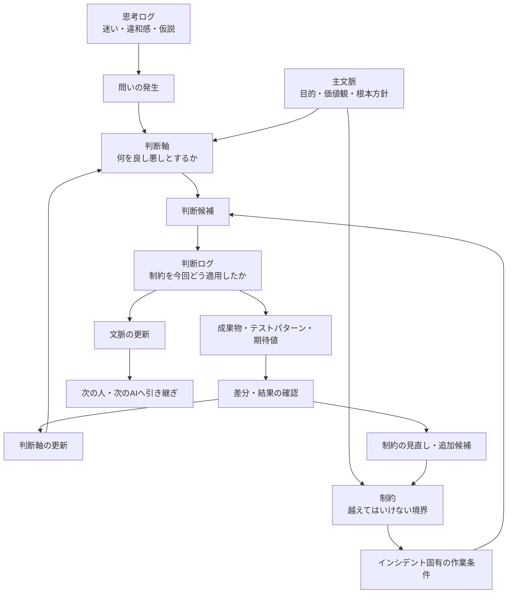

# 文脈というブラックホールに、判断ログを投げ込むな

AI協働をしていると、何でも「文脈」と呼びたくなる。

前提も文脈。
会話履歴も文脈。
判断理由も文脈。
迷いも文脈。
差分も文脈。
制約も文脈。

便利である。

便利すぎる。

そして、便利すぎる言葉はだいたい危険である。

ある日、会社のAI推進計画をCopilotに相談していたとき、私はこう聞いた。

> 判断ログって言葉、文脈って言葉に丸めてもええかな？

すると、Copilotに止められた。

まあまあ強めに止められた。

要するにこういうことだ。

> 文脈は大事。
> でも、判断ログまで文脈に丸めるな。

たしかに正しい。

「文脈」という言葉は便利すぎて、何でも飲み込むブラックホールになる。

そしてブラックホールに飲み込まれた情報は、あとから承認にもレビューにも使いにくい。

この記事では、AI協働における「文脈」「主文脈」「判断軸」「制約」「判断ログ」「思考ログ」を整理する。

---

## きっかけ：400Ksを1人月で承認するには？

前提として、私はCopilotにこんな問いを共有していた。

> AIが生成した400Ks規模のシステムを、1人月で承認するには？

普通に考えると、コードを全部読むのは無理である。

では、人間は何を見るべきなのか。

ここで、

> 文脈が大事です

と言うだけでは、ちょっと弱い。

いや、大事なのは分かる。

でも、それでは承認できない。

承認に必要なのは、もう少し分解された情報である。

* 何を前提にしているのか
* 何を判断基準にしているのか
* 何を決めたのか
* なぜそう決めたのか
* 何を捨てたのか
* どのリスクを許容したのか

このあたりを全部まとめて「文脈」と呼ぶと、気持ちはいい。

でも、実務ではぼやける。

だから分ける。

---

## 用語整理

いったん、こう置く。

```text
主文脈 = 憲法
判断軸 = 判例・判断基準
制約 = 越えてはいけない法的境界
判断ログ = 実際の判決記録
思考ログ = 評議・迷い・違和感の記録
文脈 = この話を理解するための土台
```

表にするとこうなる。

| 用語       | 何を残すか             | 一言でいうと     | 主な用途       |
| -------- | ----------------- | ---------- | ---------- |
| **思考ログ** | 迷い・違和感・仮説・会話の揺れ | 考えた道筋 | 後から発見を掘り返す |
| **判断ログ** | 決めたこと・理由・捨てた案・リスク | なぜそう決めたか | 承認・説明・レビュー |
| **文脈** | 前提・目的・価値観・用語・継続方針 | この話を理解する土台 | AIや人への引き継ぎ |
| **主文脈** | 根本目的・価値観・守るべき方向性 | 憲法 | 判断全体の方向を守る |
| **判断軸** | 良し悪しを判断する基準 | 判例・判断基準 | 複数案を評価する |
| **制約** | 禁止事項・必須条件・変更不能な境界 | 越えてはいけない線 | 判断と実装の暴走を防ぐ |

さらに短く言うと、こう。

```text
思考ログ = ぐちゃぐちゃでよい
判断ログ = 決定の証跡
文脈     = 次回以降の前提
判断軸   = 判断に使うものさし
制約     = 判断しても越えてはいけない境界
主文脈   = ものさしと境界を支える土台
```

---

## 関係図

全体の流れはこうである。



ポイントは、判断ログがゴールではないことだ。

制約は、複数の作業を横断して守る上位の境界である。
判断ログは、その制約を特定のインシデントや作業条件へ適用した記録になる。

```text
制約
＋ その時点の作業条件
＋ 今回の解釈
＝ 判断ログ
```

判断ログから成果物やテストパターンが生まれ、その結果を確認することで、判断軸や制約もまた見直される。

つまり、AI協働で本当に回したいのは、

> 判断軸と制約の育成ループ

である。

---

## 思考ログとは何か

思考ログとは、考えている途中の記録である。

まだ結論になっていないものを残す場所。

たとえば、こういうもの。

```text
KPIを大切にされる方々と話すともやる。
でも、なぜもやるのか？
KPIを大切にされる方々は、AI協働を成果測定の話として見ている。
自分は文化・思考環境・差分蓄積の話として見ている。
ここに大きな時間軸のズレがある気がする。
```

これは判断ではない。

でも、めちゃくちゃ大事である。

なぜなら、ここに違和感の火種があるからだ。

思考ログは、きれいにしすぎると死ぬ。

```text
なんか違う
腹立つ
でもたぶんここが本質
Copilotに怒られた
```

こういう温度が残っていていい。

むしろ、その熱量があとで効く。

---

## 判断ログとは何か

判断ログとは、分岐点で何を選んだかの記録である。

たとえば、こういうもの。

```text
判断:
AI協働推進の説明では、「文脈」という言葉だけで押し切らない。

理由:
文脈という言葉が広すぎて、KPIを大切にされる方々には測定不能に見えるため。

採用する言い分け:
- 思考ログ
- 判断ログ
- 文脈
- 判断軸

捨てた案:
全部まとめて「文脈ログ」と呼ぶ案。

リスク:
言葉が増えすぎると初見の人に重く見える。

次アクション:
説明では、まず「判断ログ」から入る。
```

これが判断ログである。

ただし、判断ログをさらに強くするなら、今回の判断の起因となった制約も紐づけておきたい。

```text
適用した制約ID:
constraint_019

今回の作業条件:
既存ファイル名を維持したまま、新しい機能を追加する。

今回の判断:
既存ファイルは改名せず、新規ファイルの追加で対応する。

制約の解釈:
既存参照を壊さないことを優先し、命名統一は表示名側で行う。
```

こうしておけば、あとから見たときに、

> なぜ今回はこの判断になったのか

を、担当者の好みではなく、制約と作業条件の組み合わせとして追跡できる。

判断ログには、

* 何を決めたか
* なぜ決めたか
* どの制約を適用したか
* その制約を今回どう解釈したか
* 何を捨てたか
* どのリスクを許容したか
* 次に何を見るべきか

が残る。

これは単なる議事録ではない。

制約を現実の作業へ着地させた、承認のための証跡である。

---

## 文脈とは何か

文脈とは、次の会話や作業を成立させるための土台である。

ただし、ここが重要である。

文脈は、思考ログや判断ログを全部入れる箱ではない。

むしろ、思考ログや判断ログの蓄積から抽出された、

* この話は何を目的にしているのか
* 何を大事にしているのか
* どの言葉をどういう意味で使うのか
* 何を避けたいのか
* どんな成果物を作りたいのか
* 次回以降、何を前提にすればよいのか

をまとめたものである。

つまり文脈は、

```text
ログそのものではなく、
ログから育った前提セット
```

である。

文脈は大事。

でも、文脈はゴミ箱ではない。

ここを間違えると、あとで全部が「なんとなく大事な話」になる。

そして「なんとなく大事な話」は、だいたい承認に使えない。

---

## 判断軸とは何か

判断軸とは、何を良し悪しとして判断するかの基準である。

AI駆動開発なら、たとえばこういうものが判断軸になる。

* 差分が追えること
* 再現できること
* 制約が明文化されていること
* AIに渡しやすいこと
* 人間が承認できる粒度に圧縮されていること
* 説明責任を果たせること

判断軸は、主文脈から生まれる。

そして、判断ログによって更新される。

最初は、

```text
AI協働では効率化を重視する
```

だった判断軸が、実際に進めるうちに、

```text
効率化だけで見ると、文脈が残る価値や再現性が見えない
```

と分かることがある。

すると判断軸が変わる。

```text
AI協働では、短期的な効率だけでなく、
文脈化率・差分化率・再現率も重視する
```

こうして判断軸が育つ。

---

## 制約とは何か

制約とは、判断や実装が越えてはいけない境界である。

たとえば、AI駆動開発なら次のようなものが制約になる。

* 既存のファイル名を変更しない
* Git diffで追えない変更をしない
* 承認なしに本番へ反映しない
* テストで確認できない仕様を「完了」と扱わない
* 個人情報を外部AIへ渡さない

判断軸と制約は似ているが、役割が違う。

```text
判断軸 = 複数案の中から、より良い案を選ぶためのものさし
制約   = どれほど魅力的でも、採用してはいけない案を落とす境界
```

たとえば、

```text
判断軸:
AIに渡しやすい構造を優先する。

制約:
既存の参照関係を壊すファイル名変更は禁止する。
```

という形で共存する。

判断軸は、状況に応じて重みが変わる。

一方、制約は原則として守らなければならない。

もちろん、制約そのものが古くなることはある。

ただし、その場合も黙って破るのではなく、

```text
なぜこの制約を変えるのか
どのリスクを新たに受け入れるのか
代わりに何を守るのか
```

を判断ログとして残す必要がある。

つまり制約は、思考停止のルールではない。

> 自由に考えるために、先に固定しておく境界

である。

---


## 制約と判断ログはどうつながるのか

現時点では、私は制約と判断ログを次の関係で捉えている。

```text
制約 ＞ 判断ログ
```

制約は、複数のインシデントや成果物を横断して守る上位の境界である。
判断ログは、その制約を、その時点の作業条件へ適用した記録である。

```text
制約:
既存のファイル名を変更しない。

インシデント固有の作業条件:
命名揺れを整理しながら、新機能を追加したい。

判断ログ:
既存ファイルは改名しない。
新規ファイルだけ命名規則へ合わせ、既存名称は表示名で補う。
```

同じ制約でも、作業条件が違えば判断は変わる。
だから判断ログには、制約IDだけでなく、今回の解釈も残したほうがよい。

```json
{
  "decision_log_id": "decision_20260710_001",
  "constraint_relations": [
    {
      "constraint_id": "constraint_019",
      "relation_type": "applied",
      "interpretation": "既存参照を壊さないため、既存ファイル名は維持する"
    }
  ]
}
```

この構造があると、判断ログは単なる結論ではなくなる。

> 制約を、現場で実際に適用した実績

になる。

さらに、判断ログが繰り返し発生したなら、それは新しい制約候補かもしれない。

```text
既存制約
↓ 適用
判断ログ
↓ 結果確認
繰り返される共通判断
↓ 一般化
新しい制約、または既存制約の改訂
```

制約は最初から完成した法律集ではない。
判断ログと結果によって育て続ける必要がある。

---

## なぜ判断ログを文脈に丸めてはいけないのか

判断ログを文脈に丸めると、一見すっきりする。

言葉が減る。

説明しやすくなる。

でも、その代わりに大事なものが消える。

それは、

> 誰が、どの判断軸で、何を選び、何を捨てたのか

である。

たとえば、

```text
今回はB案を採用した。
```

だけでは弱い。

```text
今回はB案を採用した。
理由は、A案よりもGit diffで追いやすく、AI差分物語に変換しやすいため。
A案はUIとしては自然だが、判断理由が画面側に閉じてしまい、後からAIに渡しにくい。
リスクは、初見ユーザにはB案が少し硬く見えること。
```

ここまで残って、ようやく判断ログになる。

これは文脈ではない。

これは承認のための記録である。

ここを文脈に丸めると、あとでこうなる。

> なんか当時、そういう流れだったんですよね。

出た。

日本企業名物、ふんわり判断である。

ふんわり判断は、AIに渡せない。

---

## AIに渡すときの使い分け

AIに渡すときは、それぞれ目的が違う。

### 思考ログを渡す

目的は、違和感の回収である。

```text
この思考ログを読んで、
まだ言語化できていない違和感、
判断が分岐している場所、
次に整理すべき問いを抽出してください。
```

### 判断ログを渡す

目的は、レビューと承認である。

```text
この判断ログを読んで、
判断理由が弱いところ、
捨てた案の中に再検討すべきもの、
リスクとして残るものを指摘してください。
```

### 文脈を渡す

目的は、引き継ぎと継続である。

```text
以下の文脈を前提として、
今回の相談を続きの研究として扱ってください。
```

### 判断軸を渡す

目的は、評価基準の共有である。

```text
以下の判断軸に基づいて、
今回の案を評価してください。
判断軸そのものに古さや不足があれば、それも指摘してください。
```

### 制約を渡す

目的は、AIの提案や実装が越えてはいけない境界を共有することである。

```text
以下の制約を必ず守ってください。
制約と依頼内容が衝突する場合は、
制約を破って進めず、衝突箇所と代替案を示してください。
```

AIにとって制約は、単なる注意書きではない。

出力候補を絞り込み、判断可能な範囲を定める入力である。

さらに判断ログと制約をセットで渡すと、AIは、

```text
何を守るべきか
なぜその制約があるのか
過去にどの状況でどう適用されたのか
今回どこまで同じ判断を再利用できるのか
```

まで考えられる。

その結果、AIが生成できるのはコードだけではない。

* テストパターンと期待値
* 設計書や方針書
* 承認資料
* インシデント記録
* ブログや説明文

といった重要な成果物にも効く。

```text
文脈      = 何のために作るか
制約      = 何を守るか
判断ログ  = なぜ今回はそうしたか
```

この三点がそろうと、AIは一般論ではなく、その活動に固有の成果物を作りやすくなる。

---

## 400Ksを1人月で承認するなら

最初の問いに戻る。

> AIが生成した400Ks規模のシステムを、1人月で承認するには？

この問いに対して、

```text
コードを全部読む
```

はたぶん無理である。

必要なのは、コードを読むことではなく、

> 承認判断できる情報構造へ変換すること

である。

その情報構造には、少なくとも以下が必要になる。

```text
主文脈:
このシステムは何を守るべきか。

判断軸:
何をもってOKとするか。

判断ログ:
今回どの判断をしたか。
何を採用し、何を捨てたか。

差分:
前回から何が変わったか。

制約:
絶対に破ってはいけない条件は何か。

再現性:
その判断をテストやログで再確認できるか。

関係:
制約、判断ログ、成果物、テスト、結果がつながっているか。
```

人間がレビューする対象は、コードそのものから、

> 判断可能な文脈構造

へ移っていく。

たぶん、AI時代に人間が最後に担うべき仕事はここである。

AIがコードを書く。

AIがテストを書く。

AIが差分を説明する。

それでも人間は、

> その判断軸で、本当に良いのか？

を見なければならない。

そして将来的には、成果物だけを単体で承認するのではなく、

```text
制約
→ 判断ログ
→ 成果物
→ テストパターン
→ 結果
```

という関係が切れていないかを承認する必要が出てくる。
ここでは、その考え方を仮に「リレーション承認」と呼んでおく。

ただし、これは別の記事で掘ったほうがよい話なので、今回は入口だけにしておく。

---

## 最終定義

この記事での定義をまとめる。


### 思考ログとは、
違和感・仮説・迷い・会話の揺れを残す記録である。
目的は、後から思考を再起動すること。

### 判断ログとは、
選択・理由・適用した制約・今回の解釈・捨てた案・リスク・次アクションを残す記録である。
目的は、制約を特定の作業条件へどう適用したかを説明可能・再利用可能にすること。

### 文脈とは、
思考ログと判断ログの蓄積から抽出された、
次の対話や作業を成立させる前提である。
目的は、人間やAIが説明なしに続きから考えられる状態を作ること。

> 文脈 ： 前提・目的・背景・価値観・用語・継続方針・ゴール 


### 主文脈とは、
その活動の根本目的・価値観・守るべき方向性である。
目的は、判断軸の根拠を安定させること。


### 制約とは、
判断・提案・実装が越えてはいけない禁止事項や必須条件である。
目的は、AIと人間の自由度を安全な範囲に限定し、守るべき境界を明示すること。
ただし固定された完成品ではなく、判断ログと結果から継続的に育てる対象でもある。

> 「これ以上は無理」の壁

### 判断軸とは、
何を良し悪しとして判断するかの基準である。
目的は、複数案を評価可能にし、判断の再利用性を高めること。

> 「壁の内側で、どれが一番マシか」のものさし
>  これこれこういうものを優先する！！・・・みたいなぁ


### 制約と判断軸使い方

> 違和感が出た時、まず制約違反か判断軸のズレかを切り分ける
> 判断軸のズレなら、判断軸自体を更新するチャンスでもある


---

## おわりに

文脈は大事である。

でも、文脈という言葉で全部を丸めてはいけない。

文脈に丸めると、思考の途中経過も、判断の証跡も、判断基準も、全部ぼやける。

AI協働で必要なのは、文脈を増やすことだけではない。

文脈を育てるために、

* 思考ログを残す
* 判断ログに、適用した制約と今回の解釈を残す
* 判断軸を更新する
* 判断ログと結果から、制約を追加・分割・統合・廃止する
* 主文脈とのズレを見る
* 次回以降の文脈へ反映する

このループを回すことだ。

AIに何を頼むかではなく、

> AIと人間が、何を判断できる状態にするか

である。

そのために、文脈をブラックホールにしない。

文脈は土台。
主文脈は憲法。
判断軸はものさし。
制約は越えてはいけない柵。
判断ログは、その柵を現場でどう使ったかの証跡。
思考ログは鉱脈。

この分け方を、しばらく使ってみたい。


---


追伸：会社のCopilotくんに怒られたので、家のCHATGPTくんに教えてもらいながら、整理してもらった記事です。


---


[AI駆動開発研究日誌 や 思考拡張・AI駆動開発の記事はこちら](https://zenn.dev/frb_tamasub)

この思考拡張・AI駆動開発の実例として、私はFRB（Fishing Rod Benchmark）という個人研究を続けている。
釣り竿の感度を振動として比較・可視化しようとする、一見おかしな研究だが、そこで起きているのは「差分」「再現性」「制約」を使ったAI協働そのものである。
  
- [FRB（Fishing Rod Benchmark）釣り竿の「感度」を数値化する話 宣言](https://qiita.com/tamasub/items/2b6649748e1772b7eec1)
  


