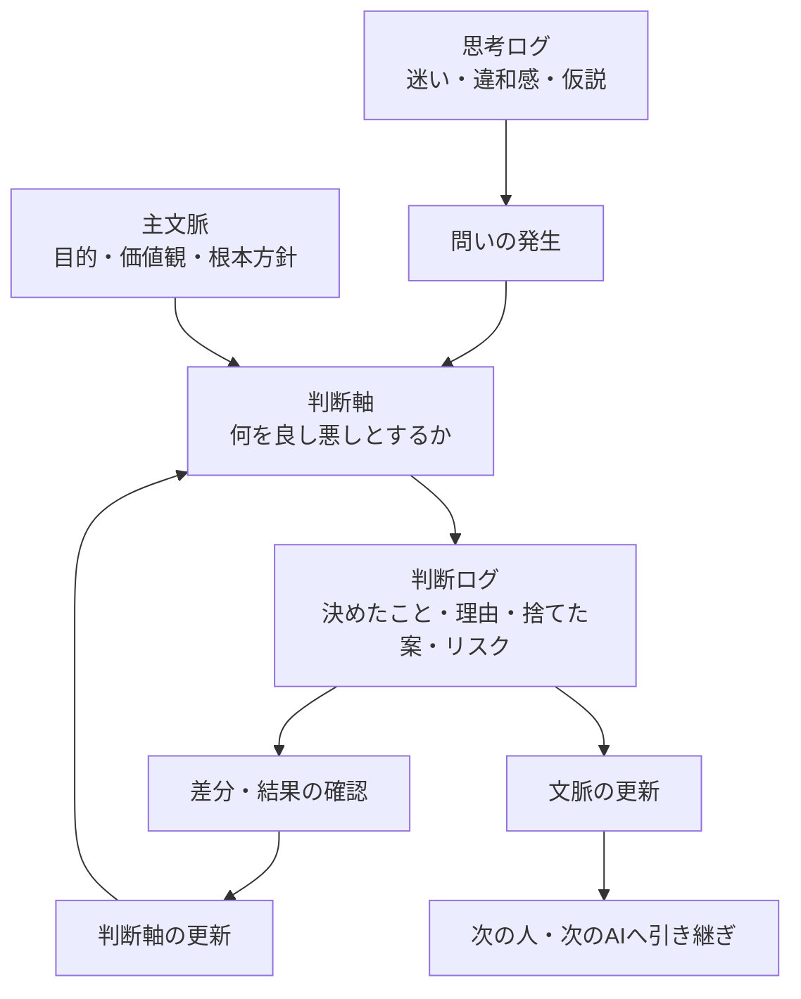

# 文脈というブラックホールに、判断ログを投げ込むな

AI協働をしていると、何でも「文脈」と呼びたくなる。

前提も文脈。
会話履歴も文脈。
判断理由も文脈。
迷いも文脈。
差分も文脈。

便利である。

便利すぎる。

そして、便利すぎる言葉はだいたい危険である。

ある日、会社のAI推進計画をCopilotに相談していたとき、私はこう聞いた。

> 判断ログって言葉、文脈って言葉に丸めてもええかな？

すると、Copilotに止められた。

まあまあ強めに止められた。

要するにこういうことだ。

> 文脈は大事。
> でも、判断ログまで文脈に丸めるな。

たしかに正しい。

「文脈」という言葉は便利すぎて、何でも飲み込むブラックホールになる。

そしてブラックホールに飲み込まれた情報は、あとから承認にもレビューにも使いにくい。

この記事では、AI協働における「文脈」「判断軸」「判断ログ」「思考ログ」を整理する。

---

## きっかけ：400Ksを1人月で承認するには？

前提として、私はCopilotにこんな問いを投げていた。

> AIが生成した400Ks規模のシステムを、1人月で承認するには？

普通に考えると、コードを全部読むのは無理である。

では、人間は何を見るべきなのか。

ここで、

> 文脈が大事です

と言うだけでは、ちょっと弱い。

いや、大事なのは分かる。

でも、それでは承認できない。

承認に必要なのは、もう少し分解された情報である。

* 何を前提にしているのか
* 何を判断基準にしているのか
* 何を決めたのか
* なぜそう決めたのか
* 何を捨てたのか
* どのリスクを許容したのか

このあたりを全部まとめて「文脈」と呼ぶと、気持ちはいい。

でも、実務ではぼやける。

だから分ける。

---

## 用語整理

いったん、こう置く。

```text
主文脈 = 憲法
判断軸 = 判例・判断基準
判断ログ = 実際の判決記録
思考ログ = 評議・迷い・違和感の記録
文脈 = この話を理解するための土台
```

表にするとこうなる。

| 用語       | 何を残すか             | 一言でいうと     | 主な用途       |
| -------- | ----------------- | ---------- | ---------- |
| **思考ログ** | 迷い・違和感・仮説・会話の揺れ   | 考えた道筋      | 後から発見を掘り返す |
| **判断ログ** | 決めたこと・理由・捨てた案・リスク | なぜそう決めたか   | 承認・説明・レビュー |
| **文脈**   | 前提・目的・価値観・用語・継続方針 | この話を理解する土台 | AIや人への引き継ぎ |
| **主文脈**  | 根本目的・価値観・守るべき方向性  | 憲法         | 判断全体の方向を守る |
| **判断軸**  | 良し悪しを判断する基準       | 判例・判断基準    | 判断ログを評価する  |

さらに短く言うと、こう。

```text
思考ログ = ぐちゃぐちゃでよい
判断ログ = 決定の証跡
文脈     = 次回以降の前提
判断軸   = 判断に使うものさし
主文脈   = そのものさしを支える土台
```

---

## 関係図

全体の流れはこうである。



ポイントは、判断ログがゴールではないことだ。

判断ログは、次の判断軸を育てる材料になる。

そして判断軸が育つと、文脈も育つ。

つまり、AI協働で本当に回したいのは、

> 判断軸更新ループ

である。

---

## 思考ログとは何か

思考ログとは、考えている途中の記録である。

まだ結論になっていないものを残す場所。

たとえば、こういうもの。

```text
KPIを大切にされる方々と話すともやる。
でも、なぜもやるのか？
KPIを大切にされる方々は、AI協働を成果測定の話として見ている。
自分は文化・思考環境・差分蓄積の話として見ている。
ここに大きな時間軸のズレがある気がする。
```

これは判断ではない。

でも、めちゃくちゃ大事である。

なぜなら、ここに違和感の火種があるからだ。

思考ログは、きれいにしすぎると死ぬ。

```text
なんか違う
腹立つ
でもたぶんここが本質
Copilotに怒られた
```

こういう温度が残っていていい。

むしろ、その熱量があとで効く。

---

## 判断ログとは何か

判断ログとは、分岐点で何を選んだかの記録である。

たとえば、こういうもの。

```text
判断:
AI協働推進の説明では、「文脈」という言葉だけで押し切らない。

理由:
文脈という言葉が広すぎて、KPIを大切にされる方々には測定不能に見えるため。

採用する言い分け:
- 思考ログ
- 判断ログ
- 文脈
- 判断軸

捨てた案:
全部まとめて「文脈ログ」と呼ぶ案。

リスク:
言葉が増えすぎると初見の人に重く見える。

次アクション:
説明では、まず「判断ログ」から入る。
```

これが判断ログである。

判断ログには、

* 何を決めたか
* なぜ決めたか
* 何を捨てたか
* どのリスクを許容したか
* 次に何を見るべきか

が残る。

これは単なる議事録ではない。

承認のための証跡である。

---

## 文脈とは何か

文脈とは、次の会話や作業を成立させるための土台である。

ただし、ここが重要である。

文脈は、思考ログや判断ログを全部入れる箱ではない。

むしろ、思考ログや判断ログの蓄積から抽出された、

* この話は何を目的にしているのか
* 何を大事にしているのか
* どの言葉をどういう意味で使うのか
* 何を避けたいのか
* どんな成果物を作りたいのか
* 次回以降、何を前提にすればよいのか

をまとめたものである。

つまり文脈は、

```text
ログそのものではなく、
ログから育った前提セット
```

である。

文脈は大事。

でも、文脈はゴミ箱ではない。

ここを間違えると、あとで全部が「なんとなく大事な話」になる。

そして「なんとなく大事な話」は、だいたい承認に使えない。

---

## 判断軸とは何か

判断軸とは、何を良し悪しとして判断するかの基準である。

AI駆動開発なら、たとえばこういうものが判断軸になる。

* 差分が追えること
* 再現できること
* 制約が明文化されていること
* AIに渡しやすいこと
* 人間が承認できる粒度に圧縮されていること
* 説明責任を果たせること

判断軸は、主文脈から生まれる。

そして、判断ログによって更新される。

最初は、

```text
AI協働では効率化を重視する
```

だった判断軸が、実際に進めるうちに、

```text
効率化だけで見ると、文脈が残る価値や再現性が見えない
```

と分かることがある。

すると判断軸が変わる。

```text
AI協働では、短期的な効率だけでなく、
文脈化率・差分化率・再現率も重視する
```

こうして判断軸が育つ。

---

## なぜ判断ログを文脈に丸めてはいけないのか

判断ログを文脈に丸めると、一見すっきりする。

言葉が減る。

説明しやすくなる。

でも、その代わりに大事なものが消える。

それは、

> 誰が、どの判断軸で、何を選び、何を捨てたのか

である。

たとえば、

```text
今回はB案を採用した。
```

だけでは弱い。

```text
今回はB案を採用した。
理由は、A案よりもGit diffで追いやすく、AI差分物語に変換しやすいため。
A案はUIとしては自然だが、判断理由が画面側に閉じてしまい、後からAIに渡しにくい。
リスクは、初見ユーザにはB案が少し硬く見えること。
```

ここまで残って、ようやく判断ログになる。

これは文脈ではない。

これは承認のための記録である。

ここを文脈に丸めると、あとでこうなる。

> なんか当時、そういう流れだったんですよね。

出た。

日本企業名物、ふんわり判断である。

ふんわり判断は、AIに渡せない。

---

## AIに渡すときの使い分け

AIに渡すときは、それぞれ目的が違う。

### 思考ログを渡す

目的は、違和感の回収である。

```text
この思考ログを読んで、
まだ言語化できていない違和感、
判断が分岐している場所、
次に整理すべき問いを抽出してください。
```

### 判断ログを渡す

目的は、レビューと承認である。

```text
この判断ログを読んで、
判断理由が弱いところ、
捨てた案の中に再検討すべきもの、
リスクとして残るものを指摘してください。
```

### 文脈を渡す

目的は、引き継ぎと継続である。

```text
以下の文脈を前提として、
今回の相談を続きの研究として扱ってください。
```

### 判断軸を渡す

目的は、評価基準の共有である。

```text
以下の判断軸に基づいて、
今回の案を評価してください。
判断軸そのものに古さや不足があれば、それも指摘してください。
```

---

## 400Ksを1人月で承認するなら

最初の問いに戻る。

> AIが生成した400Ks規模のシステムを、1人月で承認するには？

この問いに対して、

```text
コードを全部読む
```

はたぶん無理である。

必要なのは、コードを読むことではなく、

> 承認判断できる情報構造へ変換すること

である。

その情報構造には、少なくとも以下が必要になる。

```text
主文脈:
このシステムは何を守るべきか。

判断軸:
何をもってOKとするか。

判断ログ:
今回どの判断をしたか。
何を採用し、何を捨てたか。

差分:
前回から何が変わったか。

制約:
絶対に破ってはいけない条件は何か。

再現性:
その判断をテストやログで再確認できるか。
```

人間がレビューする対象は、コードそのものから、

> 判断可能な文脈構造

へ移っていく。

たぶん、AI時代に人間が最後に担うべき仕事はここである。

AIがコードを書く。

AIがテストを書く。

AIが差分を説明する。

それでも人間は、

> その判断軸で、本当に良いのか？

を見なければならない。

---

## 最終定義

この記事での定義をまとめる。

```text
思考ログとは、
違和感・仮説・迷い・会話の揺れを残す記録である。
目的は、後から思考を再起動すること。

判断ログとは、
選択・理由・捨てた案・リスク・次アクションを残す記録である。
目的は、判断を説明可能・再利用可能にすること。

文脈とは、
思考ログと判断ログの蓄積から抽出された、
次の対話や作業を成立させる前提である。
目的は、人間やAIが説明なしに続きから考えられる状態を作ること。

主文脈とは、
その活動の根本目的・価値観・守るべき方向性である。
目的は、判断軸の根拠を安定させること。

判断軸とは、
何を良し悪しとして判断するかの基準である。
目的は、判断ログを評価可能にし、判断の再利用性を高めること。
```

---

## おわりに

文脈は大事である。

でも、文脈という言葉で全部を丸めてはいけない。

文脈に丸めると、思考の途中経過も、判断の証跡も、判断基準も、全部ぼやける。

AI協働で必要なのは、文脈を増やすことだけではない。

文脈を育てるために、

* 思考ログを残す
* 判断ログを残す
* 判断軸を更新する
* 主文脈とのズレを見る
* 次回以降の文脈へ反映する

このループを回すことだ。

AIに何を頼むかではなく、

> AIと人間が、何を判断できる状態にするか

である。

そのために、文脈をブラックホールにしない。

文脈は土台。
判断軸はものさし。
判断ログは証跡。
思考ログは鉱脈。

この分け方を、しばらく使ってみたい。


---

追伸：会社のCoilotくんに怒られたので、家のCHATGPTくんに教えてもらいながら、整理してらった記事です。


</br>
</br>
</br>


---


[AI駆動開発研究日誌 や 思考拡張・AI駆動開発の記事はこちら](https://zenn.dev/frb_tamasub)

この思考拡張・AI駆動開発の実例として、私はFRB（Fishing Rod Benchmark）という個人研究を続けている。
釣り竿の感度を振動として比較・可視化しようとする、一見おかしな研究だが、そこで起きているのは「差分」「再現性」「制約」を使ったAI協働そのものである。
  
- [FRB（Fishing Rod Benchmark）釣り竿の「感度」を数値化する話 宣言](https://qiita.com/tamasub/items/2b6649748e1772b7eec1)
  


