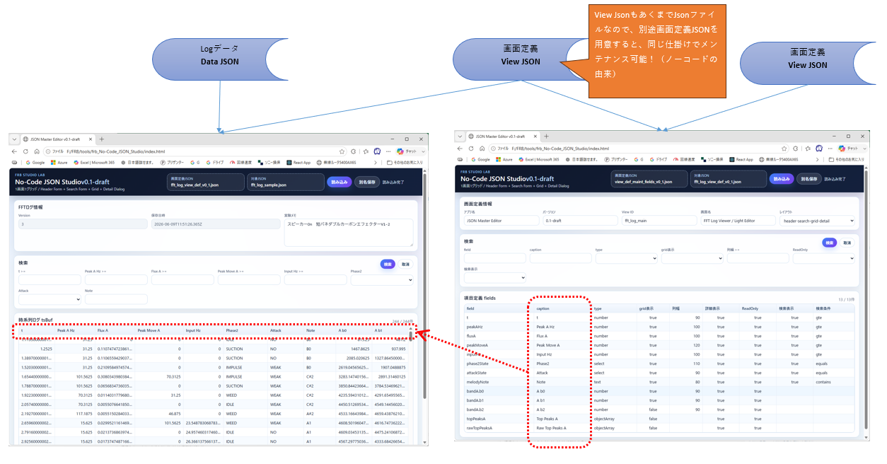

# はじめに

私は最近、FFTログを管理するための JSON Editor を作り始めた。

目的は単純だった。

> FFTログを見やすく管理したい。

ただ、それだけである。

しかし、ChatGPTと会話しながら画面を作っていくうちに、思いもよらない場所へ辿り着いた。

今回は、その話を書いてみたい。

# AI協働の中心にあるもの

私は最近、

* Markdown
* JSON
* Git

を非常に重要視している。

理由は単純である。

AIと協働するためには、

> Data と View を分離する

ことが極めて重要だからだ。

Markdownは文書の Data である。

JSONは構造化データの Data である。

そして View は後からいくらでも生成できる。

# JSON Editorを作ろうとしていた

今回作ろうとしていたのは、

FFTログを閲覧するためのJSON Editorだった。

最初は単純な話だった。

```text
JSON
↓
表示
↓
編集
↓
保存
```

しかし会話を続けるうちに、少しずつ違和感が生まれた。

例えば、

```text
Array
↓
Grid

Object
↓
Form
```

という整理である。

さらに、

```text
Child Array
↓
Child Grid
```

という考え方も生まれた。

すると突然、

昔作ったノーコードシステムの記憶が蘇った。

# Viewをデータ化した

私は昔、

テーブル定義から画面を自動生成する仕組みを作っていた。

土日を使いながら、1年ほどかけて作った。

今回やっていたことは、それと本質的に同じだった。

違うのは、

```text
昔
↓
DBテーブル

今
↓
JSON
```

である。

そして気付いた。

今回作っていたのは JSON Editor ではなく、

> Viewをデータ化する仕組み

だったのである。

```json
{
  "field": "inputHz",
  "caption": "Input Hz",
  "width": 120,
  "search": true
}
```

画面がコードではなくデータになった。

# No-Code JSON Studio

ここで見えてきたのが、

私が昔から抱えていた違和感だった。

私は長年、

> なぜみんなノーコードへ行こうとしないのだろう

と思っていた。

しかし今回気付いた。

私が好きだったのはノーコードではなかった。

本当にやりたかったのは、

> Viewのデータ化

だったのである。

そしてJSONを使えば、

システムを作らなくても管理画面を作れる。

私はこれを勝手に

> No-Code JSON Studio

と呼ぶことにした。

# さらに面白いことが起きた

しかし今回の話はここで終わらなかった。

JSON化されたデータは、

Gitで管理できる。

つまり、

```bash
git diff
```

だけで差分が見える。

ここで私はあることに気付いた。

今まで、

* Excel差分
* CSV差分
* DB差分

は別々の世界だった。

しかしJSONに統一すると、

全部同じになる。

```text
JSON
↓
Git Diff
↓
AI
```

で扱える。

つまり、

> データフォーマットという概念を超えて差分を扱える

ようになるのである。

# 横道こそが、思考拡張

面白いのは、

私は最初からこんなことを考えていなかったことである。

単にJSON Editorを作ろうとしていただけだった。

しかし会話を続けるうちに、

* ノーコード
* GitDiff
* 差分文化
* AI協働

が勝手に繋がり始めた。

そこでChatGPTとの会話の中で、こんな言葉が生まれた。

> 横道こそが、思考拡張

必要に迫られている時、人は最短経路を探す。

しかし脳に余力がある時、人は横道を歩く。

そして思考拡張は、その横道で起きる。

# おわりに

今回のJSON Editorは、必要だったから作ったわけではない。

以前から必要性は分かっていた。

ただ、

> 今やったら楽しそう

と思ったから作った。

今振り返ると、それが重要だった気がする。

脳に余力があったからこそ、

JSON Editorから、

No-Code JSON Studioへ。

さらに、

データフォーマットという概念を超えた差分文化へ。

そして思考拡張へ。

繋がることができたのだと思う。

少なくとも私にとっては、

2026年6月13日は、

> Viewをデータ化した日

であり、

> データフォーマットを超えて差分を眺められる世界が見えた日

だった。




----

■関連記事

- [思考拡張の5つのレベル——AIと共に、発見し続ける人になるために](https://zenn.dev/frb_tamasub/articles/e45f0039aaa7b1)
- [思考拡張の大前提——「AIとの対話は、人間との対話と同じである」](https://zenn.dev/frb_tamasub/articles/fab815f72f9968)
- [思考拡張の設計理論（Draft）——違和感・体験・制約の三つの軸](https://zenn.dev/frb_tamasub/articles/196760f899a922)
- [思考拡張は、設計できる。 ～AIと話していたら、脳の使い方が変わってきた話～](https://zenn.dev/frb_tamasub/articles/aa2c08d08bafa9)
- [思考拡張の実践理論（Draft） ～AIと話していたら、脳の使い方が変わってきた話～](https://zenn.dev/frb_tamasub/articles/8893402839db17)
- [私が考えるAI駆動開発とは——差分・再現性・制約の三つの文化(Draft版)](https://zenn.dev/frb_tamasub/articles/6c075a9d23b247)
- [思考拡張・ＡＩ駆動開発の免罪符戦術～一度戦闘機に乗ったものは竹槍に戻れない！！～](https://zenn.dev/frb_tamasub/articles/35a14399295c8c)
- [思考拡張派生理論：設計未提示駆動開発〜設計を渡すな、違和感を渡せ〜](https://zenn.dev/frb_tamasub/articles/8d12318725309e)
- [思考拡張派生理論：AIにレビューさせるのではなく、AIの仮説で人間の思考を再起動する](https://zenn.dev/frb_tamasub/articles/744060659c21f0)
- [思考拡張したければ、まず文脈を育てる —— 「AI差分物語」という小さな実験](https://zenn.dev/frb_tamasub/articles/17da326e608795)
- [最大構成からミニマム構成へ——思考は、削ったときに立ち上がる](https://zenn.dev/frb_tamasub/articles/3654a9bbcca652)
- [AI協働とは、優秀だけど忘れっぽいチームメンバーと働くことである](https://zenn.dev/frb_tamasub/articles/84d81cb2c735f2)
  
- [ChatGPTに「次これ」と言われ続けた90日間 〜気が付いたらQiitaとZennで100本を超えていた〜](https://zenn.dev/articles/8023bd6f3ef039/edit)
- [私が考えるAI駆動開発とは——レビュー差分でAIとの信頼を観測する](https://zenn.dev/frb_tamasub/articles/ai-driven-development-trust-by-review-diff)
- [私が考えるAI駆動開発とは — AIテスト物語があるなら設計書は必要ですか？](https://zenn.dev/frb_tamasub/articles/ai-driven-development-ai-test-story)
  


この思考拡張の実例として、私はFRB（Fishing Rod Benchmark）という個人研究を続けている。
釣り竿の感度を振動として比較・可視化しようとする、一見おかしな研究だが、そこで起きているのは「差分」「再現性」「制約」を使ったAI協働そのものである。
  
- [FRB（Fishing Rod Benchmark）釣り竿の「感度」を数値化する話 宣言](https://qiita.com/tamasub/items/2b6649748e1772b7eec1)
  
- 

---