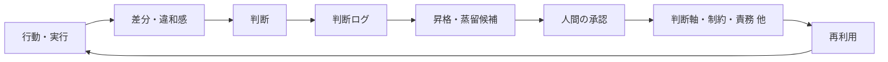
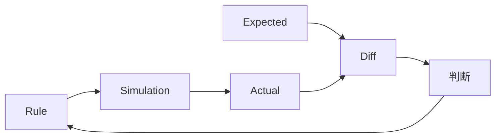

# 私が考えるAI協働の中核理論 —— 判断を未来へ渡すループ

**「……あれ？ 俺が考えてきたAI協働って、自己組織化なんじゃない？」**

今日、そんなことを思った。

ただし、この記事は「自己組織化とは何か」を解説する記事ではない。

そもそも私は、知能や自己組織化を専門的に研究しているわけでもない。

この記事で整理したいのは、もっと実務寄りの話だ。

> **AIと人間の間で生まれた判断を、どうやって未来へ渡していくか。**

そして、そのために今まで考えてきたことを並べ直してみたら、

> **もしかすると、このルールそのものをシミュレーションして検証できるのではないか？**

という、少し面白い出口が見えてきた。

本稿では便宜上これを「AI協働の中核理論」と呼ぶ。

もちろん、確立された学術理論という意味ではない。

FRB、思考拡張、AI駆動開発、AI承認駆動開発、そして日々の実務から少しずつ形成されてきた、現時点の個人仮説である。

---

# 始まりは「知能とは？」という雑談だった

あるAI研究者が、

**「知能とは何か？」**

という、とんでもなく大きな問いを持っているという話を聞いた。

私は知能そのものを深く研究したいわけではない。

ただ、

「ずいぶん高いところに問いを置くなぁ」

とは思った。

私が考えている「思考拡張設計理論」には、

> **パターン6：高目標設置型**

という考え方がある。

簡単にいえば、自分の現在地からは少し遠すぎる目標や問いをあえて置くことで、それまで見ていなかった探索領域へ思考を広げる、というものだ。

だったら。

**聞くのはタダである。**

私はGPTに、こう聞いた。

> 雑談。知能とは何？って質問したらわかりやすく答えられる？笑  
> 脳神経細胞　自己組織化を絡めて教えて

ここで重要なのは、

**私はこのとき初めて「自己組織化」という言葉を知ったわけではない。**

自己組織化という言葉には、5〜6年前、アジャイル原則の文脈で出会っていた。

当時は、

**「自己組織化？？？」**

という感じだった。

非常に難解な言葉だった。

その違和感を半年ほど頭の中に残して、その後AIから説明してもらうなどして、なんとなく意味は分かっていた。

だからこそ、「知能とは？」という巨大な問いを聞くときに、

**脳神経細胞の自己組織化を絡めて聞いてみよう**

と思った。

---

# 単純なルールだけで、すごいことが起きるデモを見たかった

GPTに、「知能とは？」を解説してもらった。

自己組織化についても改めて解説してもらった。

自己組織化とは、どうやら、  

> 単純なルールしかないのに、全体みたら凄いことできちゃいましたぁ～

という側面があると理解。

でも、まだ少し難しい。

そこで、私はこんなことを聞いた。

> **たとえば、単純なルールしかないのに、全体みたら凄いことできちゃいましたぁ～ってデモを考えたいんやけど、案ある？笑**

そこで候補として出てきたものの一つが、

**魚の群れ**

だった。


■[自己組織化デモ～魚の群れ～ (魚の群れエリアをクリックすると障害物が表示されます。)](https://tamasub.github.io/FRB/tools/frb_self-organization/emergent_behavior_fish_ants_brain_demo_v2.html)
（アリの道づくり編もあり）


一匹一匹が、群れ全体の完成形を知っているわけではない。

中央に司令塔がいて、

「はい、全員ここへ移動してください」

と指示しているわけでもない。

それぞれが近くの個体を見ながら、いくつかの小さなルールに従う。

すると——

全体として見ると、群れがまるで一つの生き物のように動く。

私は、そのデモを眺めていた。

そして、ふと思った。

> **……あれ？**
>
> **俺が考えてきたAI協働って、自己組織化なんじゃない？**

---

# 私は、AI協働を自己組織化させようとしていたわけではない

ここは重要なので、明確にしておきたい。

私は最初から、

> AI協働を自己組織化させよう

と考えていたわけではない。

むしろ逆である。

今まで数か月かけて考えてきたものが先にあった。

たとえば、

- 小さな判断
- 判断ログ
- 判断軸
- 制約
- 責務
- Expected
- 差分
- 昇格・蒸留
- 再利用
- 人間判断数ミニマム化
- 承認

といった考え方だ。

それらを育てていたところに、

**魚の自己組織化デモ**

という別の視点が入ってきた。

すると、それまで別々に見えていたものが、

一つの構造に見え始めた。

```text
小さな判断
↓
判断を残す
↓
繰り返される判断からルールが育つ
↓
育ったルールが次の行動を変える
↓
新しい差分が生まれる
↓
また判断する
↓
さらにルールが育つ
```

あれ？

これって、

**システム自身が少しずつ自分の振る舞いを形成していく構造**

として見ることもできるのではないか。

私は今日、そう思い始めた。

それが学術的に「自己組織化」と呼べるものなのかは、今は分からない。

そこを断定するつもりもない。

ただ、この言葉を通して見たことで、

**自分が今まで考えていたAI協働の見え方が変わった。**

---

# 私が考えるAI協働は、AIに大量生成させることではない

AI協働という言葉からは、

```text
AIにたくさん作らせる
AIに速く作らせる
AIに高品質な成果物を作らせる
```

という方向を想像しやすい。

もちろん、それもAI活用の大きな価値だと思う。

でも、私が今考えている方向は少し違う。

私はむしろ、

> **AIと一緒に、AIを使わなくても処理できる領域を増やしたい。**

と考えている。

たとえば、一度人間とAIで判断したことがある。

その判断理由を残す。

似た判断が何度も発生する。

そこから共通するルールを取り出す。

ルールとして構造化できれば、次回からはプログラムで処理できるかもしれない。

```text
人間とAIで判断
↓
判断を記録
↓
共通構造を抽出
↓
ルール化
↓
機械処理へ
↓
本当に新しい判断だけ人間へ
```

私はこれを、

> **人間判断数ミニマム化**

と呼んでいる。

人間の判断をなくしたいわけではない。

むしろ逆だ。

> **過去に一度判断済みのことを、何度も人間へ判断させたくない。**

人間には、

**まだ答えのない、本当に新しい判断**

へ集中してほしい。

---

# なぜ「知識」ではなく「判断」なのか

以前、

**知識・判断 分離革命**

という言葉を考えた。

AIが登場するまで、

「知っていること」と「判断できること」は、かなり近い場所にあった。

経験豊富な人は、たくさん知っている。

だから判断もできる。

でもAIによって、この関係が変わり始めている。

AIは大量の知識を扱える。

しかし、実務では最後に、

- 何を優先するのか
- どこまで許容するのか
- 何を守るのか
- どの案を捨てるのか
- 今回だけの例外なのか
- 今後も守るルールなのか

という問題が残る。

つまり、

**判断**

である。

そこで私は、

> AI時代には、知識だけでなく、  
> **「人間が何を、なぜ判断したのか」そのものを資産として扱う必要があるのではないか。**

と考えるようになった。

---

# 小さな判断を、その場で消費しない

判断というと、経営判断のような大きなものを想像するかもしれない。

でも、実際の開発ではもっと小さい。

```text
今回は共通化しない

このUIを採用する

この境界値にする

この例外は許容する

この案は捨てる

このテストを追加する
```

こういう小さな判断が、毎日大量に発生する。

問題は、そのほとんどが、

**作業が終わると消える**

ことである。

半年後に似た問題が出る。

すると、またゼロから考える。

別の人が担当すれば、また別の判断になる。

AIへ聞けば、また新しい回答が返ってくる。

それでは、判断が蓄積されない。

だから、

> **小さな判断を判断ログとして残す。**

これが最初の一歩になる。

なお、判断ログ・判断軸・制約・責務などの細かい分解については、別の記事

**[「文脈というブラックホールに、判断ログを投げ込むな」](https://zenn.dev/frb_tamasub/articles/ai-collaboration-context-decision-log)**

で詳しく扱っている。

ここでは、中核構造だけを見る。

---

# 判断を未来へ渡すループ

私が今考えている中核ループは、かなり単純だ。



重要なのは、

**判断ログを保存して終わりではない**

ことである。

判断ログの中を見ていく。

繰り返し現れる価値判断や、複数の判断に共通する方向性が見えてくれば、

**判断軸**

への昇格候補になるかもしれない。

繰り返し現れる禁止事項や境界があれば、

**制約**

への昇格・更新候補になるかもしれない。

誰が何を保証するべきかが見えてくれば、

**責務**

になるかもしれない。

暗黙の期待を比較可能な形にできれば、

**Expected**

になるかもしれない。

ただし、候補が見つかったからといって、AIがそのまま未来のルールへ昇格させるわけではない。

**未来へ渡す構造として採用するところでは、人間の承認を通す。**

```text
判断ログ
↓
昇格・蒸留候補
↓
人間の承認
↓
判断軸
制約
責務
Expected
その他の再利用可能な構造
```

その構造が、次の判断へ使われる。

そして次の現場から、また新しい判断が生まれる。

だからこれは、

**ログ管理ではなくループ**

である。

---

# 実例：蒸留した判断軸を、次の設計判断で再利用した

ここまで抽象的な話が続いたので、Studioくんの開発で実際に起きた例を一つだけ出してみる。

以前から私は、

> **400KS/人月規模の成果物を、人間がスムーズに承認できるようにしたい**

という高い目標を持っていた。

ただ、この時点ではまだ、それを日々の設計判断に使いやすい言葉へ落とし切れていなかった。

複数の設計判断を重ねていく中で、

> **結局、減らしたいのはコード量そのものではなく、人間が個別に判断・承認しなければならない対象の数ではないか**

と気づいた。

そこで、暗黙だった判断方向を、

> **人間が判断・承認する対象数をミニマム化することを優先する**

という、より明示的で、次の設計判断にも再利用しやすい判断軸として捉えるようになった。

現時点では、まだこの言葉を正式な判断軸データとして登録しているわけではない。

しかし、その後の設計判断では、すでにこの軸を使っている。

たとえば、以前のテスト設計には、

> **テストコードは、言語別に1本を原則とする。**

という制約があった。

目的は、テストコードがぽこぽこ増え、レビュー・保守・承認対象まで増殖していくことを防ぐためである。

この制約自体は、その時点では合理的だった。

ところがDefinition Driven Testingを考えていく中で、

- 人間が承認したDefinitionがある
- そこから標準テスト条件を機械的に導出できる
- 品質確保済みのプログラムで、そのテストを実行できる
- Actual / Diffまで機械的に生成できる

という条件が見えてきた。

そこで、先ほどの

> **人間判断数ミニマム化**

という上位の判断軸で、既存の「言語別に1本」という制約を再評価した。

すると、守りたいものは、

**「プログラムが物理的に1本であること」そのものではない**

と気づいた。

品質確保済みのプログラムを再利用しやすい責務単位へ分けることで、人間が個別に判断・承認・保守する対象を増やさずに済むのであれば、

> **プログラム本数の最小化よりも、品質確保済みプログラムを再利用しやすい形態・構造を優先してよい。**

そう判断した。

その結果、

```text
【以前の制約】
テストコードは、言語別に1本を原則とする
        ↓
【暗黙だった判断方向】
400KS/人月を人間がスムーズに承認したい
        ↓
【明示化・蒸留された判断軸】
人間が判断・承認する対象数を
ミニマム化することを優先する
        ↓
【既存制約を再評価】
品質確保済みプログラムから
機械導出できるものまで
「1本」に押し込む必要はない
        ↓
【人間が承認】
        ↓
【制約の適用範囲を更新】
        ↓
【新しい責務】
Definition Test Runner
```

という変化が起きた。

Definition Test Runnerでは、人間が承認したDefinitionから標準テストを機械導出し、個別TestPattern JSONを一つずつ作成・保守することなく、テスト実行からActual / Diff生成まで流す構想を持っている。

ここで面白いのは、

**暗黙だった判断方向を明示化・蒸留した判断軸が、その後の新しい設計判断に実際に再利用された**

ことだ。

そして、その判断軸で既存制約を見直した結果、以前は正しかった制約の適用範囲まで更新された。

> **暗黙だった判断方向を、再利用できる判断軸へ蒸留して未来へ渡す。  
> 次の設計では、その判断軸を使って既存ルールを再評価する。**

これが、私の言う「判断を未来へ渡すループ」の具体例である。

---

# 制約は、有識者の頭の中にあってはいけない

制約について考えていると、昔の仕事を思い出す。

私は以前から、パッケージ開発側に対して、

> **制約事項をちゃんと明確にしてほしい**

と何度も言っていた。

自分自身は、そのパッケージをよく知っている。

だから顧客へ説明できる。

でも、それでは全国展開できない。

全国のSE全員が、

同じ暗黙知を持っている前提にはできないからだ。

つまり、

> **有識者が知っていることと、組織が再利用できることは違う。**

制約は外へ出さなければならない。

そんな経験があったにもかかわらず、後にClaudeと「思考拡張」について考えていたとき、

> **どんな制約を与えれば、思考が動き出すか**

という言葉を返された。

私は、不覚にもその言葉の意味がわからなかった。  

・・・　違和感！！

しかし、その言葉がすごく重要であるという予感だけは強く感じた。  

違和感を育てることにした。

一週間後、とある実験がトリガーになり、  

腑に落ちた。  

「俺がずっと制約大事って言ってたやつやん」

となった。笑

  


> 顧客にシステムの**制約事項を説明**すると、  
> 顧客からたくさんの**質問**が飛び交う。 

つまり、

> **制約は相手の思考を立ち上げる便利な道具**なのである！！


---

# Markdown / JSON / Gitは、判断を循環させるための基盤

このループを実務へ落とすには、

頭の中だけでは扱えない。

そこで、今の私は主に、

**Markdown / JSON / Git**

を使っている。

Markdownは、人間が読む。

判断理由、背景、物語、迷いを書く。

JSONは、機械が読む。

判断軸、制約、Expected、TestPatternなどを構造として持つ。

Gitは、

**何が変わったか**

を残す。

そして私は、さらに、

**DataとViewを分離する**

ことを重視している。

大切なのは表示画面ではない。

**判断資産**そのものだ。

見せ方が変わっても、

Dataが残っていれば、別のViewを作れる。

AIにも渡せる。

プログラムでも使える。

Gitの差分へAIによる変更理由の仮説を付ける、

**AI差分物語**

も、この延長線上にある。

AI差分物語とは、私の中では、

> **AI時代の変更理由可視化手法の一つ**

という位置づけだ。

---

# Expectedがあれば、「ルールの結果」を比較できる

そして、今回の自己組織化デモから、

もう一つ大きなことに気づいた。

魚の群れは、ルールを与えると動く。

そして、

**結果を見ることができる。**

だったらAI協働も、

ルールを文章で掲げるだけではなく、

**実際に動かしてみればいいのではないか。**

たとえば、

```text
判断軸A
制約B
責務C
Expected D
```

を与える。

複数の主体や状態を動かす。

結果を見る。

```text
Expected
↓
Actual
↓
Diff
```

そこに違和感が出たら、

人間が判断する。

ルールを変更する。

そして、もう一度動かす。



これまで私は、

**判断を未来で再利用する**

ことをかなり考えてきた。

でも今日、

そのもう一つ先が見えた。

> **未来へ渡すこのAI協働中核理論は、検証することができるかもしれない。**

これはかなり面白い。

---

# AI協働のルール(AI協働中核理論)を、シミュレーションできるかもしれない

今回、私にとって一番大きかった発見は、

実は、

> **AI協働は自己組織化である**

ことではない。

自己組織化と呼べるかどうかは、正直どうでもいい。笑

それより重要なのは、

> **AI協働を構成する小さなルールを外部化できれば、そのルールがどんな全体挙動を生むのかシミュレーションして、検証できるかもしれない。**

ということだ。

たとえば、

判断軸を一つ変えたらどうなるのか。

制約を一つ外したらどうなるのか。

例外を増やしたらどうなるのか。

判断ログから新しい制約を昇格させたらどうなるのか。

Expectedを変えたらどうなるのか。

ルールの組み合わせを変えながら、

**全体の振る舞いを見る。**

これは、単なる文章レビューとはかなり違う。

将来的には、ClaudeのArtifactsのような環境で、

小さなAI協働シミュレーターを作ってみたいと思っている。

もちろん、現時点ではまだ構想である。

でも、

> **ルールは守らせるだけのものではなく、試せるものなのかもしれない。**

という可能性が見えた。

---

# この理論は、突然生まれたわけではない

振り返ると、この流れはかなり長い。

```text
FRB宣言
2026/3/11

↓

思考拡張
2026/5〜

↓

AI駆動開発
2026/6〜

↓

AI承認駆動開発 / Studioくん

↓

判断を未来へ渡すループ
```

最初からAI協働理論を作ろうとしていたわけではない。

FRBでは、

体験を残し、

再現し、

基準を作り、

差分を見て、

違和感を拾い、

また実験していた。

後から見ると、今のAI協働と似たことをずっとやっていたようにも見える。

---

# 違和感は、答えになるまで残しておけばいい

私には、ずいぶん長く残った違和感がいくつかある。

> 「テストコードを資産として管理する文化がない」

約33年。

> 「自己組織化？」

約半年。

> 「どんな制約を与えれば、思考が動き出すか」

約1週間。

私はこれを、特別な方法論にするつもりはない。

ただ、

**違和感が回収された瞬間のインパクト**

は大切にしたい。  

違和感の育成期間が長い程、  

そのインパクトは大きく感じるかもしれない・・・。（仮説）

回収の瞬間、昔の出来事まで一気につながることもある。


---

# AIが発見する世界で、人間は何をするのか

AIは今後、もっと多くのものを見つけると思う。

類似構造を見つける。

パターンを見つける。

新しい判断軸候補を出す。

制約候補を出す。

上位概念の言葉を返す。

実際、私自身、

AIから返された言葉によって、

過去の経験の意味が変わることを何度も体験してきた。

でも最後に、

```text
これは残す

これは捨てる

これは今回だけ

これは未来でも使う
```

を決める必要がある。

私は今、

> **人間の意思は、「何を未来へ残すか」という判断に現れるのではないか。**

と考えている。

AIが候補を広げる。

機械が既知のルールを処理する。

人間が、新しい差分に意味を与える。

そして、その判断をまた未来へ渡す。

---

# そして、「自己組織化」という見え方が残った

この記事の冒頭は、

> **「……あれ？ 俺が考えてきたAI協働って、自己組織化なんじゃない？」**

という気づきから始まった。

魚の群れには、中央の司令塔がいない。

一匹一匹が近くの個体を見ながら、小さなルールに従う。

その局所的な振る舞いの積み重ねから、全体として秩序だった動きが生まれる。

一方、私が育ててきたAI協働ループにも、

```text
小さな判断
↓
判断ログ
↓
昇格・蒸留候補
↓
人間の承認
↓
判断軸・制約・責務
↓
再利用
↓
次の判断
```

という、ルールが少しずつ育っていく構造がある。

ただし、このループは完全自律ではない。

判断ログから候補を見つけたり、既存ルールとの類似構造をAIが提示したりするところまでは、かなり自律的に進められるかもしれない。

しかし、

> **その候補を本当に未来のルールとして採用するのか**

というところには、意図的に**人間の承認ゲート**を残している。

だから私は今のところ、

> **完全自律の自己組織化ではなく、人間の承認ゲートを持ちながら、自己組織化的にルールが育つAI協働ループ**

くらいの見方をしている。

ただ、それを厳密に「自己組織化」と呼べるかどうかは、今の私にはそれほど重要ではない。

今回、本当に大きかった気づきは別のところにある。

> **小さなルールを外部化できれば、そのルールが全体としてどんな振る舞いを生むのか、シミュレーションして検証できるかもしれない。**

魚のデモを見て得た一番大きなものは、

「AI協働は自己組織化である」というラベルではなく、

**AI協働のルールそのものを試せるかもしれない**

という可能性だった。

自己組織化という言葉は、まだ完全には回収しきれていない。

だから今は、次に拾う価値のある問いとして残しておきたい。

---

# 中核原則：判断を未来へ渡すループ

物語だけで終わらせると、この考え方は再利用しにくい。

最後に、ここまでの話を現時点の**中核原則**として整理しておく。

**中核原則1：判断はその場で消費されると、再現できない**

判断ログに残さない限り、同じ問題は毎回ゼロから判断し直される。

**中核原則2：判断は、再利用可能な構造へ昇格・蒸留できる**

判断ログや違和感、複数の設計判断を見直すことで、

判断軸・制約・責務・Expectedといった再利用可能な構造の候補を見つけられる。

昇格・蒸留は、単に「同じ判断が何回出たか」で決めるものではない。

既存の判断軸や制約と照らしながら、その背後にある共通構造や上位の意味を見つけていく。

**中核原則3：未来のルールとして固定・更新するときは、人間の承認ゲートを通す**

候補の発見や整理にはAIを使える。

しかし、

「これは未来でも使う」

「この制約は更新する」

と決めるところには、人間の意思を残す。

**中核原則4：承認された構造は、次の判断や機械処理へ再利用する**

一度承認された判断軸・制約・責務・Definitionなどから機械的に導出できるものは、

可能な限りプログラムやAIへ委譲する。

同じ判断を、再び人間へ返さない。

**中核原則5：人間に返すのは、まだ構造化されていない新しい判断である**

これが、私が

> **人間判断数ミニマム化**

と呼んでいるものだ。

判断そのものをなくしたいわけではない。

> **同じ判断を、二度と人間にさせたくない。**

人間の時間は、

まだ答えのない、本当に新しい判断に使いたい。

---

この5つの中でも、特に中核原則3の

> **人間の承認ゲート**

は、私のAI協働設計にとって重要である。

ルールが育つ過程をすべて自律化するのではなく、

**何を未来へ残すか**

だけは人間が承認する。

そして、承認されたルールは次の判断へ使われる。

その結果を観測し、Expected / Actual / Diffを見ながら、

必要なら判断軸や制約そのものを更新する。

```text
判断
↓
判断ログ
↓
昇格・蒸留候補
↓
人間の承認
↓
ルールとして再利用
↓
実行
↓
Expected / Actual / Diff
↓
新しい判断
↓
必要ならルールを更新
```

このループを外部化できれば、

単にルールを保存するだけではなく、

**ルールそのものをシミュレーションして検証する**

ところまで進めるかもしれない。

これが、今回の記事で新しく見えた可能性である。

---

## おわりに

今の私が考えるAI協働を、一言でまとめるなら、

こうなる。

> **AI協働とは、判断をその場で消費せず、未来へ渡し続けるループである。**

判断を残す。

そこからルールを育てる。

機械で扱えるものは機械へ渡す。

新しい差分だけ、人間へ返す。

そして今日、そのルールにはもう一つの可能性が見えた。

> **未来へ渡した判断は、再利用するだけでなく、検証することもできるかもしれない。**

これから、その続きを試してみたい。


---

[AI駆動開発研究日誌や、思考拡張・AI承認駆動開発の記事はこちら](https://zenn.dev/frb_tamasub)

この思考拡張・AI駆動開発の実例として、私はFRB（Fishing Rod Benchmark）という個人研究を続けている。  
釣り竿の感度を振動として比較・可視化しようとする、一見おかしな研究だが、そこで起きているのは「差分」「再現性」「制約」を使ったAI協働そのものである。

- [FRB（Fishing Rod Benchmark）釣り竿の「感度」を数値化する話 宣言](https://qiita.com/tamasub/items/2b6649748e1772b7eec1)

