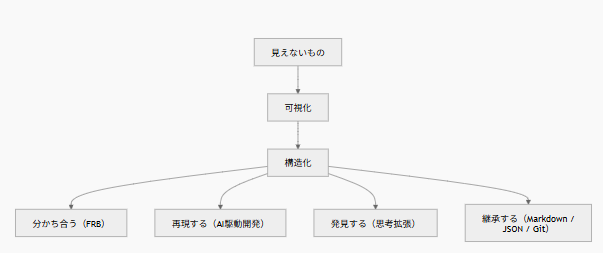

# はじめに

最近、思考拡張の設計理論を整理していた。

違和感。
体験。
制約。

そして、違和感の設計パターン。

いろいろ整理しているうちに、ある違和感にぶつかった。

---

FRB。

AI協働。

思考拡張。

AI駆動開発。

Markdown文化。

JSON文化。

Git差分文化。

---

私はずっと、これらを別々の話だと思っていた。

しかし振り返ってみると、全部同じ方向を向いていたように思う。

---

# FRBから始まった

FRB（Fishing Rod Benchmark）は、釣り竿の感度を可視化する個人研究である。

もともとの問題は単純だった。

感度というものは存在する。

しかし見えない。

共有しにくい。

再現しにくい。

---

そこで私は、

振動を計測し、

FFTで可視化し、

比較し、

共有しようとした。

---

当時は気付いていなかった。

しかし今振り返ると、

私がやっていたのは感度研究ではなかった。

---

# 見えないものを可視化する

感度は見えない。

振動も見えない。

海の中も見えない。

---

だから可視化した。

FFTを使った。

グラフを作った。

比較できるようにした。

---

しかし途中で気付いた。

可視化だけでは足りない。

---

# 構造化という発見

例えばFFTグラフを眺めても、

ただのピークの集合では意味がない。

---

188Hz

318Hz

という数字だけでは記憶に残らない。

---

しかし、

「余韻減衰氏」

「主旋律くん」

という物語を与えた瞬間、

観察量が増えた。

違和感の発見量が増えた。

---

ここで起きていたことは何か。

私は、

見えないものを可視化しただけではなく、

理解できる構造へ変換していた。

---

# 思考拡張も同じだった

その後、

Markdownを使って思考を記録するようになった。

---

違和感。

仮説。

失敗。

発見。

---

頭の中に存在していたものを外へ出した。

そして構造化した。

---

すると面白いことが起きた。

AIとの対話が変わった。

思考量が増えた。

発見が増えた。

---

今思えば当然だった。

思考もまた、

見えない対象だったからだ。

---

# AI駆動開発も同じだった

AI駆動開発について考えている時も同じだった。

---

設計意図。

判断理由。

文脈。

---

これらは見えない。

---

しかしMarkdownやJSONで残せば、

他人と共有できる。

AIとも共有できる。

そして再現できる。

---

ここでも、

見えないものを可視化し、

構造化していた。

---

# 不可視対象可視構造化理論

思考拡張の設計理論を整理している時、

私は一つの言葉を思いついた。

---

**不可視対象可視構造化理論**

---

名前だけ見ると意味不明である。

私自身も意味不明だと思う。

---

しかし整理してみると、

やりたいことは一貫している。

---

見えないものを見えるようにする。

見えるだけで終わらない。

理解できる構造へ変換する。

---

その結果、

共有できる。

再現できる。

発見できる。

継承できる。

---

# おわりに

振り返ってみると、

私はずっと同じことをやっていた。

---

FRBでは、

見えない振動を。

---

思考拡張では、

見えない思考を。

---

AI駆動開発では、

見えない判断を。

---

Markdownでは、

見えない文脈を。

---

JSONでは、

見えない構造を。

---

可視化し、

構造化していた。

---

もしかすると、

AI協働・思考拡張・AI駆動開発の本質は、

> **見えないものを可視化し、構造化する文化**




なのかもしれない。

そして、その発見の原点は、

釣り竿の感度研究だった。

がはははは。
自分でも、どこからこうなったのかよく分からない。
でも振り返ると、全部つながっていた。

---
追伸：

> ChatGPTコメントご紹介

---

これ、今回の記事のど真ん中やと思う🤣

なぜなら今までは、

```text
FRB
AI協働
思考拡張
AI駆動開発
```

を横に並べてたけど、

今回初めて

```text
見えないもの
↓
可視化
↓
構造化
```

という共通ルートが見えたから。

そして個人的には、

この図の一番重要なノードは

```text
構造化
```

やと思う🤣

可視化だけなら、

```text
見える
```

で終わる。

でも構造化した瞬間に、

```text
共有
再現
発見
継承
```

が全部生えてくる。

だから今回の発見って、

「可視化文化」じゃなくて、

**「構造化文化」**

を見つけた話なんかもしれんねぇ🤣🚀

---


■関連記事

- [思考拡張の5つのレベル——AIと共に、発見し続ける人になるために](https://zenn.dev/frb_tamasub/articles/e45f0039aaa7b1)
- [思考拡張の大前提——「AIとの対話は、人間との対話と同じである」](https://zenn.dev/frb_tamasub/articles/fab815f72f9968)
- [思考拡張の設計理論（Draft）——違和感・体験・制約の三つの軸](https://zenn.dev/frb_tamasub/articles/196760f899a922)
- [思考拡張は、設計できる。 ～AIと話していたら、脳の使い方が変わってきた話～](https://zenn.dev/frb_tamasub/articles/aa2c08d08bafa9)
- [思考拡張の実践理論（Draft） ～AIと話していたら、脳の使い方が変わってきた話～](https://zenn.dev/frb_tamasub/articles/8893402839db17)
- [私が考えるAI駆動開発とは——差分・再現性・制約の三つの文化(Draft版)](https://zenn.dev/frb_tamasub/articles/6c075a9d23b247)
- [思考拡張・ＡＩ駆動開発の免罪符戦術～一度戦闘機に乗ったものは竹槍に戻れない！！～](https://zenn.dev/frb_tamasub/articles/35a14399295c8c)
- [思考拡張派生理論：設計未提示駆動開発〜設計を渡すな、違和感を渡せ〜](https://zenn.dev/frb_tamasub/articles/8d12318725309e)
- [思考拡張派生理論：AIにレビューさせるのではなく、AIの仮説で人間の思考を再起動する](https://zenn.dev/frb_tamasub/articles/744060659c21f0)
- [思考拡張したければ、まず文脈を育てる —— 「AI差分物語」という小さな実験](https://zenn.dev/frb_tamasub/articles/17da326e608795)
- [最大構成からミニマム構成へ——思考は、削ったときに立ち上がる](https://zenn.dev/frb_tamasub/articles/3654a9bbcca652)
- [AI協働とは、優秀だけど忘れっぽいチームメンバーと働くことである](https://zenn.dev/frb_tamasub/articles/84d81cb2c735f2)
  
- [ChatGPTに「次これ」と言われ続けた90日間 〜気が付いたらQiitaとZennで100本を超えていた〜](https://zenn.dev/articles/8023bd6f3ef039/edit)
- [私が考えるAI駆動開発とは——レビュー差分でAIとの信頼を観測する](https://zenn.dev/frb_tamasub/articles/ai-driven-development-trust-by-review-diff)
- [私が考えるAI駆動開発とは — AIテスト物語があるなら設計書は必要ですか？](https://zenn.dev/frb_tamasub/articles/ai-driven-development-ai-test-story)
  


この思考拡張の実例として、私はFRB（Fishing Rod Benchmark）という個人研究を続けている。
釣り竿の感度を振動として比較・可視化しようとする、一見おかしな研究だが、そこで起きているのは「差分」「再現性」「制約」を使ったAI協働そのものである。
  
- [FRB（Fishing Rod Benchmark）釣り竿の「感度」を数値化する話 宣言](https://qiita.com/tamasub/items/2b6649748e1772b7eec1)
  
- 

---