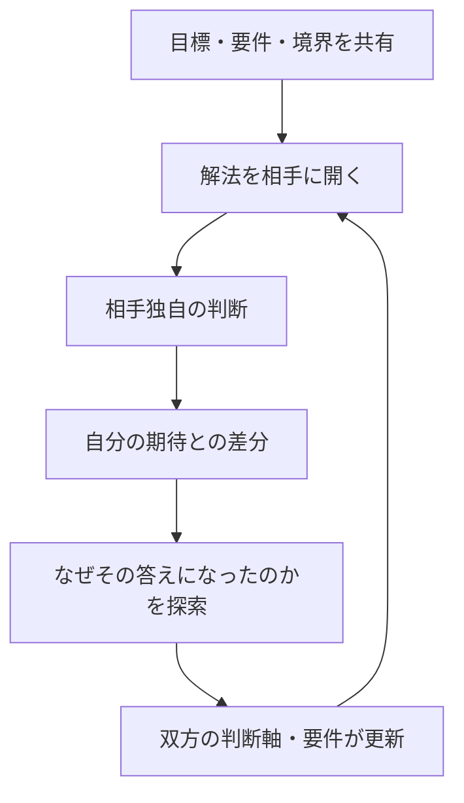

> サブタイトル：～**それは、もったいない。**～

## はじまりは、「なぜ面白くないのか？」だった

今回の思考は、こんな問いから始まった。

> **AIが全部提案してくれるのに、なぜ面白いものは生まれないのか？**

ただ、少し考えてみると、私が気にしていたのは、世間から見て面白いかどうかではなかった。

**自分が、自分のやっていることを面白がれるかどうか。**

私は現在、FRB（Fishing Rod Benchmark）という、釣り竿の感度を振動として比較・可視化する個人研究を続けている。

床を擦る。  
ロッドを改造する。  
ESP32で振動を測る。  
FFTを見る。  
AIと議論する。

自分では、めちゃくちゃ面白いと思っている。

では、AIが面白そうなテーマを100個提案してくれたとして、その中から一つ選べば、同じように夢中になれるのだろうか。

たぶん、そうではない。

そこで出てきた言葉が、

> **探索の余白**

だった。

---

## AIが全部決めると、作業だけが残る

AIが、

- 問いを決める
- 仮説を決める
- 手順を決める
- 結果を予測する
- 結論をまとめる

ところまで全部やってしまうと、人間に残るのは実行作業だけになる。

便利ではある。

しかし、自分で面白がるためには、

> 次に何を試すか  
> 何を意味のある差分と見るか  
> どの問いを追いかけるか

を自分で選べる場所が必要だった。

つまり、

> **自分で面白がれるかどうかは、探索の余白が残っているかどうかで決まる。**

ここで、以前から感じていた言葉とつながった。

> **良いAI提案は、問いを閉じない。**

良い提案は、答えをぼかして人を困らせることではない。

今すぐ試せる足場は渡す。  
しかし、試したあとに何が起きるかまでは閉じない。

一歩目は見える。  
三歩目は、まだ見えない。

その余白が、次の体験を生む。

---

## 探索の余白は、相手にも作れる

ここまでは、自分が面白がるための話だった。

しかし、次の問いが出てきた。

> **人間が、他の人間に探索の余白を作るにはどうすればよいのか？**

最初に考えたのは、材料と補助線を渡し、最後の結論だけを相手に残すという方法だった。

ただ、それだけでは足りなかった。

探索の余白を作る側にも、必要な姿勢があった。

- 自分の答えを捨てる覚悟
- 相手の判断を受け取る余裕
- 予想外の差分を面白がる姿勢

自分の答えを正解として握ったまま、

> 「自分で考えてみてください」

と言っても、実際には正解当てゲームになる。

相手が違う答えを出した瞬間に、

> 「いや、そうではなくて」

と戻すなら、それは探索ではない。

**質問形式にした説得・誘導**である。

---

## 私は、MarkdownとJSONを説明しようとしていた

私はこれまで、

> AI協働では、Excel・Word・PowerPointではなく、MarkdownとJSONが重要だ

と一生懸命説明しようとしていた。

自分の体験では、Markdown・JSON・Gitは非常に強かった。

- 人間とAIの双方が読める
- 差分を追える
- 再利用できる
- 機械処理できる
- 文脈・判断・制約を構造として残せる

実際に私は、この構成からStudioくんというツールまで作っている。

だから、自分の答えには自信があった。

しかし、今回気づいた。

相手に渡すべきだったのは、

> MarkdownとJSONという答え

ではなく、

> **AI協働を成立させるための目標と要件**

だった。

例えば、渡すべき要件はこうである。

- AIに更新してもらえる
- 人間とAIの双方が解釈できる
- 変更履歴と差分を追跡できる
- 判断理由を成果物と関連づけられる
- 継続的に再利用・検証できる
- 人間が承認できる
- 必要に応じて機械処理できる


この要件を渡したうえで、

> **この要件を満たす答えは何ですか？**

と相手に聞く。

すると相手は、Loopを選ぶかもしれない。  
OneNoteを選ぶかもしれない。  
YAMLを選ぶかもしれない。  
私が知らない製品や運用方法を持ってくるかもしれない。

そして、

> そこにこそ価値がある。

---

## 相手に答えを教えてしまったら、未知が出てこない

相手に最初から、

> MarkdownとJSONを使ってください

と伝えれば、相手はその範囲で考える。

自分の知らない選択肢が相手の頭の中にあったとしても、表に出てこない可能性がある。

それは——

> **もったいない。**

相手に答えを渡さないのは、必ずしも善意だけではない。

相手の中にある、自分の知らない知識・経験・判断軸・制約を引き出すための、

> **知的に貪欲な戦略**

でもある。

相手を尊重するから待つ。

それだけではない。

> **私がもっと知りたいから、相手の答えを先回りして潰さない。**

見た目は寛容だが、内側ではかなり貪欲である。

---

## AIに設計を渡さない。人間に答えを渡さない

ここで、AI承認駆動開発の考え方と完全につながった。

私が考えているAI承認駆動開発では、AIに詳細設計をすべて渡さない。

代わりに渡すのは、

- 目的
- 責務
- 要件
- 判断軸
- 制約
- テストパターン
- 期待値
- 承認条件

である。

その境界の内側で、AIに設計・解法を探索してもらう。

人間との協働も同じだった。

```text
AIに設計を渡さない
＝ AIが解法を『探索する余白』を残す

人間に答えを渡さない
＝ 人間が判断・解法を『探索する余白』を残す
```

共通しているのは、

> **目的と境界は共有する。  
> しかし、思考結果までは先回りして決めない。**

という構図である。

一言でまとめるなら、

> **境界を渡して、答えは開く。**

---

## レベル5の先にあったもの

以前、私は思考拡張を5つのレベルに整理した。

| レベル | 状態 |
|---|---|
| 1：受容 | AIの回答から気づきを受け取る |
| 2：引き出し | 問い方によって出力が変わると知る |
| 3：回収 | 違和感を拾い、問いへ変える |
| 4：構造化 | 一人では到達できない体系を作る |
| 5：設計 | 違和感・問い・制約を設計し、発見を起こす |

レベル5では、他者の思考を立ち上げることができる。

しかし、そこにはまだ一つ問題が残る。

発見を起こす側が、

> 相手には、最終的に自分と同じ答えへ到達してほしい

と思っている可能性がある。

そこで今回、その先のレベルが見えた。

## 思考拡張レベル6：相互拡張

> **目的・要件・境界を共有し、解法を相手に開くことで、相手から返ってきた未知によって、自分の思考まで拡張される状態。**

レベル5とレベル6の違いは、こう表せる。

```text
レベル5：発見を設計する
レベル6：発見結果を支配しない
```

相手を思考拡張させるだけではない。

相手の判断によって、自分の前提・判断軸・要件・理論まで変わる可能性を受け入れる。

むしろ、その変化を待ち望む。



私はこの状態を、

> **思考拡張レベル6「相互拡張」**

と呼ぶことにした。

---

## 「なんで分かってくれへんねん」が変わる

この考え方は、私にとってメンタル面でも大きい。

これまでは、相手が自分と違う答えを出すと、

> なんで分かってくれへんねん  
> こんなに説明しているのに

という不満が生まれやすかった。

しかし、新しい立ち位置では変わる。

```text
相手が同じ答え
→ 自分の仮説が補強される

相手が違う答え
→ 自分の知らない情報が発生する
```

どちらでも、得るものがある。

意見の不一致を、

> 理解されなかった  
> 否定された  
> 説明に失敗した

と受け取る代わりに、

> **自分と相手の間に、まだ共有されていない情報がある**

と捉える。

そして聞く。

> その答えになった理由は何ですか？  
> どの要件を重視しましたか？  
> 私に見えていない制約がありますか？

これは医学的な治療理論ではない。

ただ、日常の認知姿勢として、

> **対人ストレスを探索へ変換する**

助けにはなりそうだと感じている。

「なんで分からない？」ではなく、

> **俺の知らない情報をよこせ。**

という姿勢で生きる。

少なくとも私には、こちらの方が合っている。

---

## 探索の余白を作る実践手順

現時点では、次の流れで使えそうだ。

### 1. 目標を共有する

何を実現したいのかを先にそろえる。

### 2. 要件と境界を渡す

何を満たす必要があり、何を越えてはいけないのかを明確にする。

### 3. 自分の答えを暫定化する

自分の案は持つ。ただし唯一解ではなく、現時点の有力仮説として置く。

### 4. 解法を相手に開く

自分の答えを先に教えず、相手自身の経験と知識から案を出してもらう。

### 5. 差分を待ち望む

違う答えが返ったら、修正する前に理由を聞く。

### 6. 要件・判断軸を更新する

相手の答えから、自分側に不足していた条件や視点を回収する。

---

## 答えを渡さないことと、放置は違う

念のため、線を引いておきたい。

「相手に答えを渡さない」は、

- 必要な情報を隠す
- 初心者を放置する
- 安全上の注意を曖昧にする
- 答えを知っているのに、相手を試す
- 自分の正解へ誘導しながら、本人が気づいたように見せる

という話ではない。

探索の余白には、

- 十分な観測材料
- 判断可能な要件
- 越えてはいけない境界
- 次へ進める補助線
- 判断が現実へ反映される自己決定権

が必要である。

> **迷子にするのではなく、判断できる場所まで一緒に行く。  
> ただし、最後の判断は奪わない。**

これが探索の余白だと考えている。

---

## おわりに

今回の思考は、

> AIが全部提案してくれるのに、なぜ面白いものは生まれないのか？

という問いから始まった。

そこから、

- 自分が面白がるには探索の余白が必要
- 良いAI提案は問いを閉じない
- 他者にも探索の余白を作れる
- そのためには、自分の答えを暫定化する必要がある
- AIに設計を渡さないことと、人間に答えを渡さないことは同じ構図
- 相手の未知によって自分も拡張される

という流れで、思考拡張レベル6へたどり着いた。

相手に答えを教えてしまえば、早く話は進むかもしれない。

しかし、相手の頭の中から、自分の知らない答えが出てくる可能性は消えてしまう。

> **それは、もったいない。**

だから私は、目標と要件と境界を渡す。

そして、答えは開いておく。

相手から、自分の知らない情報が返ってくることを待ち望みながら。

---

*本記事は、FRBプロジェクトおよびChatGPTとの対話から生まれた、現時点の仮説です。今後、他者から返ってくる未知によって更新されることを前提としています。*

---

## 関連記事

- [思考拡張の5つのレベル——AIと共に、発見し続ける人になるために](https://zenn.dev/frb_tamasub/articles/e45f0039aaa7b1)
- [思考拡張の設計理論（Draft）——違和感・体験・制約の三つの軸](https://zenn.dev/frb_tamasub/articles/196760f899a922)
- [思考拡張派生理論：設計未提示駆動開発〜設計を渡すな、違和感を渡せ〜](https://zenn.dev/frb_tamasub/articles/8d12318725309e)
