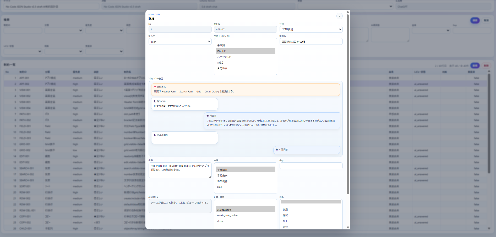
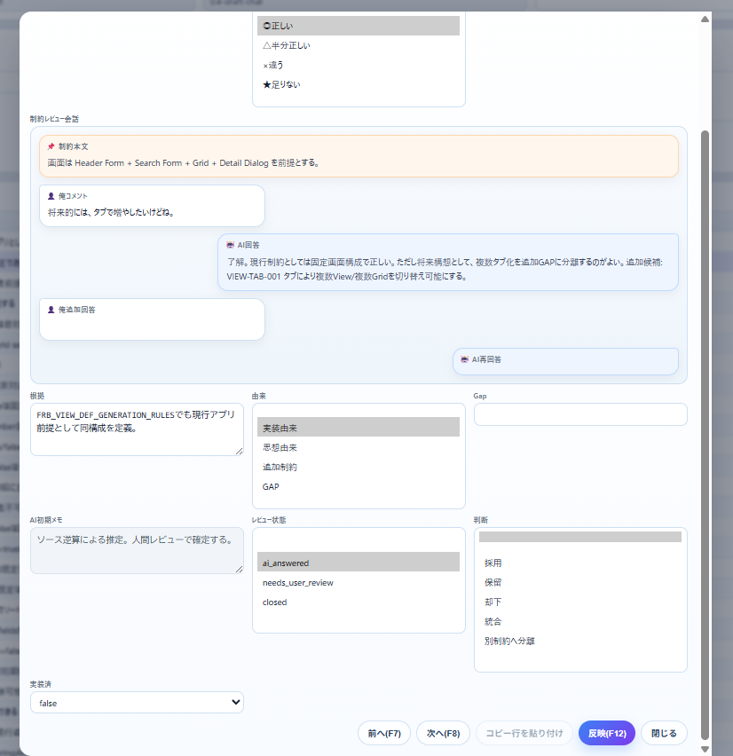
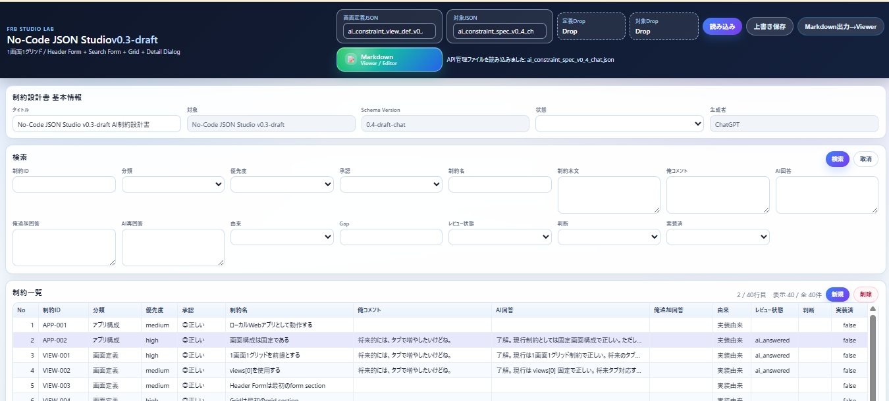

# FRB Studio v0.3-draft Tray App

## 変更内容

- `FRBStudio.csproj` を Windows タスクトレイ常駐アプリ構成へ変更
- `Program.cs` を Minimal API + NotifyIcon 常駐方式へ変更
- 起動時に `http://localhost:5055` を開く
- タスクトレイ右クリックメニューを追加
  - FRB Studio を開く
  - data フォルダーを開く
  - defs フォルダーを開く
  - 終了

## 起動方法

```bat
dotnet run
```

起動後、左の黒いコンソール画面は出ず、タスクトレイに常駐します。

## 終了方法

タスクトレイのアイコンを右クリックし、`終了` を選択してください。

## 注意

この版は Windows 専用です。
`TargetFramework` は `net9.0-windows` です。

Markdown書き込み対応は次ステップ想定です。

----

dotnet run  
dotnet build
dotnet publish -c Release -r win-x64 --self-contained true -p:PublishSingleFile=true

----



