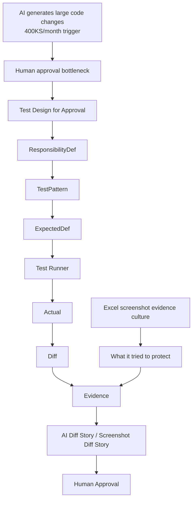
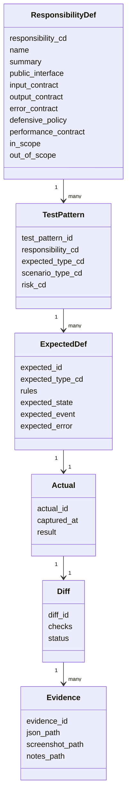
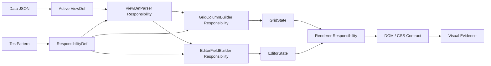
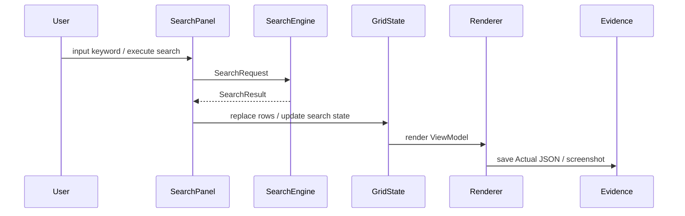
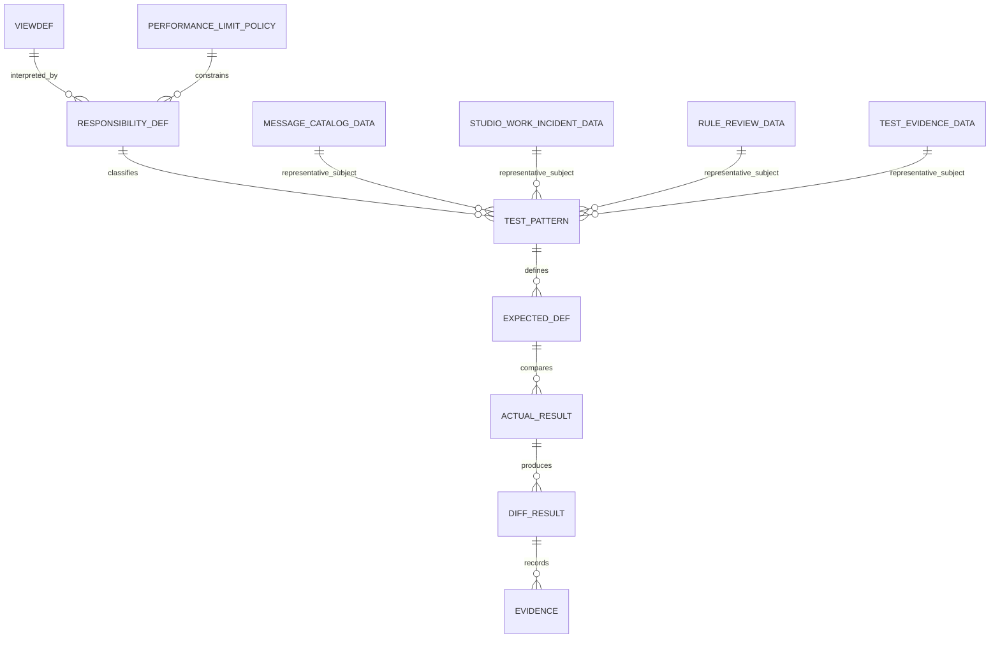

# FRB Studio テスト計画 v0.18.5

- incident: `studio_work_0109`
- phase: `v0.18.5-test-design-document-responsibility-scope`
- document type: Test Plan / Test Design Policy
- created_at: 2026-07-04
- owner: tamasub
- ai_partner: ChatGPT

---

## 0. この計画の位置づけ

このテスト計画は、単なるテストケース一覧ではない。

AIが短時間で膨大なコードを生成する時代において、人間がその成果物をどう短時間で、納得感を持って承認するかを整理するための計画である。

従来のExcelスクリーンショット貼り付け型エビデンス文化は、確認したことを残すという目的自体は正しい。しかし、AI生成物が増えるほど、人間の目視確認・Excel貼り付け・多重チェックは承認ボトルネックになる。

この計画では、竹槍エビデンス文化が守ろうとしていたものを否定しない。むしろ、以下の構造へ転生させる。

```text
Excelスクショ証跡
  ↓
Expected / Actual / Diff / Evidence
  ↓
AI差分物語 / スクショ差分物語
  ↓
人間が短時間で承認できる構造
```

テストコードは目的ではない。
AI駆動開発において、期待値・差分・証跡・再実行性を扱うために自然に必要となる実行手段である。

---

## 1. 背景：400KS/人月時代の承認ボトルネック

AIは短時間で膨大なコードを生成できる。
仮に `400KS / 人月` 級の成果物が現実味を帯びるとして、問題は「書けるか」ではなく「承認できるか」になる。

```text
昔:
  コードを書く時間がボトルネック

これから:
  AIが生成した成果物を、人間が納得して承認する時間がボトルネック
```

そのため、これからのAI駆動開発では、単にAIへ多くのコードを書かせるだけでは競争力にならない。

重要なのは、AI生成物を責務境界ごとに分解し、期待値・実績・差分・証跡として構造化し、人間が短時間で理解・判断・承認できる状態を作ることである。

---

## 2. 基本思想

### 2.1 テスト設計とは、責務境界を発見する作業である

テスト設計は、実装上のFunction一覧を作ることではない。

```text
悪い出発点:
  このFunctionをどうテストするか？

良い出発点:
  このシステムにはどんな責務があり、
  その責務は何を入力として受け取り、
  何を出力・状態・イベントとして返すべきか？
```

UTの単位は、実装単位ではなく責務単位である。

```text
巨大関数1本:
  テスト設計上は責務に分解する

小さい関数100本:
  テスト設計上は意味のある責務単位へ束ねる
```

### 2.2 責務が大きいとテストは掛け算になる

10KSのバッチプログラムを1本で作ると、入力条件・変換条件・集計条件・出力条件・エラー条件が絡み合い、テストパターンは掛け算で増える。

1KS × 10本の責務に分けると、それぞれの入力・出力・期待値が小さくなり、テストパターンは足し算に近づく。

```text
巨大責務:
  入力 × バリデーション × 変換 × 集計 × 出力 × エラー
  → 組み合わせ爆発

小さな責務:
  責務ごとの入力 → 出力 / 状態 / イベント
  → 期待値が小さく、人間が承認しやすい
```

### 2.3 壊れにくく、人間が承認しやすい構造を目指す

この計画の中心コンセプトは以下である。

```text
壊れにくいテスト構造
人間が承認しやすいテスト構造
AIが差分説明しやすいテスト構造
性能が破綻しにくいテスト構造
```

---

## 3. UT / CT / E2E の役割分担

### 3.1 UT: 責務の中身を守る

UTはFunction単位ではなく、責務単位で設計する。

UTでは、責務単位インターフェースに対して以下を確認する。

- 正しい入力で期待する出力・状態・イベントになること
- 不正な入力を責務入口で明確に弾くこと
- 入力を破壊しないこと
- エラーに責務ID・エラーコード・path・理由が含まれること
- ViewDefやDataの具体値に密結合せず、解釈ルールを確認すること

### 3.2 CT: 責務どうしの会話を守る

CTでは、各責務内部の細かい分岐を再テストしない。

CTの目的は、前段責務の出力が、後段責務の入力契約を満たしているかを確認することである。

```text
UT:
  責務の中身を確認する

CT:
  責務どうしのインターフェース契約を確認する
```

例:

```text
ViewDefParser.output
  ↓
GridColumnBuilder.input_contract
```

CTで確認するのは、検索条件の全パターンではなく、SearchPanel → SearchEngine → GridState → Renderer の受け渡し契約である。

### 3.3 E2E: 利用者の代表シナリオだけを見る

E2Eはすべての分岐を網羅する場所ではない。

E2Eでは、利用者の代表的な物語が最後まで通ることを確認する。

```text
UT = 部品の正しさを証明する
CT = 部品同士の会話が成立していることを証明する
E2E = 利用者の物語が最後まで通ることを証明する
```

---

## 4. ResponsibilityDef: 責務単位インターフェース契約

### 4.1 ResponsibilityDef の位置づけ

`ResponsibilityDef` は、ウォーターフォールでいうUTベースのプログラム一覧に相当する。
ただし、実装モジュール一覧ではなく、UTとして守るべき責務一覧である。

さらに、本計画では ResponsibilityDef を単なる一覧にしない。

```text
ResponsibilityDef
  = 責務単位インターフェース契約
  = 入力契約
  = 出力契約
  = エラー契約
  = 防衛境界
  = 性能上限契約
```

### 4.2 責務境界防衛原則

小さいFunctionすべてにガチガチの入力防衛を入れるのは現実的ではない。

そのため、Studioくんでは責務単位の公開インターフェースを防衛境界とし、そこで入力契約・出力契約・エラー契約・性能上限契約を集中管理する。

```text
責務境界の外は疑う。
責務境界の内は信じる。
```

責務単位の入口は城門である。
知らない利用者、未来の自分、AI生成コード、別責務から雑に呼ばれても、変な使い方は入口で弾く。

### 4.3 ResponsibilityDef に持たせる情報

ResponsibilityDef Master JSON には以下を持たせる。

- responsibility_cd
- name
- test_level
- summary / purpose
- public_interface
- input_contract
- output_contract
- error_contract
- defensive_policy
- performance_contract
- in_scope / out_of_scope
- expected_types
- representative_test_patterns

---

## 5. ExpectedDef の種別

ExpectedDef は、画面の写しではなく、責務ごとの約束をJSON化したものである。

### 5.1 ExpectedDef種別

| 種別 | 目的 |
|---|---|
| RuleExpectedDef | ルールが満たされていることを確認する |
| StateExpectedDef | 操作後の状態が期待どおりであることを確認する |
| EventExpectedDef | 意味のある出来事が発生したことを確認する |
| InterfaceExpectedDef | 責務間の受け渡し契約を確認する |
| ErrorExpectedDef | 不正入力を期待どおり拒否することを確認する |
| PerformanceExpectedDef | 上限・警告・拒否などの性能契約を確認する |
| VisualEvidenceExpectedDef | スクショなどの人間確認用証跡が保存されることを確認する |

### 5.2 ViewDef具体データに依存しない期待値

悪い期待値は、特定ViewDefの具体列名を固定することである。

```json
{
  "grid_columns": ["key", "caption", "message", "severity"]
}
```

良い期待値は、ViewDef解釈ルールを確認することである。

```json
{
  "rule_expected": [
    "grid.columns are derived from activeViewDef.fields where grid.visible != false",
    "key column is always available for identity",
    "column order follows ViewDef fields order"
  ]
}
```

---

## 6. TestPattern と責務識別

TestPattern には、何の責務を確認するパターンなのかを必ず識別させる。

既存の `feature_area_cd`、`test_axis_cd`、`scenario_type_cd`、`risk_cd` に加えて、少なくとも以下を持たせる方向とする。

```json
{
  "responsibility_cd": "grid_column_build",
  "expected_type_cd": "RuleExpectedDef"
}
```

初期段階では、テストパターンは単一責務に紐づけることを基本とする。
複数責務を許すと、何を守るテストなのかがぼやけやすいためである。

---

## 7. ViewDef / Data Fixture 方針

### 7.1 本番ViewDefをテストしすぎない

本番ViewDefは代表疎通確認に使う。
UTの中心にはしない。

```text
本番ViewDef
  = 実運用の代表例・疎通確認・CT/E2E寄り

Fixture ViewDef
  = ViewDef解釈ルールを確認するための人工テストデータ・UT寄り
```

### 7.2 Fixture ViewDef の初期セット

最低限、以下を用意する。

| Fixture | 目的 |
|---|---|
| grid_small | 3〜5列。最小構成・基本責務確認 |
| grid_medium | 8〜12列。標準業務画面相当 |
| grid_large | 20〜30列。上限付近・横スクロール・表示崩れ確認 |
| grid_over_limit | 上限超過。警告または拒否確認 |
| hidden_readonly_required | visible / readonly / required の解釈確認 |
| combo_options | select / combo / options の確認 |
| nested_object_array | objectArray / detail subgrid の確認 |
| markdown_chat | markdown / chat / textarea / サイドカー連携の確認 |

### 7.3 本番題材

本番題材は仕様そのものではなく、代表例として扱う。

| 題材 | 使いどころ |
|---|---|
| message_catalog | 一覧・検索・編集・CSV出力の題材 |
| studio_work_incident | objectArray履歴、長文、状態管理、判断ログの題材 |
| rule_review | 人間/AI責務、承認状態、単一正本の題材 |
| test_evidence | Expected / Actual / Diff / 証跡トレースの題材 |
| viewdef_generation_rules | ViewDefそのものをレビューするメタ題材 |
| markdown/chat系Data | Markdown表示、textarea、保存、サイドカー連携の題材 |

---

## 8. CSS / 見た目 / スクショ証跡

CSSテストは、最初からピクセル完全一致を主軸にしない。

初期段階では、以下の順番で育てる。

```text
Phase 1: DOM / CSS契約テスト
  - 必要な要素が存在する
  - 状態classが付いている
  - 表示/非表示が期待どおり

Phase 2: 人間確認用スクショ保存
  - 代表画面の状態を証跡として残す

Phase 3: スクショ差分検出
  - baseline / actual / diff を保存する

Phase 4: スクショ差分物語
  - どの領域が変わったか
  - 意図した変更か
  - CSS変更による副作用か
  - 人間が承認すべき差分か
```

スクショは初期段階ではFAIL判定の主軸ではなく、人間確認用の証跡として扱う。

```text
見た目は、まず証跡として残す。
差分判定は後で育てる。
最終的には、スクショ差分物語で人間が承認できる形にする。
```

代表スクショ対象:

- app_initial
- grid_loaded_small
- grid_loaded_medium
- grid_loaded_large
- editor_opened
- search_result_hit
- search_result_empty
- dialog_opened
- markdown_preview
- error_state

---

## 9. 性能方針との接続

性能は、実装後の努力だけで担保しない。
ViewDef / Data / ResponsibilityDef の入力契約として、表示列数・行数・ネスト深度・文字量などの上限を定義する。

```text
性能もまた、責務境界防衛の一部である。
```

### 9.1 グリッド100列問題

Studioくんでは、原則としてグリッドに100列を表示しない。

理由は性能だけではない。

- 人間が読めない
- 横スクロール地獄になる
- ExpectedDefが巨大化する
- 差分確認が困難になる
- スクショ証跡が意味を失う
- AI差分物語にも向かない
- 性能劣化の原因になる

```text
Gridは全項目表示の場所ではない。
Gridは、人間が一覧判断するための入口である。
```

100列を高速表示する努力より、100列を出さなくてよいViewDef設計を優先する。

### 9.2 上限契約テスト

性能テストは、単に大量データを流す負荷試験だけではない。

責務境界が危険な入力を検出し、警告または拒否できることを確認する契約テストとして扱う。

例:

```text
UT:
  GridColumnBuilder が max_visible_grid_columns を超えたViewDefを警告/拒否できるか

CT:
  ViewDef切替時に、上限警告がUIへ伝播するか

E2E:
  列数大Fixtureで、警告表示または折りたたみ誘導が出るか

Visual Evidence:
  列数大Fixtureのスクショを保存し、人間が崩れを確認できるか
```

---

## 10. Mermaid: 全体関係図



---

## 11. Mermaid: ResponsibilityDef中心モデル



---

## 12. Mermaid: ViewDef切替・Grid/Editor描画責務



---

## 13. Mermaid: 検索状態テスト



CTでは、SearchEngine内部の全分岐ではなく、SearchPanel → SearchEngine → GridState → Renderer の接続契約を確認する。

---

## 14. Mermaid: メッセージカタログ等との関係



メッセージカタログは題材であって仕様そのものではない。
本番Dataは代表疎通確認に使い、責務の仕様は ResponsibilityDef / Fixture ViewDef / ExpectedDef で守る。

---

## 15. 初期ロードマップ

### Phase A: 設計の正本化

- ResponsibilityDef Master JSON のドラフト作成
- Performance Limit Policy のドラフト作成
- TestPatternに `responsibility_cd` / `expected_type_cd` を持たせる方針整理
- Fixture ViewDef / Fixture Data の候補整理

### Phase B: UT責務の定義

- ViewDefParser
- GridColumnBuilder
- EditorFieldBuilder
- SearchFilter
- SearchState
- RendererDisplay
- CsvExport
- VisualEvidence

### Phase C: CT責務の定義

- ViewDef切替 → Grid/Editor再構築
- SearchPanel → SearchEngine → GridState
- EditorState → Save → FileWriter
- GridState → CsvExporter → Download
- TestPattern → Expected → Actual → Diff

### Phase D: 証跡文化の拡張

- Actual JSON保存
- Diff JSON保存
- 人間確認用スクショ保存
- スクショ差分検出
- スクショ差分物語

### Phase E: 性能上限契約

- Grid列数上限
- Grid行数上限
- 検索対象フィールド数上限
- Editor項目数上限
- objectArray行数上限
- Diff対象JSONサイズ上限

---

## 16. 今回のDone条件

このフェーズのDone条件は以下とする。

- テスト計画Markdownが作成されていること
- ResponsibilityDef Master JSONドラフトが作成されていること
- Performance Limit Policyドラフトが作成されていること
- Studioくん物語につなげるネタメモが作成されていること
- 更新後インシデントJSONへ、成果物・判断ログ・変更履歴が記録されていること
- 実装修正を行っていないことが明示されていること

---

## 17. 結び

この計画は、テストコードを書けと叫ぶための資料ではない。

AI生成物を人間が承認できるようにするための構造を作る計画である。

テストコード文化は、テストコードを書けと叫んでも根付かない。
期待値・差分・証跡が必要になる世界を作ると、テストコードは自然に生えてくる。
