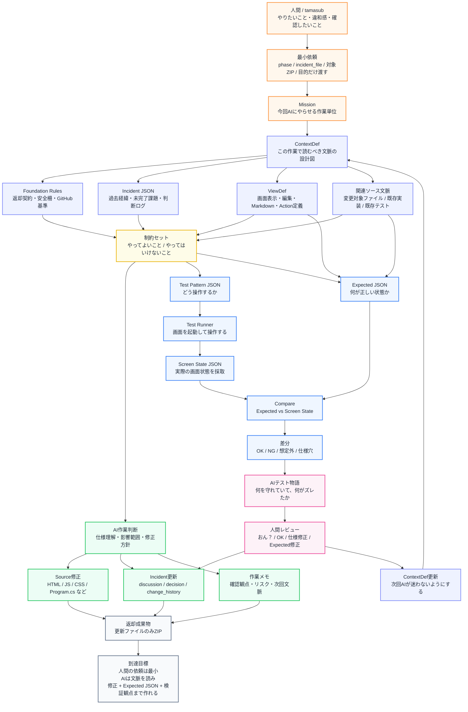

```mermaid
flowchart TD

  %% =========================
  %% User / Mission Layer
  %% =========================
  U["人間 / tamasub<br/>やりたいこと・違和感・確認したいこと"] --> MR["最小依頼<br/>phase / incident_file / 対象ZIP / 目的だけ渡す"]

  MR --> M["Mission<br/>今回AIにやらせる作業単位"]

  %% =========================
  %% Context Layer
  %% =========================
  M --> CD["ContextDef<br/>この作業で読むべき文脈の設計図"]

  CD --> FR["Foundation Rules<br/>返却契約・安全柵・GitHub基準"]
  CD --> INC["Incident JSON<br/>過去経緯・未完了課題・判断ログ"]
  CD --> VD["ViewDef<br/>画面表示・編集・Markdown・Action定義"]
  CD --> SRCCTX["関連ソース文脈<br/>変更対象ファイル / 既存実装 / 既存テスト"]

  %% =========================
  %% Constraint Layer
  %% =========================
  FR --> C["制約セット<br/>やってよいこと / やってはいけないこと"]
  INC --> C
  VD --> C
  SRCCTX --> C

  C --> AI["AI作業判断<br/>仕様理解・影響範囲・修正方針"]

  %% =========================
  %% Implementation Layer
  %% =========================
  AI --> SRC["Source修正<br/>HTML / JS / CSS / Program.cs など"]
  AI --> INCUP["Incident更新<br/>discussion / decision / change_history"]
  AI --> NOTE["作業メモ<br/>確認観点・リスク・次回文脈"]

  %% =========================
  %% Test Design Layer
  %% =========================
  C --> TP["Test Pattern JSON<br/>どう操作するか"]
  C --> EX["Expected JSON<br/>何が正しい状態か"]
  VD --> EX
  SRCCTX --> EX

  TP --> RUN["Test Runner<br/>画面を起動して操作する"]
  RUN --> SS["Screen State JSON<br/>実際の画面状態を採取"]

  EX --> CMP["Compare<br/>Expected vs Screen State"]
  SS --> CMP

  CMP --> DIFF["差分<br/>OK / NG / 想定外 / 仕様穴"]
  DIFF --> STORY["AIテスト物語<br/>何を守れていて、何がズレたか"]

  %% =========================
  %% Human Review Layer
  %% =========================
  STORY --> RV["人間レビュー<br/>おん？ / OK / 仕様修正 / Expected修正"]
  RV --> INCUP
  RV --> CDUP["ContextDef更新<br/>次回AIが迷わないようにする"]
  CDUP --> CD

  %% =========================
  %% Output Layer
  %% =========================
  SRC --> OUT["返却成果物<br/>更新ファイルのみZIP"]
  INCUP --> OUT
  NOTE --> OUT

  %% =========================
  %% Goal
  %% =========================
  OUT --> GOAL["到達目標<br/>人間の依頼は最小<br/>AIは文脈を読み<br/>修正 + Expected JSON + 検証観点まで作れる"]

  %% =========================
  %% Styles
  %% =========================
  classDef user fill:#fff7ed,stroke:#fb923c,stroke-width:2px,color:#1f2937;
  classDef context fill:#eef2ff,stroke:#818cf8,stroke-width:2px,color:#1f2937;
  classDef constraint fill:#fefce8,stroke:#eab308,stroke-width:2px,color:#1f2937;
  classDef work fill:#ecfdf5,stroke:#22c55e,stroke-width:2px,color:#1f2937;
  classDef test fill:#eff6ff,stroke:#3b82f6,stroke-width:2px,color:#1f2937;
  classDef review fill:#fdf2f8,stroke:#ec4899,stroke-width:2px,color:#1f2937;
  classDef output fill:#f8fafc,stroke:#64748b,stroke-width:2px,color:#1f2937;

  class U,MR,M user;
  class CD,FR,INC,VD,SRCCTX,CDUP context;
  class C constraint;
  class AI,SRC,INCUP,NOTE work;
  class TP,EX,RUN,SS,CMP,DIFF test;
  class STORY,RV review;
  class OUT,GOAL output;
```

