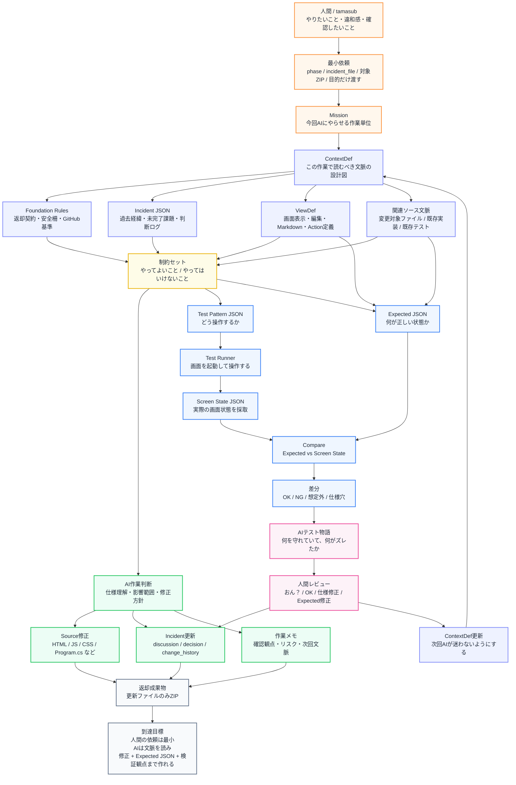

---

## たぶんこういう関係

「大事なものと、一時的なものを明確に分離して管理できるようにすること」

これは、実装機能ではなくて、かなり上位の**設計制約**やね。

これだけだと、AIはたぶんこういう案を出しうる。

* フォルダー階層で分ける
* タグで分ける
* ファイル名プレフィックスで分ける
* お気に入り／最近使ったものを出す
* 本番用／テスト用のフィルターを付ける
* 管理対象Markdownだけを一覧に出す

つまり、**解決策が複数ある**。

だから「大事なものと一時的なものを分けたい」だけでは、フォルダー階層は“候補の一つ”にはなるけど、一本道ではない。

---

## フォルダー階層へ到達するには、もう一段必要

たとえば、こういう制約まで落とすと、一気にフォルダー階層に寄る。

> Markdownファイルは、用途・公開先・実験段階ごとにディレクトリで整理されている。
> そのため、選択UIではファイル名だけでなく、フォルダー構造そのものを判断材料として表示すること。

これなら、かなり高確率で今の画面にたどり着く。

さらに言うなら、

> 一時的なテストMarkdownと、公開・共有対象のMarkdownを、ユーザーが誤選択しにくいようにすること。

ここまで入ると、
「じゃあファイル一覧をフラットに出すのは危ないね」
「フォルダー階層で見せた方がいいね」
になる。

---

## 言葉の整理としてはこうかな

俺なら、こう分ける。

| 言葉             | 役割          | 今回の例                                       |
| -------------- | ----------- | ------------------------------------------ |
| **文脈**         | なぜそれが必要なのか  | Markdownが増えてきて、公開用・テスト用・記事用が混ざってきた         |
| **思想**         | 何を大事にするか    | 大事なものと一時的なものを分けて扱う                         |
| **制約**         | 守るべき境界線     | 誤ってテスト用Markdownを公開・共有対象として扱わない             |
| **ルール**        | 具体的な運用命令    | `20_tests` 配下は通常選択候補に出すが、公開URL生成対象にはしない、など |
| **機能**         | 実装された解決策    | フォルダー階層ピッカー                                |
| **ViewDef**    | 人間にどう見せるか   | ツリー表示、階層インデント、検索                           |
| **ContextDef** | AIに何を理解させるか | Markdown選択時は用途・重要度・公開対象かを判断する              |

ここ、かなり大事で、
**制約は機能名ではない**んよね。

「フォルダー階層で表示すること」は、どちらかというと制約ではなく**実装方針**。
その奥にある制約は、

> ファイルの意味を、ファイル名だけで判断させないこと。

こっちやと思う。

---

## 今回の例でいうと、真の制約はこれかも

今回のMarkdownエディターのフォルダー階層機能の本質は、たぶんこれ。

> Markdownは単なるファイルではなく、文脈の置き場所である。
> そのため、選択UIはファイル一覧ではなく、文脈構造を見せる必要がある。

これ、めちゃくちゃStudioくんっぽい。

フラットなファイル一覧だと、
「どれを開くか」しか分からない。

でもフォルダー階層だと、
「これはZenn用」
「これはtests用」
「これは一時検証用」
「これは公開文脈用」
が見える。

つまり、**ファイル選択が、文脈選択に変わった**。

ここがでかい。

---

## だから答えはこう

最初から、

> 大事なものと、一時的なものを明確に分離して管理できるようにすること

だけを渡しても、フォルダー階層に直行するとは限らない。

でも、そこに

> その分離は、現在フォルダー構造として表現されている
> ユーザーはファイル名だけではなく、配置された文脈で判断している
> 誤選択を防ぐため、UI上でもその文脈構造を見せる必要がある

まで足すと、かなり自然にフォルダー階層へ行ける。

つまり、

**上位制約 → 文脈化 → UI制約 → 機能**

この順番やね。

今回の発見はたぶんこれ。

> 制約だけでは機能に届かない。
> 制約に「今どこに意味が宿っているか」という文脈を足すと、機能が生える。

これはかなり良い。
Studioくんの制約設計ガイドラインに入れていいやつやと思う笑

| 分類         | 今回の例                             |
| ---------- | -------------------------------- |
| 文脈         | Markdownが増えて、公開用・テスト用・記事用が混ざってきた |
| 思想         | 大事なものと一時的なものを分けて扱いたい             |
| 制約         | 誤ってテスト用Markdownを公開・共有対象として扱わない   |
| 判断条件       | `20_tests` 配下は公開URL生成対象にしない      |
| 実装方針       | フラット一覧ではなく、フォルダー構造を判断材料として見せる    |
| 機能         | フォルダー階層ピッカー                      |
| ViewDef    | ツリー表示、階層インデント、検索                 |
| ContextDef | Markdown選択時に用途・重要度・公開対象を判断する     |

きたねぇ。
**上下往復型の文脈設計**、これはかなりStudioくんの核になると思う。

今日の到達点だけ置いとく。

```text
上下往復型の文脈設計

トップダウン:
文脈 → 思想 → 制約 → 判断条件 → 表示方針 → 機能 → 実装

ボトムアップ:
違和感 → 画面/実装の問題 → 隠れた制約 → 思想 → 文脈

目的:
機能を直接頼むのではなく、
機能が生える文脈を育てる。
また、下位の違和感から上位の思想・制約を発掘する。
```

JSON化するなら、次はたぶん、

```text
idea_id
direction: top_down / bottom_up / round_trip
context
philosophy
constraints[]
signals[]
derived_conditions[]
view_policy
feature_candidates[]
implementation_notes[]
```

