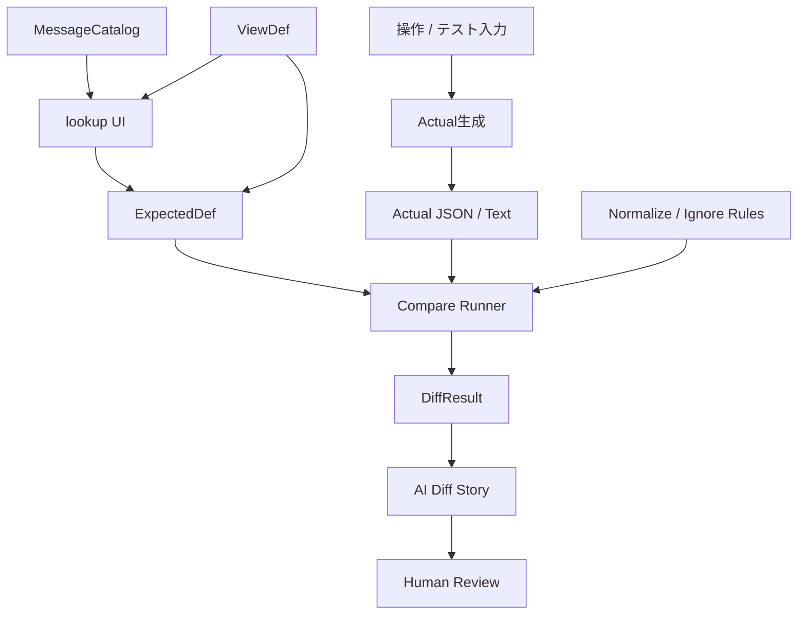

# Studioくん構想メモ — ExpectedDef / ログコンペア / lookup設計の芽

作成日: 2026-07-02  
用途: mymemo.md 追記用 / インシデント登録用の会話要約  
位置づけ: まだ実装仕様ではなく、今後ルール化・ViewDef化・ExpectedDef化していくための構想メモ

---

## 1. 今回進んだ中心思想

今回の会話で見えた中核は、かなり単純な一言に圧縮できる。

> **全部テキスト化して diff とれやぁーーーーーー**

ただし、単なる文字列化ではない。  
DB更新結果、SELECT結果、画面状態、画面項目チェック、APサーバのエラーログ、証跡ログ、APIレスポンスなどを、**比較に耐える安定したJSON/テキスト**へ変換し、Expected と Actual の差分で判断できる世界を目指す。

この考え方により、テストコードは個別仕様のAssertを大量に抱えるのではなく、次のような薄い共通ランナーへ寄せられる。

```text
テスト条件を読む
↓
操作する
↓
ActualをJSON/テキスト化する
↓
ExpectedDefに基づいて正規化・比較する
↓
Diffを見る
```

つまり、テストコードを書く文化から、**期待値定義を育てる文化**へ寄せていく。

---

## 2. ExpectedDefとは何か

今回の会話で `ExpectedDef` という言葉がかなりしっくり来た。

現時点の定義は以下。

> **ExpectedDefとは、DB・画面・ログ・ファイル・APIなど異なる検証対象を、比較可能なJSON/テキストへ変換し、diffで承認できる状態にするための期待値定義である。**

ExpectedDefは、単なる期待値ではない。

```text
何を見るか
何を期待するか
どう比較するか
何を比較対象から外すか
何を同一視するか
何が変わったら異常とみなすか
```

まで含める可能性がある。

---

## 3. 正常系も異常系もログコンペアへ寄せる

通常の画面操作やDB更新だけでなく、異常テストも同じ型にできる。

たとえばAPサーバの異常系テストなら、

```text
異常条件を発生させる
↓
APサーバがエラーログを出す
↓
ログを構造化・正規化する
↓
ExpectedDefと比較する
↓
差分がなければOK
```

このとき、日時やリクエストIDなどは毎回変わるため、ExpectedDef側で比較対象から外す必要がある。

除外・正規化候補:

```text
timestamp
request_id
trace_id
duration_ms
thread_id
machine_name
stack traceのline number
一時ファイルパス
ランダムID
```

ここで重要なのは、異常系テストを「例外が起きたか」ではなく、**期待された異常が、期待された証跡として残ったか**で見ること。

---

## 4. message_id / event_id / check_id が比較のアンカーになる

異常系では、エラーメッセージ本文を比較するより、`message_id` や `error_code` を比較した方が安定する。

```text
悪い比較:
  "必須項目が未入力です" という文言が出ていること

良い比較:
  message_id = "ERR_REQUIRED_FIELD_MISSING" が出ていること
```

文言は変わる。翻訳でも変わる。表記ゆれも起きる。  
でも message_id は設計上の契約として固定できる。

また、通常のインフォメーション系メッセージIDにも意味が出てくる。

```text
MSG_SAVE_COMPLETED
MSG_DELETE_COMPLETED
MSG_IMPORT_COMPLETED
MSG_NO_CHANGES_DETECTED
```

これらは、操作がどの意味の結果に到達したかを示すアンカーになる。

さらに内部証跡としては `event_id`、ExpectedDef上の確認項目としては `check_id` が使える。

```text
message_id = 人間に見える結果の意味
event_id   = 内部で起きた意味ある出来事
check_id   = ExpectedDef上の確認項目
decision_id = 差分をどう判断したか
```

ただし、内部イベントの順序チェックは使いすぎない。  
基本は最終状態を重視し、内部イベントは必要な時だけ使う。

```text
Outcome = 契約
EventLog = 証跡
Sequence = 診断
```

---

## 5. 境界値テストは「結果表」をdiffする

数値フィールド 0〜100 のチェックを考えると、真面目には境界値として複数の入力を確認したくなる。

```text
-1
0
1
50
99
100
101
```

ただし、これを値ごとに個別テストコードへ書く必要はない。

ExpectedDefとして、期待される結果表を持てばよい。

```json
[
  { "input": -1, "accepted": false, "message_id": "ERR_RANGE_0_100" },
  { "input": 0, "accepted": true, "message_id": "MSG_SAVE_COMPLETED" },
  { "input": 1, "accepted": true, "message_id": "MSG_SAVE_COMPLETED" },
  { "input": 50, "accepted": true, "message_id": "MSG_SAVE_COMPLETED" },
  { "input": 99, "accepted": true, "message_id": "MSG_SAVE_COMPLETED" },
  { "input": 100, "accepted": true, "message_id": "MSG_SAVE_COMPLETED" },
  { "input": 101, "accepted": false, "message_id": "ERR_RANGE_0_100" }
]
```

人間にはこう見える。

```text
input | accepted | message_id
----- | -------- | --------------------
-1    | false    | ERR_RANGE_0_100
0     | true     | MSG_SAVE_COMPLETED
1     | true     | MSG_SAVE_COMPLETED
50    | true     | MSG_SAVE_COMPLETED
99    | true     | MSG_SAVE_COMPLETED
100   | true     | MSG_SAVE_COMPLETED
101   | false    | ERR_RANGE_0_100
```

ここでの重要な単位は、

```text
1入力値 = 1テスト
```

ではなく、

```text
1仕様 = 1テスト結果ファイル
```

である。

---

## 6. ExpectedDefはViewDefで育てる

ExpectedDefの中身は、結局JSON配列・JSONオブジェクトである。  
つまり、StudioくんのViewDefでグリッド表示・編集できる。

```text
ExpectedDef = テスト期待値データ
ViewDef     = その期待値データを人間が確認・修正する画面定義
```

これにより、ExpectedDefはテストコードに埋めるものではなくなる。

```text
ExpectedDefを書く
↓
ViewDefでグリッド表示する
↓
人間が期待値表として確認・修正する
↓
テストランナーがその表を読んで実行する
↓
Actual結果表とdiffする
```

つまり、Studioくんは「JSONを編集する道具」から、**判断基準を育てる道具**へ進み始める。

---

## 7. MessageCatalog / MessageMaster の必要性

message_id は単なるEnumでは弱い。

Enumは値一覧としては便利だが、実際には以下のような意味情報が必要になる。

```text
message_id
label
severity
category
default_text
description
recoverable
deprecated
replacement_id
```

したがって、message_idは `MessageCatalog` または `MessageMaster` として育てる方がよい。

ExpectedDef側は `message_id` だけを持つ。

```json
{
  "input": 101,
  "accepted": false,
  "message_id": "ERR_RANGE_0_100"
}
```

MessageCatalog側で意味を管理する。

```json
{
  "message_id": "ERR_RANGE_0_100",
  "label": "範囲外エラー",
  "severity": "error",
  "category": "validation",
  "default_text": "0〜100の範囲で入力してください",
  "description": "数値項目が許容範囲外であることを示す"
}
```

---

## 8. fieldType は message_id ではなく lookup がよさそう

当初は `fieldType: "message_id"` のように考えたが、整理すると違和感がある。

message_id は型というより、MessageCatalogへの参照である。

したがって、より自然なのは以下。

```json
{
  "field": "message_id",
  "caption": "メッセージID",
  "fieldType": "lookup",
  "lookup": {
    "source": "MessageCatalog",
    "valueField": "message_id",
    "columns": [
      { "field": "message_id", "caption": "ID" },
      { "field": "label", "caption": "名称" },
      { "field": "severity", "caption": "区分" },
      { "field": "category", "caption": "カテゴリ" },
      { "field": "default_text", "caption": "標準文言" }
    ]
  }
}
```

つまり、

```text
FieldType = 入力部品の基本種別
lookup    = 参照型入力の共通部品
source    = どのマスタを見るか
columns   = 人間にどう見せるか
```

この分離がよい。

`lookup`を作れば、message_idだけでなく、category、status、view_def_name、context_id、expected_def_idなどにも広く使える。

---

## 9. CDと名称・説明の扱い

ユーザーの過去の業務アプリ思想として、CDと名称は常にセットで選ばせたいという強い考えがある。

ただし、業務アプリのCDは数字だけで意味が分からない世界だった。  
StudioくんのCDは `smoke` や `regression` のように英語で意味が少し透けるため、状況は少し違う。

それでも、日本人フレンドリーではない。

現時点では多言語構造にまでは進まない。  
多言語化すると階層が増え、ViewDefや編集UIが重くなるため。

理想はこれ。

```text
保存するのはCD。
人間には名称 + 説明で見せる。
```

ただし、今すぐそこまで実装するとシステム的にややこしい。  
当面は複数列コンボで十分。

```text
当面:
  CDを保存し、複数列コンボで CD + 名称 + 説明 を見ながら選べる

将来:
  CDを保存し、人間には名称 + 説明を中心に見せる
```

---

## 10. 構想全体図



---

## 11. 今後の進め方

今回の話は一気に思考が進んだが、まだ実装に突撃しない。

まずは1つのインシデントに登録し、以下の方向で徐々にルール化する。

```text
1. ExpectedDefという概念をインシデントに登録
2. ログコンペア / テキスト化 / diff文化として整理
3. MessageCatalog / MessageMasterを将来候補として登録
4. lookup / 複数列コンボをViewDef拡張候補として登録
5. 日本人フレンドリー表示は視野に入れるが、多言語化は今はしない
6. 実装は急がず、まずは思想・制約・責務境界を育てる
```

---

## 12. 短いまとめ

```text
ExpectedDef = 判断するための期待値定義
ViewDef = ExpectedDefを人間が育てるための表示・編集定義
MessageCatalog = message_idの意味辞書
lookup = CDを保存しつつ、人間には名称・説明を見せるための共通参照UI
DiffResult = ExpectedとActualの差分
AI Diff Story = 人間が判断するための差分物語
```

今回の一言:

> **テストコードを増やすな。ExpectedDefを育てろ。**

もう一つ:

> **保存するのはCD。人間には名称 + 説明で見せる。**
