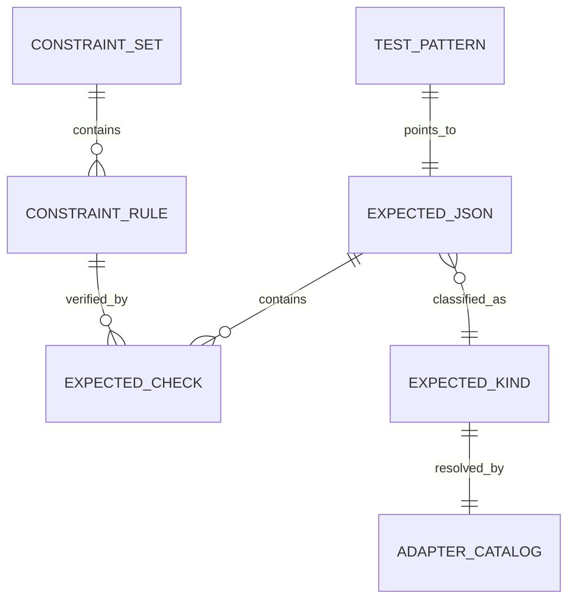
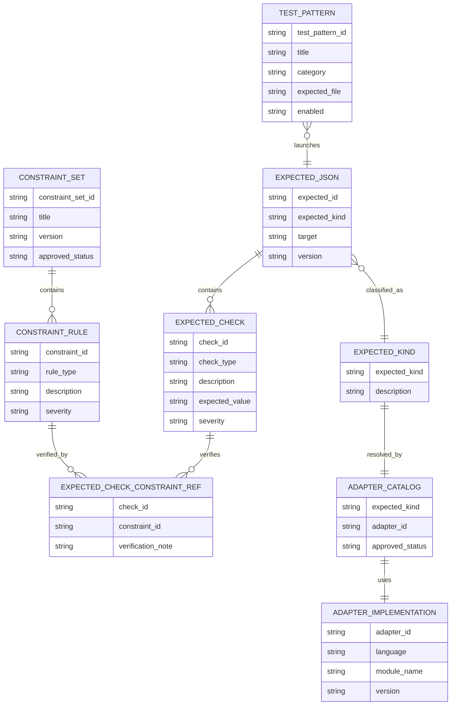

```mermaid
erDiagram
    CONSTRAINT_SET ||--o{ CONSTRAINT_RULE : contains
    TEST_PATTERN ||--|| EXPECTED_JSON : points_to
    EXPECTED_JSON ||--o{ EXPECTED_CHECK : contains
    EXPECTED_JSON }o--|| EXPECTED_KIND : classified_as
    EXPECTED_KIND ||--|| ADAPTER_CATALOG : resolved_by

    CONSTRAINT_RULE ||--o{ EXPECTED_CHECK : verified_by

```

# Test Context ER

```mermaid
erDiagram
    CONSTRAINT_SET ||--o{ CONSTRAINT_RULE : contains

    TEST_PATTERN }o--|| EXPECTED_JSON : launches

    EXPECTED_JSON ||--o{ EXPECTED_CHECK : contains
    EXPECTED_JSON }o--|| EXPECTED_KIND : classified_as

    EXPECTED_KIND ||--|| ADAPTER_CATALOG : resolved_by
    ADAPTER_CATALOG ||--|| ADAPTER_IMPLEMENTATION : uses

    CONSTRAINT_RULE ||--o{ EXPECTED_CHECK_CONSTRAINT_REF : verified_by
    EXPECTED_CHECK ||--o{ EXPECTED_CHECK_CONSTRAINT_REF : verifies

    CONSTRAINT_SET {
        string constraint_set_id
        string title
        string version
        string approved_status
    }

    CONSTRAINT_RULE {
        string constraint_id
        string rule_type
        string description
        string severity
    }

    TEST_PATTERN {
        string test_pattern_id
        string title
        string category
        string expected_file
        string enabled
    }

    EXPECTED_JSON {
        string expected_id
        string expected_kind
        string target
        string version
    }

    EXPECTED_CHECK {
        string check_id
        string check_type
        string description
        string expected_value
        string severity
    }

    EXPECTED_KIND {
        string expected_kind
        string description
    }

    ADAPTER_CATALOG {
        string expected_kind
        string adapter_id
        string approved_status
    }

    ADAPTER_IMPLEMENTATION {
        string adapter_id
        string language
        string module_name
        string version
    }

    EXPECTED_CHECK_CONSTRAINT_REF {
        string check_id
        string constraint_id
        string verification_note
    }

``` 

